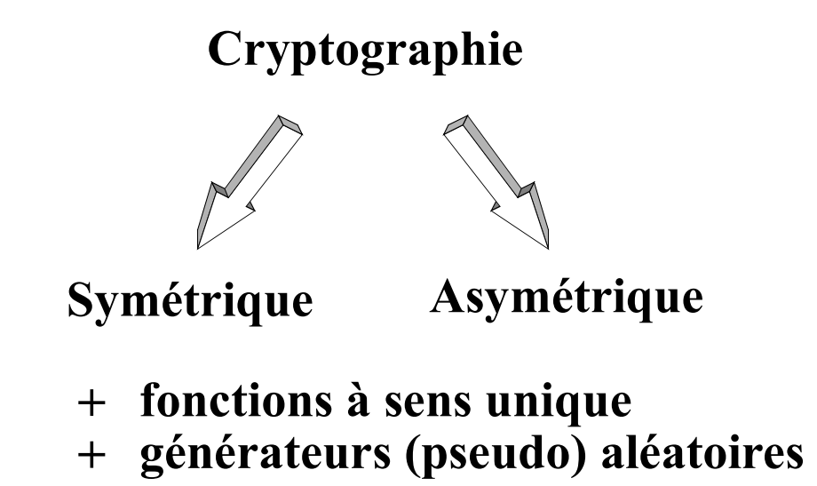
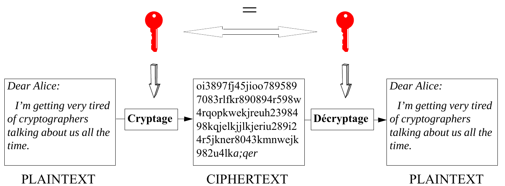
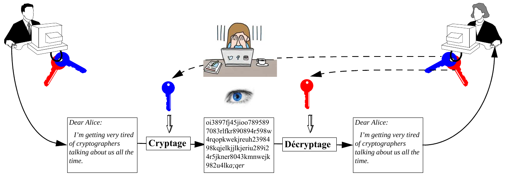
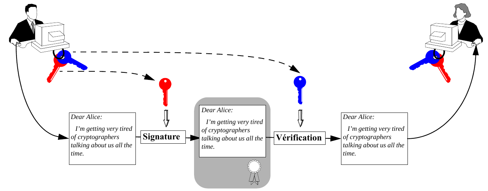
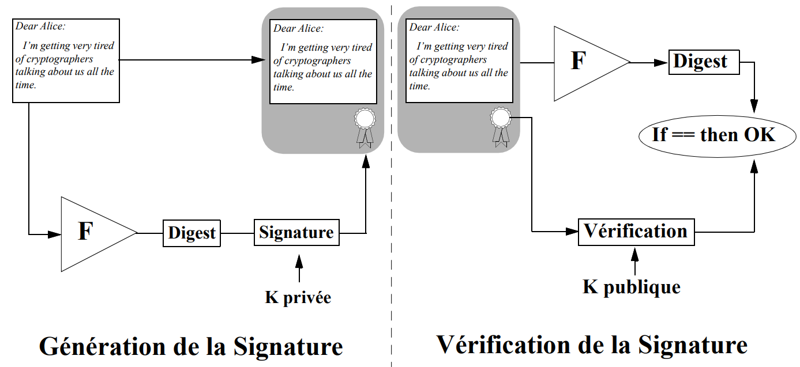
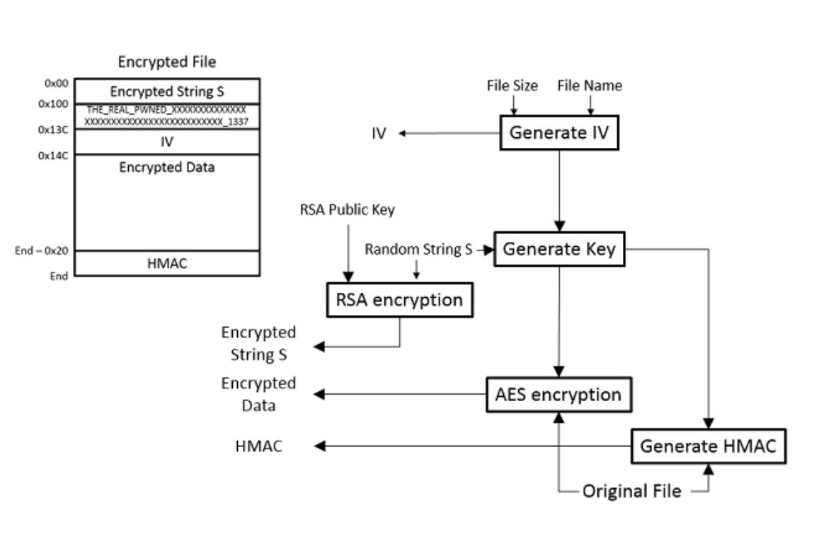

Theory:

Wednesdays 2pm - 4pm (Battelle A 316-318)

Exercises:

Wednesdays 4pm - 6pm (Battelle A 316-318)

Fridays 10am - 12pm (online - discord)

Theory: Eduardo Solana \<Eduardo.Solana@unige.ch\>

Exercises: Alexandre-Quentin Berger \<Alexandre-Quentin.Berger@unige.ch\>

Victor Reyes Martin \<Victor.Reyesmartin@unige.ch\>

## Course Objectives

- Learn the fundamentals of information systems security.
- Understand the cryptographic framework enabling the implementation of security services.
- Describe the algorithms, protocols, and integrated solutions currently in use and understand their weaknesses and how to address them.
- Discover the latest trends in cryptography and information security and the challenges they face.
- Learn the terminology enabling access to scientific publications and research reports.
- Motivate students to investigate selected topics in information security and present them to the class in individual presentations.

## Tentative Agenda

- Basic Concepts
  - Security Services
  - Internet-Related Risks
  - Classification of Cryptosystems and Attacks
  - Entropy
  - Random Oracle Model
  - Probabilistic vs. Deterministic Algorithms
  - Computational Security vs. Perfect Secrecy
- Basic Tools
  - (Pseudo-)Random Generation
  - Hash Functions
  - MACs
  - Cryptographic Algorithms:
    - Stream and Block
    - Symmetric / Asymmetric
  - Certificates
- Access Control and Transaction Security
  - Authentication Protocols
  - Key Establishment Protocols
  - Key and Password Management and Assurance

## Tentative Agenda (II)

- Framework
  - Security Policies (BLP, BIBA, Chinese Wall, etc.)
  - MLS
  - OS Security
  - PKI
  - Virtualization and Trusted Computing
- Topology
  - Perimeter/Perimeterless Security
  - Network Security Protocols
  - Cloud Security
- Topics to be covered (possibly...)
  - Homomorphic Encryption
  - Side-Channel Attacks
  - ...

## Bibliography

- **[Ros08]** Ross J. Anderson. *Security Engineering: A Guide to Building Dependable Distributed Systems* (2nd Edition). Wiley 2008.
- **[Sta17]** Williams Stallings. *Cryptography and Network Security: Principles and Practice* (7th Edition). Prentice Hall, 2017.
- **[Men97]**: Menezes, A et al. *Handbook of Applied Cryptography*. CRC series on discrete mathematics and its applications. 1997.
  URL: `http://cacr.math.uwaterloo.ca/hac/`
- **[Wag03]**: Samuel S. Wagstaff, Jr. *Cryptanalysis of Number Theoretic Ciphers*. Computational Mathematics Series. Chapman & Hall /CRC, 2003.
- **[Sti18]**: Douglas R. Stinson. *Cryptography Theory and Practice*. (4th Edition). Chapman & Hall /CRC, 2018.
- **[Del07]** Hans Delfs and Helmut Knebl. *Introduction to Cryptography. Principles and Applications* (2nd Edition). Springer 2007.
- **[Kat07]** J.Katz and Y. Lindell. *Introduction to Modern Cryptography*. CRC Press 2007.

## Security Services

- **Confidentiality**: Protection of information from unauthorized disclosure
- **Integrity**: Protection against unauthorized modification of information
- **Availability**: Ensuring that resources are accessible to legitimate users
- **Authentication**:
  - **Entity authentication**: (*entity authentication*) a process allowing an entity to be assured of the identity of a second entity, supported by corroborating evidence (e.g.: physical presence, cryptographic, biometric, etc.). The term *identification* is sometimes also used to designate this service.
  - **Data origin authentication**: (*data origin authentication*) a process allowing an entity to be assured that a second entity is the original source of a set of data. By definition, this service also ensures the integrity of that data.
- **Non-repudiation**: Provides the guarantee that an entity will not be able to deny having been involved in a transaction
- **Non-duplication**: Protection against illicit copies
- **Anonymity** (of an entity or of the origin of data): Allows the identity of an entity, the source of a piece of information, or a transaction to be preserved.

## Dangers and Attacks: Summary

| Services | Dangers | Attacks |
|---|---|---|
| Confidentiality | information leakage | illicit eavesdropping, traffic analysis |
| Integrity | modification of information | illicit creation, alteration, or destruction |
| Availability | *denial of service*, illicit use | viruses, repeated access aimed at disabling a system |
| Entity authentication | unauthorized access | password theft, flaw in the authentication protocol |
| Data authentication | falsification of information | signature falsification, flaw in the authentication protocol |
| Non-repudiation | denying participation in a transaction | claiming key theft or a flaw in the signature protocol |
| Non-duplication | duplication | falsification, imitation |
| Anonymity | identification | analysis of a transaction, unauthorized access enabling identification |

## Protection Mechanisms

| Services | Classic Mechanisms | Digital Mechanisms |
|---|---|---|
| Confidentiality | seals, safes, padlocks | encryption, logical authorization |
| Integrity | special ink, holograms | one-way functions + encryption |
| Availability | physical access control, video surveillance | logical access control, audit, *anti-virus* |
| Entity auth. | presence, voice, ID card, biometric recognition | secret + authentication protocol, network address + userid, smart card + PIN |
| Data auth. | seals, signature, fingerprint | one-way functions + encryption |
| Non-repudiation | seals, signature, notarized signature, registered mail | one-way functions + encryption + digital signature |
| Non-duplication | special ink, holograms, watermarking | digital watermarking (*watermarks*), cryptographic locking |
| Anonymity | voice scrambler, disguise, cash | *mixers*, *remailers*, electronic money, *deep web* |

## Internet-Related Risks

- Malicious programs transmitted by e-mail (*e-mail malware*)
- Malicious programs transmitted on the web (*web malware*)
- Phishing (*Phising*)
- Spam (*spam*)
- Ransomware (*ransomware*)
- Attacks on "Internet of Things" devices (*Internet of Things*/*IoT related attacks*)
- Illicit modification of published information *(information spoofing and website defacement)*
- Denial of service attacks (*denial of service* or *DDoS*)
- ...

### Non-Exhaustive List!

Excellent source of information on the subject: **National Cybersecurity Centre (NCSC):**

<https://www.ncsc.admin.ch/ncsc/fr/home.html>

## Malicious Programs Transmitted by *E-Mail*

- Also called **malicious software** or *malware*
- E-mails designed to **entice the recipient** into **opening an attachment** or **following a link** containing unwanted advertising, offensive information, risky programs, etc.
- Often **targeted** based on the victim's interests (preliminary social engineering work (*social engineering*))
- **Consequences**:
  - Installation of *malware* (*ransomware*, *keyloggers*, etc.) on the victim's system *(computer, tablet, smartphone, smartwatch, etc.)*
  - Destruction of data contained on the computer
  - Theft of personal information or data
  - Hijacking of the system for malicious purposes (e.g.: illicit *bitcoin* mining)
  - Distribution of *malware* (possibly to other users)

## Malicious Programs Transmitted on the *Web*

- This technique, often called *drive-by download*, allows the **infection of the system** *(computer, tablet, smartphone, smartwatch, etc.)* **on which a web client is running simply by visiting a site**
- This can involve either
  - a malicious site that contains the *malware*
  - a legitimate website that has been previously infected (for example, using a technique called *cross-site scripting*). The infection may affect only certain pages...
- User awareness (not visiting dubious sites) reduces the effectiveness of this technique in transmitting *malware*
- The consequences are similar to those of e-mail transmission (see page 10)
- Restricting script execution (*java/javascript*) in the browser can limit the scope of infection but risks constraining browsing on certain sites...

## Phishing (*Phising*)

- The word *phishing* is made up of the English words "*password*" (mot de passe), "*harvesting*" (moisson) and "*fishing*" (pêche)
- This combination of words illustrates the main purpose of this technique, which consists of **gathering as much private information as possible** from users via "indiscriminate fishing" mechanisms
- When the information fishing is targeted at a specific person or organization, the technique is called ***spear phishing*** (which comes from *spear fishing*)
- The transmission vector normally consists of an **e-mail with a forged sender address** (but often undetectable...) that asks the victim to provide private information: e-mail addresses, identifiers (*twitter*, *facebook*, etc.), passwords, ID numbers, bank account numbers, etc.
- The pretexts used vary (IT system update, service shutdown, delivery withdrawal, etc.) and go as far as threatening the user in case of refusal

## Spam (*Spam*)

- Encompasses all **unwanted e-mails** (often advertising) received by individuals and organizations
- Term also used to designate **pop-up pages/windows displayed without the user's consent** while browsing the web
- It is estimated that **60%** of e-mails circulating worldwide belong to this category
- The consequences are often limited to the consumption of computing and storage resources as well as the waste of time associated with reading and processing these messages, but...
- ... some **spam e-mails can also constitute vectors for transmitting malware**
- They tend to target short e-mail addresses in particular (e.g.: *abc@gmail.com*) but also work based on lists (often exchanged / sold) containing all types of addresses
- *Anti-spam* filtering operations result in considerable costs for organizations

## Ransomware (*Ransomware*)

- This specific family of *malware* belongs to the category called **Trojan Horses** (*Trojan Horses*)
- Their most common behavior consists of **encrypting the victim's data (**local and remote**) in order to render it completely inaccessible**
- A message then appears requesting payment of a ransom (often in *bitcoins* or another virtual currency) potentially enabling recovery of access to the encrypted files
- They can remain *dormant* in the infected system and be triggered by a specific event or on a given date (synchronized attacks)
- Their infection vectors vary, but **e-mails containing malicious attachments** are often implicated in primary infections
- Numerous variants exist and continue to develop
- Other behaviors associated with this *malware* are sometimes observed: **denial of service**, **targeted extortion**, **threats**, etc.

## Attacks on *Internet of Things (IoT)* Devices

- Target **connected objects** of all kinds (*cameras, TVs, refrigerators, home automation sensors and switches, alarm systems,* etc.)
- They are often **easier to hack than traditional systems** due to:
  - numerous security flaws often known to attackers
  - default passwords
  - user negligence regarding risks specific to them
- The **remote takeover** of these devices by a malicious entity implies:
  - An entry point to the home/corporate network
  - A device that can be used for illicit activities (*hacking*, *DDoS* attacks, *bitcoin* mining, etc.)
- Establishing a precise inventory of all such devices connected to the network is necessary!

## Illicit Modification of Published Information — *Information Spoofing and Website Defacement*

- Attacks targeting the **integrity** of information published on websites, social networks, etc.
- They damage **reputation and can cause significant economic damage** for companies with an Internet presence
- In the case of **websites**, **securing the host system** is essential, as is a **configuration as restrictive as possible**. Recurring security audits are strongly recommended.
- The **protection of information displayed on social networks** depends directly on the authentication process used to access the at-risk profile:
  - Avoid overly simple passwords
  - Favor strong authentication, if possible *multi-factor*
  - Properly close sessions
  - Delete *cookies*

## **Denial of Service** Attacks (*Denial of Service* / *DDoS*)

- Attacks intended to **render inaccessible** computer systems of all kinds, mainly targeting private or state organizations
- The term **DDoS** (*Distributed Denial of Service*) designates a family of attacks in which multiple devices (**often tens of thousands**) **simultaneously target the victim system(s)**
- The traffic generated reaches several hundred gigabits/second
- The effectiveness of traditional protection mechanisms (*firewalls*, intrusion *prevention* and *detection probes*, etc.) is limited
- The unavailability of a service can lead to:
  - **reputational** problems
  - significant **financial losses** (**ransom demands** may be made to deactivate them)
  - **high security risks (even physical!)** when **critical infrastructures** (hospitals, power plants, Internet *backbone*, etc.) are targeted

## Digital Security Methods

**Problem: Protecting digital information**

- in a distributed environment
- globally accessible
- without physical boundaries

**Solution:**



- one-way functions
- (pseudo) random generators

## Cryptographic Hash Functions

**Functions that are easy to compute in one direction but virtually impossible to compute in the reverse direction**


- Any modification (*even insignificant*) of the source document results in a fundamentally different *digest*.
- It is virtually impossible to retrieve the source document using only the digest (*one-way*).
- It is virtually impossible to find a second source document producing the same digest (*collision-free*).
- Usual digest length: **160 to 512 bits.**
- One-way algorithms are very efficient.
- Examples of cryptographic hash functions: **SHA-1, SHA-256, SHA-3,** etc.

## (Pseudo) Random Generators

- Random number generation is a very important process that can compromise the security of a good number of encryption systems.
- Among other applications are session key generation, initialization vectors (DES - CBC mode), secrets needed to generate signatures (ElGamal), etc.
- A random generator (*random generator*) is a device capable of generating numbers in a *random*, *unpredictable*, and *non-reproducible* way. Such a generator is normally equipped with an external device measuring physical phenomena known for their non-determinism (e.g., a radioactive or quantum source).
- Pseudo-random generators are deterministic processes developed from an initial random sequence (*seed*) that can be obtained by various methods (a user's typing frequency, the number of disk accesses, the number of packets received by a network interface, etc.)
- R. Pitkin in [Kau95]: "*The use of pseudo-random processes to generate secret quantities can result in pseudo-security*"...
- Description of the main pseudo-random algorithms in [Sti95].

## Symmetric Cryptography

Also called conventional or secret-key cryptography

(1st century BC, Julius Caesar)

**Idea: Based on a *single secret key*, perform a transformation capable of respectively rendering a piece of information unreadable and restoring it**



## Symmetric Cryptography: Characteristics

- There are numerous symmetric encryption systems (AES, DES, IDEA, RC4, RC5, etc.), some of which are free and openly accessible.
- Services supported: *Confidentiality*, *Authentication*, *Integrity*.
- Since the key is known to both parties, this technology *does not offer direct support for digital signatures*
- Since the key is secret, it must be exchanged between the parties through an alternative confidential channel (postal mail, telephone, etc.)

**Better suited to protecting personal documents than to transactions involving large populations (e-commerce)**

## Asymmetric Cryptography

Also called public or public-key cryptography

(1976, W. Diffie & M. Hellman)

- **Idea**: Use two different keys - a *secret* one and a *public* one - respectively for encryption and decryption operations
- Each user has a *keyring* containing, at minimum, their public key and their private key


## Asymmetric Cryptography: Confidentiality

- The sender encrypts the information with the recipient's public key (globally available)
- The recipient decrypts the information with their private key (known only to them)



**Only the recipient's keys (public and private) are involved in the confidential exchange!**

## Asymmetric Cryptography: Digital Signature

- The sender signs the information with their private key (known only to them)
- The recipient verifies the signature with the sender's public key (globally available)



**Only the sender's keys (public and private) are involved in the signing and verification processes!**

## Digital Signature (II)

**Problem: Signing an entire document is very time-consuming**

**Solution: Apply the signature only to the *digest* resulting from a one-way function applied to the entire document**



**Signature Generation** — **Signature Verification**

## Example of a Signed Message

```
-----BEGIN SIGNED MESSAGE----
Dear Alice:

  I'm getting very tired of cryptographers talking
about us all the time.  Why can't they keep their
noses in their own affairs?!
Sincerely,

                       Bob


-----BEGIN SIGNATURE-----
Version: XYZ n.m
iB2FHFbSU7RpAQEqsQMAvo3mETurtUnLBLzCj9/U8oOQg/T7iQcJ
vM8srMV+3VRid64o2h2XwlKAWpfVcC+2v5pba+BPvd86KIP1xRFI
eipmDnMaYP+iVbxxBPVELundZZw7IRE=Xvrc
-----END SIGNATURE-----
```

## Digital Signatures: Characteristics

- The signature changes if the document changes. The private key always stays the same
- If the document or the signature is modified, the signature will not verify (**Integrity** guaranteed)
- It is virtually impossible (even for the holder of the private key) to generate a second document with the same signature (the one-way function is collision-free)
- Only the holder of the private key can generate a signature that verifies with the corresponding public key

**Authentication + Non-Repudiation**

## Asymmetric Crypto + Symmetric Crypto

**Idea: Use public cryptography solely to exchange symmetric keys**


- A generates a random key Ks and transmits it to B by encrypting it with B's public key (confidentiality)
- A & B communicate using the key Ks to protect the confidentiality of the exchanges

## Asymmetric Crypto: Operation (RSA)

**Let n := pq with p and q two large prime numbers (\> 1024 bits)**

Let

$$\phi(n) = (p-1)(q-1)$$

Let e and d be such that

$$ed \equiv 1 \mod \phi(n)$$

By definition of congruences:

$$ed = 1 + k\phi(n)$$

Euler's theorem:

$$a^{\phi(n)} \equiv 1 \mod n$$

Encryption: $C = P^e \mod n$    Public key: (n,e)

**The inverse of this operation is considered virtually impossible to compute when large numbers are involved**

Decryption: $P = C^d \mod n$    Private key: (d)

Proof: $(P^{ed} \equiv P^{1 + k\phi(n)} \equiv (P \mod n)\,(P^{\phi(n)} \mod n)^k \equiv P \mod n) \mod n$

## Asymmetric Cryptography: Conclusions

- There are a few asymmetric encryption systems (Rabin, ElGamal, etc.) but the most widely used is **RSA**.
- Services supported: *Confidentiality*, *Authentication*, *Integrity*, *Digital Signature & Non-Repudiation, (Non-Duplication)*.
- Operations related to asymmetric crypto. are up to 50 times (!) slower than those of symmetric crypto.
  A combination of the two methods is often desirable
- Key distribution is simplified by the fact that only public keys need to be exchanged between the parties (no need for an alternative *confidential* channel) but...
- ... it is necessary to verify that the public key really belongs to the recipient:
  - Either the channel for acquiring the public key is protected against any modification (*authenticated*)
- Or the key is ***certified*** exact by a third party

## Symmetric vs. Asymmetric Cryptography

- There are hundreds of symmetric and asymmetric algorithms capable of providing a sufficient level of confidentiality.
- Symmetric solutions offer the following advantages:
  - speed (up to 100 times faster than asymmetric solutions)
  - ease of hardware implementation
  - reduced key length: 128 bits (= 16 characters => memorable!) instead of 1024 bits for asymmetric equivalents.
- Asymmetric solutions have the following main arguments:
  - Simplified key exchange: keys must be exchanged over an authenticated but non-confidential channel.
  - Simplified key management: a single public/private key pair is enough for a user to receive confidential messages from n users (instead of n different keys in the symmetric case).
- Problems common to both techniques
  - Key management by the user remains the weakest link
  - Security (normally) based on empirical rather than theoretical arguments
  - Legal restrictions on use and export

## Symmetric vs. Asymmetric Cryptography (II)

| Activity | Recommendation | Remarks |
|---|---|---|
| Protection of personal documents | Symmetric crypto | Speed, easily memorable keys |
| Protection of documents within a group of close users | Symmetric crypto | Speed, ease of exchanging confidential keys |
| Establishing confidential channels between remote (unknown) users | Asymmetric crypto | No need for a confidential channel: authenticity is sufficient |
| Transactions between two remote users, Software protection (*multicast* distribution) | Asym. crypto for protecting the sym. key + Sym. crypto for protecting the data | Speed, Only the sym. key needs to be re-encrypted for each correspondent. Encrypted copy of the software can be made public |
| Protection of network segments | Symmetric crypto | Speed, Stable environment → easy confidential key exchange between sysadmins. |

## Dissecting an Attack: *Ransomware*

"A *ransomware* (from the English *ransomware*), *ransom software*, *ransom program* or *extortion software*, *is malicious software that holds personal data hostage. To do this, a ransomware encrypts personal data and then asks its owner to send money in exchange for the key that will allow it to be decrypted*" (*Wikipedia* September 21, 2021).

- Incomplete definition since ransomware targets *a broad spectrum of IT infrastructure*.
- As an example, in May 2021, a ransomware attack directed against the company *Colonial Pipeline* caused a fuel supply cutoff affecting a large part of the US coast.
- With **a global number of attacks estimated in the billions per year**, "***Ransomware Everywhere***" is generally considered the most direct, visible, and dangerous threat to users and businesses in 2021!

## The World of Ransomware^[2017 State of Cybersecurity. F-Secure Inc.]


## Ransomware: Full Overview

- Anticipation, Remediation and Reaction
  - *Patching*
  - Active and passive detection (*Firewalls*, *WAFs*, *IDS*, *IPS*, *e-mail malware scan*, etc.)
  - *Offline backups*!
  - Security Policy - Rules for proper use of messaging
  - Training!
  - Pay or not to pay...
- Technical Dissection of the Attack
  - Infection and propagation
  - Execution
  - Payment (*Crypto-currencies* / *Bitcoin*)
  - Concealment (*Obfuscation*, *TOR Networks*/*Deep Web*)

## Generic Diagram of a *Cryptolocker Ransomware*



- The **private** decryption **keys** are **stored on the attacker's servers**
- They are sent to the victim after **payment in *bitcoins***
- The **trace** is **erased** using **TOR networks**

## *Cryptolocker Ransomware*: Targets^[Intel Security. Advanced Threat Research. http://www.intelsecurity.com]

.jin, .xls, .xlsx, .pdf, .doc, .docx, .ppt, .pptx, .txt, .dwg, .bak, .bkf, .pst, .dbx, .zip, .rar, .mdb, .asp, .aspx, .html, .htm, .dbf, .3dm, .3ds, .3fr, .jar, .3g2, .xml, .png, .tif, .3gp, .java, .jpe, .jpeg, .jpg, .jsp, .php, .3pr, .7z, .ab4, .accdb, .accde, .accdr, .accdt, .ach, .kbx, .acr, .act, .adb, .ads, .agdl, .ai, .ait, .al, .apj, .arw, .asf, .asm, .asx, .avi, .awg, .back, .backup, .backupdb, .pbl, .bank, .bay, .bdb, .bgt, .bik, .bkp, .blend, .bpw, .c, .cdf, .cdr, .cdr3, .cdr4, .cdr5, .cdr6, .cdrw, .cdx, .ce1, .ce2, .cer, .cfp, .cgm, .cib, .class, .cls, .cmt, .cpi, .cpp, .cr2, .craw, .crt, .crw, .phtml, .php5, .cs, .csh, .csl, .tib, .csv, .dac, .db, .db3, .dbjournal, .dc2, .dcr, .dcs, .ddd, .ddoc, .ddrw, .dds, .der, .des, .design, .dgc, .djvu, .dng, .dot, .docm, .dotm, .dotx, .drf, .drw, .dtd, .dxb, .dxf, .dxg, .eml, .eps, .erbsql, .erf, .exf, .fdb, .ffd, .fff, .fh, .fmb, .fhd, .fla, .flac, .flv, .fpx, .fxg, .gray, .grey, .gry, .h, .hbk, .hpp, .ibank, .ibd, .ibz, .idx, .iif, .iiq, .incpas, .indd, .kc2, .kdbx, .kdc, .key, .kpdx, .lua, .m, .m4v, .max, .mdc, .mdf, .mef, .mfw, .mmw, .moneywell, .mos, .mov, .mp3, .mp4, .mpg, .mrw, .msg, .myd, .nd, .ndd, .nef, .nk2, .nop, .nrw, .ns2, .ns3, .ns4, .nsd, .nsf, .nsg, .nsh, .nwb, .nx2, .nxl, .nyf, .oab, .obj, .odb, .odc, .odf, .odg, .odm, .odp, .ods, .odt, .oil, .orf, .ost, .otg, .oth, .otp, .ots, .ott, .p12, .p7b, .p7c, .pab, .pages, .pas, .pat, .pcd, .pct, .pdb, .pdd, .pef, .pem, .pfx, .pl, .plc, .pot, .potm, .potx, .ppam, .pps, .ppsm, .ppsx, .pptm, .prf, .ps, .psafe3, .psd, .pspimage, .ptx, .py, .qba, .qbb, .qbm, .qbr, .qbw, .qbx, .qby, .r3d, .raf, .rat, .raw, .rdb, .rm, .rtf, .rw2, .rwl, .rwz, .s3db, .sas7bdat, .say, .sd0, .sda, .sdf, .sldm, .sldx, .sql, .sqlite, .sqlite3, .sqlitedb, .sr2, .srf, .srt, .srw, .st4, .st5, .st6, .st7, .st8, .std, .sti, .stw, .stx, .svg, .swf, .sxc, .sxd, .sxg, .sxi, .sxi, .sxm, .sxw, .tex, .tga, .thm, .tlg, .vob, .war, .wallet, .wav, .wb2, .wmv, .wpd, .wps, .x11, .x3f, .xis, .xla, .xlam, .xlk, .xlm, .xlr, .xlsb, .xlsm, .xlt, .xltm, .xltx, .xlw, .ycbcra, .yuv
