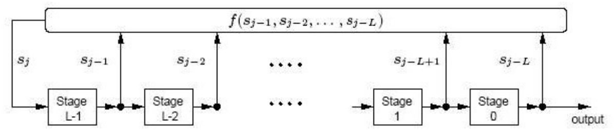
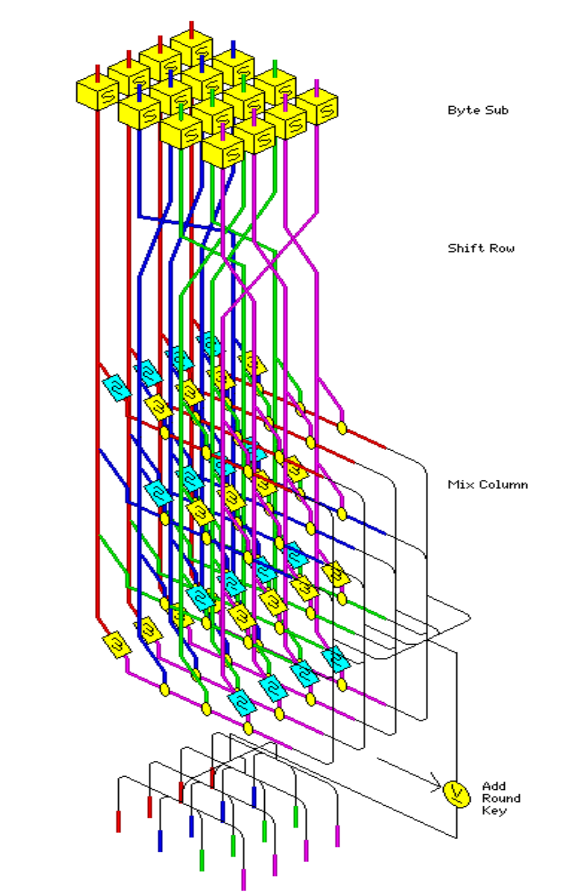

## Symmetric Cryptography — Overview

* Stream Ciphers
  * Synchronous and asynchronous stream ciphers
  * Linear Feedback Shift Registers (LFSR)
  * The **RC4** algorithm
* Block Ciphers
  * Modes of operation: ***ECB, CBC, CFB, OFB*** and ***CTR***
  * *Product Ciphers* and *Feistel ciphers*
  * **DES**, **2DES** and **3DES**
  * **AES**
  * *Differential* and *Linear Cryptanalysis*

## Stream Ciphers

* *Stream ciphers* are a family of encryption systems in which the size of the encrypted block is equal to 1 bit.

* *Stream ciphers* are generally composed of two phases:

  * A ***generation*** phase for the sequence of elements forming the key (the *keystream*).

  * A ***substitution*** phase in which the plaintext bits undergo a specific operation dependent on the *keystream*.

* An obvious example of a *stream cipher* is the ***one-time pad***, with:

  * A *keystream* generation phase performed by a (*pseudo*-)random generator.

  * A substitution phase consisting of performing an **xor** ($\oplus$) with the *keystream*.

## *Stream Ciphers*: Characteristics

* *Speed*: Encryption is performed directly at the register level. Ideal for applications requiring "*on the fly*" encryption such as *video streaming*.

* *Simplicity*: The operations can be carried out by systems with limited CPU resources.

* *No* (or little...) *need for memory/buffering*.

* *Limited or absent error propagation:* retransmitting the faulty packets is normally enough (suited to applications where packet loss is frequent, such as wireless transmissions (*WiFi*)).

* Drawbacks:

  * The quality, in terms of *randomness*, of the generated *keystream* determines the robustness of the system.

  * *Reusing* the *keystream* allows for easy cryptanalysis (cf. the *one-time pad*).

## Synchronous *Stream Ciphers*

* The generated *keystream* depends only on the key, not on the *plaintext* or the *ciphertext*.

* The encryption process of a *synchronous stream cipher* is described by the following equations:

$$\sigma_{i+1} = f(\sigma_i, k) \qquad z_i = g(\sigma_i, k) \qquad c_i = h(z_i, m_i)$$

  where $\sigma_i$ is the initial state, which may depend on the key **k**, **f** is the function that determines the next state, **g** is the function that produces the *keystream* $z_i$, and **h** is the output function that produces the ciphertext $c_i$ from the plaintext $m_i$.

* Schematically, the operating mode of a *synchronous stream cipher* is as follows:

```{.cetz caption="Figure 6.1 : General model of a synchronous stream cipher (Source [Men97])"}
#cetz.canvas({
  import cetz.draw: *

  let draw-state-block(x, y, w: 0.8, h: 0.8, label: $sigma_i$) = {
    rect((x - w / 2, y - h / 2), (x + w / 2, y + h / 2), stroke: black)
    content((x, y), label, anchor: "center")
  }

  let draw-function_block(x, y, r: 0.4, label: $f$) = {
    circle((x, y), radius: r, stroke: black)
    content((x, y), label)
  }

  let r = 0.4

  content((-0.3, 0), $k$, anchor: "center")
  draw-state-block(3, 2)
  draw-function_block(1.5, 1, r: r)
  draw-function_block(3, 0, r: r, label: $g$)
  draw-function_block(5, 0, r: r, label: $h$)
  content((7.3, 0), $c_i$)
  content((5, 2), $m_i$)
  content((1, 1.7), $sigma_(i + 1)$)
  content((4, 0.3), $z_i$)

  line((0, 0), (3 - r, 0), mark: (end: ">"))
  line((3 + r, 0), (5 - r, 0), mark: (end: ">"))
  line((5 + r, 0), (7, 0), mark: (end: ">"))
  line((5, 1.7), (5, r), mark: (end: ">"))
  line((3, 2 - r), (3, r), mark: (end: ">"))
  line((1.5, 0), (1.5, 1 - r), mark: (end: ">"))
  line((3, 1), (1.5 + r, 1), mark: (end: ">"))
  line((1.5, 1 + r), (1.5, 2))
  line((1.5, 2), (3 - r, 2), mark: (end: ">"))

  rect((0.4, -0.6), (3.6, 2.6), stroke: (dash: "dashed"))
  content((2, 3), "Keystream creation", anchor: "center")
})
```

## Synchronous *Stream Ciphers*: Characteristics

* Require **synchronization** between the sender and the receiver: besides using the same key **k**, both must be in the same state for the process to work. If synchronization is lost, external mechanisms are needed to recover it (*special markers, plaintext redundancy analysis*, etc.)

* **No error propagation**. Modifying the ciphertext during transmission does not cause disruptions in subsequent ciphertext sequences (however, deleting a ciphertext would cause the receiver to lose synchronization).

* **Active attacks**: the insertion, removal, or *replay* of parts of the ciphertext are detected by the receiver. However, an adversary could modify certain bits of the ciphertext and analyze the impact on the corresponding plaintext. Additional origin-authentication mechanisms are needed to detect these attacks.

* The most frequent case of *Synchronous Stream Ciphers*: the **additive stream cipher** (cf. *the one-time pad*), where the functions **f** and **g** that generate the keystream are replaced by a random generator, and the function **h** is a modulo-2 addition (xor):

```{.cetz caption="Stream cipher additif — Encryption et Decryption (Source [Men97])"}
#cetz.canvas({
  import cetz.draw: *

let draw-xor(x, y, r: 0.2) = {

  circle((x, y), radius: r, stroke: black)

  line((x - r, y), (x + r, y), stroke: black)

  line((x, y - r), (x, y + r), stroke: black)

}

let draw-generator(
  x, y,
  w: 3.4,
  h: 0.8,
  label: "Keystream Generator"
) = {

  rect(
    (x - w / 2, y - h / 2),
    (x + w / 2, y + h / 2),
    stroke: black
  )

  content((x, y), text(label, size: 10pt), anchor: "center")

}

// Encryption panel

content((-1.8, 0), $k$, anchor: "center")

draw-generator(1.2, 0)

draw-xor(4.15, 0, r: 0.25)

content((4.15, 1.3), $m_i$)

content((5.7, 0), $c_i$)

content((1.2, 0.9), $z_i$)

line((-1.5, 0), (-0.5, 0), mark: (end: ">"))

line((2.9, 0), (3.9, 0), mark: (end: ">"))

line((4.15, 1, ), (4.15, 0.2), mark: (end: ">"))

line((4.4, 0), (5.4, 0), mark: (end: ">"))


// Decryption panel

content((6.9, 0), $k$, anchor: "center")

draw-generator(9.9, 0)

draw-xor(12.85, 0, r: 0.25)

content((12.85, 1.3), $c_i$)

content((14.4, 0), $m_i$)

content((9.9, 0.9), $z_i$)

line((7.2, 0), (8.2, 0), mark: (end: ">"))

line((11.6, 0), (12.6, 0), mark: (end: ">"))

line((12.85, 1), (12.85, 0.2), mark: (end: ">"))

line((13.1, 0), (14.1, 0), mark: (end: ">"))

})
```

## Asynchronous *Stream Ciphers*

* Also called **self-synchronizing** (*self synchronizing ciphers*).

* The generated keystream depends on the key as well as on *a fixed number of previous ciphertexts*.

* The encryption process of an *asynchronous stream cipher* is described by the following equations:

$$\sigma_i = (c_{i-t}, c_{i-t+1}, \ldots, c_{i-1}) \qquad z_i = g(\sigma_i, k) \qquad c_i = h(z_i, m_i)$$

  where $\sigma_i$, **g**, and **h** are as in the synchronous case.

* Schematically, the operating mode of an *asynchronous stream cipher* is as follows:

```{.cetz caption="Figure 6.3 : General model of a self-synchronizing stream cipher (Source [Men97])"}
#cetz.canvas({
  import cetz.draw: *

  let draw-boxes(x, y, n: 12, size: 0.25, type: "Plaintext", pos: 1.5, top: true) = {
    for i in range(int(n / 2)) {
      rect((x + i * size, y), (x + (i + 1) * size, y + size), stroke: black)
    }
    for i in range(int(n / 2)) {
      rect((x - i * size, y), (x - (i + 1) * size, y + size), stroke: black)
    }
    let text_pos = -1
    if top {
      text_pos = 1
    }
    content((x, y + pos * size * text_pos), type, anchor: "center")
  }

  let draw-function_block(x, y, r: 0.4, label: $f$) = {
    circle((x, y), radius: r, stroke: black)
    content((x, y), label)
  }

  let r = 0.4
  let size = 0.5
  let n = 4

  content((-0.3, 0), $k$, anchor: "center")
  draw-function_block(2.5, 0, r: r, label: $g$)
  draw-function_block(5, 0, r: r, label: $h$)
  draw-boxes(2.5, 1.7, n: n, size: size, type: "Buffer")
  content((7.3, 0), $c_i$)
  content((5, 1.4), $m_i$)
  content((4, 0.3), $z_i$)

  line((0, 0), (2.5 - r, 0), mark: (end: ">"))
  line((2.5 + r, 0), (5 - r, 0), mark: (end: ">"))
  line((5 + r, 0), (7, 0), mark: (end: ">"))
  line((5, 1.1), (5, r), mark: (end: ">"))
  for i in range(n) {
    line((2.5 - n / 2 * size + size / 2 + i * size, 1.7), (2.5, r), mark: (end: ">"))
  }
  line((6, 0), (6, 1.7 + size / 2))
  line((6, 1.7 + size / 2), (2.5 + size * n / 2, 1.7 + size / 2), mark: (end: ">"))
})
```

## Asynchronous *Stream Ciphers*: Characteristics

* **Self-synchronization**: If ciphertexts are removed or inserted along the way, the receiver is able to *re-synchronize* with the sender thanks to the storage (*buffer*) of a number of previous ciphertexts.

* **Limited error propagation**: Error propagation extends only to the number of ciphertext bits stored (the *buffer* size). After that, decryption proceeds correctly again.

* **Active attacks**: Modifying fragments of the ciphertext will be more easily detected than in the synchronous case, because of error propagation. However, since the receiver is able to self-synchronize with the sender, even if ciphertexts are removed or inserted along the way, it is advisable to verify the integrity and authenticity of the entire stream.

* **Diffusion of plaintext statistics**: The fact that each plaintext bit influences all subsequent ciphertexts results in a greater dispersion of plaintext statistics compared to the synchronous case...

* ... It is therefore advisable to **use asynchronous stream ciphers when plaintext entropy is limited**, as this could allow targeted attacks on highly redundant plaintexts.

## *Stream Ciphers*: Keystream Generators

* When a keystream of length **m** needs to be generated from a secret key of length **l** with **l << m**, keystream generators are used.

* The most common of these generators is the *Linear Feedback Shift Register* (LSFR).

* An LSFR has the following characteristics:

  * Adapts very well to hardware implementations.

  * Produces sequences with long periods and notable random quality (fairly strong *randomness*)

  * Relies on the algebraic properties of linear combinations.

* Generic example of an **LSFR** of length **L**:

![Figure 6.4 : A linear feedback shift register (LFSR) of length L (Source [Men97])](qmd_images/LSFR.png)

## LSFRs: A Few Remarks

* LSFRs are constructions widely used in cryptography and in coding theory.

* A large number of *LSFR-based stream ciphers* (especially in the military sphere) have been developed in the past.

* Unfortunately, the level of security offered by these systems is considered insufficient nowadays (compared to that of *block ciphers*...)

* The metric used to analyze an LFSR is its *linear complexity* (**linear complexity**). The *Berlekamp-Massey*[^1] algorithm makes it possible to determine the linear complexity of an LSFR, and thereby compute an arbitrarily large number of sequences generated by an LSFR.

* One solution for increasing the complexity is to replace the linear combination of the ciphertext bits with a non-linear function f. These are the **Non Linear Feedback Shift Registers**:



[^1]: J.L. Massey. *Shift Register Synthesis and BCH Decoding*. IEEE Transactions on Information Theory, 15 (1969), 122-127.

## Software Cipher Streams: RC4

* The major disadvantage of register-based stream ciphers is that they are very slow when implemented in software on a generic machine. RC4$_{TM}$ is a *variable-key stream cipher* developed in 1987 by *Ron Rivest* for the *RSA security* company. It is very fast (10 times faster than DES!)

* For 7 years, this algorithm was patented, and the details of its internal workings were only disclosed after signing a confidentiality agreement. Since its (unofficial) publication in a *newsgroup* in 1994, it has been widely discussed and analyzed throughout the entire cryptographic community.

* The algorithm operates in *synchronous* mode (the *keystream* is independent of the ciphertext and the plaintext).

* It is composed of linear and non-linear combinations. The key element is a substitution box (**S-box**) of size 8x8, whose entries are a permutation of the digits 0 to 255. The permutation is a function of the main key, of variable size with $0 < len(k) \le 255$. The final encryption is obtained by an **xor** between the *keystream* and the *plaintext*.

* RC4 is used in a large number of commercial applications: *Lotus Notes, Oracle SQL, MS Windows, SSL, etc.* It has been the subject of a large number of analytical and exhaustive studies[^2] that have succeeded in compromising the security of the *key scheduling* and of the *PRGA*.

* In particular, the application of RC4 to the *Wired Equivalent Privacy* (**WiFi WEP**) protocol was "broken" following a flaw in the way the protocol was used.

[^2]: http://www.wisdom.weizmann.ac.il/~itsik/RC4/rc4.html

## RC4: How It Works

* The algorithm consists of two steps:

  * The *Key Scheduling Algorithm* (**KSA**): Responsible for the initial permutation that fills the *S-box* based on the variable-length key `len(k) = ℓ`.

  * The **Pseudo Random Generator Algorithm** (**PRGA**): Generates the *keystream* of arbitrary size based on the *S-box*.

::: {layout-ncol="2"}
```
KSA(K)
Initialization:
  S ← ⟨0, 1, …, N − 1⟩
  j ← 0
Scrambling:
  For i ← 0 … N − 1
    j ← j + S[i] + K[i mod ℓ]
    S[i] ↔ S[j]
```

```
PRGA(S)
Initialization:
  i ← 0
  j ← 0
Generation loop:
  i ← i + 1
  j ← j + S[i]
  S[i] ↔ S[j]
  t ← S[i] + S[j]
  Output z ← S[t]
```
:::

**Source:** Fluhrer, Mantin and Shamir. *Attacks on RC4 and WEP*, Cryptobytes 2002

## Block Ciphers

* Symmetric *block ciphers* are the cornerstone of cryptography. Their main function is confidentiality, but they are also the basis for *authentication* services, *hash functions*, *random generation*, etc.

* Definition: A *block cipher* is a **function** that maps an n-bit block to another block of the same size. The function is parameterized by a k-bit key K. To allow unique decryption, the function must be **bijective**. *Each key defines a different bijection*. The size of the input block on which encryption is applied is also called the **nominal size** of the algorithm.

* Criteria for evaluating the quality of a *block cipher*:

  * **Key size/entropy**: Ideally, keys are equiprobable and the key space has an entropy equal to k. High key entropy protects against *brute-force* attacks based on *chosen/known plaintexts*. Modern *block ciphers* must have keys of at least 128 bits.

  * **Performance**

  * **Block size**: A block that is too small would allow attacks in which plaintext/ciphertext "dictionaries" could be built. Nowadays, blocks of size $\ge$ 128 bits are becoming common.

  * **Cryptographic resistance**: The *block cipher* must show resistance to known cryptanalysis techniques: *linear or differential cryptanalysis, meet in the middle*, etc. The effort inherent to these attacks (complexity, storage, parallelization, etc.) must be equivalent to that of a *brute-force* attack.

## Block Ciphers: Modes of Operation

### Electronic Codebook (ECB)

```{.cetz caption="a) Electronic Codebook (ECB)"}
#cetz.canvas({
  import cetz.draw: *

  let draw-boxes(x, y, n: 12, size: 0.25, type: "Plaintext", pos: 1.5, top: true) = {
    for i in range(int(n / 2)) {
      rect((x + i * size, y), (x + (i + 1) * size, y + size), stroke: black)
    }
    for i in range(int(n / 2)) {
      rect((x - i * size, y), (x - (i + 1) * size, y + size), stroke: black)
    }
    let text_pos = -1
    if top {
      text_pos = 1
    }
    content((x, y + pos * size * text_pos), type, anchor: "center")
  }

  let draw-cipher-block(x, y, w: 2.5, h: 1) = {
    rect((x - w / 2, y - h / 2), (x + w / 2, y + h / 2), stroke: black)
    content((x, y + h / 6), [block cipher], anchor: "center")
    content((x, y - h / 6), [encryption], anchor: "center")
  }

  let draw-ecb-block(offset-x) = {
    let x = offset-x
    let y = 0

    let size = 0.25
    let n = 12
    draw-boxes(x, y + 1, n: n, size: size, type: "Plaintext", pos: 2)

    let w = 2.2
    let h = 0.8
    draw-cipher-block(x, y, w: 2.2, h: 0.8)

    line((x, y + 1), (x, y + h / 2), mark: (end: ">"), stroke: black)

    content((x - w, y), [Key], anchor: "east")
    line((x - w + 0.1, y), (x - w / 2, y), mark: (end: ">"), stroke: black)

    draw-boxes(x, y - 1.5, n: n, type: "Ciphertext", top: false, pos: 1.3)

    line((x, y - h / 2), (x, y - 1.5 + size), mark: (end: ">"), stroke: black)
  }

  draw-ecb-block(0)
  draw-ecb-block(5)
  draw-ecb-block(10)
})
```

* Identical plaintexts result in identical ciphertexts
* No error propagation to adjacent blocks

### Cipher-block Chaining (CBC)

```{.cetz caption="b) Cipher-block Chaining (CBC)"}
#cetz.canvas({
  import cetz.draw: *

  let draw-boxes(x, y, n: 12, size: 0.25, type: "Plaintext", pos: 1.5, top: true) = {
    for i in range(int(n / 2)) {
      rect((x + i * size, y), (x + (i + 1) * size, y + size), stroke: black)
    }
    for i in range(int(n / 2)) {
      rect((x - i * size, y), (x - (i + 1) * size, y + size), stroke: black)
    }
    let text_pos = -1
    if top {
      text_pos = 1
    }
    content((x, y + pos * size * text_pos), type, anchor: "center")
  }

  let draw-cipher-block(x, y, w: 2.5, h: 1) = {
    rect((x - w / 2, y - h / 2), (x + w / 2, y + h / 2), stroke: black)
    content((x, y + h / 6), [block cipher], anchor: "center")
    content((x, y - h / 6), [encryption], anchor: "center")
  }

  let draw-xor(x, y, r: 0.2) = {
    circle((x, y), radius: r, stroke: black)
    line((x - r, y), (x + r, y), stroke: black)
    line((x, y - r), (x, y + r), stroke: black)
  }

  let draw-cbc-block(offset-x, last_x: 0, show-iv: false, last: false) = {
    let x = offset-x
    let y = 0

    let size = 0.25
    let n = 12
    draw-boxes(x, y + 2, n: n, size: size, type: "Plaintext", pos: 2)

    let xor-y = y + 1
    let r = 0.2
    draw-xor(x, xor-y, r: r)

    line((x, y + 2), (x, xor-y + r), stroke: black)

    let w = 2.2
    let h = 0.8
    draw-cipher-block(x, y, w: 2.2, h: 0.8)

    line((x, xor-y - r), (x, y + h / 2), mark: (end: ">"), stroke: black)

    content((x - w, y), [Key], anchor: "east")
    line((x - w + 0.1, y), (x - w / 2, y), mark: (end: ">"), stroke: black)

    draw-boxes(x, y - 1.5, n: n, type: "Ciphertext", top: false, pos: 1.3)

    line((x, y - h / 2), (x, y - 1.5 + size), mark: (end: ">"), stroke: black)

    if show-iv {
      draw-boxes(x - 3, xor-y - size / 2, n: n, size: size, type: "Initialization Vector (IV)", pos: 2)
      line((x - 3 + size * n / 2, xor-y), (x - r, xor-y), mark: (end: ">"), stroke: black)
    } else {
      line((last_x + 1.5, xor-y), (x - r, xor-y), mark: (end: ">"), stroke: black)
    }

    if not last {
      let y_1 = y - h / 2 - (1.5 - h / 2) / 3
      line((x, y_1), (x + 1.5, y_1), stroke: black)
      line((x + 1.5, y_1), (x + 1.5, xor-y), stroke: black)
    }
  }

  draw-cbc-block(0, show-iv: true)
  draw-cbc-block(5, last_x: 0, show-iv: false)
  draw-cbc-block(10, last_x: 5, show-iv: false, last: true)
})
```

* Identical plaintexts result in different ciphertexts if the *IV* changes
* Plaintext *patterns* are "erased" from the ciphertext (chaining)
* An error in $c_j$ affects only the decryption of blocks $c_j$ and $c_{j+1}$

## Block Ciphers: Modes of Operation (II)

### *Cipher Feedback Mode*: CFB (Source [Men97])

```{.cetz caption="c) Cipher feedback (CFB), r-bit characters/r-bit feedback"}
#cetz.canvas({
  import cetz.draw: *

  let draw-boxes(x, y, n: 12, size: 0.25, type: "Plaintext", pos: 1.5, top: true) = {
    for i in range(int(n / 2)) {
      rect((x + i * size, y), (x + (i + 1) * size, y + size), stroke: black)
    }
    for i in range(int(n / 2)) {
      rect((x - i * size, y), (x - (i + 1) * size, y + size), stroke: black)
    }
    let text_pos = -1
    if top {
      text_pos = 1
    }
    content((x, y + pos * size * text_pos), type, anchor: "center")
  }

  let draw-cipher-block(x, y, w: 2.5, h: 1) = {
    rect((x - w / 2, y - h / 2), (x + w / 2, y + h / 2), stroke: black, fill: white)
    content((x, y + h / 6), [block cipher], anchor: "center")
    content((x, y - h / 6), [encryption], anchor: "center")
  }

  let draw-xor(x, y, r: 0.2) = {
    circle((x, y), radius: r, stroke: black, fill: white)
    line((x - r, y), (x + r, y), stroke: black)
    line((x, y - r), (x, y + r), stroke: black)
  }

  let draw-cfb-block(offset-x, last_x: 0, show-iv: false, last: false) = {
    let x = offset-x
    let y = 0

    let size = 0.25
    let n = 8

    let xor-y = y - 1
    let r = 0.2
    draw-xor(x, xor-y, r: r)

    let w = 2.2
    let h = 0.8
    draw-cipher-block(x, y, w: 2.2, h: 0.8)

    draw-boxes(x - 2, xor-y - size / 2 - size / 2, n: n, size: size, type: "Plaintext", pos: 2)

    content((x - w, y), [Key], anchor: "east")
    line((x - w + 0.1, y), (x - w / 2, y), mark: (end: ">"), stroke: black)

    draw-boxes(x, y - 2.5, n: n, type: "Ciphertext", top: false, pos: 1.3)

    line((x, xor-y - r), (x, y - 2.5 + size), mark: (end: ">"), stroke: black)

    line((x, xor-y + r), (x, y - h / 2), stroke: black)

    line((x - 2 + size * n / 2, xor-y), (x - r, xor-y), mark: (end: ">"), stroke: black)

    if show-iv {
      draw-boxes(x, y + 1, n: n, size: size, type: "Initialization Vector (IV)", pos: 2)
      line((x, y + 1 + size / 2), (x, y + h / 2), mark: (end: ">"), stroke: black)
    } else {
      line((last_x + 1.5, y + 1), (x, y + 1), stroke: black)
      line((x, y + 1), (x, y + h / 2), mark: (end: ">"), stroke: black)
    }

    if not last {
      let y_1 = y - 2.5 - xor-y
      line((x, y_1), (x + 1.5, y_1), stroke: black)
      line((x + 1.5, y_1), (x + 1.5, y + 1), stroke: black)
    }
  }

  draw-cfb-block(0, show-iv: true)
  draw-cfb-block(5, last_x: 0, show-iv: false)
  draw-cfb-block(10, last_x: 5, show-iv: false, last: true)
})
```

**7.17 Algorithm** CFB mode of operation (CFB-r)

> INPUT: k-bit key K; n-bit IV; r-bit plaintext blocks $x_1, \ldots, x_u$ $(1 \le r \le n)$.
>
> SUMMARY: produce r-bit ciphertext blocks $c_1, \ldots, c_u$; decrypt to recover plaintext.
>
> 1. Encryption: $I_1 \leftarrow IV$. ($I_j$ is the input value in a shift register.) For $1 \le j \le u$:
>    (a) $O_j \leftarrow E_K(I_j)$. (Compute the block cipher output.)
>    (b) $t_j \leftarrow$ the r leftmost bits of $O_j$. (Assume the leftmost is identified as bit 1.)
>    (c) $c_j \leftarrow x_j \oplus t_j$. (Transmit the r-bit ciphertext block $c_j$.)
>    (d) $I_{j+1} \leftarrow 2^r \cdot I_j + c_j \mod 2^n$. (Shift $c_j$ into right end of shift register.)
> 2. Decryption: $I_1 \leftarrow IV$. For $1 \le j \le u$, upon receiving $c_j$:
>    $x_j \leftarrow c_j \oplus t_j$, where $t_j$, $O_j$ and $I_j$ are computed as above.

## Block Ciphers: Modes of Operation (III)

### *Output Feedback Mode*: OFB (Source [Men97])

```{.cetz caption="d) Output feedback (OFB), r-bit characters/n-bit feedback"}
#cetz.canvas({
  import cetz.draw: *

  let draw-boxes(x, y, n: 12, size: 0.25, type: "Plaintext", pos: 1.5, top: true) = {
    for i in range(int(n / 2)) {
      rect((x + i * size, y), (x + (i + 1) * size, y + size), stroke: black)
    }
    for i in range(int(n / 2)) {
      rect((x - i * size, y), (x - (i + 1) * size, y + size), stroke: black)
    }
    let text_pos = -1
    if top {
      text_pos = 1
    }
    content((x, y + pos * size * text_pos), type, anchor: "center")
  }

  let draw-cipher-block(x, y, w: 2.5, h: 1) = {
    rect((x - w / 2, y - h / 2), (x + w / 2, y + h / 2), stroke: black, fill: white)
    content((x, y + h / 6), [block cipher], anchor: "center")
    content((x, y - h / 6), [encryption], anchor: "center")
  }

  let draw-xor(x, y, r: 0.2) = {
    circle((x, y), radius: r, stroke: black, fill: white)
    line((x - r, y), (x + r, y), stroke: black)
    line((x, y - r), (x, y + r), stroke: black)
  }

  let draw-ofb-block(offset-x, last_x: 0, show-iv: false, last: false) = {
    let x = offset-x
    let y = 0

    let size = 0.25
    let n = 8

    let xor-y = y - 1.5
    let r = 0.2
    draw-xor(x, xor-y, r: r)

    let w = 2.2
    let h = 0.8
    draw-cipher-block(x, y, w: 2.2, h: 0.8)

    draw-boxes(x - 2, xor-y - size / 2, n: n, size: size, type: "Plaintext", pos: 2)

    content((x - w, y), [Key], anchor: "east")
    line((x - w + 0.1, y), (x - w / 2, y), mark: (end: ">"), stroke: black)

    draw-boxes(x, y - 2.5, n: n, type: "Ciphertext", top: false, pos: 1.3)

    line((x, xor-y - r), (x, y - 2.5 + size), mark: (end: ">"), stroke: black)

    line((x, xor-y + r), (x, y - h / 2), stroke: black)

    line((x - 2 + size * n / 2, xor-y), (x - r, xor-y), mark: (end: ">"), stroke: black)

    if show-iv {
      draw-boxes(x, y + 1, n: n, size: size, type: "Initialization Vector (IV)", pos: 2)
      line((x, y + 1 + size / 2), (x, y + h / 2), mark: (end: ">"), stroke: black)
    } else {
      line((last_x + 1.5, y + 1), (x, y + 1), stroke: black)
      line((x, y + 1), (x, y + h / 2), mark: (end: ">"), stroke: black)
    }

    if not last {
      let y_1 = y - 2.5 - xor-y
      line((x, y_1), (x + 1.5, y_1), stroke: black)
      line((x + 1.5, y_1), (x + 1.5, y + 1), stroke: black)
    }
  }

  draw-ofb-block(0, show-iv: true)
  draw-ofb-block(5, last_x: 0, show-iv: false)
  draw-ofb-block(10, last_x: 5, show-iv: false, last: true)
})
```

**7.20 Algorithm** OFB mode with full feedback (per ISO 10116)

> INPUT: k-bit key K; n-bit IV; r-bit plaintext blocks $x_1, \ldots, x_u$ $(1 \le r \le n)$.
>
> SUMMARY: produce r-bit ciphertext blocks $c_1, \ldots, c_u$; decrypt to recover plaintext.
>
> 1. Encryption: $I_1 \leftarrow IV$. For $1 \le j \le u$, given plaintext block $x_j$:
>    (a) $O_j \leftarrow E_K(I_j)$. (Compute the block cipher output.)
>    (b) $t_j \leftarrow$ the r leftmost bits of $O_j$. (Assume the leftmost is identified as bit 1.)
>    (c) $c_j \leftarrow x_j \oplus t_j$. (Transmit the r-bit ciphertext block $c_j$.)
>    (d) $I_{j+1} \leftarrow O_j$. (Update the block cipher input for the next block.)
> 2. Decryption: $I_1 \leftarrow IV$. For $1 \le j \le u$, upon receiving $c_j$:
>    $x_j \leftarrow c_j \oplus t_j$, where $t_j$, $O_j$, and $I_j$ are computed as above.

## CFB and OFB Modes: Characteristics

The CFB and OFB modes function like a *stream cipher* with a *keystream* generated by the encryption block. In CFB, the *keystream* depends on the previous ciphertexts (asynchronous), whereas in OFB, the keystream is entirely determined by the key and the *IV* (synchronous).

**CFB features:**

* As in CBC mode, identical plaintexts are translated into different ciphertexts if the IV changes. The IV does not need to be confidential and can be exchanged in the clear between the parties.

* Chaining also introduces dependencies between the current ciphertexts and the previous ciphertexts. In particular, if **n** is the nominal size of the algorithm and **r** is the size of the plaintexts, the current ciphertext will depend on the previous **n/r** ciphertexts (each iteration shifts the faulty input by **r** positions; after **n/r** iterations, the faulty ciphertext will be completely "expelled").

* Error propagation follows the same principle: an error in a ciphertext will result in incorrect decryption of the following **n/r** ciphertexts.

**OFB features:**

* OFB behaves identically to the CBC and CFB modes for the encryption of identical plaintexts.

* No error propagation to adjacent ciphertexts.

* Change the IV if the key does not change, to avoid reusing the *keystream*!!!

## *Counter Mode* (CTR Mode)

Frequently used as an encryption method in data transfer protocols such as ATM (*Asynchronous Transfer Mode*) and IPsec (*IP security*)

```{.cetz caption="(a) Encryption / (b) Decryption — Counter Mode (Source [Sta10])"}
#cetz.canvas({
  import cetz.draw: *

  let draw-cipher-block(x, y, w: 2.5, h: 1) = {
    rect((x - w / 2, y - h / 2), (x + w / 2, y + h / 2), stroke: black, fill: white)
    content((x, y + h / 6), [block cipher], anchor: "center")
    content((x, y - h / 6), [encryption], anchor: "center")
  }

  let draw-xor(x, y, r: 0.2) = {
    circle((x, y), radius: r, stroke: black, fill: white)
    line((x - r, y), (x + r, y), stroke: black)
    line((x, y - r), (x, y + r), stroke: black)
  }

  let draw-ctr-block(offset-x, counter_nb: "1") = {
    let x = offset-x
    let y = 0

    let size = 0.25
    let n = 8

    let xor-y = y - 1.5
    let r = 0.2
    draw-xor(x, xor-y, r: r)

    let w = 2.2
    let h = 0.8
    draw-cipher-block(x, y, w: 2.2, h: 0.8)

    content((x - 2, xor-y - size / 2), [Plaintext $P$], anchor: "center")

    content((x - w, y), [Key $K$], anchor: "east")
    line((x - w + 0.1, y), (x - w / 2, y), mark: (end: ">"), stroke: black)

    content((x, y - 2.5), [Ciphertext $C$], anchor: "center")

    line((x, xor-y - r), (x, y - 2.5 + 0.25), mark: (end: ">"), stroke: black)
    line((x, xor-y + r), (x, y - h / 2), stroke: black)
    line((x - 2 + 0.5, xor-y), (x - r, xor-y), mark: (end: ">"), stroke: black)

    content((x, y + 1), [Counter #counter_nb], anchor: "center")
    line((x, y + 1 - 0.25), (x, y + h / 2), mark: (end: ">"), stroke: black)
  }

  draw-ctr-block(0, counter_nb: "1")
  draw-ctr-block(5, counter_nb: "2")
  content((7, 0), "......")
  draw-ctr-block(11, counter_nb: "N")
  rect((-3.5, -0.75), (13, 2), stroke: (dash: "dashed"))
})
```

## *Counter Mode* (II)

* The *keystream* is generated by encrypting a random counter of size $2^b$ (with b the block size), which is needed for decryption. This counter is incremented modulo $2^b$ after each iteration.

* Operates in synchronous mode. Reusing the same counter results in an *identical keystream*!

* Solution: Always increment the counter for each encrypted stream, so that the counter of the first block of a stream is greater than that of the last block of the previous stream.

* *Easily parallelizable*: The keystream can be precomputed for both encryption and decryption. Fully takes advantage of SIMD architectures because, unlike other chaining modes, there are no dependencies between the operations on different blocks.

* *Random access to the encryption/decryption of each block*: Unlike other chaining modes, where the *i-th* operation depends on the *(i-1)-th* operation.

* If we add to this the *absence of error propagation*, counter mode facilitates the selective (re)transmission of ciphertext blocks, which makes it very attractive for securing high-speed lines as well as for encrypted transfers of large volumes of information (e.g. video).

## *Product Ciphers* and *Feistel Ciphers*

* A *product cipher* is an encryption scheme combining a series of successive transformations in order to strengthen resistance to cryptanalysis. Common transformations for a *product cipher* are: transpositions, substitutions, XORs, linear combinations, modular multiplications, etc.

* A *Feistel cipher* is an iterative *product cipher* capable of transforming a **2t**-bit plaintext of the form $(L_0, R_0)$, made up of two **t**-bit sub-blocks $L_0$ and $R_0$, into a ciphertext of size **2t** of the form $(R_r, L_r)$ after **r** successive stages (*rounds*) with $r \ge 1$. Each stage defines a *bijection* (invertible!) to allow unique decryption.

* *Permutations* and *substitutions* are the most frequent operations.

* The stages $1 \le i \le r$ are written: $(L_{i-1}, R_{i-1}) \xrightarrow{K_i} (L_i, R_i)$ with $L_i = R_{i-1}$ and $R_i = L_{i-1} \oplus f(R_{i-1}, K_i)$. The $K_i$ are subkeys, different for each stage, generated from the main key **K** of the encryption scheme.

* The number of stages specific to a *Feistel cipher* is normally even and $\ge 3$ (e.g. DES has 16 stages)

* After all the stages have been executed, a *Feistel cipher* performs a permutation of the two parts $(L_r, R_r)$ into $(R_r, L_r)$.

* Decryption of a *Feistel Cipher* is identical to encryption, except that the subkeys $K_i$ are applied in reverse order (from $K_r$ to $K_1$).

## *Data Encryption Standard* (DES)

* DES was the most important cryptographic algorithm until the advent of AES in 2001.

* DES is a *Feistel Cipher* with 64-bit blocks (nominal size).

* The effective key size is 56 bits (a total of 64 bits with 8 parity bits).

* The algorithm consists of **16** stages with **16** 48-bit subkeys generated (one key per stage).

* DES (like any other *block cipher*) can be used in the 4 modes: ECB, CBC, CFB, and OFB.

* The operating scheme of DES is as follows:


## DES: Operating Scheme


## DES: *Cipher Function*

![Figure 7.10 : DES inner function f (Source [Men97])](qmd_images/des_cipher_function.png)

## DES: *Tables*

**Table 7.2: DES initial permutation and inverse (IP and $IP^{-1}$)**

| | | | IP | | | | |
|---|---|---|---|---|---|---|---|
| 58 | 50 | 42 | 34 | 26 | 18 | 10 | 2 |
| 60 | 52 | 44 | 36 | 28 | 20 | 12 | 4 |
| 62 | 54 | 46 | 38 | 30 | 22 | 14 | 6 |
| 64 | 56 | 48 | 40 | 32 | 24 | 16 | 8 |
| 57 | 49 | 41 | 33 | 25 | 17 | 9 | 1 |
| 59 | 51 | 43 | 35 | 27 | 19 | 11 | 3 |
| 61 | 53 | 45 | 37 | 29 | 21 | 13 | 5 |
| 63 | 55 | 47 | 39 | 31 | 23 | 15 | 7 |

| | | | $IP^{-1}$ | | | | |
|---|---|---|---|---|---|---|---|
| 40 | 8 | 48 | 16 | 56 | 24 | 64 | 32 |
| 39 | 7 | 47 | 15 | 55 | 23 | 63 | 31 |
| 38 | 6 | 46 | 14 | 54 | 22 | 62 | 30 |
| 37 | 5 | 45 | 13 | 53 | 21 | 61 | 29 |
| 36 | 4 | 44 | 12 | 52 | 20 | 60 | 28 |
| 35 | 3 | 43 | 11 | 51 | 19 | 59 | 27 |
| 34 | 2 | 42 | 10 | 50 | 18 | 58 | 26 |
| 33 | 1 | 41 | 9 | 49 | 17 | 57 | 25 |

**Table 7.3: DES per-round functions: expansion E and permutation P**

| | | E | | |
|---|---|---|---|---|
| 32 | 1 | 2 | 3 | 4 | 5 |
| 4 | 5 | 6 | 7 | 8 | 9 |
| 8 | 9 | 10 | 11 | 12 | 13 |
| 12 | 13 | 14 | 15 | 16 | 17 |
| 16 | 17 | 18 | 19 | 20 | 21 |
| 20 | 21 | 22 | 23 | 24 | 25 |
| 24 | 25 | 26 | 27 | 28 | 29 |
| 28 | 29 | 30 | 31 | 32 | 1 |

| | P | | |
|---|---|---|---|
| 16 | 7 | 20 | 21 |
| 29 | 12 | 28 | 17 |
| 1 | 15 | 23 | 26 |
| 5 | 18 | 31 | 10 |
| 2 | 8 | 24 | 14 |
| 32 | 27 | 3 | 9 |
| 19 | 13 | 30 | 6 |
| 22 | 11 | 4 | 25 |

*(Source [Men97])*

## DES: *S-boxes*

**S-Box 1: Substitution Box 1**

| Row / Column | 0 | 1 | 2 | 3 | 4 | 5 | 6 | 7 | 8 | 9 | 10 | 11 | 12 | 13 | 14 | 15 |
|---|---|---|---|---|---|---|---|---|---|---|---|---|---|---|---|---|
| 0 | 14 | 4 | 13 | 1 | 2 | 15 | 11 | 8 | 3 | 10 | 6 | 12 | 5 | 9 | 0 | 7 |
| 1 | 0 | 15 | 7 | 4 | 14 | 2 | 13 | 1 | 10 | 6 | 12 | 11 | 9 | 5 | 3 | 8 |
| 2 | 4 | 1 | 14 | 8 | 13 | 6 | 2 | 11 | 15 | 12 | 9 | 7 | 3 | 10 | 5 | 0 |
| 3 | 15 | 12 | 8 | 2 | 4 | 9 | 1 | 7 | 5 | 11 | 3 | 14 | 10 | 0 | 6 | 13 |

**S-Box 2: Substitution Box 2**

| Row / Column | 0 | 1 | 2 | 3 | 4 | 5 | 6 | 7 | 8 | 9 | 10 | 11 | 12 | 13 | 14 | 15 |
|---|---|---|---|---|---|---|---|---|---|---|---|---|---|---|---|---|
| 0 | 15 | 1 | 8 | 14 | 6 | 11 | 3 | 4 | 9 | 7 | 2 | 13 | 12 | 0 | 5 | 10 |
| 1 | 3 | 13 | 4 | 7 | 15 | 2 | 8 | 14 | 12 | 0 | 1 | 10 | 6 | 9 | 11 | 5 |
| 2 | 0 | 14 | 7 | 11 | 10 | 4 | 13 | 1 | 5 | 8 | 12 | 6 | 9 | 3 | 2 | 15 |
| 3 | 13 | 8 | 10 | 1 | 3 | 15 | 4 | 2 | 11 | 6 | 7 | 12 | 0 | 5 | 14 | 9 |

## DES: How It Works

### *Cipher Function*

* **Expansion E**: The 32 bits of the input are transformed into a 48-bit vector using table **E** (page 77). The first row of this table indicates how the first 6-bit sub-block will be generated: bit $32$ is taken first, followed by bits 1, 2, 3, 4, 5. The second sub-block starts with bit $4$, followed by bits 5, 6, 7, 8, 9, and so on...

* *Key addition*: XOR of the 48-bit vector with the key.

* **S-boxes**: **8 S-boxes** are applied to the 48-bit vector resulting from the previous XOR. Each of these S-boxes takes a 6-bit sub-block and transforms it into a 4-bit sub-block. S-boxes 1 and 2 are presented on page 78. The operation is carried out as follows: if we denote the 6 input bits of the S-box as: $a_1a_2a_3a_4a_5a_6$, the output is given by the content of the cell located in row $a_1 + 2a_6$ and column $a_2 + 2a_3 + 4a_4 + 8a_5$.

* **Permutation P**: Permutation P (page 77) works as follows: the first bit is sent to position $16$, the second to position $7$, and so on.

### **Permutations IP and IP$^{-1}$**

* They act, respectively, at the beginning and at the end of block processing, over all 64 bits (see the tables on page 77 for details).

## DES and Triple-DES

* The size of the key set ($\{0,1\}^{56}$) constitutes the greatest threat to DES given current computing resources. In 1999, it took only 24 hours to find the key from a *known plaintext* using a massively parallel brute-force technique (100,000 PCs connected over the Internet)[^3].

* **Triple DES** protects us from these *brute-force* attacks by increasing the space of possible keys to $\{0,1\}^{112}$. Schematically, it works as follows:


* This alternative makes it possible to continue using DES "boxes" (hardware and software) while awaiting a migration to AES.

* The level of security obtained by this solution is very satisfactory.

* The performance impact of three successive executions of DES remains a drawback for certain applications.

[^3]: http://www.rsasecurity.com/company/news/releases/pr.asp?doc_id=462

## DES: Properties

* **DES is not a group** (in the algebraic sense) under composition: in other words, since DES is a permutation: $\{0,1\}^{64} \to \{0,1\}^{64}$, if DES were a group under composition, this would mean that:

$$\forall (K_1, K_2), \exists K_3 \text{ s.t. } E_{K_2}(E_{K_1}(x)) = E_{K_3}(x)$$

  This property makes it possible to ensure that composed encryption (such as *Triple-DES*) considerably increases the security of DES. If DES were a group, an exhaustive search over the set of possible keys ($\{0,1\}^{56}$) would allow the algorithm to be "broken" regardless of the number of consecutive DES executions.

* **Weak and semi-weak keys** (*weak and semi-weak keys*):

  * A key **K** is said to be **weak** if $E_K(E_K(x)) = x$.

  * A pair of keys $(K_1, K_2)$ is said to be **semi-weak** if $E_{K_1}(E_{K_2}(x)) = x$.

* Weak keys have the particularity of generating subkeys that are identical in pairs ($k_1 = k_{16}$, $k_2 = k_{15}$,..., $k_8 = k_9$), which facilitates cryptanalysis.

* DES has 4 weak keys (and 6 pairs of semi-weak keys):

**Weak keys for DES:**

```
0101 0101 0101 0101
0101 0101 FEFE FEFE
FEFE FEFE FEFE FEFE
FEFE FEFE 0101 0101
```

## *Advanced Encryption Standard* (AES)

* Adopted as a standard in November 2001[^4], designed by *Johan Daemen* and *Vincent Rijmen*[^5] (hence its original name *Rijndael*).

* It is also an *iterative block cipher* (like DES), but not a *Feistel Cipher*

  * *Plaintext/Ciphertext* blocks: 128 bits.

  * Variable-length key: 128, 192, or 256 bits.

* Unlike DES, AES resulted from a consultation and analysis process open to experts worldwide.

* Techniques similar to DES (substitutions, permutations, XOR…) complemented by simple, highly efficient algebraic operations.

* All operations are performed in the field $GF(2^8)$: the finite field of polynomials of degree $\le 7$ with coefficients in $GF(2)$.

* In particular, a byte for AES is an element of $GF(2^8)$, and operations on bytes (additions, multiplications,...) are defined as in $GF(2^8)$.

* ~2 times more efficient (in software) and ~$10^{22}$ times (in theory...) more secure than DES...

* Scalable: The key size can be increased if necessary.

[^4]: http://csrc.nist.gov/publications/fips/fips197/fips-197.pdf
[^5]: http://csrc.nist.gov/CryptoToolkit/aes/rijndael/Rijndael-ammended.pdf

## Detail of an AES Stage (*round*)



*The basic unit on which the calculations are applied is a matrix of 4 rows and 4 columns (in the case of a 128-bit key) whose elements are bytes:*

* ***ByteSub***: Non-linear operation (S-box) designed to resist linear and differential cryptanalysis.

* ***ShiftRow***: Permutation of the bytes, introducing variable shifts on the rows.

* ***MixColumn***: Each column is replaced by linear combinations of the other columns (matrix multiplication!)

* ***AddRoundKey:*** XOR of the current matrix with the subkey corresponding to the current stage.

## Detail of an AES Stage (*round*) (II)


*Source: A new encryption algorithm, by Joan Daemen and Vincent Rijmen. Pour la Science, special issue on the art of secrecy.*

## AES: Overall Operation

* The number of AES stages varies depending on the key size. For a 128-bit key, 10 stages must be performed. Each 32-bit increase in key size results in one additional stage (14 stages for 256-bit keys).

* Decryption consists of applying the inverse operations in each stage (*InvSubBytes*, *InvShiftRows*, *InvMixColumns*). *AddRoundKey* (because of the XOR) is its own inverse.

* The **Key Schedule** consists of:

  * *A main-key expansion operation*. If $N_e$ is the number of stages (depending on the key), a matrix of 4 rows and $4 \times (N_e + 1)$ columns is generated.

  * *A stage-key selection operation:* The first subkey will consist of the first 4 columns of the matrix generated during the expansion, and so on.

* *Pseudo-code for AES*:

```
Rijndael(State,CipherKey)
{
    KeyExpansion(CipherKey,ExpandedKey);              // Key Schedule
    AddRoundKey(State,ExpandedKey[0..3]);              // First XOR with the 1st subkey
    For( i=1 ; i<Ne ; i++ ) Round(State,ExpandedKey[4*i ... (4*i)+3]);  // Ne - 1 stages
    FinalRound(State,ExpandedKey[4*Ne ... 4*Ne+3]).     // Last stage (no MixColumn)
}
```

## AES: Final Remarks and Attacks (I)

* AES's greatest strength lies in its simplicity and its performance, including on platforms with reduced computing capacity (e.g. smart cards with 8-bit processors).

* Since its official publication, numerous cryptanalysis studies have been published with very interesting results. In particular, N. Courtois and P. Pieprzyk[^6] presented a technique called XSL, which makes it possible to represent AES as a system of 8000 quadratic equations with 1600 binary unknowns. The effort needed to break this system is estimated (this is still a conjecture...) at $2^{100}$.

* These attacks rely on the strongly algebraic (and widely contested...) nature of AES. Moreover, only a few *known plaintexts* are needed to carry them out, which distinguishes them from linear and differential attacks (page 88).

* In recent years (2009-2011), attacks based on similar keys (*related key attacks*)[^7] have obtained interesting results on reduced versions of AES.

* Another family of attacks called *side channel attacks*[^8], acting directly on the implementation of the algorithm, makes it possible to extract information of cryptographic interest during the execution of the encryption.

[^6]: Nicolas Courtois and Josef Pieprzyk. *Cryptanalysis of Block Ciphers with Overdefined Systems of Equations*. Asiacrypt 2002.
[^7]: Alex Biryukov; Orr Dunkelman; Nathan Keller; Dmitry Khovratovich; Adi Shamir (2009-08-19). "Key Recovery Attacks of Practical Complexity on AES Variants With Up To 10 Rounds
[^8]: Dag Arne Osvik, Adi Shamir and Eran Tromer (2005-11-20). *Cache Attacks and Countermeasures: the Case of AES*

## AES: Final Remarks and Attacks (II)

* In 2015, a *Meet in the Middle*-type attack (page 89) based on biclique structures[^9]$^,$[^10] showed that it was possible to reduce the effort needed to find an AES-128 key to $2^{126}$, a factor of 4 compared to brute force. This nevertheless remains far beyond current computing capabilities.

* Another family of attacks called *side channel attacks*[^11], acting directly on the implementation of the algorithm, makes it possible to extract information of cryptographic interest during the execution of the encryption. In particular, in[^12] the authors manage to extract the 128-bit key with only *6-7 plaintext/ciphertext pairs*, based on *cache accesses*.

* The security of AES (as with any other encryption algorithm) is always based on the assumption of a maximum-entropy key. Recently published attacks on AES-based protocols (such as WPA2) exploit the weakness of the passwords/passphrases from which the keys used are derived.

[^9]: A. Bogdanov et al. "Bicicle Cryptanalysis of the Full AES". Asiacrypt 2011.
[^10]: Biaoshuai Tao et Hongjun Wu, "Improving the Biclique Cryptanalysis of AES". Information Security and Privacy. Volume 9144 of the series Lecture Notes in Computer Science pp 39-56. June 2015.
[^11]: Dag Arne Osvik, Adi Shamir and Eran Tromer (2005-11-20). *Cache Attacks and Countermeasures: the Case of AES*
[^12]: Ashokkumar C.; Ravi Prakash Giri; Bernard Menezes (2016). 2016 IEEE European Symposium on Security and Privacy (EuroS&P). pp. 261–275

## Cryptanalysis Techniques for *Block Ciphers*

### Differential Cryptanalysis[^13]

* This is a *chosen plaintext* attack that focuses on how differences between two *plaintexts* propagate as they progress through the different stages of the algorithm.

* It assigns probabilities to the keys it "guesses" based on the changes they induce on the ciphertexts. The most probable key has a good chance of being the correct key after a large number of *plaintext/ciphertext* pairs.

* Requires $2^{47}$ *chosen plaintext* pairs to obtain correct results.

### Linear Cryptanalysis[^14]

* This is a *known plaintext* attack that builds a simulator of the block from linear approximations. By analyzing a large number of *plaintext/ciphertext* pairs, the key bits of the simulator tend to coincide with those of the *block cipher* being analyzed (probabilistic computation)

* For DES, an attack based on this technique requires $2^{38}$ *known plaintexts* to obtain a 10% probability of guessing correctly, and $2^{43}$ for 85%!

* This is the most powerful analytical attack to date on *block ciphers*.

[^13]: Biham, E. and A. Shamir. (1990). *Differential Cryptanalysis of DES-like Cryptosystems*. Advances in Cryptology — CRYPTO '90. Springer-Verlag. 2–21.
[^14]: Mitsuru Matsui: *Linear Cryptoanalysis Method for DES Cipher*. EUROCRYPT 1993: 386-397.

## Cryptanalysis Techniques for *Block Ciphers* (II)

* Putting differential and linear attacks into practice presents difficulties in parallelizing the computations, compared to an exhaustive key search.

* Both of these attacks are very sensitive to the number of stages of the *block cipher*: the chances of success increase exponentially as the number of stages of the algorithm decreases.

* A conjecture widespread among cryptographers is that these attacks, unpublished at the time, were known to the designers of DES. In particular, the design of the S-boxes offers very strong resistance to both techniques.

### *Meet-in-the-Middle* Attack

* Applies to constructions of the type $y := E_{K_2}(E_{K_1}(x))$. The key space for this solution is $\{0,1\}^{112}$. We first build two lists $L_1$ and $L_2$ of $2^{56}$ messages of the form: $L_1 = E_{K_1}(x)$ and $L_2 = D_{K_2}(y)$, with **E** and **D** the encryption and decryption operations, respectively. We then need to identify elements that repeat in both lists and verify our hypothesis with a second *known plaintext*. The $K_1$ and $K_2$ associated with this pair of *known plaintexts* will (in all likelihood) be the keys being sought!

* Effort required to carry out the attacks: $2^{57}$ operations to build the two lists + $2^{56}$ 64-bit blocks of storage to store the intermediate results... significantly lower than the $2^{112}$ estimated intuitively...

* These *meet-in-the-middle* techniques are also applied to the internal cryptanalysis of *block ciphers*.
