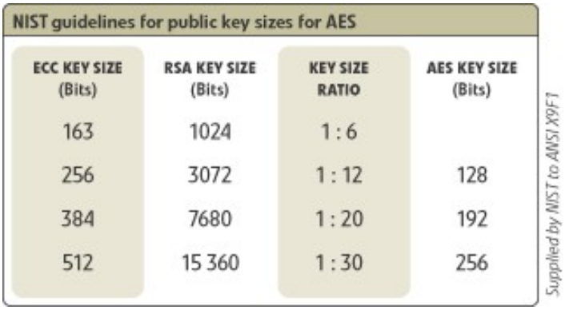

## Overview

- Mathematical Foundations
- Reference Problems
- Factorization
- RSA Encryption Algorithm
- ElGamal Encryption Algorithm
- Rabin Encryption Algorithm
- Elliptic Curves

## Mathematical Foundations

- **Fundamental Theorem of Arithmetic:**

  Every strictly positive integer n can be written uniquely (up to order) as a product of powers of distinct prime numbers $p_i$, namely:

  $$n = p_1^{e1} \cdot p_2^{e2} \cdot p_3^{e3} \cdot \ldots \cdot p_m^{em}$$

- **Euler's Phi Function**:

  Let $n \in Z^+$, **Euler's phi function $\Phi(n)$** is equal to the number of positive integers smaller than n that are relatively prime to n.

- Computing the **value** of **Euler's phi function $\Phi(n)$:**

  According to the fundamental theorem of arithmetic, every integer n>1 can be written as:

  $$n = \prod_{i=1}^{m} p_i^{ei}$$

  then $\Phi(n)$ is computed as:

  $$\Phi(n) = \prod_{i=1}^{m} (p_i^{ei} - p_i^{(ei-1)})$$

## Mathematical Foundations (II)

- In particular, if **n** is written as **n = p · q** with **p** and **q** prime, then:

  $$\Phi(n) = (p - 1) \cdot (q - 1)$$

- **Euler's Theorem**:

  Let $n \in Z^+$ and $a \in Z$ with gcd (a, n) = 1, then we have:

  $$a^{\Phi(n)} \equiv 1 \bmod n$$

- **Fermat's Little Theorem** (special case of Euler's theorem if n is prime):

  Let $a \in Z$ and p a prime number such that p does not divide a, then we have:

  $$a^{p-1} \equiv 1 \bmod p$$

  Note that since p is prime, we have $\Phi(p) = p-1$.

- **Reduction of exponents mod $\Phi(n)$:**

  If n is the product of distinct primes and r, s $\in Z$ s.t. $r \equiv s \bmod \Phi(n)$ then $\forall a \in Z$:

  $$a^r \equiv a^s \bmod n$$

- **Application of Euler's Theorem to Computing Inverses**:

  Following Euler's theorem, we have that:

  $$a \, a^{\Phi(n)-1} \equiv 1 \bmod n$$

  which means that **$a^{\Phi(n)-1}$ is the inverse of a mod n.** In particular, **$a^{p-2}$ is the inverse of a mod n if p is prime.**

## Mathematical Foundations (III)

- **Definition:** The **multiplicative group** of $Z_n$, denoted $Z_n^*$ is = { $a \in Z_n$ s.t. **gcd(a,n) = 1**}.

  In particular, if **n** is **prime:** $Z_n^* = \{ a \text{ s.t. } 1 \le a \le n-1 \}$

- The **number of elements**, or **order**, of the **multiplicative group** $Z_n^*$ is $\Phi(n)$ (by def. of $\Phi$).

- **Definition**: Let $a \in Z_n$, the **order** of **a** is the smallest positive integer **t** for which:

  $$a^t \equiv 1 \bmod n$$

- **Definition**: Let $\alpha \in Z_n^*$, if the order of $\alpha$ is $\Phi(n)$, then $\alpha$ is a **generator** of $Z_n^*$.

  When a group $Z_n^*$ has a generator, it is said to be **cyclic**.

- **Properties of generators**:
  - $Z_n^*$ has a generator iff. **n = 2, 4, $p^k$ or $2p^k$**, with **p prime, p ≠ 2 and k ≥ 1**.

    In particular, if p is prime, $Z_p^*$ has a generator.
  - If $\alpha$ is a generator of $Z_n^*$, then all elements of $Z_n^*$ can be written as:

    $$Z_n^* = \{ \alpha^i \bmod n \text{ s.t } 0 \le i \le \Phi(n) - 1 \}$$
  - The number of generators of $Z_n^*$ is $\Phi(\Phi(n))$.
  - $\alpha$ is a generator of $Z_n^*$ iff. $\forall$ **prime p** s.t. **p divides $\Phi(n)$**, we have:

    $$\alpha^{\Phi(n)/p} \ne 1 \bmod n .$$

    In particular if **n** is a **prime** of the form **2p + 1** with **p prime** (such an **n** is called a ***safe prime***), $\alpha$ is a generator of $Z_n^*$ iff. $\alpha^2 \ne 1 \bmod n$ and $\alpha^p \ne 1 \bmod n$.

## Fast Exponentiation

- ***Fast exponentiation***: Using the binary representation of a number, one can compute powers very efficiently, e.g. computing $2^{644} \bmod 645$:

  $$(644)_{10} = (1010000100)_2$$

  Now, we compute the exponents corresponding to powers of 2, namely:

  $$2 \equiv 2 \bmod 645$$
  $$2^2 \equiv 4 \bmod 645$$
  $$2^4 \equiv 16 \bmod 645$$
  $$2^8 \equiv 256 \bmod 645$$
  $$2^{16} \equiv 391 \bmod 645$$
  $$\ldots$$
  $$2^{512} \equiv 256 \bmod 645$$

  Based on the binary representation, we compute:

  $$2^{644} = 2^{512+128+4} = 2^{512} \cdot 2^{128} \cdot 2^4 = 1601536 \equiv 1 \bmod 645$$

  The complexity of this ***fast exponentiation*** algorithm is $O(\log^3 n)$.

  Building on Euler's theorem, computing the inverse of a number in such a group can therefore be done in polynomial time.

- **The extended Euclidean algorithm** can also be used to find an x s.t:

  $$ax \equiv 1 \bmod n$$

  since this congruence can be written as: **ax - 1 = kn** and therefore:

  $$ax - kn = 1 = \text{gcd}(a, n).$$

  The complexity of this algorithm is also $O(\log^3 n)$.

## Chinese Remainder Theorem

- The **Chinese Remainder Theorem** (3rd$^\text{rd}$ century!) makes it possible to solve systems of simultaneous linear congruences. It solves problems raised in ancient Chinese puzzles. It involved, for example, finding a number that leaves a remainder of 1 when divided by 3, of 2 when divided by 5, and of 3 when divided by 7... It was also used to compute the exact moment of alignment of several celestial bodies having different orbits (and therefore periods).

- **Chinese Remainder Theorem**: Let $n_1, n_2, \ldots, n_t \in Z^+$ be pairwise coprime (i.e. gcd $(n_i,n_j) = 1$, $i \ne j$) and $a_1, a_2, \ldots, a_t \in Z$. Then, the system of congruences:

  $$x \equiv a_1 \bmod n_1$$
  $$x \equiv a_2 \bmod n_2$$
  $$\ldots$$
  $$x \equiv a_t \bmod n_t$$

  has a unique solution x mod $N := n_1 n_2 \ldots n_t$

- **Gauss's Algorithm** (1801) for computing x:

  $$x = \sum_{i=1}^{t} a_i N_i M_i \bmod N$$

  with $N_i = N/n_i$ and $M_i = N_i^{-1} \bmod n_i$. The complexity of this algorithm is $O(\log^3 n)$.

- It is therefore possible in polynomial time to move between congruences **mod $n_i$** and congruences **mod N**!

## Reference Problems

- **Main generic problems**
  - **Factorization** (FACTP): Given a positive integer n, find its factorization into prime numbers.
  - **Discrete logarithms** (DLP): Given a prime number p, a generator $\alpha \in Z_p^*$ and an element $\beta \in Z_p^*$, find the integer x, $0 \le x \le p-2$, such that: $\alpha^x \equiv \beta \bmod p$.
  - **Square root in $Z_n$ if n is composite** (SQROOTP): Given a composite integer n and a quadratic residue a, find the square root of `a mod n`.
- **Specific problems** (specific to a given cryptosystem):
  - **RSA** (RSAP): Given a positive integer n = pq, a positive integer e with $\gcd(e,(p-1)(q-1)) = 1$ and an integer c, find an integer m with $m^e \equiv c \bmod n$.
  - **Diffie-Hellman** (DHP): Given a prime number p, a generator $\alpha \in Z_p^*$ and the elements $\alpha^a \bmod p$ and $\alpha^b \bmod p$, find $\alpha^{ab} \bmod p$.
- **Proven results**:
  - DHP $\le_p$ DLP (Proven equivalent under certain conditions^[*The Relationship Between Breaking the Diffie--Hellman Protocol and Computing Discrete Logarithms*. U. Maurer, S. Wolf. SIAM Journal of Computing, volume 28, no. 5, pages 1689-1721, 1999.])
  - RSAP $\le_p$ FACTP (Proven equivalent for the generic problem, see page 101)
  - SQROOTP $\cong_p$ FACTP

## Classical Factorization Techniques

### Exponential Time

They run at best in $O(\exp(c * \ln(n)))$

- Trial division
- Sieve of Eratosthenes (2nd century BC)
- Fermat's difference-of-squares method (~1650)
- Square Form Factorization (1971)
- Pollard's p-1 method (1974)
- Pollard's Rho method (1975)

### Sub-exponential Time

They run at best in $O(\exp(c * (\ln(n))^{1/3}))$

- Continued fractions (1975)
- Quadratic sieve (1981)
- Number field sieve - NFS (1990)
- General number field sieve - GNFS (2006)

### Polynomial Time Methods

- Shor's algorithm on a quantum computer (1994) runs in $O(\log^c n)$

## Factorization: New Developments

- Bernstein's NFS-specific-purpose computer^[Daniel J. Bernstein. *Circuits for Integer Factorization: a Proposal* (October 2001)] which (according to his assumptions) factors a 1536-bit number in the same time as a 512-bit computation performed on a conventional machine running NFS.

- Lenstra et al.^[Lenstra, Shamir et al. *Analysis of Bernstein's Factorization Circuit*. June 2002] claim that "Bernstein's factor should be brought down to 1.17," but argue that a one-day factorization machine for a 1024-bit number could be built for a few thousand dollars under certain optimistic assumptions.

- To learn more about the Bernstein - Lenstra, Shamir controversy, see `http://cr.yp.to/nfscircuit.html`

- The largest factorization of a number to date (2020) using NFS is RSA-829 (a 250-digit number)^[Zimmermann, Paul (February 28, 2020). "*Factorization of RSA-250*". cado-nfs-discuss (Mailing list).]. A total computation time of *2700 core-years*, using *Intel Xeon Gold 6130 CPUs* as reference (2.1 GHz).

- Factorization on a quantum computer
  - Significant challenges in building the machine (errors, decoherence, etc.)
  - I. Chuang (IBM, Almaden) built a 7-*qubit* computer (December 2001)
  - Ongoing work: feasibility of a computer with millions of *qubits*...?

## RSA Encryption/Decryption Scheme^[*A Method for Obtaining Digital Signatures and Public Key Cryptosystems*. R.Rivest, A.Shamir and L.M. Adleman. Communications of tha ACM 21 (1978), 120-126]

### Key Generation

- Each entity (**A**) creates a key pair (public and private) as follows:
  - A chooses the size of the **modulus n** (e.g. size (n) = 1024 or size (n) = 2048).
  - A generates two large prime numbers **p** and **q** (~ n/2).
  - A computes **n := pq** and $\Phi(n) = (p-1)(q-1)$.
  - A generates the encryption exponent **e**, with $1 < e < \Phi(n)$ s.t. **gcd (e, $\Phi(n)$) = 1**.
  - A computes the decryption exponent **d**, s.t.: $ed \equiv 1 \bmod \Phi(n)$ using the extended Euclidean algorithm or the *fast exponentiation* algorithm (page 94).
  - The pair **(n,e)** is A's **public key**; **d** is A's **private key**.

### Encryption

- Entity **B** obtains **(n,e),** A's authentic public key.
- **B** transforms its plaintext into a series of integers $m_i$, s.t. $m_i \in [0, n-1] \; \forall i$.
- **B** computes the ciphertext $c_i := m_i^e \bmod n$, $\forall i$ using the *fast exponentiation* algorithm.
- **B** sends **A** all the ciphertexts $c_i$.

### Decryption

- **A** uses its private key to compute the plaintexts $m_i = c_i^d \bmod n$.

## Proof of RSA

- Let **m** be the plaintext and **c** the ciphertext with $c := m^e \bmod n$, we need to prove:

  $$m \equiv c^d \bmod n$$

  Substituting c with its value gives:

  $$c^d \bmod n = m^{ed} \bmod n \quad (*)$$

  but, we know that:

  $$ed \equiv 1 \bmod \Phi(n)$$

  and therefore, by definition of congruences, there exists an integer k with:

  $$ed - 1 = k\Phi(n)$$

  substituting into (*):

  $$(c^d \equiv m^{k\Phi(n)+1} \equiv m^{k\Phi(n)} m) \bmod n$$

  If **gcd (m,n) = 1**, we have by Euler's theorem:

  $$1 \equiv m^{\Phi(n)} \bmod n$$

  therefore:

  $$(c^d \equiv m^{k\Phi(n)} m \equiv m) \bmod n \qquad \text{q.e.d.!}$$

  If **gcd (m,n) ≠ 1**, **m** is necessarily a multiple of **p** or of **q** (a very unlikely case...), one can show by working **mod p** and **mod q** that the congruence still holds.

## RSA: Security

- The **RSAP** problem (page 96), consisting of finding **m** from **c**, has not been proven to be as hard as factorization but...:

- ... one can prove that if **d** is found, **p** and **q** can easily be computed. This is equivalent to saying that factoring **n** and finding **d** require an equivalent computational effort.

- We know that the fastest known factorization methods (page 97) have *sub-exponential* complexity ($\sim O(\exp(c * (\ln(n))^{1/3}))$). The problem therefore remains computationally infeasible for moduli ≥ 1048 bits (2048 bits is a frequent choice for lasting security...).

- In order to improve encryption speed, one tends to choose fairly small exponents **e** (typically: **e := 3, e:=17 and e:=19**). However, it has been proven that computing an *i-th root* (with small **i**) modulo a composite **n** can be significantly easier than factoring **n**^[*Breaking RSA May Not Be Equivalent to Factoring*. D. Boneh et R. Venkatesan. Advances in Cryptology - EUROCRYPT '98.]. On the other hand, in 2008 it was proven that **the generic resolution of the RSA problem is equivalent to factorization**.^[*Breaking RSA Generically is Equivalent to Factoring.* D. Aggarwal and U. Maurer. CRYPTO 2008 Rump Session.]

- The decryption exponent **d** must imperatively be large^[*Cryptanalysis of short RSA secret exponents*. M.J Wiener. IEEE transactions on Information Theory (1990), 553-558.] (at least half the size of n) to guarantee the security of the system.

- As a result, **encryption is normally significantly faster than decryption**, since the exponents used are much smaller!

## RSA: Attacks

- When one wishes to encrypt the same message for a group of correspondents, it is important to introduce variations (*randomization*) before encryption to avoid the following attack:

  Suppose that ciphertexts $c_1,c_2,c_3$ are computed from the same plaintext m and the same exponent **e:=3** addressed to three entities with moduli: $n_1, n_2, n_3$.

  The *Chinese Remainder Theorem* tells us that there exists a solution **x mod $n_1n_2n_3$**, s.t.:

  $$x \equiv c_1 \bmod n_1, \qquad x \equiv c_2 \bmod n_2 \qquad x \equiv c_3 \bmod n_3$$

  But if **m** does not change across the three encryptions, we have $x = m^3 \bmod n_1n_2n_3$ and, moreover: $m^3 < n_1n_2,n_3$. One can, therefore, find **m** by computing the **integer cube root** of $m^3$, knowing that efficient algorithms exist for this computation!

- More generally, if $m < n^{1/e}$, fast algorithms (in **Z**) can be applied to compute the **e-th roots** of $m^e$. It is therefore important to perform "*randomization*" operations on **m** before encrypting!

- RSA's multiplicative property: $(m_1m_2)^e \equiv m_1^e m_2^e \equiv c_1 c_2 \bmod n$ gives rise to dangerous weaknesses (see blind signatures).

- Assuming the parameters are correctly chosen and the implementation has no flaws, the most effective method for "breaking" the generic RSA algorithm remains the factorization of n.

## ElGamal Encryption/Decryption Scheme^[*A Public Key Cryptosystem and a Signature Scheme Based on Discrete Logaithms*. T. ElGamal. Advances in Cryptology-Proceedings of CRYPTO 84 (LNCS 196), 10-18, 1985.]

### Key Generation

- Each entity (**A**) creates a key pair (public and private) as follows:
  - A generates a large prime number **p** ($\text{len}(p) \ge 1024$ **bits**) and a generator $\alpha$ of the multiplicative group $Z_p^*$.
  - A generates a random number **a**, s.t. $1 \le a \le p-2$ and computes $\alpha^a \bmod p$.
  - A's public key is **(p, $\alpha$, $\alpha^a \bmod p$)**, A's private key is **a**.

### Encryption

- Entity **B** obtains **(p, $\alpha$, $\alpha^a \bmod p$),** A's authentic public key.
- **B** transforms its plaintext into a series of integers $m_i$, s.t. $m_i \in [0, p-1] \; \forall i$.
- For each message $m_i$:
  - **B** generates a unique random number **k**, s.t. $1 \le k \le p-2$.
  - **B** computes $\lambda := \alpha^k \bmod p$ and $\delta := m_i (\alpha^a)^k \bmod p$ and sends the ciphertext $c := (\lambda,\delta)$.

### Decryption

- **A** uses its private key **a** to compute $\lambda^{p-1-a} \bmod p$ (note that: $\lambda^{p-1-a} \equiv \lambda^{-a} \equiv \alpha^{-ak} \bmod p$).
- **A** recovers the plaintext by computing: $(\alpha^{-ak}) \, \delta \bmod p.$

## ElGamal Scheme: Remarks

- The proof that decryption works is obvious by substituting $\delta$ with its value:

  $$(\alpha^{-ak}) \, \delta \bmod p \equiv (\alpha^{-ak}) \, m \, (\alpha^a)^k \bmod p \equiv m \bmod p.$$

- The ElGamal scheme is based on the difficulty of computing discrete logarithms modulo a prime number (see the **DLP** problem on page 96) even though it has not been proven to be strictly equivalent to that problem.

- The most efficient algorithms known to date have *sub-exponential* complexity very close to that of factorization (the same algorithms are often used...)

- The chosen exponents **(k,a)** must be large, since there exist efficient algorithms for computing discrete logarithms modulo a prime number when the exponent is small (*baby-step giant-step algorithm*^[Algorithm by D.Shanks appearing in: *The Art of Computer Programming-Fundamental Algorithms*. D.E Knuth. Volume 1. Addison Wesley 1973.])

- One drawback of ElGamal is that it doubles the length of the ciphertext.

- It is essential for the security of the scheme that the random number **k not be repeated,** otherwise: let $(\lambda_1,\delta_1)$ and $(\lambda_2,\delta_2)$ be the two generated ciphertexts, we have that $\delta_1/\delta_2 = m_1/m_2$ and consequently, it is trivial to recover one plaintext from the other...

- The ElGamal scheme can be generalized to other groups such as **$GF(2^n)$** or elliptic curves (see page 111).

## Rabin Encryption/Decryption Scheme^[*Digitalized Signatures and Public Key Functions as Intractable as Factorization.* M.O.Rabin. MIT/LCS/TR 212. MIT Laboratory for Computer Science 1979.]

### Key Generation

- Each entity (**A**) creates a key pair (public and private) as follows:
  - A generates two large random prime numbers **p** and **q** ($\text{len}(pq) \ge 1024$).
  - A computes **n := pq**.
  - A's public key is **n**, A's private key is **(p,q)**.

### Encryption

- Entity **B** obtains **n,** A's authentic public key.
- **B** transforms its plaintext into a series of integers $m_i$, s.t. $m_i \in [0, n-1] \; \forall i$.
- **B** computes $c_i = m_i^2 \bmod n$ for each message $m_i$.
- **B** sends all the ciphertexts $c_i$ to **A**.

### Decryption

- **A** uses its private key **(p,q)** to find the **4 solutions** of the equation: $c_i = x^2 \bmod n$ using efficient algorithms for computing square roots **mod p** and **mod q**.
- **A** determines, either through additional information from **B**, or through redundancy analysis, which of the 4 messages $m_1, m_2, m_3, m_4$ is the original plaintext.

## Rabin Scheme: Remarks

- The Rabin scheme is based on the impossibility of finding square roots modulo a composite of unknown factorization (problem **SQROOTP**, see page 96).

- The main interest of this algorithm lies in the fact that it has been proven to be equivalent to factorization (SQROOTP $\cong$ FACTP). This algorithm therefore belongs to the category of algorithms that are ***provably secure* against any passive attack**.

- **Active attacks** can, in some cases, compromise the security of the algorithm. More precisely, if one mounts the following *chosen ciphertext* attack (A is asked to decrypt a chosen ciphertext):
  - Attacker **M** generates an **m** and sends **A** the ciphertext $c = m^2 \bmod n$.
  - **A** responds with a root $m_x$ among the 4 possible ones $m_1, m_2, m_3, m_4$.
  - If $m \equiv \pm m_x \bmod n$ (probability 0.5), **M** starts over with a new **m**.
  - Otherwise, **A** computes **gcd $(m - m_x, n)$** and thereby obtains one of the two factors of **n**...

- This attack could be avoided if the scheme required sufficient redundancy in the plaintexts, allowing A to unambiguously identify which of the possible solutions is the original plaintext. In this case, A would always respond with **m** and discard the other solutions that do not have the pre-established level of redundancy.

## Elliptic Curves^[Source of all images on elliptic curves: `https://www.certicom.com/en/ecc-tutorial`]

- An **elliptic curve** is a set of points **E** defined by the equation:

  $$y^2 = x^3 + ax + b$$

  with x, y, a and b being **rational**, **integer**, or **integer modulo m** numbers (m > 1). The set E also contains a "**point at infinity**" denoted $\infty$. The point $\infty$ is not on the curve but is the identity element of E.

- For our computations we will choose elliptic curves having no multiple roots or, in other words, curves where the discriminant $4a^3 + 27b^2 \ne 0.$

## Elliptic Curves: Addition

- Let $P := (x, y) \in E$, we define **-P** as **-P := (x, -y)**. Graphically, **-P** is the point symmetric to **P** with respect to the **x**-axis. Note that **P + (-P) = $\infty$**.

- Let $P, Q \in E$ be two points, such that $Q \ne -P$, we define the addition **P + Q := R** where $R \in E$ s.t. **-R** is the 3rd$^\text{rd}$ point of intersection between the curve and the line passing through **P** and **Q**:

- The set E with $\infty$ defines a **commutative group** under addition.

## Elliptic Curves: Scalar Multiplication

- Let $P \in E$, the point **2P = R**, s.t. **-R** is the point of intersection of the curve with the line tangent to the curve at point P.

- When the elliptic curve is defined over the field $Z_p$ with **p** a large prime number ($y^2 \equiv x^3 + ax+ b \bmod p$), computing $k \in Z_p$ s.t. **Q = kP** with **(P, Q)** known is very difficult (requires exponential effort...). This problem is known as: **Elliptic Curve Discrete Logarithm Problem (ECDLP)**

## Elliptic Curves: Remarks

- The main advantage of public key cryptography based on elliptic curves is that the size of the numbers used (and therefore of the keys) is smaller.

- This is due to the increased complexity of computations on $E_p$ (elliptic curve defined over the field $Z_p$) compared to usual fields such as $Z_p$ or $GF(2^m)$.

- This table shows the ratios of key sizes compared to those of RSA:

- Representing a plaintext as points on the curve remains a complex operation.

- In October 2003^[`http://www.certicom.com/index.php?action=company,press_archive&view=175`], the *US National Security Agency* (NSA) purchased a patent from *Certicom* for the use of elliptic curve cryptography.

- In September 2013 Claus Diem showed^[`http://www.math.uni-leipzig.de/~diem/preprints/dlp-ell-curves-II.pdf`] that under certain conditions the **ECDLP** problem could be solved in *sub-exponential* time.

## ElGamal Scheme on Elliptic Curves

### Key Generation

- Each entity (**A**) creates a key pair (public and private) as follows:
  - A chooses an elliptic curve $E_p$ with **p,** a large prime number ($\text{len}(p) \sim 200$ **bits**) and a point $P_o \in E_p$.
  - A generates a random number **a**, s.t. $1 < a < p$ and computes $P_a = aP_o$ (scalar multiplication on $E_p$, for which efficient algorithms exist).
  - A's public key is **($E_p$, $P_o$, $P_a$)**, A's private key is **a**.

### Encryption

- Entity **B** obtains **($E_p$, $P_o$, $P_a$),** A's authentic public key.
- **B** transforms its plaintext into a series of integers $m_i$, s.t. $m_i \in E_p \; \forall i$.
- For each message $m_i$:
  - **B** generates a unique random number **k**, s.t. $1 < k < p$.
  - **B** computes $\lambda := kP_o$ and $\delta := kP_a + m_i$ and sends the ciphertext $c := (\lambda,\delta)$.

### Decryption

- **A** uses its private key **a** to compute: $a\lambda = akP_o = kP_a$ .
- **A** recovers the plaintext by computing: $\delta - kP_a = kP_a + m_i - kP_a = m_i.$
- The security of the scheme relies on **ECDLP**!

## Summary Table^[*Next Generation Security for Wireless.* S.A Vanstone, 2004. `http://www.compseconline.com/hottopics/hottopic20_8/Next.pdf`]

| Public key system | Mathematical problem | Examples |
|---|---|---|
| Integer factorization | Given a number n, find its prime factors | RSA, Rabin-Williams |
| Discrete logarithm | Given a prime number n, and numbers g and h, find x such that $h = g^x \bmod n$ | ElGamal, Diffie-Hellman, DSA |
| Discrete logarithm on elliptic curve | Given an elliptic curve E and points P and Q on E, find x such that Q = xP | EC-Diffie-Hellman, ECDSA |

| Public key system | Best known methods for solving the mathematical problem | Running time |
|---|---|---|
| Integer factorization | Number field sieve: $\exp(1.923 (\log n)^{1/3}(\log \log n)^{2/3})$ | Sub-exponential |
| Discrete logarithm | Number field sieve: $\exp(1.923 (\log n)^{1/3}(\log \log n)^{2/3})$ | Sub-exponential |
| Discrete logarithm on elliptic curve | Pollard-rho algorithm: square root of n | Fully exponential |
