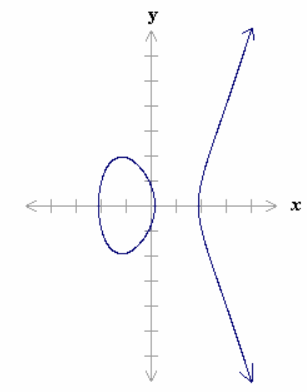

## Overview

| System | Underlying hard problem | Public key | Private key |
|---|---|---|---|
| **RSA** | Factorization (FACTP) | $(n,e)$ | $d$ |
| **ElGamal** | Discrete logarithm (DLP) | $(p,\alpha,\alpha^a \bmod p)$ | $a$ |
| **Rabin** | Square root mod composite (SQROOTP) | $n$ | $(p,q)$ |
| **EC-ElGamal** | Discrete log. on curve (ECDLP) | $(E_p,P_0,P_a)$ | $a$ |

::: {.callout-tip title="Common thread"}

All these systems rely on a **function that is easy to compute in one direction, hard to invert without a secret** (trapdoor). The secret = the hidden algebraic structure (prime factors, discrete exponent...).

:::

## Mathematical Foundations

**🔴 Fundamental theorem of arithmetic**: every $n>0$ can be written uniquely as $n = p_1^{e_1}\cdots p_m^{e_m}$.

**🔴 Euler's $\Phi$ function**: $\Phi(n)$ = number of integers $<n$ coprime with $n$.

$$\Phi(n) = \prod_{i=1}^m \left(p_i^{e_i} - p_i^{e_i-1}\right) \qquad \Phi(pq) = (p-1)(q-1) \; \text{if } p,q \text{ prime}$$

**🔴 Euler's theorem**: if $\gcd(a,n)=1$, then $a^{\Phi(n)} \equiv 1 \bmod n$.

**🟠 Fermat's little theorem** (special case, $n=p$ prime, $\Phi(p)=p-1$):

$$a^{p-1} \equiv 1 \bmod p$$

**🟠 Practical consequences**:

- Exponent reduction: if $r \equiv s \bmod \Phi(n)$ then $a^r \equiv a^s \bmod n$.
- Modular inverse: $a^{\Phi(n)-1}$ is the inverse of $a$ mod $n$ (hence $a^{p-2}$ if $p$ prime).

**Multiplicative group $Z_n^*$**: $Z_n^* = \{a \in Z_n : \gcd(a,n)=1\}$, of order $\Phi(n)$.

- **Order of an element $a$**: smallest $t>0$ such that $a^t \equiv 1 \bmod n$.
- **Generator**: element of order $\Phi(n)$ → generates all of $Z_n^*$; the group is then said to be **cyclic**.
- $Z_n^*$ has a generator iff $n = 2, 4, p^k$ or $2p^k$ ($p$ prime $\ne 2$). In particular always true if $n$ is prime.
- Number of generators of $Z_n^*$: $\Phi(\Phi(n))$.

::: {.callout-warning title="Trap"}

Do not confuse the **order of the group** ($\Phi(n)$, the size of $Z_n^*$) with the **order of an element** ($t$ such that $a^t\equiv1$). An element is a generator only if its order equals the order of the group.

:::

**Fast exponentiation** (*fast exponentiation*): via the binary representation of the exponent → complexity $O(\log^3 n)$. Also allows (via Euler) computing an inverse in polynomial time.

**Extended Euclidean algorithm**: finds $x$ such that $ax \equiv 1 \bmod n$ (solves $ax-kn=1=\gcd(a,n)$), complexity $O(\log^3 n)$.

**🔴 Chinese Remainder Theorem (CRT)**: for $n_1,\ldots,n_t$ pairwise coprime, the system $x \equiv a_i \bmod n_i$ has a unique solution mod $N=\prod n_i$ (Gauss's algorithm, $O(\log^3 n)$). Allows efficiently moving from congruences mod $n_i$ to a congruence mod $N$.

## Reference Problems

| Problem | Statement | Used by |
|---|---|---|
| **FACTP** | Factor $n$ into primes | RSA, Rabin |
| **DLP** | Find $x$ s.t. $\alpha^x \equiv \beta \bmod p$ | ElGamal, DH, DSA |
| **SQROOTP** | Square root of $a$ mod composite $n$ | Rabin |
| **RSAP** | Find $m$ s.t. $m^e \equiv c \bmod n$ | RSA |
| **DHP** | Find $\alpha^{ab}\bmod p$ from $\alpha^a,\alpha^b$ | Diffie-Hellman |

**Proven results (reductions)**:

- $\text{DHP} \le_p \text{DLP}$ (equivalent under certain conditions)
- $\text{RSAP} \le_p \text{FACTP}$ (equivalence proven for the generic case)
- $\text{SQROOTP} \cong_p \text{FACTP}$ (complete equivalence)

::: {.callout-warning title="Trap"}

RSA's security is **not proven to be strictly equivalent** to FACTP in the general case (only for the "generic" attack), unlike Rabin, where SQROOTP $\cong$ FACTP is a complete result.

:::

## Factorization Techniques

| Class | Complexity | Algorithms |
|---|---|---|
| **Exponential** | $O(\exp(c\ln n))$ | Trial division, sieve of Eratosthenes, Fermat, Pollard $p{-}1$, Pollard $\rho$ |
| **Sub-exponential** | $O(\exp(c(\ln n)^{1/3}))$ | Continued fractions, quadratic sieve, NFS, GNFS |
| **Polynomial** | $O(\log^c n)$ | Shor (**quantum** computer only) |

::: {.callout-important title="Key takeaway"}

No known classical algorithm factors in polynomial time: this is the basis of RSA/Rabin security. Only a **quantum** computer (Shor) would allow it — hence the current interest in post-quantum cryptography.

:::

2020 record: RSA-829 (250 digits) factored via GNFS in ~2700 core-years.

## RSA

### Key Generation

1. Choose the size of $n$ (1024, 2048 bits...).
2. Generate large primes $p,q$ ($\sim n/2$), compute $n=pq$, $\Phi(n)=(p-1)(q-1)$.
3. Choose $e$ s.t. $1<e<\Phi(n)$, $\gcd(e,\Phi(n))=1$.
4. Compute $d$ s.t. $ed \equiv 1 \bmod \Phi(n)$ (extended Euclidean algorithm).
5. Public key $(n,e)$, private key $d$.

### Encryption / Decryption

$$c = m^e \bmod n \qquad\qquad m = c^d \bmod n$$

**Proof (idea)**: $ed \equiv 1 \bmod \Phi(n) \Rightarrow ed = k\Phi(n)+1$. If $\gcd(m,n)=1$, Euler gives $m^{\Phi(n)}\equiv1$, so $c^d \equiv m^{k\Phi(n)}m \equiv m \bmod n$.

**🔴 Security**:

- Finding $d$ ⟺ factoring $n$ (equivalent effort).
- Secure as long as factoring $n$ remains sub-exponential; $n \ge 2048$ bits recommended.
- Solving RSAP generically ⟺ FACTP (2008 result).
- $d$ must be **large** (≥ half the size of $n$), otherwise Wiener's attack applies.
- Consequence: **fast encryption** (small $e$), **slow decryption** (large $d$).

::: {.callout-warning title="RSA attacks"}

- **Common message with small $e$**: if the same $m$ is encrypted to 3 recipients with $e=3$, the CRT allows reconstructing $m^3$ and extracting its cube root → **always randomize $m$** before encryption.
- **Multiplicative property**: $(m_1m_2)^e \equiv c_1c_2 \bmod n$ → exploitable (blind signatures).

:::

## ElGamal

### Key Generation

Choose a large prime $p$, a generator $\alpha$ of $Z_p^*$, secret $a$ ($1\le a\le p-2$), compute $\alpha^a \bmod p$.
Public key $(p,\alpha,\alpha^a\bmod p)$, private key $a$.

### Encryption / Decryption

For each message, B chooses a **unique random $k$**:

$$\lambda := \alpha^k \bmod p \qquad \delta := m\,(\alpha^a)^k \bmod p \qquad c:=(\lambda,\delta)$$

A computes $\lambda^{p-1-a} \equiv \alpha^{-ak} \bmod p$, then $m \equiv \delta \cdot \alpha^{-ak} \bmod p$.

**Security**: relies on the difficulty of the DLP (not proven strictly equivalent).

::: {.callout-warning title="Major trap"}

If **$k$ is reused** for two messages: $\delta_1/\delta_2 = m_1/m_2$ → one plaintext is trivially recovered from the other. $k$ must be **unique for each encryption**.

:::

**Limitations**: exponents $(k,a)$ must be large (otherwise *baby-step giant-step*); the ciphertext is **double** the size of the plaintext.

## Rabin

### Key Generation

Large primes $p,q$ ($\text{size}(pq)\ge1024$), $n:=pq$. Public key $n$, private key $(p,q)$.

### Encryption / Decryption

$$c = m^2 \bmod n$$

Decryption: compute the **4 square roots** of $c$ mod $n$ (via $p$ and $q$); identify the correct $m$ through redundancy or an indication from B.

| | |
|---|---|
| **Advantage** | **Proven** equivalence SQROOTP $\cong$ FACTP → *provably secure* against **passive** attacks |
| **Limitation** | Ambiguity of the 4 roots; vulnerable to the *chosen ciphertext* attack (**active**) |

::: {.callout-warning title="Active attack on Rabin"}

The attacker sends a chosen $c=m^2 \bmod n$, obtains a root $m_x$ from A. If $m \ne \pm m_x$ (probability $1/2$), $\gcd(m-m_x,n)$ reveals a factor of $n$ → breaks the system. Countermeasure: require **redundancy** in the plaintexts.

:::

## Elliptic Curves

**Definition**: $E: y^2 = x^3+ax+b$ (+ point at infinity $\infty$, neutral element), with discriminant $4a^3+27b^2 \ne 0$.

**Geometric addition**: $-P=(x,-y)$; $P+Q=R$ where $-R$ is the 3rd point of intersection of the line $(PQ)$ with $E$. $(E,+)$ forms a **commutative group**.

**Scalar multiplication**: $2P=R$ where $-R$ is the intersection of the tangent at $P$ with $E$ (allows efficient computation of $kP$).

**🔴 ECDLP**: on $E_p$ ($p$ a large prime), recovering $k$ such that $Q=kP$ is **exponentially hard**.

::: {.callout-tip title="Advantage of elliptic curves"}

Security equivalent to RSA with **much smaller keys**, since the best known attacks (Pollard-rho, $O(\sqrt{n})$) are **fully exponential**, unlike the sub-exponential NFS used against RSA/classical DLP.

:::

### EC-ElGamal

- **Keys**: A chooses $E_p$ ($\text{len}(p)\sim200$ bits), $P_0\in E_p$, secret $a$, computes $P_a=aP_0$. Public $(E_p,P_0,P_a)$, private $a$.
- **Encryption**: B chooses a unique random $k$, sends $c=(\lambda,\delta)$ with $\lambda:=kP_0$, $\delta:=kP_a+m_i$.
- **Decryption**: A computes $a\lambda = kP_a$, then $m_i = \delta - kP_a$.
- Security: relies on **ECDLP**.

## Final Comparison

| System | Mathematical problem | Examples |
|---|---|---|
| Integer factorization | Find the prime factors of $n$ | RSA, Rabin |
| Discrete logarithm | Find $x$ s.t. $h=g^x \bmod n$ | ElGamal, Diffie-Hellman, DSA |
| Discrete log. on elliptic curve | Find $x$ s.t. $Q=xP$ | EC-Diffie-Hellman, ECDSA |

| Problem | Best known method | Complexity |
|---|---|---|
| Factorization | Number Field Sieve | Sub-exponential |
| Discrete log. | Number Field Sieve | Sub-exponential |
| Elliptic discrete log. | Pollard-rho ($O(\sqrt n)$) | Fully exponential |

## Key Takeaways

- All these systems rely on problems that are **easy in one direction, hard in the other** (factorization, discrete log, square root mod composite).
- **RSA**: security ≈ factorization; small $e$ → fast encryption; large $d$ → mandatory.
- **ElGamal**: security ≈ DLP; **never reuse $k$**; ciphertext doubles.
- **Rabin**: the only system **proven** equivalent to FACTP (passive), but fragile against active attacks.
- **Elliptic curves**: same security as RSA with much smaller keys (fully exponential attacks vs sub-exponential).
- Euler's theorem + CRT + fast exponentiation = mathematical toolbox common to the whole chapter.
