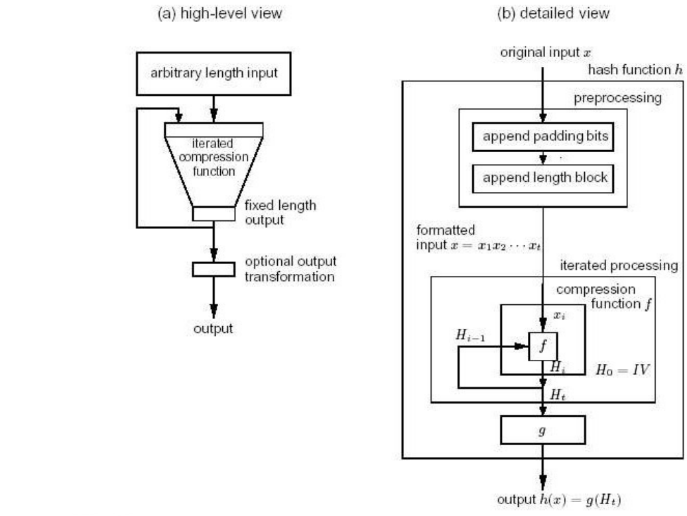
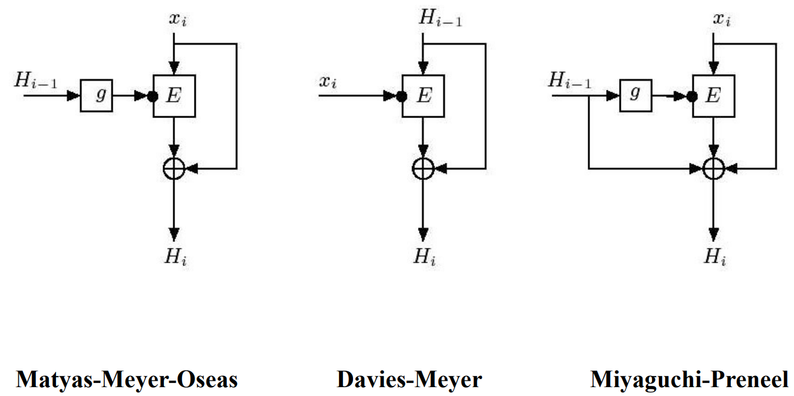
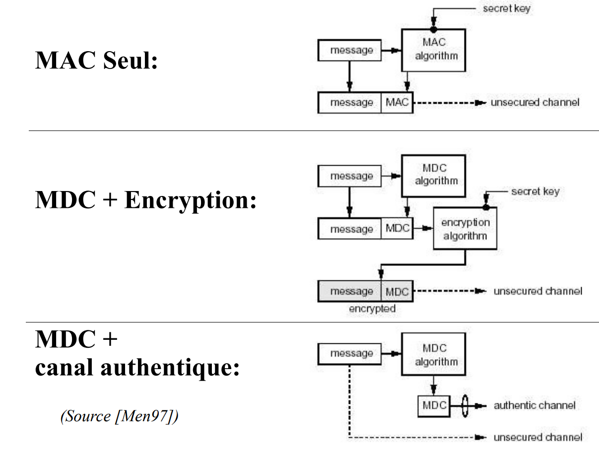

## Hashes and MACs — Plan

- *One-way functions*
- Hash function: definition and classification
- Unkeyed hash functions (MDCs)
    - MDCs based on cryptographic algorithms
    - Customized MDCs (MD5, SHAx)
- Keyed hash functions (MACs)
- Applications
- *Randomized hash functions*: UNIX example

## One-Way Functions

- A function f is said to be one-way (**one-way function** or **OWF**) if $\forall x \in X$ one can easily compute $f(x) = y$ but for the great majority of $y \in Y$ it is computationally infeasible to find an $x$ s.t. $f(x) = y$.
- Examples:
    - computing squares modulo a composite:

      $$f(x) = x^2 \mod n \text{ with } n = pq \text{ (p and q unknown)}$$

      is a one-way function because the inverse is hard (see the base problem SQROOTP).
    - one can construct a one-way function based on DES or any other block cipher E as follows:

      $$y = f(x) = E_k(x) \oplus x, \text{ with } k \text{ a fixed and known key}$$

      one can consider that $E_k(x) \oplus x$ has a (pseudo) random behavior by construction of E. Computing the inverse amounts to finding an $x$ s.t.:

      $$x = E_k^{-1}(x \oplus y)$$

      which is considered hard given the properties of E.

      Note that $f(x) = E_k(x)$ alone would not be sufficient to make it an OWF because, knowing the key, DES is reversible.

## Hash Functions: Definitions

- A hash function (**hash function**) is a function h having the following properties:
    - **compression**: the function h maps a set X composed of bit strings of finite but arbitrary length, to a set Y composed of bit strings of finite and fixed length (and normally smaller than the size of X) with $h(x) = y$, and $x \in X, y \in Y$.
    - **easy to compute**: given h and $x \in X$, $h(x)$ is easy to compute.
- A hash function is said to be "keyed" (**keyed hash function**) if a key is involved in computing the function ($h_k(x) = y$); otherwise it is called "unkeyed" (**unkeyed hash function**).
- Hash functions have numerous computer science applications including structured archiving that facilitates search. On the security side we will study two main categories:
    - manipulation detection codes (**manipulation detection codes (MDC)** or *message integrity codes (MIC)*): these are *unkeyed functions* that provide an integrity service under certain conditions. The result of such a function is called an *MDC-value* or, simply, a *digest*.
    - message authentication codes (**message authentication codes or MAC**), which are *keyed functions* used to authenticate the source of a message and ensure its integrity without using additional mechanisms (encryption).

## Hash Functions: Definitions (II)

- Some basic properties of hash functions:
    - 1) *preimage resistance*: given a $y \in Y$, it is computationally infeasible to find a preimage $x \in X$ satisfying $h(x) = y$.
    - 2) *2ⁿᵈ-preimage resistance*: given an $x \in X$ and its image $y \in Y$, with $h(x) = y$, it is computationally infeasible to find an $x' \neq x$ such that $h(x) = h(x')$. Also called *weak collision resistance*.
    - 3) *collision resistance*: it is computationally infeasible to find two distinct preimages $x, x' \in X$ for which $h(x) = h(x')$ (no restriction on the choice of values). Also called *strong collision resistance*.
- A one-way hash function (**one way hash function or OWHF**) is an MDC satisfying 1) and 2). Also called: *weak one-way hash function*.
- A collision-resistant hash function (**collision resistant hash function or CRHF**) is an MDC satisfying properties 2) and 3). (Note that 3) $\Rightarrow$ 2)). Also called: *strong one-way hash function*.
- OWF $\not\Rightarrow$ OWHF: Note that an OWHF, being a hash function, imposes additional restrictions on the source and image domains as well as on 2nd-*preimage resistance*, which are not necessarily satisfied by OWFs.
    - Example: $f(x) = x^2 \mod n$ with $n = pq$ (p and q unknown) is not an OWHF because given $x$, $-x$ is a trivial collision.

## Message Authentication Codes (MAC)

- A **Message Authentication Code (MAC)** is a family of functions $h_k$ parameterized by a secret key k having the following properties:
    - 1) **compression**: as for generic hash functions but applied to $h_k$.
    - 2) **easy to compute**: given a function $h_k$, and a known key k, one can easily compute $h_k(x)$. The result is called a *MAC-value* or, simply, a *MAC*.
    - 3) **computation-resistance**: without knowledge of the symmetric key k, it is (computationally) infeasible to compute pairs $(x, h_k(x))$ from 0 or several known pairs $(x_i, h_k(x_i))$ for any $x \neq x_i$.
- Property 3) implies that the pairs $(x_i, h_k(x_i))$ also cannot be used to compute the key k (*key non-recovery*). However, the *key non-recovery* property does not imply *computation-resistance*, since *chosen/known-plaintext* attacks could lead to forged pairs $(x, h_k(x))$.
- The impossibility of computing pairs $(x, h_k(x))$ also translates into *preimage* and *collision resistance* (cf. previous slide) for any entity not in possession of the key k.

## *Hash Functions*: Summary Diagram


*(Source [Men97])*

## Attacks on MDCs: 2ⁿᵈ Preimage Resistance

- Problem: given $h(x) = y$, find $x'$ s.t. $h(x') = h(x)$.
- Practical example: we have a text with an associated *digest* carrying a digital signature; we want to create a forged text carrying the same signature (without having control over the original text). What are our chances from a probabilistic point of view?
- Let h be a hash function with n possible outputs and a given value $h(x)$. If h is applied to k random values, what must the value of k be for the probability of having at least one $y$ s.t. $h(x) = h(y)$ to be 0.5?
- For the first value of y, the probability that $h(x) = h(y)$ is $1/n$. Conversely, the probability that $h(x) \neq h(y)$ is $1 - 1/n$. For k values, the probability of having no collision is: $(1 - 1/n)^k$, that is:

$$\left(1 - \frac{1}{n}\right)^k = 1 - k\frac{1}{n} + \binom{k}{2}\frac{1}{n^2} - \binom{k}{3}\frac{1}{n^3} + \dots$$

  which for very large n can be approximated by $1 - k/n$. Consequently, the complementary probability of having at least one collision is about $k/n$; which gives us $k = n/2$ for a probability of 0.5.
- Conclusion: for an m-bit digest, the number of trials needed to find a $y$ s.t. $h(x) = h(y)$ with a probability of 0.5 is $2^{m-1}$.

## Attacks on MDCs: Collision Resistance

- Problem: find two distinct values $x, x'$ s.t. $h(x) = h(x')$.
- Practical example: We need to have someone sign a text and want to apply that signature to a forged text (we control the original text). What are our chances of finding two original texts satisfying this criterion?

![*Example of a forged letter in $2^{37}$ variations (source [Sta95])*](qmd_images/lettre_falsifiee.png)

## *Birthday Paradox*: Mathematical Foundation

- The *birthday paradox* is a classic probability problem which shows that in a gathering of only 23 people, there is already a fifty-fifty chance of having two people sharing the same birthday.
- Let $y_1, y_2, \dots, y_n$ be all the possible outputs of a hash function. How many of the $h(x_i) : h(x_1), h(x_2), \dots, h(x_k)$ must we compute to have a probability of collision equal to or greater than 0.5?
- The first choice for $h(x_1)$ is arbitrary ($prob = 1$), the second $h(x_2) \neq h(x_1)$ has a probability of $1 - 1/n$, the third $1 - 2/n$, etc. This gives us a probability of having no collisions equal to:

$$P_{no-collision} = \prod_{i=1}^{k-1}\left(1 - \frac{i}{n}\right)$$

  It is easily proven (series expansion of $e^{-x}$) that for $0 \le x \le 1 : 1 - x \le e^{-x}$ and therefore:

$$P_{no-coll} = \prod_{i=1}^{k-1}\left(1 - \frac{i}{n}\right) \le \prod_{i=1}^{k-1} e^{-\frac{i}{n}} = e^{\frac{-k(k-1)}{2n}}$$

## *Birthday Paradox*: Mathematical Foundation (II)

The probability of having at least one collision is $P_{at-least-1} = 1 - P_{no-coll}$, that is:

$$P_{at-least-1} \ge 1 - e^{\frac{-k(k-1)}{2n}}$$

To find the value of k for which $P_{at-least-1}$ is greater than 0.5, it suffices to compute:

$$\frac{1}{2} = 1 - e^{\frac{-k(k-1)}{2n}}$$

If k is large, we replace $k(k-1)$ with $k^2$ and obtain, after simple calculations:

$$k = \sqrt{2(\ln 2)n} \cong 1.17\sqrt{n} \approx \sqrt{n}$$

- Taking n = 365 for birthdays, we obtain $k = 22.3$, which confirms the statement of the problem
- Consequence for hash functions: Let a hash function have $2^m$ possible outputs. If h is applied to $k = 2^{m/2}$ inputs, we have a probability greater than 0.5 of obtaining $h(x_i) = h(x_j)$

## Theoretical Computational Resistance of Hash Functions: Summary

| Hash Fct. Type | Characteristic | Computational Difficulty | Attack Goal | Recommended digest/key size |
|---|---|---|---|---|
| OWHF | *preimage resistance* | $2^n$ | find a preimage | $n \ge 80$ bits |
| OWHF | *2ⁿᵈ-preimage resistance* | $2^{n-1}$ | find $x'$ with $h(x') = h(x)$ | $n \ge 80$ bits |
| CRHF | *collision resistance* | $2^{n/2}$ | find a collision | $n \ge 160$ bits |
| MAC | *key non-recovery* | $2^t$ | find the key | $n \ge 80$ |
| MAC | *computation resistance* | $\min(2^t, 2^n)$ | produce an $(x, h_k(x))$ | $t \ge 80$ |

- n: size of the *MDC-value* or *MAC-value* resulting from the application of the *hash function*
- t: size of the MAC key

## Generic Operating Model of MDCs



*(Source [Men97])*

## MDCs Based on Encryption Systems

- Idea: use a known symmetric encryption system to build an MDC.
- Problems to solve:
    - the reversibility of symmetric algorithms must be "broken" to turn them into OWHFs or CRHFs.
    - The "nominal width" of certain encryption systems (e.g. DES) is 64 bits, which is not sufficient to build CRHFs.
- Operating principle:
    - the text blocks are sequentially processed by the encryption "box".
    - compression is based on chaining operations with the blocks resulting from previous iterations and logical functions (fundamentally XOR). This also makes the process irreversible.
    - If necessary, n encryption boxes will be combined to obtain digest lengths n times greater than the nominal width of the boxes used.
- Caution: the security of these algorithms is strongly dependent on the properties of the underlying encryption boxes.
- Examples:
    - The *Matyas-Meyer-Oseas*, *Davies-Meyer* and *Miyaguchi-Preneel* models.
    - MDC-2 and MDC-4 using respectively 2 and 4 DES boxes. *Digest* = 128 bits.

## MDCs Based on Encryption Systems: Generic Models



**Matyas-Meyer-Oseas** — **Davies-Meyer** — **Miyaguchi-Preneel**

*(source [Men97])*

## Examples (II): MDC-2 and MDC-4

::: {layout-ncol=2}


:::

*(Source [Men97])*

## Customized MDCs

- These are functions designed exclusively to generate integrity codes (*digests*), with speed and security as the primary concern.
- Their operation is based on the following elements:
    - initialization operations (*padding* + appending the length).
    - a set of predefined constants specially chosen to increase dispersion.
    - a set of "steps" (*rounds*) that are sequentially applied to all the blocks of the original data. These rounds perform a combination of logical operations and rotations on the data and the constants.
    - chaining operations involving the outputs of previous *rounds*.
- In these functions, each bit of the *digest* is a function of each bit of the inputs.
- The best known are:
    - MD5: R. Rivest, 1992; RFC 1321. *Digest* = 128 bits. Broken!
    - SHA-0: NIST, 1993. *Digest* = 160 bits. Collisions in $2^{39}$ operations instead of $2^{80}$
    - SHA-1: NIST, 1995. *Digest* = 160 bits. Revision of SHA-0 with an additional bit rotation. Collisions in $2^{63}$ operations (instead of $2^{80}$).
    - SHA-2: NIST (FIPS 190-3). Includes: SHA-224, SHA-256, SHA-384 and SHA-512. Digest sizes range from 224 to 512 bits.
    - SHA-3: *Keccak* Algorithm (variable digest size from 224 to 512 bits)

## *Hash Functions*: Latest Developments

- X.Wang et al.^1^ culminate in 2004 a long effort aimed at finding collisions in the MD5 algorithm. They publish two pairs of collisions for 1024-bit messages.
- In 2005, X.Wang et al.^2^ prove at the CRYPTO'05 conference that the number of operations needed to find collisions on SHA-1 (the current standard for secure hash functions) is only $2^{63}$.
- These attacks target the search for arbitrary collisions, but at CRYPTO'06 researchers from the University of Graz in Austria^3^ propose a method to partially control the content of the collisions.
- In December 2008^4^ it is shown that controlled collisions can be generated on MD5, thereby creating a rogue Certification Authority allowing certificates to be forged that are accepted by any browser.
- These results rely on analytical approaches (as opposed to *brute force*!)
- The process of selecting a successor to SHA-1 is similar to the one that designated AES as the block-encryption standard. NIST decided (October 2012) that Keccak would be the underlying algorithm for **SHA-3**.

::: {.callout-note title="References"}
1. X.Wang et al. *Collisions for Hash Functions MD4, MD5, HAVAL-128 and RIPEMD*. http://eprint.iacr.org/2004/199.pdf.
2. X.Wang et al. *Finding Collisions in the Full SHA-1.* Advances in Cryptology. Crypto'05
3. C. Cannière et al. *SHA-1 collisions: Partial meaningful at no extra cost?* Rump Sessions CRYPTO'06.
4. M. Stevens et al. *Short Chosen-Prefix Collisions for MD5 and the Creation of Rogue CA Certificate.* CRYPTO'09
:::

## *Secure Hash Algorithm*: Overview

![*(Source [Sta95])*](qmd_images/sha_vue_ensemble.png)

## SHA-0: Operating Details

![*(Source [Sta95])*](qmd_images/sha0_details.png)

| $t$ | $K_t$ | $f_t(b,c,d)$ |
|---|---|---|
| $0 \le t \le 19$ | $K_t := \text{5A827999}$ | $f_t(b,c,d) := (b \cdot c)\ U\ (\bar{b} \cdot d)$ |
| $20 \le t \le 39$ | $K_t := \text{6ED9EBA1}$ | $f_t(b,c,d) := b \oplus c \oplus d$ |
| $40 \le t \le 59$ | $K_t := \text{8F1BBCDC}$ | $f_t(b,c,d) := (b \cdot c)\ U\ (b \cdot d)\ U\ (c \cdot d)$ |
| $60 \le t \le 79$ | $K_t := \text{CA62C1D6}$ | $f_t(b,c,d) := b \oplus c \oplus d$ |

The text blocks $W_t$ are computed as: $W_t := W_{t-16} \oplus W_{t-14} \oplus W_{t-8} \oplus W_{t-3}$

## MACs Based on Encryption Systems

- CBC-MAC algorithm based on DES-CBC with $IV = 0$ and elimination of the intermediate *ciphertexts*
- key length = 56 bits (112 if the optional part is used)
- *MAC-value* length = 64 bits


*(Source [Men97])*

## Nested MACs and HMACs

- A **Nested MAC** or **NMAC** is a composition of 2 families of MAC functions G and H parameterized by keys k and l such that:

  $$G \circ H = \{ g \circ h \text{ with } g \in G \text{ and } h \in H \} \text{ with } g \circ h_{(k,l)}(x) = g_k(h_l(x))$$

- The security of an NMAC depends on two criteria:
    - The family of functions G is collision resistant.
    - The family of functions H is resistant to attacks specific to MACs, i.e.:

      It is impossible to find a pair $(x,y)$ and a fixed but unknown key m, such that: $MAC_m(x) = y$.
- An **HMAC** (FIPS 198, 2002) is a Nested MAC based, at its core, on dedicated unkeyed MDCs such as SHA-1 or SHA-256.
- An HMAC uses two 512-bit constants called *ipad* and *opad* such that:

  $$opad := 363636\dots36 \quad \text{and} \quad ipad := 5C5C5C\dots5C$$

  and a 512-bit key k.
- The operating scheme of HMAC-256 (based on SHA-256) is as follows:

  $$HMAC\text{-}256_k(x) := SHA\text{-}256\big((k \oplus opad)\ ||\ SHA\text{-}256((k \oplus ipad)\ ||\ x)\big)$$

- HMACs are the most widely used MACs. The attacks mentioned on the functions of the SHA family are harder to carry out on an HMAC because of the key k.

## Applications of Hash Functions: Integrity



**MAC Alone:** — **MDC + Encryption:** — **MDC + Authentic Channel:**

*(Source [Men97])*

## Applications of Hash Functions: Blockchains

- Bitcoin transactions are published and visible to all participants. They are encapsulated in **blocks** chained together using cryptographic hash functions
- **Mining** consists of iteratively adding new blocks containing the current transactions
- Generating a valid block requires **solving a *cryptographic puzzle (proof of work)*** that is very costly in computation time (finding *pseudo-collisions* in cryptographic hash functions). Validation, however, remains very efficient
- The first miner able to generate a valid block will receive a monetary reward (in bitcoins). The mining process is open to all miners but only the first one is rewarded
- The resulting chain of blocks (**blockchain**) then becomes a decentralized and immutable **public ledger**, protecting all past transactions. Falsifying/modifying data protected by the *blockchain* would require a computational effort greater than that performed by all the *honest* miners combined


## Blockchain: *Proof of Work*

**Bitcoin Statistics 13/10/2025** *(source http://ycharts.com)*:

- *Difficulty*: **150.84 T**
- *Target*: $2^{224}$ / *Difficulty* = $\sim 2^{177}$. The valid digest to generate a block must be **less than $2^{177}$**, which means a ***pseudo-collision on the 79 most significant bits***. The variation in the inputs depends on the *nonce*
- *Hashrate*: $\sim$ **1.1 ZH/sec** ($1.1 \times 10^{21}$ hashes/sec)
- Hash functions executed to obtain a block: $\sim$ **660 $\times$ 10²¹**
- Average time to generate a block: **10 min**


## Other Applications of Hash Functions

- Authentication:
    - *data origin authentication* (DOA)
    - *transaction authentication* (= DOA + *time-variant parameters*)
- *Virus checking*
    - The creator of a piece of software creates a digest = $h(x)$ with x being the original, and distributes it via a secure channel (e.g. CD-ROM).
- Public key distribution
    - Allows checking the authenticity of a public key.
- *Timestamp* on a document:
    - The document to be timestamped is first submitted to a hash function. The timestamp (with the signature of the corresponding entity) is then applied only to the digest.
- *One-time password (S-Key)* (identification mechanism)
    - Starting from a secret *seed* $x_0$, a chain of hash-values is created: $x_1 = h(x_0)$, $x_2 = h(x_1)$, ... $x_n = h(x_{n-1})$.
    - The system stores $x_n$ and the user enters $x_{n-1}$. If $h(x_{n-1}) == x_n$ => OK.
    - The system then stores $x_{n-1}$, and so on.

## *Randomized Hash Functions* (the UNIX example) I

- UNIX keeps its passwords in a globally accessible file (or possibly distributed via NIS)
- The stored information corresponds to the result produced by a hash function.
- Example (fictitious):

```
root:Jw87u9bebeb9i:0:1:Operator:/:/bin/csh
pp:1Qhw.oihEtHK6:359:355:PP:/net/spp_telecom/pp:/bin/cs
```

- Problems:
    - since the hash function is deterministic, it produces the same result for identical passwords.
    - one could create "codebooks" containing the result of applying the hash function to given inputs (e.g. a dictionary) and easily compare them (*off-line*) with the strings stored by UNIX (*brute force dictionary attack*).
- Solution:
    - Add a different (pseudo) random 12-bit element for each password (called *salt*) before computing the hash function, both at storage time and during verification.
    - This element allows adding a random factor of 4096 possibilities for each password and prevents the detection of duplicates.

## *Randomized Hash Functions* (the UNIX example) II


*(Source [Sta95])*

## *Randomized Hash Functions* (the UNIX example) III


*(Source [Men97])*
