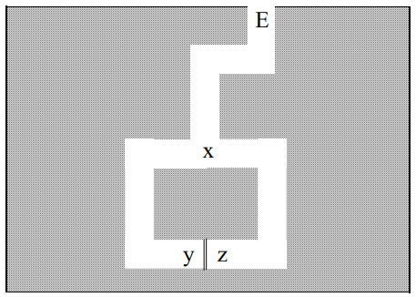

## Authentication

### Overview

- Data origin authentication
- Entity authentication
  - Weak authentication
  - Strong authentication
  - Zero Knowledge authentication

## Data Origin Authentication

- 1) MAC with a symmetric key $k$ known to $A$ and $B$:

  $$A \rightarrow B:\quad X,\ \mathrm{MAC}_k(X)$$

  If $B$ computes $\mathrm{MAC}_k(X)$ on its side and obtains the same value => the message comes from $A$.

- 2) MDC + symmetric encryption (key $k$ known to $A$ and $B$)

  $$A \rightarrow B: X,\ E_k(\mathrm{MDC}(X))$$

  $B$ computes $\mathrm{MDC}(X)$ and then $E_k(\mathrm{MDC}(X))$. If equal => message comes from $A$.

- 3) Like 2) with confidentiality of $X$ in addition:

  $$A \rightarrow B:\quad E_k(X,\mathrm{MDC}(X))$$

- 4) MDC + digital signature:

  $$A \rightarrow B:\quad X,\ \mathrm{Sig}_{priv-A}(\mathrm{MDC}(X))$$

  $B$ computes $\mathrm{MDC}(X)$ and verifies $\mathrm{Sig}_{priv-A}(\mathrm{MDC}(X))$ with an authentic copy of `pub-A`. If equal => $A$ is the origin of the message.

  This solution additionally offers non-repudiation of origin.

- These simple protocols offer no support regarding the uniqueness or the freshness (*timeliness*) of received messages and are exposed to *replay attacks*! They require mechanisms that take into account time or the context of the transaction (cf. entity authentication).

## Entity Authentication: Introduction

- entity authentication (*entity authentication*), also called identification
- Objectives of a robust identification protocol:
  - 1) If $A$ and $B$ are "honest": if $A$ is able to authenticate itself to $B$, $B$ must accept $A$'s identity.
  - 2) $B$ cannot reuse the information provided by $A$ to identify itself as $A$ to $C$.
  - 3) The probability that a third entity $C$ succeeds in impersonating $A$ to $B$ is negligible.
  - 4) Point 3) remains true even if:
    - $C$ has observed a large (polynomial) number of instances of the identification protocol between $A$ and $B$
    - $C$ has participated (possibly by impersonating someone else) in previous executions of the identification protocol with $A$ or (not exclusively) $B$.
    - several instances of the protocol (possibly initiated by $C$) can run simultaneously without compromising the identification process.
- *Weak authentication* protocols satisfy points 1) and 3). Whereas *strong authentication* protocols satisfy (at least partially) points 2) and 4) as well.

## Entity Authentication: Introduction (II)

- Terminology: from here on we call the *user ($A$)* the entity that must prove its identity (*claimant*) and the *system ($B$)* the entity responsible for verifying that identity (*verifier*)
- Basic elements for authentication:
  - *something known*: passwords, PINs, private or secret keys, etc.
  - *something possessed*: passport, smart card, password generators, etc.
  - *something inherent to the human individual:* *biometric* properties such as fingerprints, the retina, DNA code, etc.
- **Weak authentication** (*weak authentication*): The user presents a pair (*userid*, *password*) to the system in order to identify itself. The *userid* being the claimed identity and the *password* the corroborating evidence.
- **Strong authentication** (*strong authentication*): Unlike weak authentication, the secret used to corroborate identity is not explicitly revealed but, rather, the user provides the system with proof of possession of this secret.
- *Zero knowledge* authentication: These are strong authentication protocols that additionally have the characteristic of proving the user's identity without disclosing any information (not even a hint...) about the secret itself. In other words, it consists of giving a proof of a claim without revealing the slightest detail of it.

## Dictionary Attacks (*Dictionary Attacks*)

- A **dictionary attack** consists of using a database containing dictionary words from one or more languages (as well as variants) as input to an encryption or hashing system in order to obtain secret keys or passwords.
- This attack is very effective at obtaining poor-quality passwords, even though nowadays there exist very large databases containing word variations as well as complex mnemonic rules allowing high-entropy passwords to be "cracked".
- A dictionary attack can be mounted:
  - by obtaining the (encrypted or *hashed*) password database of the authentication system (operating system, network, etc.)
  - from one or more exchanges of an authentication instance, following a passive attack (observation of network packets), e.g.:

    :::: {layout-ncol="2"}

    ::: {#first-column}
    $A \rightarrow B:\quad A$

    $A \leftarrow B:\quad R$

    $A \rightarrow B:\quad E_p(R)$
    :::

    ::: {#second-column}
    $A$ sends its identity

    $R$ = a random number (challenge)

    $A$ encrypts $R$ with its password
    :::

    ::::

    The pair $(R, E_p(R))$ makes it possible to mount an *offline* dictionary attack.
- Dictionary attacks are normally less effective *online* because operating systems limit the number of unsuccessful authentication attempts.

## Plaintext Equivalence (*Plaintext-Equivalence*)

- A data string is said to be *plaintext-equivalent* to a password if it can be used to obtain the same level of access as would using the password.
- E.g.: If the system $B$ stores a list of all its clients' hashed passwords in the following authentication procedure:

  :::: {layout-ncol="2"}

  ::: {#first-column}

  $A \rightarrow B:\quad H(p)$

  :::

  ::: {#second-column}

  $A$ sends $B$ the hash of the password for the system

  :::

  ::::

  the information string $H(p)$ is *plaintext-equivalent* to the password $p$.
  This is equivalent to saying that applying a hash function to store passwords does not provide any additional security for the system.
- In particular, in the classic UNIX authentication system (page 138) the password hash stored in the `/etc/passwd` file is not *plaintext-equivalent* to the password because it is $p$ and not $H(p)$ that is exchanged between the client and the server.
- This property is essential because password databases are normally protected by logical mechanisms that are often circumvented through flaws in the server's operating system.
- If these central databases contain passwords in the clear or information that is *plaintext-equivalent* to them, the consequences in the event of an attack are devastating.
- The ideal case is that the information stored by the server is neither *plaintext-equivalent* to the passwords nor exposed to *offline* dictionary attacks.

## Weak Authentication

- Weak authentication systems are divided into two main categories:
  - *Fixed password*: The password does not depend on time nor on the number of times the identification protocol has been executed. This category includes systems where the password is changed by the user's decision or as a system security measure.
  - *Variable password*: Modifying the password as a function of time and/or the number of executions is part of the identification protocol.
- Storage techniques specific to fixed-password systems:
  - storing the password *in the clear* in a file protected by the operating system's own access control mechanisms.
    Problems: OS flaws, "super-user" privileges, *backups*, etc.
  - storing the password encrypted or after applying a *one-way function* (possibly making access to this file public, cf. UNIX example).
    Problems: *off-line* attacks, i.e. *guessing attacks*, *brute-force dictionary attacks*, collision identification, etc.
- Most serious problem of *fixed passwords*: it can be replayed after eavesdropping on an identification instance over an unprotected network!

## Weak Authentication: Fixed Password

- Protection techniques for fixed-password systems:
  - Strict rules of behavior concerning the creation, maintenance, and updating of passwords, taking into account the low entropy of passwords usually chosen by users (cf. table opposite)

| $\downarrow n \ \rightarrow c$ | 26 (lowercase) | 36 (lowercase alphanumeric) | 62 (mixed case alphanumeric) | 95 (keyboard characters) |
|---|---|---|---|---|
| 5 | 23.5 | 25.9 | 29.8 | 32.9 |
| 6 | 28.2 | 31.0 | 35.7 | 39.4 |
| 7 | 32.9 | 36.2 | 41.7 | 46.0 |
| 8 | 37.6 | 41.4 | 47.6 | 52.6 |
| 9 | 42.3 | 46.5 | 53.6 | 59.1 |
| 10 | 47.0 | 51.7 | 59.5 | 65.7 |

: Table 10.1: Size in bits of the password space for various character combinations. The number of passwords with $n$ characters, with $c$ choices per character, is $c^n$. The table gives the base-2 logarithm of this number of possible passwords.

| $\downarrow n \ \rightarrow c$ | 26 (lowercase) | 36 (lowercase alphanumeric) | 62 (mixed case alphanumeric) | 95 (keyboard characters) |
|---|---|---|---|---|
| 5 | 0.67 hr | 3.4 hr | 51 hr | 430 hr |
| 6 | 17 hr | 120 hr | 130 dy | 4.7 yr |
| 7 | 19 dy | 180 dy | 22 yr | 440 yr |
| 8 | 1.3 yr | 18 yr | 1400 yr | 42000 yr |
| 9 | 34 yr | 640 yr | 86000 yr | $4.0 \times 10^6$ yr |
| 10 | 890 yr | 23000 yr | $5.3 \times 10^6$ yr | $3.8 \times 10^8$ yr |

: Table 10.2: Time required to exhaustively search the password space. The table gives the time $T$ (in hours, days, or years) required to search or precompute the entire specified space using a single processor (cf. Table 10.1). $T = c^n \cdot t \cdot y$, where $t$ is the number of times the password mapping is iterated, and $y$ the time per iteration, for $t = 25$, $y = 1/(125\,000)$ sec. (This approximates the UNIX `crypt` command on a high-end PC performing DES at 1.0 Mbytes/s — see §10.2.3.)

*(Source [Men97])*

  - Slowing down the identification process as well as limiting the number of unsuccessful attempts in order to counter "*on-line brute force attacks*".
  - *salting*: (cf. UNIX example)
  - Restricting or even avoiding the distribution of password files, even encrypted ones.

## Weak Authentication: Variable Password

- The two best-known techniques for identification by variable password are *one-time passwords* and (*hardware*) random number generators
- *one-time passwords*: such as the *Lamport* scheme (whose most common implementation is *S-Key*). It works as follows:

**Initialization**:

$A$ generates a secret $w$

A constant $t$ (= number of identifications ~1000) and an OWF $H$ are chosen

:::: {layout-ncol="2"}

::: {#first-column}

$A \rightarrow B:\quad w_t = H_t(w)$

:::

::: {#second-column}

$H$ applied $t$ times to $w$

:::

::::

$B$ stores: $w_{stored} := w_t,\ n:= t-1$

**Messages corresponding to the $(t-n)^{th}$ identification:**

:::: {layout-ncol="2"}

::: {#first-column}

$A \rightarrow B:\quad A$

$A \leftarrow B:\quad n$

$A \rightarrow B:\quad w_n = H_n(w)$

:::

::: {#second-column}

identity of $A$

current iteration for $A$

:::

::::

$B$ tests: $H(w_n) == w_{stored}$. If OK => $n := n - 1$ and $w_{stored} := w_n$

**End**: When $n == 0$, $A$ chooses a new $w$ and the process starts over...

- **Attacks**: Authentication of $B$ is **necessary**! Otherwise: $C$ impersonates $B$ and:
  - obtains the current password $w_n$ and can replay it (*pre-play attack*)
  - supplies an $n < n_{current}$ and can thus generate all the $H_{m>n}(w_n)$ (*small n attack*)

## Weak Authentication: Variable Password (II)

- (*hardware*) random number generators.
  - These are smart cards that periodically generate (~ every 30 or 60 secs) different numbers used to identify (together with a *PIN* and information about the person's identity) the holder of the card.
  - The generation is based on a secret key present on the card and known to the system.
  - The best known is *SecureId* manufactured by *RSA Security*.
  - It has been adopted by many banks as an authentication mechanism for Internet *tele-banking*.
  - It is also exposed to the *pre-play attack*, but the window for replaying the password is limited to the change frequency (30 or 60 secs.).
- Conclusions on weak authentication:
  - Fixed passwords offer a very low level of security.
  - Variable passwords constitute an important step towards strong authentication but require additional precautions.

## Strong Authentication: Symmetric Solutions

- Strong authentication protocols use symmetric or asymmetric cryptographic techniques. We start with symmetric ones...
- **Unilateral authentication with a shared symmetric key**:

  :::: {layout-ncol="2"}

  ::: {#first-column}

  $A \rightarrow B:\quad A$

  $A \leftarrow B:\quad R$

  $A \rightarrow B:\quad E_{k-AB}(R)$

  :::

  ::: {#second-column}

  $A$ sends its identity

  $R$ = a random number (challenge)

  $A$ encrypts $R$ with the shared key

  :::

  ::::

  $B$ decrypts $E_{k-AB}(R)$ and identifies $A$ if it finds $R$

- Remarks:
  - $B$ must ensure that the challenge $R$ is random and must not repeat it.
  - This protocol constitutes a remarkable improvement over password authentication because the variation of challenges prevents Eve from replaying parts of the protocol.
  - *Eve* can try an *off-line known-plaintext attack* from a (normally limited) number of pairs $(R, E_{k-AB}(R))$, but most encryption systems are secure in this respect (DES is only vulnerable from $2^{47}$ pairs onward)!
  - $C$ can impersonate $B$ and choose its challenges $R$ to mount a *chosen-plaintext attack* (DES's vulnerability in this respect is also $2^{47}$, but other encryption systems are more sensitive to these attacks).

## Strong Authentication: Symmetric Solutions (II)

- Remarks (continued):
  - $C$ could mount an *Active Man-in-the-Middle* attack by impersonating $B$ (since $B$ is not authenticated), but it must convince $A$ to start the protocol.
  - An MDC: $H(k-AB,R)$ or a MAC: $H_{k-AB}(R)$ can replace $E_{k-AB}(R)$ and speed up identification.
  - After initial identification, a secure (at least authenticated) channel must be established using cryptographic protection to prevent $C$ from injecting packets while impersonating $A$.
  - Protocols of this type, where one entity must respond taking into account a *challenge* proposed by the other, are called *challenge and response protocols* and are the most widespread form of strong authentication.
- **Unilateral authentication with a shared symmetric key, $2^{nd}$ variant**:

  :::: {layout-ncol="2"}

  ::: {#first-column}

  $A \rightarrow B:\quad A,\ E_{k-AB}(\mathrm{timestamp})$

  :::

  ::: {#second-column}

  clocks synchronized between $A$ and $B$!

  :::

  ::::

  - Advantage: one fewer message and a *stateless* protocol **but:**
  - clock synchronization is difficult to achieve in reality and "drift" can be exploited by an adversary.
  - Moreover, if one manages to convince $B$ to "advance its clock", certain past identification instances can become valid again.

## Strong Authentication: Symmetric Solutions (III)

- **Bilateral authentication with a shared symmetric key (naive solution):**

  :::: {layout-ncol="2"}

  ::: {#first-column}

  $A \rightarrow B:\quad A,\ R_2$

  $A \leftarrow B:\quad R_1,\ E_{k-AB}(R_2)$

  $A \rightarrow B:\quad E_{k-AB}(R_1)$

  :::

  ::: {#second-column}

  :::

  ::::

- At first glance the protocol seems robust **but** let's observe what an adversary $C$ can do by starting two identification processes:

  :::: {layout-ncol="2"}

  ::: {#first-column}

  $C \rightarrow B:\quad A,\ R_2$

  $C \leftarrow B:\quad R_1,\ E_{k-AB}(R_2)$

  :::

  ::: {#second-column}

  $C$ claims to be $A$

  $B$ responds by impersonating $A$

  :::

  ::::

  at this point, $C$ starts a second instance:

  :::: {layout-ncol="2"}

  ::: {#first-column}

  $C \rightarrow B:\quad A,\ R_1$

  $C \leftarrow B:\quad R_3,\ E_{k-AB}(R_1)$

  :::

  ::: {#second-column}

  $$$$

  $C$ cannot go any further but...

  :::

  ::::

  successfully completes the first identification instance with:

  :::: {layout-ncol="2"}

  ::: {#first-column}

  $C \rightarrow B:\quad E_{k-AB}(R_1)$

  :::

  ::: {#second-column}

  and it's done!

  :::

  ::::

- Because $C$ sends back to $B$ the same $R$ it received from it, this kind of attack is called a *reflection attack*.
- Since the key is shared, $C$ could have achieved the same result (even more discreetly) by running the second instance against $A$ (pretending to be $B$)

## Strong Authentication: Symmetric Solutions (IV)

- **Bilateral authentication with a shared symmetric key (robust solution):**

  :::: {layout-ncol="2"}

  ::: {#first-column}

  $(1)\ A \rightarrow B:\quad A,\ R_2$

  $(2)\ A \leftarrow B:\quad E_{k-AB}(R_1,R_2,A)$

  $(3)\ A \rightarrow B:\quad E_{k-AB}(R_2,R_1)$

  :::

  ::: {#second-column}

  :::

  ::::

- The presence of $A$ in $(2)$ adds extra security in case obvious *reflection attacks* are not detected by the protocol. Otherwise, if $A$ initiates an authentication with what it believes to be $B$ but which is actually $C$:

  $A \rightarrow C:\quad A, R_2 \qquad (*)$

  Then $C$ starts a new authentication instance with $A$ using the same $R_2$:

  :::: {layout="[ 30, 70 ]"}

  ::: {#first-column}

  $C \rightarrow A:\quad B,\ R_2$

  $C \leftarrow A:\quad E_{k-AB}(R_1,R_2)$

  :::

  ::: {#second-column}

  If $A$ does not see $R_2$ as an obvious reflection, then it responds:

  As in $(2)$ but without the "$A$"

  :::

  ::::

  which is used by $C$ to complete its protocol $(*)$. However, if $A$ responds with $B$ included inside the packet as recommended in the protocol:

  $A \rightarrow C:\quad E_{k-AB}(R_1,R_2,B)$

  this can no longer be used by $C$ to continue $(*)$ because $A$ would be needed instead of $B$.

- Also note that including $R_1$ in the encrypted part also protects against the dangers of *chosen plaintext attacks* present in the previous solution.

## Symmetric Solutions: Smartcards

![*(Source [Men97])*](qmd_images/smartcards.png)

## Strong Authentication: Asymmetric Solutions

- **Unilateral authentication with an asymmetric key (naive solution...):**

  :::: {layout-ncol="2"}

  ::: {#first-column}

  $A \rightarrow B:\quad A$

  $A \leftarrow B:\quad E_{pub-A}(R)$

  $A \rightarrow B:\quad R$

  :::

  ::: {#second-column}

  $A$ sends its identity to $B$

  $B$ encrypts with $A$'s public key

  $A$ returns $R$ after decrypting

  :::

  ::::

- Remarks:
  - $B$ must know $A$'s authentic key to avoid *man-in-the-middle attacks*.
  - **but above all:** $B$ can mount *chosen-ciphertext attacks* (i.e. $B$ can have $A$ decrypt anything it wants!).
- **Unilateral authentication with an asymmetric key (robust solution)**:
  Idea: structure the text encrypted with `pub-A` and show that $B$ knows the *plaintext*:

  :::: {layout-ncol="2"}

  ::: {#first-column}

  $A \rightarrow B:\quad A$

  $A \leftarrow B:\quad H(R),\ B,\ E_{pub-A}(B,R)$

  :::

  ::: {#second-column}

  $A$ sends its identity to $B$

  $H(R)$ testifies to the fact that $B$ knows $R$

  :::

  ::::

  $A$ decrypts $E_{pub-A}(B,R)$ and obtains $B'$ and $R'$.

  $A$ suspends the protocol if $h(R') \neq h(R)$ or $B' \neq B$, otherwise:

  $A \rightarrow B: R$

  $B$ identifies $A$ if there is a match with the initial $R$

- A dual protocol can be imagined by using $A$'s signature with `priv-A` (instead of encryption with `pub-A`), but the same precautions concerning structure apply in order to prevent $A$ from signing a "malicious" message generated by $B$.

## Strong Authentication: Asymmetric Solutions (II)

- **Bilateral authentication with an asymmetric key. Robust solution due to Needham and Schroeder:**

  $(1)\ A \rightarrow B:\quad E_{pub-B}(r_1,A)$

  $(2)\ A \leftarrow B:\quad E_{pub-A}(r_1,r_2)$

  $(3)\ A \rightarrow B:\quad r_2$

- Note that the presence of $A$ in $(1)$ defeats *chosen ciphertext attacks*.
- The protocol can be strengthened by adding a "witness" $H(r_1)$ in $(1)$.

### Final remarks on classical authentication

- Entity authentication is a very complex process full of unexpected pitfalls.
- Some protocols, such as the one proposed by ISO in 1988 for authentication in distributed directories, have flaws very similar to those we have highlighted here.
- Moreover, in [Kau95], page 233, protocol 9-9 has an unspecified flaw for which the author gives no solution. It's up to you to discover it...
- When identification takes place within the context of a session, it is imperative that *all packets* belonging to the session be authenticated (e.g. by establishing a secure channel with the establishment of session keys).

## Zero Knowledge Proofs: Definitions

- Problem with "classical" authentication methods: $B$ (or even an observer) is able to obtain information about the secret held by $A$:
  - In weak authentication methods (via *password*), it is the secret in its entirety that is disclosed.
  - In classical *challenge and response* methods, $B$ can obtain [*plaintext* / *ciphertext*] pairs that could be used for cryptanalysis.
- *Definition*: An interactive protocol is a **proof of knowledge** (*proof of knowledge*) when it has the following two characteristics:
  - **completeness** (*completeness*): if $A$ and $B$ are two "honest" entities, $B$ accepts the proof provided by $A$.
  - **soundness** (*soundness*): If a "dishonest" entity $C$ is able to "fool" $B$, then $C$ possesses $A$'s secret (or information *polynomially* equivalent to the secret). This is equivalent to requiring possession of the secret for the proof to succeed.
- An interactive proof of knowledge is said to be "*without information leakage*" (**zero knowledge interactive proof** or **ZKIP**) if it additionally has the property that $A$ is able to convince $B$ of a fact without revealing *any information* about the secret it possesses.

## Zero Knowledge Proofs: Definitions (II)

- A protocol is a **computational ZKIP** (*computational ZKIP*) if an observer capable of performing probabilistic tests in polynomial time is unable to distinguish a genuine proof (where $A$ answers) from a simulated proof (e.g. produced by a random generator).
- A protocol is a **perfect ZKIP** (*perfect ZKIP*) if there is no difference (in the probabilistic sense) between the real proof and the simulated proof. The absence of information in the proof is guaranteed by Shannon's *information theory* and not by computational criteria.
- Generic structure of a ZKIP:

  :::: {layout-ncol="2"}

  ::: {#first-column}

  $(1)\ A \rightarrow B$

  $(2)\ A \leftarrow B$

  $(3)\ A \rightarrow B$

  :::

  ::: {#second-column}

  witness

  challenge

  response

  :::

  ::::

  - $(1)$ $A$ chooses a secret random number and sends $B$ proof of possession of this secret. This constitutes a commitment on $A$'s part and defines a class of questions that $A$ claims to be able to answer.
  - $(2)$ The challenge sent by $B$ (randomly) selects a question within this class.
  - $(3)$ $A$ responds (using its secret).
- If necessary, the protocol is repeated in order to minimize as much as possible the probability that an "impostor" guesses the correct answers "by chance".

## ZKIP: Intuitive Example

- This example is described in [Qui89]^[[Qui89]: Quisquater, J-J. et.al. *How to Explain Zero-Knowledge Protocols to Your Children*. Proceedings of Crypto'89 Conference. 1989.]. Suppose that $A$ knows a passage between $y$ and $z$ (the secret).

- $(1)$ $B$ stands at the entrance of the cave at point $E$.
- $(2)$ $A$ chooses a direction and heads toward points $y$ or $z$ (choice of witness).
- $(3)$ Once $A$ is inside the cave, $B$ enters in turn but stops at point $x$.
- $(4)$ $B$ asks $A$ to come to point $x$ via the right or the left path (the challenge).
- $(5)$ Using the secret to go from $y$ to $z$ (or vice versa) if necessary, $A$ obeys $B$'s instructions.

Repeat points $(1)$ to $(5)$ $n$ times. If $A$ does not know the secret, it has a probability of $2^{-n}$ of succeeding in fooling $B$ (of guessing "correctly").

## ZKIP: Intuitive Example (II)

- In this example, $B$ observes that $A$ can cross the passage $yz$ at will but obtains no information on how to do so, even if the protocol is executed millions of times.
- Furthermore, $B$ cannot convince $B'$ that $A$ knows the secret (as would have been the case if $A$ had encrypted information using a private key, e.g.). $B'$ could suspect $A$ and $B$ of having agreed on the sequences (right/left) beforehand
- This type of protocol is inspired by the "*cut and choose*" technique, whereby $A$ and $B$ fairly share a pie by following these steps:
  - $A$ cuts the pie.
  - $B$ chooses a piece.
  - $A$ takes the remaining piece.
- The first ZKIP was published in 1985 by S. Goldwasser [Gol85]^[[Gol85]: Goldwasser, S. et al. *The Knowledge Complexity of Interactive Proof Systems*. Proceedings of the 17th ACM Symposium on Theory of Computing, 1985.]. The application of the *cut and choose* paradigm to cryptographic protocols is due to Rabin [Rab78]^[[Rab78]: Rabin, M.O. *Digital Signatures*. Foundations of Secure Communications. New York, Academic Press, 1978.].

## ZKIP: Graph Isomorphism

- Two graphs $G_1 = (V_1,E_1)$ and $G_2=(V_2,E_2)$ are *isomorphic* if there exists a permutation $\pi$ s.t. $\{u,v\} \in E_1$ iff $\{\pi(u), \pi(v)\} \in E_2$.
- Example: $G_1 = (V, E_1)$ and $G_2=(V, E_2)$ with $V = \{1,2,3,4\}$, $E_1= \{12,13,23,24\}$, and $E_2 = \{12,13,14,34\}$ are isomorphic with the permutation $\pi: G_1 \rightarrow G_2$, $\pi = \{4,1,3,2\}$:

- Starting from a graph $G_1$, one can easily (in polynomial time) find a permutation $\pi$ s.t.: $G_2 = \pi(G_1)$.
- However, no polynomial algorithm is known for determining whether two sufficiently large graphs (~1000 vertices) are isomorphic (i.e. finding the permutation $\pi$ from $G_1$ and $G_2$).

## ZKIP: Graph Isomorphism (II)

- Based on graph isomorphism, one can construct a ZKIP as follows:

**(Initialization)** $A$ chooses a sufficiently large graph $G_1$ and devises a permutation $\pi$ (the secret) allowing it to compute a second graph $G_2$ ($G_1$ and $G_2$ are made public)

:::: {layout="[ 40, 60 ]"}

::: {#first-column}

$(1)\ A \rightarrow B:\quad H$

:::

::: {#second-column}

$A$ chooses a random permutation $\delta$ such that $\delta: G_2 \rightarrow H$ and sends $H$ to $B$ (the witness)

:::

::::
:::: {layout="[ 40, 60 ]"}

::: {#first-column}

$(2)\ A \leftarrow B:\quad i$

$(3)\ A \rightarrow B:\quad \lambda$

:::

::: {#second-column}

$B$ chooses an integer $i \in \{1,2\}$ and sends it to $A$ (the challenge)

$A$ computes $\lambda$ such that $H = \lambda(G_i)$:

&nbsp;&nbsp;&nbsp;&nbsp;If $i = 2$: $\lambda := \delta$

&nbsp;&nbsp;&nbsp;&nbsp;If $i = 1$: $\lambda := \delta \circ \pi$

:::

::::

$(4)$ $B$ checks whether $H = \lambda(G_i)$ and accepts the step as correct.

$(5)$ Repeat $(1)$ to $(4)$ a sufficiently large number of times to minimize the risk of "guessing correctly".

## ZKIP: Graph Isomorphism (III)

- Verification of the properties:
  - *Completeness*: The protocol is accepted if $A$ knows the secret (i.e. the permutation between the two graphs).
  - *Soundness*: If $C$ tries to impersonate $A$ without knowing $\pi$, it can fix a $j$ and provide a correct permutation $\lambda(G_j)$ but will not be able to find a correct permutation for both graphs. It will have to settle for guessing the *challenge* provided by $B$.
  - *Zero-Knowledge*: $A$ manages to convince $B$ that the two graphs are isomorphic but learns nothing about $\pi$; $B$ only sees a random graph $H$ isomorphic to $G_1$ and $G_2$ as well as a permutation between $H$ and $G_1$ or between $H$ and $G_2$.
  - *Perfect Zero-Knowledge:* this is equivalent to saying that $B$ could generate such information all by itself (using a random generator and polynomial computations). It can be proven (cf. [Sti95]) that the transcripts produced by the protocol cannot be distinguished (from a probability distribution standpoint) from those produced by a simulator (even assuming that $B$ "cheats").
- The use of the graph isomorphism paradigm in authentication protocols remains relatively marginal due to implementation efficiency issues.

## ZKIP: Fiat-Shamir Algorithm

- Goal: Allow $A$ to identify itself by proving knowledge of a secret $s$ (associated with $A$ by means of authentic public information) to $B$ without revealing information about $s$.
- This is a protocol that serves as a basis for real and efficient implementations.
- Algorithm:

**(Initialization)**:

(a) A trusted third party, $T$, chooses and publishes an $n$ s.t. $n = pq$ and keeps $p$ and $q$ secret.

(b) $A$ chooses a secret $s$ with $1 \leq s \leq n -1$ and $(s,n) = 1$, computes $v = s^2 \bmod n$ and distributes $v$ as a public key certified by $T$.

:::: {layout-ncol="2"}

::: {#first-column}

$(1)\ A \rightarrow B:\quad x = r^2 \bmod n$

$(2)\ A \leftarrow B:\quad e \in \{0,1\}$

$(3)\ A \rightarrow B:\quad y = r \cdot s^e \bmod n$

:::

::: {#second-column}

$A$ chooses a random $r$ and sends a witness $r^2$

$B$ sends its challenge

$A$ computes the response using the secret $s$.

:::

::::

$B$ rejects the proof if $y = 0$ (an impostor could falsify the proof with $r = 0$) and accepts the proof if $y^2 \equiv x \cdot v^e \bmod n$.

Steps $(1)$ to $(3)$ are repeated until a sufficient level of confidence is reached.

## ZKIP: Fiat-Shamir Algorithm (II)

- Verification of the properties:
  - *Completeness*: If $A$ knows $s$, the protocol accepts the identification proof.
  - *Soundness*: In the simple case, an impostor could only answer $e = 0$. Otherwise, it could choose a random $r$ and send $x = r^2/v$ in $(1)$ and respond to the challenge $e = 1$ with a correct answer $y = r$. In the case where $e = 0$, it would have to compute the square root of $x$ mod $n$ ($n$ composite with unknown factorization), which is difficult per SQROOTP. Success of the proof therefore requires possession of the secret.
  - *Zero Knowledge*: $B$ cannot obtain any information about $s$ because when $e = 1$, it is hidden by a random number (*blinding factor*).
  - *Perfect Zero-Knowledge*: The pairs $(x,y)$ obtained from $A$ can also be simulated by $B$ by choosing a random $y$ and $x = y^2$ or $y^2/v \bmod n$. It can be proven that these pairs have a probability distribution identical to those provided by $A$ (which computes them differently!).
- Note that, despite this last property, $B$ is unable to impersonate $A$ to $B'$ because it cannot predict the values of the challenges $e$.

## ZKIP: Common Implementations

- **Feige-Fiat-Shamir (FSS)**:
  - Based on the Fiat-Shamir protocol but using multiple witnesses and challenges (sets of $k$ values) at each iteration; which, for $n$ iterations, gives us a probability of $2^{-nk}$ of guessing all the answers.
- **Guillou-Quisquater (GQ)**:
  - Also based on Fiat-Shamir but increasing the choice of challenges, which decreases the probability of guessing without increasing the number of instances transferred and steps in the protocol.
- **Schnorr**
  - Based on the difficulty of computing discrete logarithms (DLP)
  - It also uses a very large domain of possible challenges, allowing it to carry out identification in only 3 message exchanges.
- These protocols are notably more efficient than RSA and can be implemented on devices with reduced computing capacity (*smart cards*).
- They satisfy the properties of *completeness*, *soundness* but the *zero-knowledge* property is sometimes sacrificed (as in the case of *Schnorr*) to increase efficiency.
- For a detailed description of these protocols, refer to [Men97] or [Sti95].

## ZKIP: Final Remarks

- ZKIPs offer a very good level of cryptographic security. They allow identification to be carried out while minimizing the chances of a hypothetical impostor and, **above all**, protecting the secret information of "honest" users.
- In 1989 (SECURICOM'89) *Adi Shamir* said about ZKIPs: "*I could go to a Mafia owned store a million successive times and they will still not be able to misrepresent themselves as me*"...
- And yet ([Sch96]): $A$ takes part in a ZKIP with $C \in$ Mafia; at the same time, $D$ (an accomplice of $C$) takes part in another ZKIP where it claims to impersonate $A$ to $B$ (an "honest" verifier).

  :::: {layout-ncol="2"}

  ::: {#first-column}

  $(1)\quad A \rightarrow C:\quad t_1$

  $(1')\quad D \rightarrow B:\quad t_1$

  $(2')\quad D \leftarrow B:\quad d_1$

  $(2)\quad A \leftarrow C:\quad d_1$

  $(3)\quad A \rightarrow C:\quad r_1$

  $(3')\quad D \rightarrow B:\quad r_1$

  :::

  ::: {#second-column}

  witness that $C$ relays over a radio link to $D$

  $D$ forwards $t_1$ to $B$

  $B$ sends the challenge to $D$; $D$ forwards it to $C$

  $C$ reuses the challenge in its dialogue with $A$

  $A$ computes the response using its secret, which $C$ sends to $D$

  $B$ accepts $r_1$ and so on!

  :::

  ::::

- Solutions:
  - Carry out identifications inside shielded rooms (*Faraday* cage)...
  - Use strong synchronization algorithms to avoid additional exchanges.

## Authentication: Summary

### Attacks and Protections

| Attack | Description | Protection |
|---|---|---|
| *replay* | replaying a previous identification instance | *zero-knowledge* ; *challenge and response* ; *one-time password* (watch out for *pre-play*!) |
| *known/chosen-plaintext* | obtaining plaintext / ciphertext pairs | *zero-knowledge* |
| *chosen-ciphertext* | getting A to decrypt (or sign) carefully chosen information | *zero-knowledge* ; *ch. & resp.* + witness of knowledge + structure (redundancy!) |
| *reflection* | replying with the same number that was received | including the target entity in the messages ; asymmetry in the messages |
| *interleaving* | using messages belonging to several simultaneous protocol instances | including the target entity in the messages ; introducing cryptographic chaining between the messages of the same identification instance |
| *collusion* | collusion between the parties involved | *Faraday* cage ; strong synchronization |
