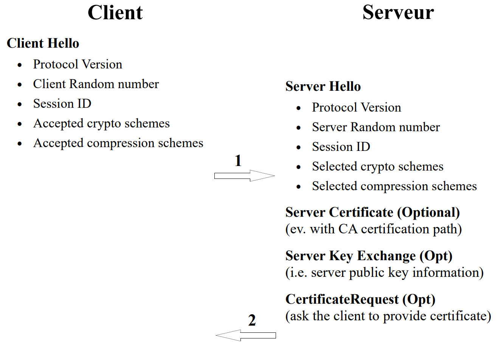

## Key Establishment Protocols (KEPs) — Overview

* Definitions
* Classification
* Properties
* *Key Agreement Protocols* (KAP) :
    * Symmetric : *Authenticated Key Exchange* 2
    * Asymmetric : *Diffie-Hellman*, *Station to Station*, *Secure Remote Password*, *Off-The Record Protocol* (OTR) and *Signal Protocol*
* *Key Transport Protocols* (KTP) :
    * Symmetric : *Shamir's No-key Protocol*, *Kerberos*
    * Hybrid : *Encrypted Key Exchange*
    * Asymmetric : *Needham-Schroeder Protocol*
* SSL/TLS

## Key Establishment Protocols. Definitions

* A key establishment protocol (*key establishment protocol* or *KEP*) is one that provides the entities involved with a shared secret (a key) that will serve as the basis for subsequent cryptographic exchanges.
* The two variants of KEPs are key transport protocols (*key transport protocol* or *KTP*) and key agreement protocols (*key agreement protocol* or *KAP*).
    * A *key transport protocol* (KTP) is a mechanism allowing one entity to create a secret key and transfer it to its correspondent(s).
    * A *key agreement protocol* (KAP) is a mechanism allowing two (or more) entities to derive a key from information *specific to each entity*.
* *Key pre-distribution schemes* are those in which the keys used are entirely determined a priori (e.g. from initial computations).
* *Dynamic key establishment schemes* (DKE) are those in which the keys change with each execution of the protocol.


## Key Establishment Protocols: Properties

* ***Implicit key authentication* (or *key authentication*)** : a property whereby an entity is assured that only its correspondent(s) can access a secret key. However, this specifies nothing about actually possessing the key.
* ***Key confirmation*** : a property allowing an entity to be sure that its correspondents are in possession of the generated session keys
* ***Explicit key authentication*** : = *implicit key authentication* + *key confirmation*.
* An ***authenticated KEP*** is a KEP capable of providing *key authentication*.
* Attacks :
    * A ***passive attack*** is one that attempts to break a cryptographic system while limiting itself to recording and analyzing the exchanges.
    * An ***active attack*** involves an adversary who modifies or injects messages.
    * A protocol is said to be vulnerable to a ***known-key attack*** if, when a previous session key is compromised, it becomes possible to : (a) compromise future keys through a passive attack and/or (b) mount active attacks aimed at identity spoofing.

## Key Establishment Protocols: Properties (II)

Most modern protocols guarantee the following properties:

* ***Perfect Forward Secrecy*** (PFS) is a characteristic that guarantees the confidentiality of session keys used in the past even if the long-term keys (for example, the recipient's private key) are compromised :


* ***Future Secrecy*** : The protocol guarantees the security of subsequent exchanges (future session keys are protected) even if the long-term keys are compromised **by a passive attacker** :


* ***Deniability / Repudiability*** (*repudiability*) : Similar to *Zero-Knowledge* authentication protocols, this allows entities to guarantee the authentication of exchanges without providing information that would allow a third party to prove their participation in the cryptographic exchange.

## Symmetric KAP with Pre-distribution — Trivial Case

* Let there be n users with a key distribution center (*key distribution center* or *KDC*)
* A trivial symmetric KAP with pre-distribution can be constructed as follows :

    (1) The KDC generates $n(n-1)/2$ different keys (a different key for each pair of users).

    (2) The KDC then distributes the keys over a confidential and authentic channel, giving $n-1$ keys to each user.

* If the KDC generates the keys in a truly random manner, this system is unconditionally secure against user collusion (even assuming that $n-2$ users collude, they would not be able to find the key of the other two) by construction of the protocol.
* Problems with this protocol :
    * $O(n^2)$ in key storage at the KDC.
    * $O(n)$ in secret keys exchanged per entity.

## Symmetric KAPs with *Dynamic Key Establishment*

* These methods allow the entities involved to derive short-lived keys (typically, session keys) from long-lived secrets which, for these protocols, are symmetric keys.
* Intuitive example :

    (Initialization) : $A$ and $B$ share a long-term symmetric key $S$

:::: {layout-ncol="2"}

::: {#first-column}

$(1)\quad A \rightarrow B:\quad r_a$

$(2)\quad A \leftarrow B:\quad r_b$

:::

::: {#second-column}

$A$ generates a random number and sends it to $B$

$B$ does the same

:::

::::

$A$ and $B$ compute the session key : $K := E_S(r_a \oplus r_b)$

Properties :

* *Entity authentication* : NO : by construction of the protocol, the $r_i$ can be sent by any entity.
* *Implicit key authentication* : YES : only the entities sharing the long-term symmetric key $S$ can access the session key $K$.
* *Key confirmation* : NO : since the $r_i$ are random, they can be modified by an adversary and prevent $A$ and $B$ from agreeing on the session key $K$. This would not be detected by the protocol.
* *Perfect Forward Secrecy* : NO : if the long-term key $S$ is compromised, all previous session keys can easily be computed by an adversary who had recorded all the exchanges.

## Symmetric KAPs with DKE — *Authenticated Key Exchange Protocol* 2 (AKEP2)^[Bellare, M. et Rogaway, P. *Entity Authentication and Key Distribution*. Advances in Cryptography. CRYPTO'93.]

(Init.) : $A$ and $B$ share two long-term symmetric keys $S$ and $S'$. $S$ is used to generate MACs $h_S()$ (in order to guarantee the integrity and authentication of entities) and $S'$ for generating the session key $K$.

:::: {layout-ncol="2"}

::: {#first-column}

$(1)\quad A \rightarrow B:\quad r_a$

$(2)\quad A \leftarrow B:\quad T = (B,A,r_a,r_b), h_S(T)$

$(3)\quad A \rightarrow B:\quad (A, r_b), h_S(A,r_b)$

:::

::: {#second-column}

$A$ generates a random number and sends it to $B$

$B$ does the same, plus the identities, plus the MAC of everything

$A$ verifies the identities and the $r_a$ provided by $B$ ; then, it sends identity + $r_b$ + MAC of everything

:::

::::

The key is computed bilaterally with a dedicated MAC $h'_{S'}()$ : $K := h'_{S'}(r_b)$.

* *Entity authentication* : YES mutual (provided by the MACs).
* *Implicit key authentication* : YES.
* *Key confirmation* : NO (no evidence that the key $S'$ is known to the correspondent).
* *Perfect forward secrecy* : NO (if the key $S'$ is compromised, so are previous session keys $K$).
* The key depends only on $B$ (and on the long-term key $S'$) but the protocol can easily be modified so that the key also depends on $A$, making it a "true" KAP.

## Asymmetric KAP with Pre-Distribution — Diffie-Hellman

* Published in 1976^[Diffie, W. and Hellman, M. *New Directions in Cryptography*. IEEE Transactions on Information Theory, 22 (1976), 644-654.], it is the precursor of asymmetric protocols.
* It allows two entities who have never met to build a shared key by exchanging messages over a non-confidential channel.
* Protocol :

    Initialization : A prime number p is generated along with a generator $\alpha$ of $Z_p^*$, s.t. $\alpha \in Z_{p-1}$. Both numbers are made public.

:::: {layout-ncol="2"}

::: {#first-column}

$(1)\quad A \rightarrow B:\quad \alpha^x \bmod p$

$(2)\quad A \leftarrow B:\quad \alpha^y \bmod p$

:::

::: {#second-column}

$A$ chooses a secret $x \in Z_{p-1}$ and sends the public part

$B$ chooses a secret $y \in Z_{p-1}$ and sends the public part

:::

::::

    $A$ computes the secret key : $K := (\alpha^y)^x \bmod p$ and $B$ in turn : $K := (\alpha^x)^y \bmod p$

* The security of this scheme lies in the impossibility of finding $\alpha^{xy} \bmod p$ from $\alpha^x \bmod p$ and $\alpha^y \bmod p$. (*Diffie-Hellman Problem* : DHP).
* **Proven result** : $DHP \leq_p DLP$.

## Diffie-Hellman (II)

* Diffie-Hellman is secure (as much as DHP) against passive attacks. In other words, an adversary limited to observing messages passing by cannot find the key $K$.
* This is however no longer true for active attacks ; let us see what $C$ can do by modifying the messages :


* $C$ exchanges secret keys with $A$ and $B$, respectively : $\alpha^{xy'} \bmod p$ and $\alpha^{x'y} \bmod p$ ($C$ controls $x'$ and $y'$). If $C$ re-encrypts each packet it receives with the corresponding public key, the attack takes place transparently for $A$ and $B$.
* This attack is called *Man in the Middle* (MIM) and applies to all asymmetric protocols.
* It is due to the lack of authentication of public keys, i.e. when $A$ "talks" to $B$, it must use $B$'s authentic public key.

## Diffie-Hellman (III)

* Characteristics of (unauthenticated) Diffie-Hellman :
    * *Entity Authentication* : NO.
    * *Implicit key authentication* : NO (due to the *MIM* attack).
    * *Key confirmation* : NO (due to the risk of *MIM*, $A$ cannot be sure that $B$ possesses the shared secret key).
* Generating symmetric keys from a shared Diffie-Hellman key :
    * The quantities handled in DH (notably $K$) are 512 - 1024 bits in size (depending on the prime p used).
    * An intuitive approach for generating small-sized symmetric keys (64 - 128 bits) would be to take a subset of the bits of the key K.
    * Unfortunately, it can be proven that DH keys are not *bit secure*, which means that subsets of bits (notably the *Least Significant Bits*) can be computed with an effort not proportional to the effort needed to compute the entire key $K$.
    * To generate keys securely, it is advisable to apply an MDC (such as SHA or MD5) to the *entire* key (possibly chaining the application of MDCs to obtain successive symmetric keys).
    * This method makes it possible to obtain a KAP with *Dynamic Key Establishment*.

## Diffie-Hellman on Elliptic Curves

**Key generation**

* $A$ and $B$ choose an elliptic curve $E_p$ with $p$, a large prime number ($len(p) \sim 200$ **bits**) and a point $P_0 \in E_p$ of large order (possibly a generator of $E_p$).
* $A$ generates a random number $x$, s.t. $1 < x < p$ and computes the public part $xP_0$ (scalar multiplication over $E_p$, for which efficient algorithms exist). $B$ generates a random number $y$ s.t. $1 < y < p$ and computes the public part $yP_0$.
* Key exchange protocol :

:::: {layout-ncol="2"}

::: {#first-column}

$(1)\quad A \rightarrow B:\quad xP_0$

$(2)\quad A \leftarrow B:\quad yP_0$

:::

::: {#second-column}


:::

::::

* After the exchange $A$ computes $K_a := x (yP_0)$ and $B$ in turn computes : $K_b := y (xP_0)$.
* The commutative property of the operations on $E_p$ guarantees the equality : $K_a = K_b$.
* The shared secret key results from a process of selecting bits from the key $K_a$ or from the result of an MDC (hash function) applied to the key $K_a$.
* It is also necessary to authenticate the exchanged public parts in order to avoid the *man-in-the-middle* attacks described previously.
* The properties of the protocol are identical to the $Z_p^*$ case (page 192).

## Asymmetric KAP with DKE — *Station to Station Protocol*^[Diffie, W. et al. *Authentication and Authenticated Key Exchanges*. Designs, Codes and Cryptography, 2 (1992).]

(Notation) $S_A$ : Signature with $A$'s private key.

(Initialization) :

(a) A prime p and a generator $\alpha$ of $Z_p^*$ are chosen, s.t. $\alpha \in Z_{p-1}$. Both numbers are made public (and possibly associated with the participants' public keys).

(b) The participants have access to authentic copies of their correspondents' public keys. Certificates can be exchanged if needed in (2) and (3).

:::: {layout-ncol="2"}

::: {#first-column}

$(1)\quad A \rightarrow B:\quad \alpha^x \bmod p$

$(2)\quad A \leftarrow B:\quad \alpha^y \bmod p, E_k(S_B(\alpha^x, \alpha^y))$

$(3)\quad A \rightarrow B:\quad E_k(S_A(\alpha^y, \alpha^x))$

:::

::: {#second-column}

$A$ generates a secret $x$ and sends the public part

$B$ generates a secret $y$ and computes the key : $k := (\alpha^x)^y \bmod p$, signs and encrypts the public parts

$A$ decrypts by computing $k := (\alpha^y)^x \bmod p$, checks $B$'s signature and the public parts ; if OK, $A$ signs and encrypts, reversing the public parts

:::

::::

$B$ decrypts and checks $A$'s signature on the public parts. If OK => END.

## Station to Station Protocol (II)

Characteristics :

* *Entity Authentication* : YES mutual (provided by the signatures).
* *Implicit key authentication* : YES, the keys are protected by DHP. The MIM attack is made impossible by the signatures.
* *Key confirmation* : YES, both entities prove possession of the key by encrypting quantities with it.
* *Explicit key authentication* : YES : *implicit key authentication* + *key confirmation*.
* *Perfect Forward Secrecy* : YES. The only long-term key is the one used for signing/verification. If this key is compromised, previous session keys are protected by the fact that they are not explicitly exchanged but rather computed via DH.
* Obviously, as soon as the signing key is compromised (private key theft), the stated properties no longer hold for subsequent exchanges.
* The protocol also provides *anonymity* since the identity of the parties is protected by k.
* Variant : In (2), compute $sig := S_B(\alpha^x, \alpha^y)$, and send : $(sig, h_k(sig))$ rather than $E_k(S_B(\alpha^x, \alpha^y))$. Likewise for (3), taking into account the asymmetries of the protocol. A more efficient solution since it involves a MAC rather than symmetric encryption.
* A robust and efficient algorithm chosen as the basic support for key generation in *IPv6*.

## *Off-The-Record* Protocol (OTR)

* A protocol designed in 2004^[N. Borisov, I. Goldberg, E. Brewer. *Off-the-Record Communication, or, Why Not To Use PGP*. Workshop on Privacy in the Electronic Society 2004.] with the aim of offering authentication and confidentiality services in message exchanges (*instant messaging*) while preserving the "repudiable" character of an "*off the record*" conversation
* The protocol also satisfies the **PFS** and **Future Secrecy** properties in the event of long-term key compromise.
* It builds on the same principles as the *Station-to-Station* protocol (page 196), adding to the DH parameter signatures an **ephemeral authentication** via a MAC. This dual technique is called **SIGMA**^[H. Krawczyk. *SIGMA: The 'SIGn-and-MAc' Approach to Authenticated Diffie-Hellman and Its Use in the IKE Protocols.* CRYPTO 2003: Advances in Cryptology - CRYPTO 2003] (*SIGn-and-MAC*) :
* It uses a key derivation function (*Key Derivation Function* or *KDF*) to generate an encryption key ($K_e$) preserving message confidentiality with *AES CTR-mode* and a MAC key ($K_m$) guaranteeing their authenticity of origin.
* Each conversation involves a key change (a new exchange of DH parameters) along with a plaintext exchange of the MAC keys ($K_m$) used in the previous exchange to guarantee **repudiability** !

## *OTR* and *Signal* Protocols

* Schematic exchanges of the OTR protocol :

:::: {layout-ncol="2"}

::: {#first-column}

$(1)\quad A \rightarrow B:\quad \alpha^x \bmod p$

$(2)\quad A \leftarrow B:\quad \alpha^y \bmod p, S_B(\alpha^x, \alpha^y)), MAC_{Km}(B)$

$(3)\quad A \rightarrow B:\quad S_A(\alpha^y, \alpha^x), MAC_{Km}(A)$

:::

::: {#second-column}

$A$ generates a secret $x$ and sends the public part

$B$ generates a secret $y$, computes the session key $k := (\alpha^x)^y \bmod p$ and signs the DH public parts. It then generates the keys $K_e$ and $K_m$ via the KDF : $(K_m, K_e) := KDF(k)$

$A$ does the same

:::

::::

Messages are then encrypted with the key $K_e$

* There are numerous evolutions of the original OTR protocol^[https://otr.cypherpunks.ca] that have addressed vulnerabilities and made the protocol more efficient.
* The **Signal**^[https://signal.org (Open Whisper Systems)] protocol is an evolution of the OTR protocol that targets the protection of message exchanges in social networks. It also uses ephemeral asymmetric and symmetric keys to ensure *PFS*, *Future Secrecy* and *repudiability* with DH computations on elliptic curves.
* **Signal** is used to protect messaging platforms such as *Whatsapp* and *Facebook Messenger*, among others.

## Recent Attacks on Diffie-Hellman and PFS

* In 2015 a group of researchers published^[Adrian, A. et al. *Imperfect Forward Secrecy: How Diffie-Hellman Fails in Practice*. 22nd ACM Conference on Computer and Communications Security, CSS 2015.] a series of attacks on the TLS/SSL protocol allowing them to :
    * Perform a *downgrade* via an active attack called *Logjam* whereby a *man-in-the-middle* manages to reduce the size of the Diffie-Hellman group over which the shared secret key establishment takes place to 512 bits.
    * Then compute the discrete logarithms of $\alpha^x \bmod p$ and $\alpha^y \bmod p$ using the *Number Field Sieve* technique.
* Starting from a group based on a fixed prime number $p$, they perform a pre-computation phase lasting approximately **one week**.
* Once this initial phase is complete, the computation of the individual logarithms takes only **one minute** !
* A statistical observation shows that a significant percentage of servers rely on the same group (the same prime p), which makes it possible to use the same pre-computation phase to compromise several servers.
* One of the conclusions of this research is that major actors with state-level resources would be capable today of breaking PFS when it is based on groups (very widespread today...) of 1024 bits.

## Asymmetric KAP with DKE — *Secure Remote Password protocol*^[Thomas Wu. *The SRP Authentication and Key Exchange System*. Request for Comments: 2945. September 2000.]

(a) Let m be a *safe prime* with $m := 2p+1$ and p prime

(b) Let $\alpha$ be a generator of $Z_p^*$, s.t. $\alpha \in Z_{p-1}$

(c) Let $P$ be $A$'s password and $x := H(P)$ with $H$ a CRHF.

(d) $B$ keeps in its password database the *verifier* $v := \alpha^x \bmod m$.

:::: {layout-ncol="2"}

::: {#first-column}

$(1)\quad A \rightarrow B:\quad \delta := \alpha^r \bmod m$

$(2)\quad A \leftarrow B:\quad \lambda := (v + \alpha^t) \bmod m, u$

:::

::: {#second-column}

$A$ generates a secret random number $r$

$B$ generates a secret random number $t$ and a second random number $u$

:::

::::

$A$ computes the symmetric key : $k := (\lambda - v)^{r+ux} \bmod m$

$B$ computes the symmetric key : $k := (\delta v^u)^t \bmod m$

$A$ and $B$ prove knowledge of $k$ (*key confirmation*) during a subsequent exchange.

* **SRP** protects passwords against dictionary attacks.
* $B$ does not store passwords but verification values (*verifier-based*).
* **SRP** also satisfies all properties specific to KEPs and is included in numerous standards (SSL/TLS, EAP, etc.).

## Symmetric Key Transport Protocol — Trivial Case

(Init.) $A$ and $B$ share a long-term symmetric key $S$

:::: {layout-ncol="2"}

::: {#first-column}

$(1)\quad A \rightarrow B:\quad E_S(r_a)$

:::

::: {#second-column}

$A$ generates a random number and encrypts it with $k$

:::

::::

The session key used by both entities is $K := r_a$.

Properties :

* *Entity Authentication* : NO.
* *Implicit Key Authentication* : YES (only $A$ and $B$ have access to the key).
* *Key Confirmation* : NO. $B$ cannot be sure that $A$ possesses the key since $r_a$ is a random number. By adding redundancy (e.g. $B$'s identity), $B$ can obtain unilateral *key confirmation* (and thus, *explicit key authentication*) :

:::: {layout-ncol="2"}

::: {#first-column}

$(1')\quad A \rightarrow B:\quad E_s(B, r_a)$

:::

::: {#second-column}


:::

::::

* *Perfect Forward Secrecy* : NO.
* Furthermore, if $B$ cannot judge the *freshness* of (1) from $r_a$ alone, it can ask $A$ to include a *timestamp*, provided the clocks are synchronized :

:::: {layout-ncol="2"}

::: {#first-column}

$(1'')\quad A \rightarrow B:\quad E_s(B, t_a, r_a)$

:::

::: {#second-column}


:::

::::

## KTP Symmetric: *Shamir's No-key Protocol*^[Massey, J.L. *Contemporary Cryptology: An Introduction in Contemporary Cryptology: The Science of Information Integrity*. G.J Simmons, ed., IEEE Press, 1992.pp 1-39.]

Number theory reminder : If p is prime and $r \equiv t \bmod p-1$ then $a^r \equiv a^t \bmod p \; \forall a \in Z$ and therefore : $r.r^{-1} \equiv 1 \bmod p-1$ implies $a^{rr^{-1}} \equiv a \bmod p$.

(Init.) (a) Choose and publish a prime number p for which it is difficult (by DLP) to compute discrete logarithms in $Z_p$.

(b) $A$ (resp. $B$) generates a secret number a (resp. b), s.t $\{a,b\} \in Z_{p-1}$ and $(a,p-1) = 1$ and $(b,p-1) = 1$ (so that the inverses exist).

(c) For what follows, $A$ pre-computes $a^{-1} \bmod p-1$ and $B$ pre-computes $b^{-1} \bmod p-1$

:::: {layout-ncol="2"}

::: {#first-column}

$(1)\quad A \rightarrow B:\quad K^a \bmod p$

$(2)\quad A \leftarrow B:\quad (K^a)^b \bmod p$

$(3)\quad A \rightarrow B:\quad (K^{ab})^{a^{-1}} \bmod p$

:::

::: {#second-column}

$A$ chooses a key $K \in Z_p$ and hides it with the exponent $a$

$B$ in turn exponentiates with the exponent $b$

$A$ undoes the exponentiation with $a^{-1} \bmod (p-1)$ but the key remains protected by the exponent $b$

:::

::::

$B$ only has to compute $K$ by exponentiating with $b^{-1} \bmod p-1$.

* This protocol is the equivalent of Diffie-Hellman in *Key Transport* (in DH the key is not transported but computed bilaterally). It therefore suffers from the same problems (notably *Man in the Middle*) as the latter.


## Asymmetric Key Transport Protocol — *Needham-Schroeder Public Key Protocol*^[Needham, R.M. et Schroeder, M.D. *Using Encryption for Authentication in a Large Network of Computers*. Communications of the ACM, 21, 1978.]

(Notation) : $E_{pubE}(X)$ means *encrypt with entity E's public key*.

(Init) : $A$ and $B$ each possess an authentic copy (possibly a certificate) of the other's public key.

:::: {layout-ncol="2"}

::: {#first-column}

$(1)\quad A \rightarrow B:\quad E_{pubB}(k_1,A)$

$(2)\quad A \leftarrow B:\quad E_{pubA}(k_1,k_2)$

$(3)\quad A \rightarrow B:\quad E_{pubB}(k_2)$

:::

::: {#second-column}

$A$ generates a random number $k_1$, associates it with $A$, then encrypts

$B$ does the same for $k_2$, concatenates with $k_1$, then encrypts

$A$ checks whether $k_1$ matches, if so, encrypts $k_2$ ; $B$ checks whether $k_2$ matches with $(2)$

:::

::::

The key is generated using a cryptographic hash function : $K := H(k_1,k_2)$

Characteristics :

* *Entity Authentication* + *implicit key authentication* + *key confirmation* : YES.
* *Perfect forward secrecy* : NO : The keys are entirely determined by the exchanged quantities.
* A similar protocol (only (3) changes) can be used for entity authentication (cf. authentication chapter).

## Hybrid KTP: *Encrypted Key Exchange* (EKE)^[Bellovin, S.M. and Meritt, M. *Encrypted Key Exchange: Password-Based Protocols Secure Against Dictionary Attacks*. 1992 IEEE CS Conf. on Research in Security and Privacy 1992.]

* This protocol involves symmetric and asymmetric schemes in order to minimize the risk of cryptanalysis by *dictionary attack* inherent to symmetric systems.

(Init.) : $A$ and $B$ share a symmetric secret $p$ (*password*).

:::: {layout-ncol="2"}

::: {#first-column}

$(1)\quad A \rightarrow B:\quad A, E_p(pub_A)$

$(2)\quad A \leftarrow B:\quad E_p(E_{pubA}(k))$

$(3)\quad A \rightarrow B:\quad E_k(r_a)$

$(4)\quad A \leftarrow B:\quad E_k(r_a,r_b)$

$(5)\quad A \rightarrow B:\quad E_k(r_b)$

:::

::: {#second-column}

$A$ generates a public/private key pair and sends the public part to $B$ encrypted with $p$

$B$ generates a session key $k$ and sends it encrypted

$A$ generates a random number and sends it encrypted with $k$

$B$ generates $r_b$ and sends it along with $r_a$ encrypted with $k$

Confirmation from $A$. If $r_b$ = OK => END

:::

::::

* (1) and (2) are responsible for the *key transport* ; (3) through (5) for *key confirmation*.
* This protocol is robust even if the shared *password* $p$ between $A$ and $B$ is of poor quality. Indeed, *Eve* cannot try to guess it without also having to "break" the asymmetric algorithm.
* *Entity Authentication* + *implicit key authentication* + *key confirmation* : YES.
* *Perfect forward secrecy* : YES if the pair $pub_A/priv_A$ is regenerated at each instance of the protocol. NO if $pub_A/priv_A$ is a long-lived key.

## Symmetric KTP with *Key Distribution Center* — *Symmetric Needham-Schroeder*^[Needham, R.M. et Schroeder, M.D. *Using Encryption for Authentication in a Large Network of Computers*. Communications of the ACM, 21, 1978.]

(Notation) : We call $T$ the *Key Distribution Center*.

(Init.) : $A$ and $T$ share the symmetric key $K_{AT}$. $B$ and $T$ share $K_{BT}$.

:::: {layout-ncol="2"}

::: {#first-column}

$(1)\quad A \rightarrow T:\quad A, B, r_a$

$(2)\quad A \leftarrow T:\quad E_{KAT}(r_a, B, k_{AB}, E_{KBT}(k_{AB},A))$

$(3)\quad A \rightarrow B:\quad E_{KBT}(k_{AB}, A)$

$(4)\quad A \leftarrow B:\quad E_{kAB}(r_b)$

$(5)\quad A \rightarrow B:\quad E_{kAB}(r_b - 1)$

:::

::: {#second-column}

$A$ generates a random number $r_a$ and sends it to $T$ along with the identities

$T$ generates $k_{AB}$ and sends it encrypted

$A$ forwards the packet to $B$

Confirmation from $B$ using $k_{AB}$ and a random number $r_b$

Confirmation from $A$

:::

::::

* *Entity Authentication* :
    * $A$ to $B$ : YES.
    * $B$ to $A$ : NO : $A$ never sees $r_b$ (it could be $E_{k'}(r_b')$).
* *Implicit Key Authentication* : YES (the keys are always protected by $K_{AT}$ and $K_{BT}$). However, in the event of a *known-key attack* (cf. next page), this no longer holds for $B$.
* *Key Confirmation* : Only $B$ obtains the assurance that $A$ possesses the key, due to the flaw described in *entity authentication*.


## Symmetric KTP with *Key Distribution Center* — *Symmetric Needham-Schroeder* (II)

* *Perfect Forward Secrecy* : NO. If either of the two keys $K_{AT}$ or $K_{BT}$ is compromised, the session keys k immediately become visible.
* Solution to obtain mutual *key confirmation* and *entity authentication* :

    Replace : (3) and (4) with :

:::: {layout-ncol="2"}

::: {#first-column}

$(3')\quad A \rightarrow B:\quad E_{kAB}(r_a'), E_{KBT}(k_{AB}, A)$

$(4')\quad A \leftarrow B:\quad E_{kAB}(r_a'-1,r_b)$

:::

::: {#second-column}


:::

::::

    Provided that the $r_i$ are carefully controlled by the participants.

    However : beware of *reflection attacks* (cf. entity authentication) !

* **Problem** : $A$ can replay (3) as many times as it wishes, without any control from $B$. This problem worsens if an old key k is compromised :
* *Vulnerable to a known-key attack* : If a session key k already used is obtained by an adversary $C$, they can, without difficulty, get it accepted by $B$ by replaying (3) and computing the *challenge* sent by $B$ in (5). In this case, the *entity authentication*, *implicit key authentication* and *key confirmation* properties of $A$ toward $B$ are also compromised.
* Solution : Add a *timestamp* in (3) attesting to the freshness of the exchanges :

:::: {layout-ncol="2"}

::: {#first-column}

$(3'')\quad A \rightarrow B:\quad E_{KBT}(k_{AB}, A,t)$

:::

::: {#second-column}

This is the solution adopted by Kerberos

:::

::::

## Symmetric KTP with *Key Distribution Center* — Kerberos

* Kerberos is a protocol enabling entity authentication and key distribution within a network of users.
* Originally, Kerberos was designed as a replacement solution to address the security problems (weak authentication, plaintext transactions, etc.) specific to UNIX environments.
* Kerberos was created at MIT as an integral part of Project ATHENA.
* It is based on the symmetric *Needham-Schroeder* protocol, notably with the correction of a few flaws in the protocol and the inclusion of *timestamps*.
* The first three versions were unstable. Version 4 achieved considerable success in both industrial and academic environments and remains predominant. Version 5, although more secure and better structured, is more complex and less efficient, which has slowed its deployment.
* Kerberos also defines a mode of collaboration between domains belonging to distinct administrative authorities (the *realms*). This allows users of one domain to use resources of another domain "without leaving" the secure Kerberos environment.
* For *inter-realm* transactions, symmetric cryptography constitutes a significant obstacle because it requires confidential channels for key pre-distribution.

## Kerberos: Simplified Diagram


![**[Kau95] contains a complete description of Kerberos**](qmd_images/kerberos.png)

## Kerberos Version 5

(Notation) : - $A$ and $B$ want to establish a secure transaction ; in the Kerberos environment, this is normally a client and a server providing services. - Kerberos's *KDC* is subdivided into two functional entities : the *Authentication Server* ($AS$) and the *Ticket Granting Server* ($TGS$). Both access the *password DB*. - The $r_a^{(n)}$ are random numbers, t is a *timestamp*, $t_1$ and $t_2$ indicate a validity time window.

(Initialization) : $A$ and $B$ share a secret key with $AS$, namely : $K_A$ and $K_B$ (for clients, this is a OWF of the *password*). $TGS$ also has a secret key $K_T$.

:::: {layout-ncol="2"}

::: {#first-column}

$(1)\quad A \rightarrow AS:\quad A, TGS, r_a$

$(2)\quad A \leftarrow AS:\quad E_{KA}(k_{AT},r_a), Ticket_{AT} := E_{KT}(A,TGS,t_1,t_2,k_{AT})$

$(3)\quad A \rightarrow TGS:\quad Authenticator_{AT} := E_{kAT}(A,t), Ticket_{AT}, B, r_a'$

$(4)\quad A \leftarrow TGS:\quad E_{kAT}(k_{AB},r_a'), Ticket_{AB} := E_{KB}(A,B,t_1,t_2,k_{AB})$

$(5)\quad A \rightarrow B:\quad Authenticator_{AB} := E_{kAB}(A,t), Ticket_{AB}, r_a'', [request]$

$(6)\quad A \leftarrow B:\quad E_{KAB}(r_a''), [response]$

:::

::: {#second-column}


$AS$ generates $k_{AT}$


$TGS$ generates $k_{AB}$


$[request]$ and $[response]$ possibly encrypted with $k_{AB}$

:::

::::

**(1) + (2)** : Request for a ticket for $TGS$

**(3) + (4)** : Request for a ticket for $B$

**(5) + (6)** : Authentication and key establishment between $A$ and $B$.

## Kerberos Characteristics

* *Entity Authentication* : YES, for all entities involved.
* *Implicit key authentication* : YES : all generated keys are protected by keys shared between $AS$ and all participants.
* *Key confirmation* :
    * Between $A$ and $AS$ : NO : $AS$ has no proof that $A$ possesses the key $K_A$.
    * Between $A$ and $TGS$ : YES for $k_{AT}$ (redundant quantities encrypted with $k_{AT}$ are exchanged between $A$ and $TGS$) ; NO for $k_{AB}$ ($TGS$ has no proof from $A$)
    * Between $A$ and $B$ : YES : exchange of redundant quantities encrypted with $k_{AB}$.
* *Perfect forward secrecy* : NO : All keys are explicitly transferred.

**Problems** :

* The initial keys (such as $K_A$) depend (directly) on the *passwords* chosen by the users. This makes the protocol vulnerable to *password theft* or to :
* *Password guessing attacks* : $E_{KA}(k_{AT},r_a)$ in (2) helps break $A$'s password. Solution : Pre-authentication in (1) : $E_{KA}(t)$ with t = *timestamp* (optional in v5).
* The validity window of a *ticket* can lead to *replay attacks* if the $r_a^{(n)}$ are not properly controlled by the participants.
* Clock synchronization is *necessary* ! This is not always easy in heterogeneous environments.

## *Secure Socket Layer* (SSL) / *Transport Level Security* (TLS)

* Sits between the transport layer (TCP) and the application layer protocols (not only HTTP but also SMTP, FTP, etc. !)
* It is a highly configurable *Meta Key Establishment Protocol* allowing numerous operating modes and negotiation options.
* Offers confidentiality, integrity, data flow authentication, and server identification (and incidentally client identification) services
* Uses the following families of algorithms :
    * Public cryptography (RSA, *Diffie-Hellmann*, DSA, etc.) for exchanging symmetric keys
    * MACs for data flow authentication
    * Symmetric cryptography (DES, IDEA, AES, etc.) for encrypting the data flow
* The involvement of *CAs* to *certify* the association between entities and public keys is strongly recommended... but not essential !
* *Entity authentication* via certificates (server, client optional), *Implicit Key Authentication* and *Key Confirmation* are guaranteed. *Perfect Forward Secrecy* depends on the protocol chosen for the key exchange.

## SSL/TLS Overview

* SSL is a "mini-stack" of protocols with functionalities from the session, presentation and application layers.
* SSL consists of three fundamental building blocks :
    * The *SSL record protocol* enabling the encapsulation of higher-level protocols on top of TCP (fragmentation + compression + encryption)
    * The *SSL handshake protocol* in charge of authenticating the participants and negotiating the encryption parameters
    * The *SSL state machine*. Unlike HTTP, SSL is a *stateful* protocol, and therefore requires a set of variables that determine the state of a session and a connection

## SSL/TLS *Record Protocol*


**MAC** = *Message Authentication Code* : Ensures the integrity and authenticity of the packet

## SSL/TLS *State Variables*

A session can contain several connections !

**Per session**

* **session identifier**
* **peer certificate**
* **compression method**
* **cipher specification**
    encryption algo. + authentication algo. + crypto attributes
* **master secret**
    secret shared between client and server
* **is resumable**
    indicates if new connections may be initiated under this session

**Per connection**

* **client/server random**
    byte sequences for key gen.
* **c/s write MAC secret**
    secret key used to generate MACs by the client (resp. the server)
* **c/s write key secret**
    secret key used by the client (resp. the server) to encrypt application data
* **sequence numbers**
    keep track of received/sent messages
* **initialization vectors**
    for crypto algorithms

## SSL/TLS *Handshake Protocol* Simplified



## SSL/TLS *Handshake Protocol* Simplified (II)


## SSL/TLS: Key Generation

```
master_secret = 
    MD5(pre_master_secret + SHA('A' + pre_master_secret +
      ClientHello.random + ServerHello.random)) +
    MD5(pre_master_secret + SHA('BB' + pre_master_secret +
      ClientHello.random + ServerHello.random)) +
    MD5(pre_master_secret + SHA('CCC' + pre_master_secret +
      ClientHello.random + ServerHello.random));
key_block =
    MD5(master_secret + SHA('A' + master_secret +
                ServerHello.random +
                ClientHello.random)) +
    MD5(master_secret + SHA('BB' + master_secret +
                ServerHello.random +
                ClientHello.random)) +
    MD5(master_secret + SHA('CCC' + master_secret +
                ServerHello.random +
                ClientHello.random)) + [...];

until enough output has been generated.  Then the key_block is
partitioned as follows:

client_write_MAC_secret[CipherSpec.hash_size]
server_write_MAC_secret[CipherSpec.hash_size]
client_write_key[CipherSpec.key_material]
server_write_key[CipherSpec.key_material]
client_write_IV[CipherSpec.IV_size] /* non-export ciphers */
server_write_IV[CipherSpec.IV_size] /* non-export ciphers */
```

## SSL/TLS: Final Remarks

* The secret keys are the result of applying hash functions (MD5, SHA) to the *random numbers* of the *Hello* records and the *pre_master_secret*
* TLS/SSL has become the *de facto* standard for security on the web (underlying *https*)
* SSL clients (*Explorer, Firefox, Opera, Chrome*, etc.) contain "hard-coded" certificates corresponding to a few root certification authorities (*Verisign*, *Thawte*, *Microsoft*, *RSA*, etc.) allowing verification of certificates presented by certain servers, but SSL is designed to rely on a global certification network that, for now, does not exist.
* The most common security flaws in SSL concern the random generation of keys as well as the most common implementation defects: *buffer overflows*, *sql injection*, etc. The weakness of hash functions (MD5, SHA) is also a risk factor.
* In November 2009^[Marsh Ray, Steve Dispensa. *Renegotiating TLS*. http://extendedsubset.com/Renegotiating_TLS.pdf. Novembre 2009.], an attack was discovered allowing a *Man in The Middle* to inject content (*chosen plaintext*) into an authentic stream following a renegotiation of parameters provided for in the protocol. This is a **flaw in the protocol** that required a patch in all implementations.
* The *heartbleed* flaw, based on a buffer overflow, seriously troubled the Internet community when it was discovered in April 2014.

## *Key Establishment Protocols*: Final Remarks

* Key establishment protocols constitute a cornerstone of any security solution. Before choosing (designing) a KEP, it is therefore essential to :
    * Define the objectives (confidentiality, entity/data authentication, non-repudiation, etc.)
    * Define the desired level of security based on the properties studied (*key confirmation*, *perfect forward secrecy*, etc.)
    * Establish a list of constraints related to the environment (users, machines, network, potential attackers, etc.)
* Based on these criteria we can :
    * Choose a proven and robust solution (better than inventing one *from scratch* !).
    * Verify that the objectives are met and the properties satisfied.
* Verifying protocols is a complex and delicate process; moreover, published solutions are not always correct. Two approaches are possible (and necessary) :
    * Practical analysis. Analyzing the protocol's flaws "on paper" and "on machine," taking into account the classic pitfalls: control of random numbers to avoid *reflection attacks*, redundancy of encrypted/signed quantities, etc.
    * Formal analysis with *logics* specially designed for this purpose (such as BAN logic^[Burrows, Abadi, Needham. *A Logic of Authentication.* Proceedings of the Royal Society, Series A, 426, 1871 (December 1989), 233-271. http://www.research.digital.com/SRC/personal/Martin_Abadi.])
