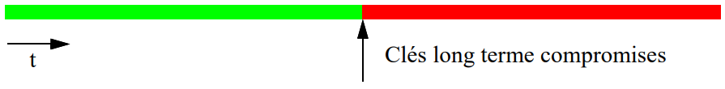
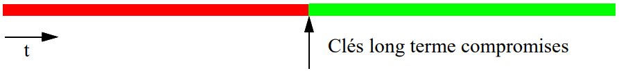

## Overview

A **KEP** provides a shared secret (key) for future cryptographic exchanges. Two variants:

* **KTP** (*Key Transport*): one entity **creates** the key and **transfers** it.
* **KAP** (*Key Agreement*): the entities **derive** the key from information specific to each of them.

Another classification axis:

* **Pre-distribution**: keys fixed in advance.
* **DKE** (*Dynamic Key Establishment*): a new key at each execution (session).

| Type | Symmetric | Hybrid | Asymmetric |
|---|---|---|---|
| **KAP** | AKEP2 | — | Diffie-Hellman, DH-EC, STS, SRP, OTR, Signal |
| **KTP** | Trivial case, Shamir No-key, symmetric NS, Kerberos | EKE | Needham-Schroeder Public Key |

**SSL/TLS**: configurable meta-protocol on top of TCP, combines several KEPs.

## Fundamental Concepts

### Definitions

* **Passive attack**: observation/analysis of exchanges only.
* **Active attack**: modification/injection of messages.
* ***Known-key attack***: a compromised past session key allows (a) passively breaking future keys and/or (b) mounting active identity spoofing.

### Essential Properties

::: {.callout-important title="🔴 Hierarchy of authentication properties"}

* **Implicit key authentication**: only the correspondent(s) can access the key (does not prove that they already possess it).
* **Key confirmation**: proof that the correspondent(s) actually possess the key.
* **Explicit key authentication** = *implicit key authentication* + *key confirmation*.
* **Authenticated KEP**: a KEP guaranteeing *key authentication*.

:::

| Property | Question it answers | Targeted attacker |
|---|---|---|
| **PFS** (*Perfect Forward Secrecy*) | Do *past* session keys remain secure if the long-term key is compromised? | active or passive |
| **Future Secrecy** | Do *future* session keys remain secure if the long-term key is compromised? | **passive only** |
| **Deniability / Repudiability** | Can one authenticate without leaving proof usable by a third party? | — |

::: {layout-ncol="2"}

:::

::: {.callout-warning title="Pitfall"}

**PFS ≠ Future Secrecy**: PFS protects the **past** (green before compromise), Future Secrecy protects the **future** (green after compromise), and only against a **passive** attacker — an active attacker can always impersonate identities once the long-term key is stolen.

:::

## Symmetric KAPs

### Trivial Pre-distribution (KDC)

1. KDC generates $n(n-1)/2$ keys (one per pair of users).
2. KDC distributes $n-1$ keys to each user (confidential + authentic channel).

* **Security**: unconditional against collusion (even $n-2$ colluders cannot find the key of the other 2).
* **Limitations**: $O(n^2)$ storage at the KDC, $O(n)$ keys per user.

### DKE — Intuitive Exchange (Challenge-Response)

Init: $A,B$ share $S$ (long term).

$(1)\ A\to B: r_a \qquad (2)\ A\leftarrow B: r_b \qquad K := E_S(r_a \oplus r_b)$

| Property | Status | Reason |
|---|---|---|
| Entity authentication | NO | $r_i$ can be sent by anyone |
| Implicit key auth | YES | only holders of $S$ compute $K$ |
| Key confirmation | NO | $r_i$ modifiable without detection |
| PFS | NO | $S$ compromised ⇒ any past $K$ recomputable |

### AKEP2 (*Authenticated Key Exchange Protocol 2*)

Init: $A,B$ share $S$ (MAC $h_S$, authentication) and $S'$ (generation of $K$).

$(1)\ A\to B: r_a$
$(2)\ A\leftarrow B: (B,A,r_a,r_b), h_S(T)$
$(3)\ A\to B: (A,r_b), h_S(A,r_b)$

$K := h'_{S'}(r_b)$

| EA | IKA | KC | PFS |
|---|---|---|---|
| YES (mutual, via MACs) | YES | NO ($S'$ not proven known) | NO |

## Asymmetric KAPs

### Diffie-Hellman (1976)

Public init: $p$ prime, $\alpha$ generator of $Z_p^*$.

$(1)\ A\to B:\ \alpha^x \bmod p \qquad (2)\ A\leftarrow B:\ \alpha^y \bmod p$

$$K := \alpha^{xy} \bmod p$$

* Passive security = difficulty of the **DHP** (*Diffie-Hellman Problem*), with $DHP \le_p DLP$.
* **Vulnerable to Man-in-the-Middle (MIM)** when active: $C$ negotiates separately with $A$ (key $\alpha^{xy'}$) and $B$ (key $\alpha^{x'y}$), invisible if $C$ relays/decrypts-re-encrypts. Cause: **lack of public key authentication**.

| EA | IKA | KC | PFS |
|---|---|---|---|
| NO | NO (due to MIM) | NO | — |

::: {.callout-warning title="Pitfall"}

DH keys ($K$, 512-1024 bits) **are not *bit secure***: a subset of bits (LSB) can be computed more easily than the whole $K$. **Solution**: apply an MDC (SHA/MD5) to the *entire* key to derive symmetric keys (⇒ yields a DKE).

:::

**DH on elliptic curves**: same principle with $E_p$, point $P_0$, secrets $x,y$; $K_a := x(yP_0) = y(xP_0) =: K_b$ (commutativity). Same properties as the $Z_p^*$ case; also requires authentication of the public values.

### Station-to-Station (STS)

Adds **signatures** to the DH exchanges to counter MIM.

$(1)\ A\to B:\ \alpha^x$
$(2)\ A\leftarrow B:\ \alpha^y,\ E_k(S_B(\alpha^x,\alpha^y))$
$(3)\ A\to B:\ E_k(S_A(\alpha^y,\alpha^x))$, with $k := \alpha^{xy} \bmod p$

| EA | IKA | KC | PFS |
|---|---|---|---|
| YES mutual | YES (MIM blocked by signature) | YES | **YES** |

* Only long-term key = signing key ⇒ compromise does not break past session $K$s.
* Also provides **anonymity** (identities protected by $k$).
* Efficient variant: replace $E_k(S_B(...))$ with $(sig, h_k(sig))$ (MAC instead of symmetric encryption).
* Basis for key generation in **IPv6**.

### OTR (*Off-The-Record*, 2004) and Signal

* Builds on STS + **ephemeral MAC authentication** = **SIGMA** approach (*SIGn-and-MAc*).
* KDF generates $K_e$ (encryption, AES CTR) and $K_m$ (MAC).
* Reveals the old $K_m$ in plaintext after use ⇒ **repudiability**.
* Guarantees **PFS + Future Secrecy + Deniability**.
* **Signal** = an evolution of OTR on elliptic curves, for messaging (WhatsApp, Messenger).

### Recent Attacks on DH — *Logjam* (2015)

1. **Active downgrade**: forces the DH group down to 512 bits.
2. Computation of discrete logarithms via **Number Field Sieve**: pre-computation ≈ **1 week** (fixed for a given $p$), then each individual log ≈ **1 minute**.
3. Many servers share the same $p$ ⇒ a single pre-computation compromises several servers.

::: {.callout-warning title="Pitfall"}

State-level actors would be capable of breaking PFS for **1024-bit** groups, very widespread at the time — this is not merely a theoretical problem.

:::

### Secure Remote Password (SRP)

* $x := H(P)$ (password), $B$ stores the **verifier** $v := \alpha^x \bmod m$ (not the password).
* Protects against **dictionary attacks**.
* Full KEP properties; used in SSL/TLS, EAP, etc.

## KAP/KTP Summary Table

| Protocol | EA | IKA | KC | PFS |
|---|---|---|---|---|
| Intuitive DKE (symmetric) | NO | YES | NO | NO |
| AKEP2 | YES | YES | NO | NO |
| Diffie-Hellman (unauthenticated) | NO | NO | NO | — |
| Station-to-Station | YES | YES | YES | **YES** |
| SRP | YES | YES | YES | yes |
| Trivial symmetric KTP | NO | YES | NO* | NO |
| Shamir No-key | — | — | — | vulnerable to MIM |
| Needham-Schroeder Public Key | YES | YES | YES | NO |
| EKE | YES | YES | YES | YES if ephemeral keys |
| Symmetric Needham-Schroeder | partial | YES | partial | NO |
| Kerberos | YES | YES | partial | NO |

*with redundancy ($B$'s identity), unilateral *key confirmation* possible.

## Key Transport Protocols (KTP)

### Trivial Symmetric Case

$(1)\ A\to B:\ E_S(r_a)$, $K := r_a$.

* Adding identity $E_S(B,r_a)$ ⇒ unilateral *key confirmation*.
* Adding a *timestamp* $E_S(B,t_a,r_a)$ ⇒ guarantees *freshness* (synchronized clocks required).

### Shamir's No-key Protocol

$(1)\ A\to B:\ K^a \bmod p$
$(2)\ A\leftarrow B:\ K^{ab} \bmod p$
$(3)\ A\to B:\ K^{b} \bmod p$ (via $a^{-1}$)

* Equivalent of DH in **transport** mode (key chosen by $A$, not computed bilaterally).
* Same flaws as DH: **vulnerable to MIM**.

### Needham-Schroeder Public Key

$(1)\ A\to B:\ E_{pubB}(k_1,A)$
$(2)\ A\leftarrow B:\ E_{pubA}(k_1,k_2)$
$(3)\ A\to B:\ E_{pubB}(k_2)$, $K := H(k_1,k_2)$

* EA + IKA + KC: **YES**. PFS: **NO** (keys entirely determined by the exchanges).

### Encrypted Key Exchange (EKE) — Hybrid

* $A,B$ share a password $p$ (often weak).
* (1)-(2): key transport ($A$'s pub/priv pair encrypted with $p$, session key $k$ returned encrypted).
* (3)-(5): confirmation via challenge-response encrypted with $k$.
* **Robust even with a weak password**: breaking $p$ would also require breaking the asymmetric algorithm.
* PFS: YES if the pub/priv pair is regenerated at each session, otherwise NO.

### Symmetric Needham-Schroeder (with KDC $T$)

$(1)\ A\to T:\ A,B,r_a$
$(2)\ A\leftarrow T:\ E_{K_{AT}}(r_a,B,k_{AB}, E_{K_{BT}}(k_{AB},A))$
$(3)\ A\to B:\ E_{K_{BT}}(k_{AB},A)$
$(4)\ A\leftarrow B:\ E_{k_{AB}}(r_b)$
$(5)\ A\to B:\ E_{k_{AB}}(r_b-1)$

::: {.callout-warning title="Pitfall — protocol flaw"}

* **$B$ is never authenticated to $A$** ($A$ never sees $r_b$ in plaintext to verify it).
* **Vulnerable to a *known-key attack***: a compromised past session key $k$ allows an attacker to replay (3) and respond to the challenge (5) ⇒ impersonates $A$ to $B$.
* **Solution**: add a *timestamp* in (3): $E_{K_{BT}}(k_{AB},A,t)$ → **adopted by Kerberos**.

:::

### Kerberos

* Based on symmetric NS + fixes (timestamps).
* Architecture: **KDC = Authentication Server (AS) + Ticket Granting Server (TGS)**.
* v4: industrial/academic success. v5: more secure but more complex (slower deployment). Handles domains (*realms*).

**Simplified flow (v5)**:

1. **(1)+(2)**: $A \leftrightarrow AS$ → obtaining the *ticket* for $TGS$ (key $k_{AT}$).
2. **(3)+(4)**: $A \leftrightarrow TGS$ → obtaining the *ticket* for $B$ (key $k_{AB}$).
3. **(5)+(6)**: $A \leftrightarrow B$ → mutual authentication + establishment of $k_{AB}$.

| Property | Status |
|---|---|
| Entity authentication | YES (all entities) |
| Implicit key auth | YES |
| Key confirmation | partial (NO between $A$-$AS$; YES $A$-$TGS$ for $k_{AT}$ only; YES $A$-$B$) |
| PFS | NO (keys explicitly transferred) |

**Known problems**:

* Initial keys derived from *passwords* ⇒ **password guessing attacks** (mitigated by optional pre-authentication with a timestamp).
* Ticket validity window ⇒ risk of **replay attacks** if $r_a^{(n)}$ are poorly controlled.
* **Clock synchronization mandatory**.

## SSL / TLS

Key establishment meta-protocol, between TCP and the application layer (HTTP, SMTP, FTP…).

* **Combined algorithms**: public crypto (RSA, DH, DSA) for key exchange, MAC for integrity, symmetric crypto (AES, etc.) for the data.
* **CA** recommended but not mandatory.
* EA (certificates, client optional), IKA, KC: guaranteed. **PFS depends on the chosen key exchange mode**.

### Three Building Blocks

1. **Record protocol**: fragmentation + compression + encryption.
2. **Handshake protocol**: authentication + parameter negotiation.
3. **State machine**: *stateful* protocol (unlike HTTP).

### State Variables

| Per **session** | Per **connection** |
|---|---|
| session identifier, peer certificate, compression method, cipher spec, **master secret**, is resumable | client/server random, write MAC secret, write key secret, sequence numbers, IV |

### Key Generation (Outline)

$$\text{master\_secret} = f(\text{pre\_master\_secret}, \text{ClientHello.random}, \text{ServerHello.random})$$

then a `key_block` (derived from the *master_secret* via MD5/SHA) is partitioned into MAC keys + encryption keys + IVs for the client and server.

### Historical Incidents

* **Logjam** (2015): see DH attacks above.
* **Renegotiation attack** (Nov. 2009): content injection (*chosen plaintext*) via renegotiation — a **protocol** flaw, patch required everywhere.
* **Heartbleed** (April 2014): buffer overflow, **implementation** flaw (OpenSSL).

## Pitfalls — Do Not Confuse

| Concepts | Key difference |
|---|---|
| KAP vs KTP | KAP = key **derived** bilaterally; KTP = key **created** by one entity then transferred |
| Pre-distribution vs DKE | keys fixed a priori vs keys renewed at each session |
| Implicit key auth vs Key confirmation | *implicit* = only the right correspondent *can* obtain the key; *confirmation* = proof that they *already possess* it |
| PFS vs Future Secrecy | protect the **past** and the **future** respectively; Future Secrecy only against a **passive** attacker |
| DH vs Shamir No-key | DH = KAP (key computed by both); Shamir = KTP (key chosen by $A$) — same MIM vulnerability |
| STS vs plain DH | STS adds **signatures** ⇒ against MIM, obtains PFS and key confirmation |
| known-key attack | exploits a compromised **past session** key, not the long-term key |

## Key Takeaways

* A **KEP** = KTP (transport) or KAP (agreement); keys via **pre-distribution** or **DKE**.
* Hierarchy: **Explicit key auth = Implicit key auth + Key confirmation**.
* **PFS** protects the past, **Future Secrecy** protects the future (passive attacker only).
* **Unauthenticated DH** can be broken by **MIM** — any secure variant (STS, OTR, Signal) adds **authentication** of the public values (signatures or MAC).
* **STS** is the reference for full EA + IKA + KC + PFS; **OTR/Signal** add **repudiability** via **SIGMA**.
* **Needham-Schroeder** (public or symmetric) lacks PFS; the symmetric version suffers from a **known-key attack** fixed by **timestamps** → basis of **Kerberos**.
* **Kerberos** = AS + TGS, strong mutual authentication, but no PFS and dependence on passwords.
* **SSL/TLS** is a meta-protocol combining all these building blocks; its security strongly depends on the choice of key exchange mode and the implementation (Heartbleed, renegotiation).
* Before choosing/designing a KEP: define objectives, security level, constraints; prefer a **proven solution**; verify through **practical + formal analysis** (e.g. BAN logic).
