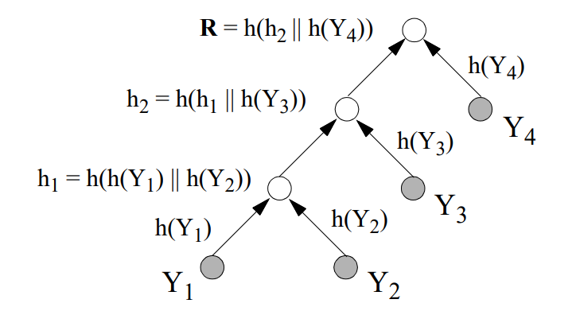
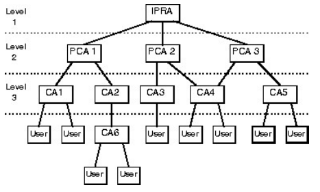
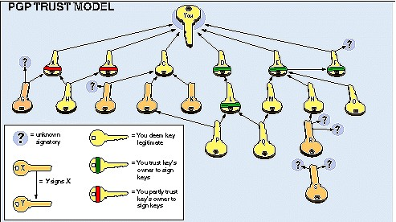

# *Trusted Third Parties* and *Certification*

* *Trusted Third Parties (TTP)*
  * TTP operating modes
  * KDCs and CAs
  * Other TTPs
* Public key authentication
  * Certificates
  * *Certificate Revocation Lists*
  * Authentication trees
  * Certification topologies
* *Public Key Infrastructures (PKIs)*

## TTP: Operating Modes

* *In-line*: The TTP acts as an intermediary to relay the exchanges between A and B in real time. Examples: *Proxies*, *Secure Gateways*.

* *On-line*: The TTP participates in real time in the exchanges between A and B, but A and B communicate directly (without going through the TTP). Example: *Key Distribution Center*.

* *Off-line*: The TTP does not participate in the exchange in real time but makes the information available *a priori*. Example: *Certification Authorities*.

* Comparison *In-line/On-line/Off-line*: Exchanges are facilitated and there is no need for permanent availability of the TTP in the *off-line* mode (unlike the other two), but revocation of privileges (e.g.: when a secret key is compromised) is more complex.

## TTP: *Key Distribution Centers* (KDCs)

* *Key Distribution Centers*: Purpose: Solve the *n2 key distribution problem*:
  * In a symmetric environment of n entities without an intermediary: $n(n-1)/2 \sim n^2$ different keys are needed for all pairs of entities to share a different key.
  * Moreover, such a system is not scalable, since adding an entity results in the generation of n new keys.

If each entity shares a key with a KDC, only n keys are needed for the system to operate and a single key suffices for each new entity. The establishment of secure channels is ensured by the generation of session keys and the presence of *Kerberos-style tickets*.

* Problems:
  * *Single point of security failure*: by construction the KDC can impersonate all nodes of the network. If it is compromised, the whole system becomes vulnerable.
  * *Single point of operational failure*: the usual operating mode of a KDC is *on-line* (possibly *in-line*). If it becomes unavailable (e.g. following a *denial of service attack*), the whole system is paralyzed.
  * *Performance bottleneck*: KDC operations are often computationally expensive (encryption/decryption, *random generation*, etc.). Classic solutions (i.e. *mirroring*) must be considered to distribute the KDCs' load.

## TTP: *Certification Authorities* (CAs)

* The primary role of a Certification Authority (*CA*) is to authenticate the association between an entity and its public key (think of *Man-In-the-Middle* attacks!).
* The CA creates and signs *certificates* containing this association (subject to proof of identity such as a passport) and makes them accessible to the entities concerned.
* Once signed, copies of the certificates (*cached certificates*) can be kept in unprotected locations (e.g. in the user's disk space). However, in order to verify the signature of the certificates, the entities concerned need an *authentic* copy of the CA's public key.
* *Simpler then safer*: no need to implement complex protocols in a CA.
* The usual operating mode of a CA is *off-line*, which reduces the consequences of (short...) periods of unavailability.
* Problem associated with the *off-line* mode: the validity of *cached certificates* can be called into question "asynchronously" by the theft of a private key. Remedy: CAs also publish signed lists of invalid certificates (*Certificate Revocation Lists* or CRLs).
* The compromise of a CA has *less obvious* but *almost as harmful* consequences as that of a KDC, especially if the private key used to sign certificates is also compromised.

## CA: *Proof of Possession* (PoP)

* Verifying A's identity in order to create (or modify) a certificate associating A with its public key is not a sufficient criterion. It is also necessary to verify that A truly possesses the corresponding private key.
* Let A and its CA: CAA. Let's see what an active attacker C can do in "collaboration" with a CAC that would not verify PoP:

A signs a document describing a revolutionary invention and sends it to B (the notary) with its certificate signed by CAA:

$$A \rightarrow B: S_{privA}(Invention), S_{privCA_A}(CertA)$$

C intercepts this packet, contacts CAC and asks it to create a certificate associating its identity C with A's public key, and sends to B:

$$C \rightarrow B: S_{privA}(Invention), S_{privCA_C}(CertC)$$

C thus becomes the revolutionary inventor...

* Simple PoP verification protocol:

  $$CA \rightarrow A: A, r$$

  r: random number, A to protect A from *chosen message attacks*.

  $$CA \leftarrow A: S_{privA}(A,r)$$

  The CA merely has to verify the signature with pubA.

* This criterion and other behavioral criteria such as the updating of CRLs or the security of the signing key introduce *levels of trust* for CAs and for the certificates they sign.
* This phenomenon worsens with the uncontrolled proliferation of CAs!

## CA: Certification and Revocation

* Problem: If the same key is used to sign both certificates and CRLs, an adversary in possession of a CA's private signing key can attack a "victim" A under the authority of that CA as follows:
  * Publish a CRL containing A's revoked certificate.
  * Create a certificate associating A with a public key whose private key it controls, in order to:
  * play the *Man-In-the-Middle* to decrypt confidential transactions intended for A;
  * impersonate A for authenticated transactions or signed documents.
* Solution: *Separation of duties*^[Crispo, B. and Lomas, M. *A Certification Scheme for Electronic Commerce*. International Workshop on Security Protocols. Cambridge, UK. April, 1996.]: Certification and revocation become clearly differentiated tasks:
  * Certificates and CRLs are signed with different keys,
  * by different functional entities (*Certification Authority* and *Revocation Authority*);
  * if possible, residing on different machines subject to independent *security policies*.

## Functional Entities Related to Certification

* *Name Server*: responsible for managing a unique and consistent namespace. When authentication is required, name management must be supplemented by the certification of the public keys associated with these names.

Example of a pilot solution combining both concepts: `DNSsec`: an authenticated name-management environment for the Internet.

* *Registration Authority*: Entity responsible for carrying out tasks related to certificate management that require direct contact with the entities concerned. These tasks include verifying the parameters required for the initial request or for the modification of certificates (identity verification, PoP, etc.). Detaching this functionality from the CA is normally due to geographic considerations.
* *Key Generator*: Allows the process of generating public/private key pairs to be delegated to a dedicated entity:
  * Advantages: simplicity for users; possibility of strengthening the security of the chosen pairs.
  * Disadvantage: Private key known to another entity! Loss of non-repudiation.
* *Certificate Directory*: The directory allowing users to access (read-only) the certificates of their correspondents.

## Other TTPs

* *Timestamp agent* (TA): Certifies the existence of a document or the occurrence of a transaction at a specific point in time. To do this, the TA can:
  * associate a *timestamp* with the document (or with `h(doc)`, h being a *Collision Resistant Hash Function*) and sign the whole with its private key and
  * use an *authentication tree* (cf. page 231).
* *Notary agent*: Certifies not only the existence of a document at a given time (like the TA) but also its validity, origin, or ownership by a given entity. This service constitutes support (legally necessary?) for non-repudiation.
* *Key escrow agent* (KEA): Entity authorized to access secret session keys provided certain conditions (e.g. a court order) are met. This requires a dedicated encryption system. Example, the *Clipper key escrow system*:
  * Announced in April 1993 by the US administration, amid great controversy, as *the* solution for large-scale communication encryption.
  * The *Clipper chip* is a symmetric encryption/decryption device that grants access to session keys when the secret keys of two KEAs (normally federal agencies) are supplied to it as input.
  * The presence of a few flaws, together with the need for asymmetric cryptography, led to its successor: the *Capstone chip*, which can be integrated into a PCMCIA card (called *Fortezza* and used for *military level security*).

## Authenticity of Public Keys: Certificates

* A certificate is a piece of information associating an entity with its public key. Generically, it consists of the following elements:
  * *Serial Number*, *Version*.
  * *Issuer*: the (global and unique) identity of the signing CA.
  * *Signature Algorithm*: the algorithm used to compute the signature on the certificate. E.g.: `MD5 + ElGamal` or `SHA + RSA`.
  * *Subject*: The (global and unique) name of the entity whose public key is certified.
  * *Subject Public Key*: The entity's public key. For example:
    * **(n,e)**: modulus and public exponent for RSA.
    * **(p, $\alpha$, $\alpha^x \bmod p$)**: modulus, generator and public part for Diffie-Hellman.
  * *Subject Public Key Algorithm*: The algorithm associated with the public key. E.g: RSA or Diffie-Hellman.
  * *Validity*: The certificate's validity period, normally expressed in UTC.
  * *Signature*: Contains the signature computed using the *Signature Algorithm* and the CA's private key. It covers all of the preceding records and thus guarantees the authenticity of the information they contain.

## *Certificate Revocation Lists* (CRLs)

* These are lists containing certificates that have become invalid due to a compromised private key or any other factor calling into question the validity of the information contained in a certificate (change of the algorithm used, change of function for a *role-based certificate*, etc.).
* A generic CRL has the following elements:
  * *Issuer*, *Signature Algorithm*: as for certificates.
  * *Date of Issue*, *Date of Next Issue*: issuance date and date of the next issuance.
  * For each revoked certificate, the following records:
    * *Serial Number* of the revoked certificate.
    * *Revocation Date*.
  * *Signature*: signature covering the entire list.
* A CA must publish CRLs very frequently and using wide-audience distribution channels, in order to reduce the risk of fraud.
* Revocation is the *Achilles' heel* of any public-key system...
* One solution: certificates with very short validity periods (a few minutes) requiring periodic re-confirmation from the CAs...
* ...but this brings us back to the *on-line* mode and thus imposes high availability requirements on the CAs.

## Authentication Trees

* Authentication trees are an alternative to certification for authenticating public information.
* The idea is to exploit the advantages of a tree structure (normally binary) using *hash functions* and authentication of the *root* node.

Let A be a tree with n leaves. Let h be a *collision resistant hash function* (CRHF). Tree A can be used to authenticate n public values $Y_1, Y_2, ..., Y_n$ by constructing an authentication tree as follows:

1. The values $Y_1, Y_2, ..., Y_n$ are placed in the leaves of the tree.
2. Each arc leaving a leaf $Y_i$ is labeled $h(Y_i)$ (h being a CRHF).
3. Each non-terminal node with underlying arcs labeled $h_1$ and $h_2$ is labeled $h(h_1 \| h_2)$ ($\|$ denotes concatenation).

## Authentication Trees (II)

* To verify the authenticity of $Y_1$, it is necessary to provide the values $h(Y_2)$, $h(Y_3)$, $h(Y_4)$. Then, one only needs to compute $h(Y_1)$, $h_1$ and $h_2$ (as per the figure) and accept the authenticity of $Y_1$ if $h(h_2 \| h(Y_4)) = \mathbf{R}$. An illicit modification of $Y_1$ would result (owing to the properties of the CRHF) in a different value for $h(h_2 \| h(Y_4)) \Leftrightarrow R$.
* Note that only the value **R** needs to be authenticated (e.g. by means of a digital signature). The other values are protected by the *non-reversibility* of the CRHF.
* Advantage: Only R requires cryptographic protection for authentication!
* Disadvantages:
  * To verify value $Y_1$, the values $h(Y_{2,3,4})$ and the value R are needed. To minimize this effect, one can use *balanced* trees (trees whose paths differ by *at most* one arc) in order to reduce the number of intermediate data items to $\sim \log_2 n$.
  * When a node is modified, the entire path to the root must be recomputed.
  * When new nodes are added, it is advisable to build unbalanced trees (like the one in the figure) and to add the nodes from the root.
* Main application: *timestamping*: the *timestamping agent* (TA) builds such a tree and provides the requester with the *timestamp* signed with its private key as well as the verification path. The TA publishes **R** daily in a newspaper, which prevents it from cheating!

## Certification Topologies

* When two users belonging to different CAs wish to communicate, a trust problem arises: should one trust a certificate issued by another CA?
* The *cross-certification* process allows CAA to certify the public key pubCAB of CAB. The resulting certificate is called a cross-certificate, denoted: CAA{CAB}.
* If A wants to verify the authenticity of B's public key and there exists a cross-certificate CAA{CAB}, A will ask B to provide its certificate signed by CAB, namely CAB{B}. The resulting certification chain: CAA{CAB}CAB{B} allows A to verify B's public key using an authentic copy of pubCAA.
* The trust relationship required for cross-certification is not always easy to establish in competing environments, which is why hierarchical models between CAs have been proposed. Example: the strict hierarchical PEM/X.509 model:

## Certification Topologies (II)

* In the PEM environment, every non-local certification chain begins at the root node, whose public key is assumed to be known worldwide...
* Other models, such as the one proposed by PGP, are based on a graph structure in which the nodes are the users, who act as CAs to certify the public keys of their correspondents. Even though well suited to closed groups of users, this model has its limits when applied to unconnected populations.

* Other proposed schemes combine the hierarchical structure with bidirectional cross-certification.
* Certification chains must be kept as short as possible (a chain is always only as strong as its weakest link!).

## *Public Key Infrastructure* (PKI): Definitions

::: {.callout-note}
**Definition:** *A PKI is an integrated infrastructure that provides a set of security services based on public key cryptography.*
:::

**Functional Entities:**

* **Certification Authority** (CA): Entity responsible for the creation and maintenance of certificates.
* **Certificate Repository** making certificates available to users and applications. Technologies used: X.500, LDAP, WWW Servers, DNS, etc.
* **Certificate Revocation**: compromised or obsolete certificates (notably CRL management)
* **Centralized Key Backup and Recovery**: Entity allowing the management of key loss following various events: destruction of the hardware medium, forgotten unlock password, employee departure, etc. Note that this procedure applies mainly to the *decryption private key* (as opposed to the *signing private key*).
* **Automatic Key Update** after the end of their validity.

## *Public Key Infrastructure* (PKI): Functional Entities (II)

* **Key and Certificate History**. This entity allows the recovery of keys that have become obsolete, having been used to encrypt a document in the past.
* **Cross-Certification** with other PKIs (clients, suppliers, partners, etc.). This functionality allows (under certain constraints) the validation of certificates issued by other PKIs
* **Support for *non-repudiation***: Value-added service providing the evidence necessary to demonstrate the course of an authenticated transaction (*data origin authentication*, *time-stamped data signature*, *signed receipt of delivery*, etc.)
* ***Secure Time Stamping***: Entity capable of providing a reference time accepted by all parties of a PKI. Main applications: *non-repudiation*, arbitration in case of disputes, etc.
* **Client Software**: This functional entity allows all client-side PKI operations to be performed. Examples: management of user certificates, document signing, decryption of information, management of specific peripherals (smart card readers, biometric devices, etc.)

## PKI: Main Advantages and Disadvantages

**Advantages**

* **Security**: The integrated nature of a PKI makes it possible to create a security environment with no weak links.
* **All in one**: A PKI allows the integration and management of all the security parameters specific to a large number of services: strong entity authentication, document signing enabling non-repudiation, *single sign-on*, virtual private networks (VPNs), secure communications with clients/partners/suppliers (B2C, B2B), etc. A PKI represents a significant saving compared to "case-by-case" solutions.
* ***Intra*- and *inter*-company interoperability**: The main PKI products comply with widely used standardization norms (X.509, PKCS, OCSP, etc.). A large number of applications and hardware devices now conform to these standards. The possible compatibility between different PKI providers also allows (with some caveats) inter-company interoperability.

**Disadvantages**

* **Cost of implementation:** expensive products, scarce skills
* **Complexity**... but:
* **outsourcing** the PKI "service" is an alternative.
