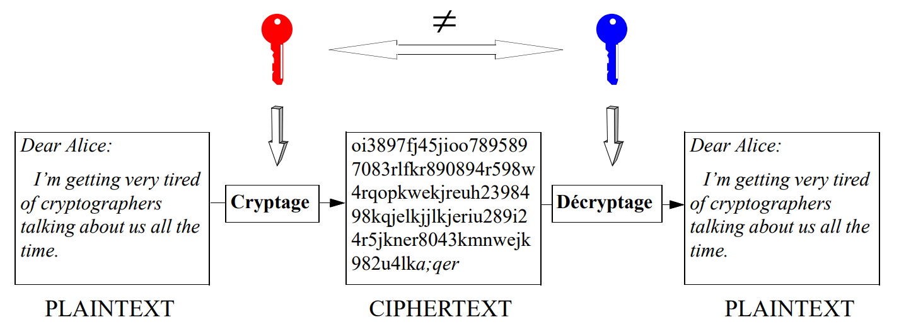
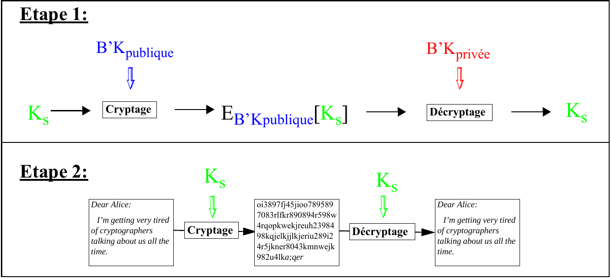
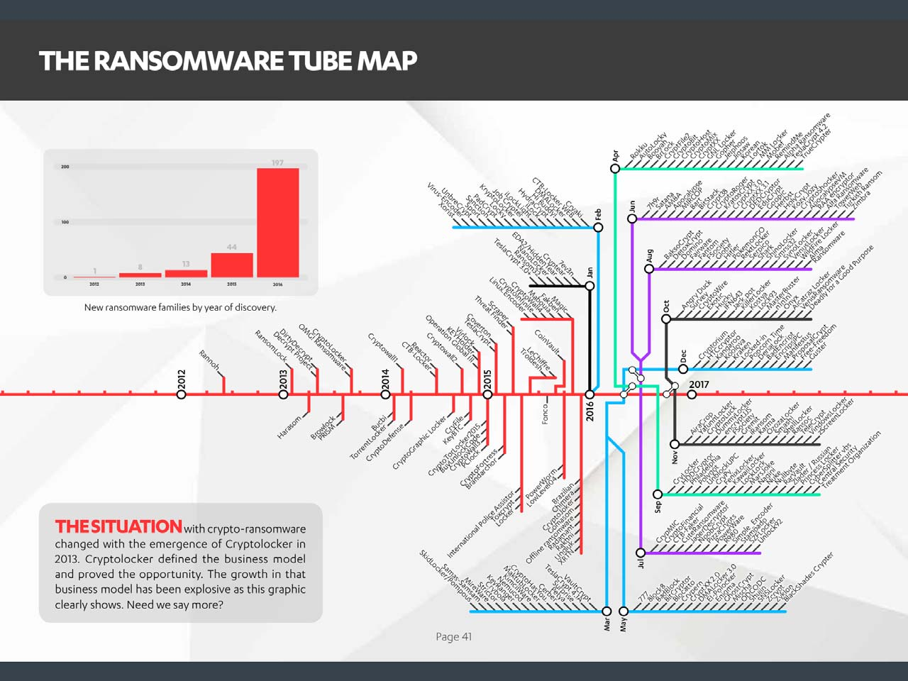

Théorie :

Mercredis 14h - 16h (Battelle A 316-318)

Exercices :

Mercredis 16h - 18h (Battelle A 316-318)

Vendredis 10h - 12h (en ligne - discord)

Théorie : Eduardo Solana \<Eduardo.Solana@unige.ch\>

Exercices : Alexandre-Quentin Berger \<Alexandre-Quentin.Berger@unige.ch\>

Victor Reyes Martin \<Victor.Reyesmartin@unige.ch\>

## Objectifs du Cours

- Apprendre les bases de la sécurité des systèmes d'information.
- Comprendre le cadre cryptographique permettant d'implémenter des services de sécurité.
- Décrire les algorithmes, protocoles et solutions intégrées actuellement utilisés et comprendre leurs faiblesses et comment y remédier.
- Découvrir les dernières tendances en cryptographie et sécurité de l'information et les défis auxquels elles font face.
- Apprendre la terminologie permettant l'accès aux publications scientifiques et aux rapports de recherche.
- Motiver les étudiants à investiguer des sujets sélectionnés en sécurité de l'information et à les présenter à la classe dans des présentations individuelles.

## Agenda Prévisionnel

- Concepts de Base
  - Services de Sécurité
  - Risques Liés à Internet
  - Classification des Cryptosystèmes et Attaques
  - Entropie
  - Modèle de l'Oracle Aléatoire
  - Algorithmes Probabilistes vs. Déterministes
  - Sécurité Computationnelle vs. Secret Parfait
- Outils de Base
  - Génération (Pseudo-)Aléatoire
  - Fonctions de Hachage
  - MACs
  - Algorithmes Cryptographiques :
    - Stream et Bloc
    - Symétrique / Asymétrique
  - Certificats
- Contrôle d'Accès et Sécurité des Transactions
  - Protocoles d'Authentification
  - Protocoles d'Établissement de Clés
  - Gestion et Assurance des Clés et Mots de Passe

## Agenda Prévisionnel (II)

- Framework
  - Politiques de Sécurité (BlP, BIBA, Chinese Wall, etc.)
  - MLS
  - Sécurité des OS
  - PKI
  - Virtualisation et Trusted Computing
- Topologie
  - Sécurité Périmétrique/Sans Périmètre
  - Protocoles de Sécurité Réseau
  - Sécurité Cloud
- Sujets à couvrir (éventuellement...)
  - Chiffrement Homomorphique
  - Attaques par Canal Auxiliaire
  - ...

## Bibliographie

- **[Ros08]** Ross J. Anderson. *Security Engineering: A Guide to Building Dependable Distributed Systems* (2nd Edition). Wiley 2008.
- **[Sta17]** Williams Stallings. *Cryptography and Network Security: Principles and Practice* (7th Edition). Prentice Hall, 2017.
- **[Men97]**: Menezes, A et al. *Handbook of Applied Cryptography*. CRC series on discrete mathematics and its applications. 1997.
  URL: `http://cacr.math.uwaterloo.ca/hac/`
- **[Wag03]**: Samuel S. Wagstaff, Jr. *Cryptanalysis of Number Theoretic Ciphers*. Computational Mathematics Series. Chapman & Hall /CRC, 2003.
- **[Sti18]**: Douglas R. Stinson. *Cryptography Theory and Practice*. (4th Edition). Chapman & Hall /CRC, 2018.
- **[Del07]** Hans Delfs and Helmut Knebl. *Introduction to Cryptography. Principles and Applications* (2nd Edition). Springer 2007.
- **[Kat07]** J.Katz and Y. Lindell. *Introduction to Modern Cryptography*. CRC Press 2007.

## Services de Sécurité

- **Confidentialité** : Protection de l'information d'une divulgation non autorisée
- **Intégrité** : Protection contre la modification non autorisée de l'information
- **Disponibilité** : S'assurer que les ressources sont accessibles aux utilisateurs légitimes
- **Authentification** :
  - **Authentification d'entités** : (*entity authentication*) procédé permettant à une entité d'être sûre de l'identité d'une seconde entité à l'appui d'une évidence corroborant (p.ex.: présence physique, cryptographique, biométrique, etc.). Le terme *identification* est parfois utilisé pour désigner également ce service.
  - **Authentification de l'origine de données** : (*data origin authentication*) procédé permettant à une entité d'être sûre qu'une deuxième entité est la source originale d'un ensemble de données. Par définition, ce service assure également l'intégrité de ces données.
- **Non-répudiation** : Offre la garantie qu'une entité ne pourra pas nier être impliquée dans une transaction
- **Non-Duplication** : Protection contre les copies illicites
- **Anonymat** (d'entité ou d'origine de données) : Permet de préserver l'identité d'une entité, de la source d'une information ou d'une transaction.

## Dangers et Attaques : Synthèse

| Services | Dangers | Attaques |
|---|---|---|
| Confidentialité | fuite d'informations | écoutes illicites, analyse du trafic |
| Intégrité | modification de l'information | création, altération ou destruction illicite |
| Disponibilité | *denial of service*, usage illicite | virus, accès répétés visant à inutiliser un système |
| Authentification d'entités | accès non autorisés | Vol de mot de passe, faille dans le protocole d'authentification |
| Authentification de données | falsification d'informations | falsification de signature, faille dans le protocole d'authentification |
| Non-répudiation | nier la participation à une transaction | prétendre un vol de clé ou une faille dans le protocole de signature |
| Non-duplication | duplication | falsification, imitation |
| Anonymat | identification | analyse d'une transaction, accès non autorisés permettant l'identification |

## Mécanismes de Protection

| Services | Mécanismes classiques | Mécanismes digitaux |
|---|---|---|
| Confidentialité | scellés, coffre-forts, cadenas | cryptage, autorisation logique |
| Intégrité | encre spéciale, hologrammes | fonctions à sens unique + cryptage |
| Disponibilité | contrôle d'accès physique, surveillance vidéo | contrôle d'accès logique, audit, *anti-virus* |
| Auth. d'entités | présence, voix, pièce d'identité, reconnaissance biométrique | secret + protocole d'authentification, adresse réseau + userid, carte à puce + PIN |
| Auth. de données | sceaux, signature, empreinte digitale | fonctions à sens unique + cryptage |
| Non-répudiation | sceaux, signature, signature notariale, envoi recommandé | fonctions à sens unique + cryptage + signature digitale |
| Non-duplication | encre spéciale, hologrammes, tatouage | tatouage digital (*watermarks*), verrouillage cryptographique |
| Anonymat | brouilleur de voix, déguisement, argent liquide | *mixers*, *remailers*, argent électronique, *deep web* |

## Risques Liés à Internet

- Programmes malveillants transmis par e-mail (*e-mail malware*)
- Programmes malveillants transmis sur le web (*web malware*)
- Hameçonnage (*Phising*)
- Pourriels (*spam*)
- Rançongiciels (*ransomware*)
- Attaques sur les dispositifs "Internet des Objets" (*Internet of Things*/*IoT related attacks*)
- Modification illicite des informations publiées *(information spoofing and website defacement)*
- Attaques dénis de service (*denial of service* ou *DDoS*)
- ...

### Liste Non Exhaustive !

Excellente source d'information pour le sujet: **Centre National pour la Cybersécurité (NCSC):**

<https://www.ncsc.admin.ch/ncsc/fr/home.html>

## Programmes Malveillants Transmis par *E-Mail*

- Aussi appelés **maliciels** ou *malware*
- E-mails conçus pour **inciter le destinataire** à **ouvrir une pièce jointe** ou à **suivre un lien** contenant de la publicité non souhaitée, des informations offensives, des programmes à risque, etc.
- Souvent **ciblés** sur la base des intérêts de la victime (travail préliminaire d'ingénierie sociale (*social engineering*))
- **Conséquences** :
  - Installation de *malware* (*ransomware*, *keyloggers*, etc.) dans le système de la victime *(ordinateur, tablette, smartphone, smartwatch, etc.)*
  - Destruction de données contenues dans l'ordinateur
  - Vol d'informations ou de données personnelles
  - Détournement du système pour des fins malicieuses (p.ex.: minage illicite de *bitcoins*)
  - Diffusion de *malware* (éventuellement à d'autres utilisateurs)

## Programmes Malveillants Transmis sur le *Web*

- Cette technique, souvent appelée *drive-by download*, permet d'**infecter le système** *(ordinateur, tablette, smartphone, smartwatch, etc.)* **sur lequel s'exécute un client web lors de la simple visite d'un site**
- Il peut s'agir soit
  - d'un site malicieux qui contient le *malware*
  - d'un site web légitime qui aurait été infecté au préalable (par exemple, moyennant une technique appelée *cross-site scripting)*. L'infection pouvant affecter seulement certaines pages...
- La sensibilisation des utilisateurs (ne pas visiter des sites douteux) diminue l'efficacité de cette technique dans la transmission de *malware*
- Les conséquences sont semblables à celle des transmissions par e-mail (voir page 10)
- L'exécution restreinte des scripts (*java/javascript*) dans le navigateur peut limiter la portée de l'infection mais risque de contraindre la navigation dans certains sites...

## Hameçonnage (*Phising*)

- Le mot *phising* se compose des mots anglais "*password*" (mot de passe), "*harvesting*" (moisson) et "*fishing*" (pêche)
- Cette composition de mots illustre le but principal de cette technique qui consiste **à récolter un maximum d'informations privées** des utilisateurs via des mécanismes de "pêche indiscriminée"
- Lorsque la pêche aux informations est ciblée vers une personne ou organisation spécifique, la technique est dénommée ***spear phising*** (qui provient de *spear fishing* ou pêche au harpon)
- Le vecteur de transmission consiste normalement dans un **e-mail avec une adresse d'expédition falsifiée** (mais souvent indétectable...) qui demande à la victime de fournir des informations privées: adresses e-mail, identifiants (*twitter*, *facebook*, etc.), mots de passe, numéros d'identité, numéros de comptes bancaires, etc.
- Les prétextes utilisés sont variés (mise à jour du système informatique, arrêt du service, retrait d'un envoi, etc.) et vont jusqu'à menacer l'utilisateur en cas de refus

## Pourriels (*Spam*)

- Englobe tous les **e-mails indésirables** (souvent publicitaires) reçus par les personnes et les organisations
- Terme utilisé également pour désigner les **pages/*fenêtres pop-up* affichées sans le consentement de l'utilisateur** lors de la navigation web
- On estime que **60%** des e-mails qui circulent dans le monde appartiennent à cette catégorie
- Les conséquences sont souvent limitées à la consommation de ressources de calcul et stockage ainsi qu'au gaspillage de temps associé à la lecture et traitement de ces messages mais...
- ... certains **e-mails spam peuvent également constituer des vecteurs de transmission de malware**
- Ils ont tendance à cibler plus particulièrement les adresses e-mail courtes (p.ex: *abc@gmail.com*) mais fonctionnent également sur la base des listes (souvent échangées / vendues) contenant tous types d'adresses
- Les opérations de filtrage *anti-spam* entraînent des coûts considérables pour les organisations

## Rançongiciels (*Ransomware*)

- Cette famille spécifique de *malware* appartient à la catégorie appelée **Chevaux de Troie** (*Trojan Horses*)
- Leur comportement plus habituel consiste à **chiffrer les données de la victime (**locaux et distants**) afin de les rendre totalement inaccessibles**
- Un message apparait ensuite pour demander le paiement d'une rançon (souvent en *bitcoins* ou une autre monnaie virtuelle) permettant potentiellement de récupérer l'accès aux fichiers chiffrés
- Ils peuvent rester en état *dormant* dans le système infecté et être déclenchés par un événement spécifique ou à une date donnée (attaques synchronisées)
- Leurs vecteurs d'infection sont variés mais les **e-mails contenant des pièces jointes malicieuses** sont souvent mis en cause lors des infections primaires
- Des nombreuses variantes existent et continuent à se développer
- On observe parfois d'autres comportements associés à ces *malware*: **dénis de service**, **extorsions ciblées**, **menaces**, etc.

## Attaques sur les Dispositifs *Internet of Things (IoT)*

- Ciblent les **objets connectés** de toute sorte (*caméras, TVs, frigos, capteurs et interrupteurs domotiques, installations d'alarme,* etc.)
- Ils sont souvent **plus faciles à pirater que les systèmes traditionnels** par cause de:
  - nombreuses failles de sécurité souvent connues des attaquants
  - mots de passe par défaut
  - négligence de la part des utilisateurs qui ignorent les risques qui leurs sont propres
- La **prise de contrôle à distance** de ces appareils par une entité malveillante implique:
  - Une porte d'entrée au réseau domestique/corporatif
  - Un dispositif pouvant être utilisé pour des activités illicites (*hacking*, attaques *DDoS*, minage de *bitcoins*, etc.)
- L'établissement d'un répertoire précis de tous les dispositifs de ce type connectés au réseau est nécessaire!

## Modification Illicite des Informations Publiées — *Information Spoofing and Website Defacement*

- Attaques visant **l'intégrité** de l'information publiée dans les sites web, les réseaux sociaux, etc.
- Elles portent atteinte **à la réputation et peuvent provoquer d'importants dommages économiques** pour les sociétés ayant une présence Internet
- Dans le cas des **sites web**, la **sécurisation du système hôte** est essentielle ainsi qu'une **configuration aussi restrictive que possible**. Des audits des sécurité récurrents sont vivement recommandés.
- La **protection des informations affichées dans les réseaux sociaux** dépend directement du processus d'authentification permettant d'accéder au profil à risque:
  - Éviter les mots de passe trop simples
  - Privilégier l'authentification forte, si possible *multi-facteur*
  - Fermer proprement les sessions
  - Effacer les *cookies*

## Attaques **Dénis de Dervice** (*Denial of Service* / *DDoS*)

- Attaques destinées à **rendre inaccessibles des systèmes informatiques** de toute sorte visant surtout les organisations privées ou étatiques
- Le terme **DDoS** (*Distributed Denial of Service*) désigne une famille d'attaques dans laquelle des multiples (**souvent des dizaines de milliers**) **de dispositifs ciblent simultanément le(s) système(s) victime(s)**
- Le trafique généré atteint plusieurs centaines de gigabits / seconde
- L'efficacité des mécanismes de protection traditionnels (*firewalls*, *sondes* de *prévention* et de *détection d'intrusion*, etc.) est limitée
- L'indisponibilité d'un service peut engendrer:
  - des problèmes **réputationnels**
  - d'importantes **pertes financières** (des **demandes de rançon** peuvent être exigées pour les désactiver)
  - des **hauts risques de sécurité (même physique!)** lorsque des **infrastructures critiques** (hôpitaux, centrales électriques, *backbone* de l'Internet, etc.) sont ciblées

## Méthodes Digitales de Sécurité

**Problème: Protéger des informations digitales**

- dans un environnement distribué
- globalement accessible
- sans frontière matérielle

**Solution:**


- fonctions à sens unique
- générateurs (pseudo) aléatoires

## Fonctions de Hachage Cryptographiques

**Fonctions faciles à calculer dans un sens mais virtuellement impossibles à calculer dans le sens contraire**


- Toute modification (*même insignifiante*) du document source se traduit par un *digest* fondamentalement différent.
- Il est virtuellement impossible de retrouver le document source à l'aide seulement du digest (*one-way*).
- Il est virtuellement impossible de retrouver un deuxième document source produisant le même digest (*collision-free*).
- Longueur habituelle des digests: **160 à 512 bits.**
- Les algorithmes à sens unique sont très performants.
- Exemples de fonctions de hachage cryptographiques: **SHA-1, SHA-256, SHA-3,** etc.

## Générateurs (Pseudo) Aléatoires

- La génération de nombre aléatoire est un processus très important pouvant compromettre la sécurité d'un bon nombre de systèmes de cryptage.
- Entre autres applications on trouve la génération de clés de session, les vecteurs d'initialisation (DES - CBC mode), des secrets nécessaires à la génération de signatures (ElGamal), etc.
- Un générateur aléatoire (*random generator*) est un dispositif capable de générer des nombres de façon *aléatoire*, *imprévisible* et *non reproductible*. Un tel générateur est normalement doté d'un dispositif externe mesurant des phénomènes physiques connus par leur non-déterminisme (p.ex., une source radioactive ou quantique).
- Les générateurs pseudo-aléatoires sont des procédés déterministes développés à partir d'une séquence aléatoire initial (*seed*) pouvant être obtenue par des méthodes diverses (la fréquence de frappe d'un utilisateur, le nombre d'accès disque, le nombre de paquets reçus par une interface réseau, etc.)
- R. Pitkin dans [Kau95]: "*The use of pseudo-random processes to generate secret quantities can result in pseudo-security*"...
- Description des principaux algorithmes pseudo-aléatoires dans [Sti95].

## Cryptographie Symétrique

Aussi appelée cryptographie conventionnelle ou à clés secrètes

(I av. JC, Julius Cesar)

**Idée: Sur la base d'une *seule clé secrète*, réaliser une transformation capable respectivement de rendre illisible et de restituer une pièce d'information**


## Cryptographie Symétrique: Caractéristiques

- Il existe des nombreux systèmes de cryptage symétriques (AES, DES, IDEA, RC4, RC5, etc.) dont certains gratuits et de libre accès.
- Services supportés: *Confidentialité*, *Authentification*, *Intégrité*.
- La clé étant connue des deux intervenants, cette technologie n'offre *pas de support direct pour des signatures digitales*
- La clé étant secrète, elle doit être échangée entre les intervenants par un canal confidentiel alternatif (courrier postal, téléphone, etc.)

**Se prête mieux à la protection de documents personnels qu'à des transactions impliquant des grandes populations (commerce électronique)**

## Cryptographie Asymétrique

Aussi appelée cryptographie publique ou à clés publiques

(1976, W. Diffie & M. Hellman)

- **Idée**: Utiliser deux clés différentes - une *secrète* et une *publique* - respectivement pour les opérations de cryptage et décryptage
- Chaque utilisateur dispose d'un *porte-clés* (*keyring*) contenant, au moins, sa clé publique et sa clé privée



## Cryptographie Asymétrique: Confidentialité

- L'expéditeur crypte l'information avec la clé publique du destinataire (globalement disponible)
- Le destinataire décrypte l'information avec sa clé privée (connue de lui seul)


**Seulement les clés (publique et privée) du destinataire sont impliquées dans l'échange confidentiel!**

## Cryptographie Asymétrique: Signature Digitale

- L'expéditeur signe l'information avec sa clé privée (connue de lui seul)
- Le destinataire vérifie la signature avec la clé publique de l'expéditeur (globalement disponible)


**Seulement les clés (publique et privée) de l'expéditeur sont impliquées dans les processus de signature et vérification!**

## Signature Digitale (II)

**Problème: La signature de tout un document est très coûteuse en temps**

**Solution: Appliquer la signature uniquement au *digest* résultant d'une fonction à sens unique sur tout le document**


**Génération de la Signature** — **Vérification de la Signature**

## Exemple d'un Message Signé

```
-----BEGIN SIGNED MESSAGE----
Dear Alice:

  I'm getting very tired of cryptographers talking
about us all the time.  Why can't they keep their
noses in their own affairs?!
Sincerely,

                       Bob


-----BEGIN SIGNATURE-----
Version: XYZ n.m
iB2FHFbSU7RpAQEqsQMAvo3mETurtUnLBLzCj9/U8oOQg/T7iQcJ
vM8srMV+3VRid64o2h2XwlKAWpfVcC+2v5pba+BPvd86KIP1xRFI
eipmDnMaYP+iVbxxBPVELundZZw7IRE=Xvrc
-----END SIGNATURE-----
```

## Signatures digitales: Caractéristiques

- La signature change si le document change. La clé privée est toujours la même
- En cas de modification du document ou de la signature, la signature ne sera pas vérifiée (**Intégrité** garantie)
- Il est virtuellement impossible (même pour le détenteur de la clé privée) de générer un deuxième document avec la même signature (la fonction à sens unique est sans collisions)
- Seul le détenteur de la clé privée peut générer une signature qui se vérifie avec la clé publique correspondante

**Authentification + Non Répudiation**

## Crypto asymétrique + Crypto symétrique

**Idée: Utiliser la cryptographie publique uniquement pour échanger des clés symétriques**



- A génère une clé aléatoire Ks et la transmet à B en l'encryptant avec la clé publique de B (confidentialité)
- A & B communiquent en utilisant la clé Ks pour protéger la confidentialité des échanges

## Crypto asymétrique: Fonctionnement (RSA)

**Soit n := pq avec p et q deux nombres premiers grands (\> 1024 bits)**

Soit

$$\phi(n) = (p-1)(q-1)$$

Soit e et d tels que

$$ed \equiv 1 \mod \phi(n)$$

Par définition des congruences:

$$ed = 1 + k\phi(n)$$

Théorème d'Euler:

$$a^{\phi(n)} \equiv 1 \mod n$$

Encryption: $C = P^e \mod n$    Clé publique: (n,e)

**L'inverse de cette opération est considéré virtuellement impossible à calculer lorsque des grandes nombres son impliqués**

Décryption: $P = C^d \mod n$    Clé privée: (d)

Preuve: $(P^{ed} \equiv P^{1 + k\phi(n)} \equiv (P \mod n)\,(P^{\phi(n)} \mod n)^k \equiv P \mod n) \mod n$

## Cryptographie Asymétrique: Conclusions

- Il existe quelques systèmes de cryptage asymétrique (Rabin, ElGamal, etc.) mais le plus utilisé est **RSA**.
- Services supportés: *Confidentialité*, *Authentification*, *Intégrité*, *Signature Digitale & Non-Refus, (Non Duplication)*.
- Les opérations liées à la crypto. asymétrique sont jusqu'à 50 fois (!) plus lentes que celles de la crypto. symétrique.
  Une combinaison des deux méthodes est souvent souhaitable
- La distribution des clés est simplifiée par le fait que seules des clés publiques doivent être échangées entre les intervenants (pas besoin d'un canal *confidentiel* alternatif) mais...
- ... il est nécessaire de vérifier que la clé publique appartient réellement au destinataire:
  - Soit le canal d'acquisition de la clé publique est protégé contre toute modification (*authentifié*)
- Soit la clé est ***certifiée*** exacte par un tiers

## Cryptographie Symétrique vs. Asymétrique

- Il existe des centaines d'algorithmes symétriques et asymétriques capables de fournir un niveau de confidentialité suffisant.
- Les solutions symétriques offrent les avantages suivants:
  - rapidité (jusqu'à 100 fois plus rapide que les solutions asymétriques)
  - facilité d'implantation en hardware
  - longueur de clé réduite: 128 bits (= 16 caractères => mémorisable !) au lieu de 1024 bits pour des équivalents asymétriques.
- Les solutions asymétriques ont comme arguments principaux:
  - Echange de clés simplifié: les clés doivent être échangées par un canal authentifié mais non-confidentiel.
  - Gestion de clés simplifiée: une seule paire de clés publique/privé suffit à un utilisateur pour recevoir des messages confidentiels de n utilisateurs (au lieu de n clés différentes dans le cas symétrique).
- Problèmes propres aux deux techniques
  - La gestion de clés par l'utilisateur reste le maillon le plus faible
  - Sécurité (normalement) basée sur des arguments empiriques plutôt que théoriques
  - Restrictions légales d'usage et d'exportation

## Cryptographie Symétrique vs. Asymétrique (II)

| Activité | Recommandation | Remarques |
|---|---|---|
| Protection de documents personnels | Crypto symétrique | Vitesse, clés facilement mémorisables |
| Protection de documents dans un groupe d'utilisateurs proches | Crypto symétrique | Vitesse, facilité d'échange des clés confidentielles |
| Etablissement de canaux confidentiels entre utilisateurs distants (inconnus) | Crypto asymétrique | Pas besoin d'avoir un canal confidentiel: authenticité suffit |
| Transactions entre deux utilisateurs distants, Protection de logiciel (distribution *multicast*) | Crypto asym. pour protection de clé sym. + Crypto sym. pour protection des données | Vitesse, Seule la clé sym. doit être ré-encryptée pour chaque correspondant. Copie cryptée du logiciel peut être rendue publique |
| Protection des segments réseaux | Crypto symétrique | Vitesse, Environnement stable → échange confidentiel des clés facile entre sysadmins. |

## Dissection d'une Attaque: *Ransomware*

"Un *rançongiciel* (de l'anglais *ransomware*), *logiciel rançonneur*, *logiciel de rançon* ou *logiciel d'extorsion*, *est un logiciel malveillant qui prend en otage des données personnelles. Pour ce faire, un rançongiciel chiffre des données personnelles puis demande à leur propriétaire d'envoyer de l'argent en échange de la clé qui permettra de les déchiffrer*" (*Wikipedia* 21 septembre 2021).

- Définition incomplète car les ransomware portent sur *un vaste spectre de l'infrastructure informatique*.
- A titre d'exemple, en mai 2021, une attaque ransomware dirigée contre la société *Colonial Pipeline* a provoqué une coupure d'approvisionnement de combustible d'une grande partie de la côte des Etats Unis.
- Avec **un nombre d'attaques global chiffré en milliards par année**, "***Ransomware Everywhere***" est globalement considérée la menace la plus directe, visible et dangereuse pour utilisateurs et entreprises en 2021!

## L'Univers du Ransomware^[2017 State of Cybersecurity. F-Secure Inc.]



## Ransomware: Vue Intégrale

- Prévision, Remédiation et Réaction
  - *Patching*
  - Détection active et passive (*Firewalls*, *WAFs*, *IDS*, *IPS*, *e-mail malware scan*, etc.)
  - *Backups offline* !
  - Politique de Sécurité - Règles de bon usage de la messagerie
  - Formation !
  - Payer ou pas payer...
- Dissection Technique de l'Attaque
  - Infection et propagation
  - Exécution
  - Paiement (*Crypto-currencies* / *Bitcoin*)
  - Occultation (*Obfuscation*, *TOR Networks*/*Deep Web*)

## Schéma Générique d'un *Ransomware Cryptolocker*


- Les **clés privées** de déchiffrement sont **stockées dans les serveurs de l'attaquant**
- Elles sont envoyées à la victime après **paiement en *bitcoins***
- La **trace** est **broyée** à l'aide des **réseaux *TOR***

## *Ransomware Cryptolocker*: Cibles^[Intel Security. Advanced Threat Research. http://www.intelsecurity.com]

.jin, .xls, .xlsx, .pdf, .doc, .docx, .ppt, .pptx, .txt, .dwg, .bak, .bkf, .pst, .dbx, .zip, .rar, .mdb, .asp, .aspx, .html, .htm, .dbf, .3dm, .3ds, .3fr, .jar, .3g2, .xml, .png, .tif, .3gp, .java, .jpe, .jpeg, .jpg, .jsp, .php, .3pr, .7z, .ab4, .accdb, .accde, .accdr, .accdt, .ach, .kbx, .acr, .act, .adb, .ads, .agdl, .ai, .ait, .al, .apj, .arw, .asf, .asm, .asx, .avi, .awg, .back, .backup, .backupdb, .pbl, .bank, .bay, .bdb, .bgt, .bik, .bkp, .blend, .bpw, .c, .cdf, .cdr, .cdr3, .cdr4, .cdr5, .cdr6, .cdrw, .cdx, .ce1, .ce2, .cer, .cfp, .cgm, .cib, .class, .cls, .cmt, .cpi, .cpp, .cr2, .craw, .crt, .crw, .phtml, .php5, .cs, .csh, .csl, .tib, .csv, .dac, .db, .db3, .dbjournal, .dc2, .dcr, .dcs, .ddd, .ddoc, .ddrw, .dds, .der, .des, .design, .dgc, .djvu, .dng, .dot, .docm, .dotm, .dotx, .drf, .drw, .dtd, .dxb, .dxf, .dxg, .eml, .eps, .erbsql, .erf, .exf, .fdb, .ffd, .fff, .fh, .fmb, .fhd, .fla, .flac, .flv, .fpx, .fxg, .gray, .grey, .gry, .h, .hbk, .hpp, .ibank, .ibd, .ibz, .idx, .iif, .iiq, .incpas, .indd, .kc2, .kdbx, .kdc, .key, .kpdx, .lua, .m, .m4v, .max, .mdc, .mdf, .mef, .mfw, .mmw, .moneywell, .mos, .mov, .mp3, .mp4, .mpg, .mrw, .msg, .myd, .nd, .ndd, .nef, .nk2, .nop, .nrw, .ns2, .ns3, .ns4, .nsd, .nsf, .nsg, .nsh, .nwb, .nx2, .nxl, .nyf, .oab, .obj, .odb, .odc, .odf, .odg, .odm, .odp, .ods, .odt, .oil, .orf, .ost, .otg, .oth, .otp, .ots, .ott, .p12, .p7b, .p7c, .pab, .pages, .pas, .pat, .pcd, .pct, .pdb, .pdd, .pef, .pem, .pfx, .pl, .plc, .pot, .potm, .potx, .ppam, .pps, .ppsm, .ppsx, .pptm, .prf, .ps, .psafe3, .psd, .pspimage, .ptx, .py, .qba, .qbb, .qbm, .qbr, .qbw, .qbx, .qby, .r3d, .raf, .rat, .raw, .rdb, .rm, .rtf, .rw2, .rwl, .rwz, .s3db, .sas7bdat, .say, .sd0, .sda, .sdf, .sldm, .sldx, .sql, .sqlite, .sqlite3, .sqlitedb, .sr2, .srf, .srt, .srw, .st4, .st5, .st6, .st7, .st8, .std, .sti, .stw, .stx, .svg, .swf, .sxc, .sxd, .sxg, .sxi, .sxi, .sxm, .sxw, .tex, .tga, .thm, .tlg, .vob, .war, .wallet, .wav, .wb2, .wmv, .wpd, .wps, .x11, .x3f, .xis, .xla, .xlam, .xlk, .xlm, .xlr, .xlsb, .xlsm, .xlt, .xltm, .xltx, .xlw, .ycbcra, .yuv
