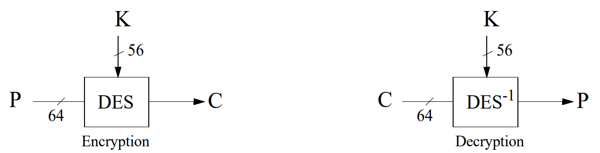
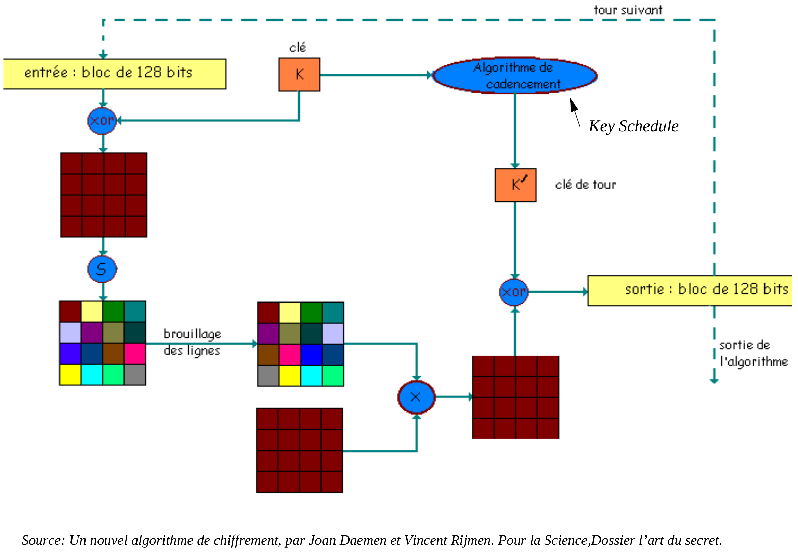

## Cryptographie Symétrique — Aperçu

* Cryptage en chaîne (Stream Ciphers)
  * Stream ciphers synchrones et asynchrones
  * Linear Feedback Shift Registers (LFSR)
  * L'algorithme **RC4**
* Cryptage par blocs (Block Ciphers)
  * Modes d'opération : ***ECB, CBC, CFB, OFB*** et ***CTR***
  * *Product Ciphers* et *Feistel ciphers*
  * **DES**, **2DES** et **3DES**
  * **AES**
  * *Differential* et *Linear Cryptanalysis*

## Cryptage en chaîne (*Stream Ciphers*)

* Les *stream ciphers* constituent une famille de systèmes de cryptage où la taille du bloc encrypté est égale à 1 bit.

* Les *stream ciphers* sont généralement composés de deux phases :

  * Une phase de ***génération*** de la séquence d'éléments formant la clé (le *keystream*).

  * Une phase de ***substitution*** où les bits du plaintext subissent une opération spécifique dépendante du *keystream*.

* Un exemple évident d'un *stream cipher* est le ***one-time pad*** avec :

  * Une phase de génération du *keystream* effectuée par un générateur (*pséudo*-) aléatoire.

  * Une phase de substitution qui consiste à effectuer un **xor** ($\oplus$) avec le *keystream*.

## *Stream Ciphers* : Caractéristiques

* *Rapidité* : Le cryptage se fait directement au niveau des registres. Idéal pour des applications nécessitant un cryptage "*on the fly*" comme le *video streaming*.

* *Facilité* : Les opérations peuvent être effectuées par des systèmes ayant des ressources CPU limitées.

* *Pas* (ou peu...) *besoin de mémoire/buffering*.

* *Propagation des erreurs limitée ou absente :* la retransmission des paquets fautifs suffit normalement (adapté aux applications où les pertes de paquets sont fréquentes comme les transmissions sans fil (*WiFi*)).

* Inconvénients :

  * La qualité en termes de *randomness* du *keystream* généré détermine la robustesse du système.

  * La *réutilisation* du *keystream* permet une cryptanalyse facile (cf. le *one-time pad*).

## *Stream Ciphers* Synchrones

* Le *keystream* généré dépend seulement de la clé et non pas du *plaintext* ni du *ciphertext*.

* Le processus d'encryption d'un *stream cipher synchrone* est décrit par les équations suivantes :

$$\sigma_{i+1} = f(\sigma_i, k) \qquad z_i = g(\sigma_i, k) \qquad c_i = h(z_i, m_i)$$

  avec $\sigma_i$ l'état initial qui peut dépendre de la clé **k**, **f** la fonction qui détermine l'état suivant, **g** la fonction qui produit le *keystream* $z_i$ et **h** la fonction de sortie qui produit le ciphertext $c_i$ à partir du plaintext $m_i$.

* Schématiquement, le mode de fonctionnement d'un *stream cipher synchrone* est le suivant :

```{.cetz caption="Figure 6.1 : General model of a synchronous stream cipher (Source [Men97])"}
#cetz.canvas({
  import cetz.draw: *

  let draw-state-block(x, y, w: 0.8, h: 0.8, label: $sigma_i$) = {
    rect((x - w / 2, y - h / 2), (x + w / 2, y + h / 2), stroke: black)
    content((x, y), label, anchor: "center")
  }

  let draw-function_block(x, y, r: 0.4, label: $f$) = {
    circle((x, y), radius: r, stroke: black)
    content((x, y), label)
  }

  let r = 0.4

  content((-0.3, 0), $k$, anchor: "center")
  draw-state-block(3, 2)
  draw-function_block(1.5, 1, r: r)
  draw-function_block(3, 0, r: r, label: $g$)
  draw-function_block(5, 0, r: r, label: $h$)
  content((7.3, 0), $c_i$)
  content((5, 2), $m_i$)
  content((1, 1.7), $sigma_(i + 1)$)
  content((4, 0.3), $z_i$)

  line((0, 0), (3 - r, 0), mark: (end: ">"))
  line((3 + r, 0), (5 - r, 0), mark: (end: ">"))
  line((5 + r, 0), (7, 0), mark: (end: ">"))
  line((5, 1.7), (5, r), mark: (end: ">"))
  line((3, 2 - r), (3, r), mark: (end: ">"))
  line((1.5, 0), (1.5, 1 - r), mark: (end: ">"))
  line((3, 1), (1.5 + r, 1), mark: (end: ">"))
  line((1.5, 1 + r), (1.5, 2))
  line((1.5, 2), (3 - r, 2), mark: (end: ">"))

  rect((0.4, -0.6), (3.6, 2.6), stroke: (dash: "dashed"))
  content((2, 3), "Keystream creation", anchor: "center")
})
```

## *Stream Ciphers* Synchrones : Caractéristiques

* Nécessitent la **synchronisation** de l'émetteur et du récepteur : En plus d'utiliser la même clé **k**, les deux doivent se trouver dans le même état pour que le processus fonctionne. Si la synchronisation est perdue il faut des mécanismes externes pour la récupérer (*marqueurs spéciaux, analyses de redondance du plaintext*, etc.)

* **Pas de propagation d'erreur**. La modification du ciphertext pendant la transmission n'entraîne pas des perturbations dans des séquences de ciphertext ultérieures (cependant, la suppression d'un ciphertext provoquerait la désynchronisation du récepteur).

* **Attaques actives** : l'insertion, l'élimination ou le *replay* de parties de ciphertext sont détectés par le récepteur. Cependant, un adversaire pourrait modifier certains bits du ciphertext et analyser l'impact sur le plaintext correspondant. Des mécanismes d'authentification d'origine supplémentaires sont nécessaires afin de détecter ces attaques.

* Cas les plus fréquent des *Stream Cipher Synchrones* : le **stream cipher additif** (cf. *le one-time pad*) où les fonctions **f** et **g** générant le keystream sont remplacées par un générateur aléatoire et la fonction **h** est une addition modulo 2 (xor) :

```{.cetz caption="Stream cipher additif — Encryption et Decryption (Source [Men97])"}
#cetz.canvas({
  import cetz.draw: *

let draw-xor(x, y, r: 0.2) = {

  circle((x, y), radius: r, stroke: black)

  line((x - r, y), (x + r, y), stroke: black)

  line((x, y - r), (x, y + r), stroke: black)

}

let draw-generator(
  x, y,
  w: 3.4,
  h: 0.8,
  label: "Keystream Generator"
) = {

  rect(
    (x - w / 2, y - h / 2),
    (x + w / 2, y + h / 2),
    stroke: black
  )

  content((x, y), text(label, size: 10pt), anchor: "center")

}

// Encryption panel

content((-1.8, 0), $k$, anchor: "center")

draw-generator(1.2, 0)

draw-xor(4.15, 0, r: 0.25)

content((4.15, 1.3), $m_i$)

content((5.7, 0), $c_i$)

content((1.2, 0.9), $z_i$)

line((-1.5, 0), (-0.5, 0), mark: (end: ">"))

line((2.9, 0), (3.9, 0), mark: (end: ">"))

line((4.15, 1, ), (4.15, 0.2), mark: (end: ">"))

line((4.4, 0), (5.4, 0), mark: (end: ">"))


// Decryption panel

content((6.9, 0), $k$, anchor: "center")

draw-generator(9.9, 0)

draw-xor(12.85, 0, r: 0.25)

content((12.85, 1.3), $c_i$)

content((14.4, 0), $m_i$)

content((9.9, 0.9), $z_i$)

line((7.2, 0), (8.2, 0), mark: (end: ">"))

line((11.6, 0), (12.6, 0), mark: (end: ">"))

line((12.85, 1), (12.85, 0.2), mark: (end: ">"))

line((13.1, 0), (14.1, 0), mark: (end: ">"))

})
```

## *Stream Ciphers* Asynchrones

* Aussi appelés **auto-synchronisés** (*self synchronizing ciphers*).

* Le keystream généré dépend de la clé ainsi que d'*un nombre fixé de ciphertexts précédents*.

* Le processus d'encryption d'un *stream cipher asynchrone* est décrit par les équations suivantes :

$$\sigma_i = (c_{i-t}, c_{i-t+1}, \ldots, c_{i-1}) \qquad z_i = g(\sigma_i, k) \qquad c_i = h(z_i, m_i)$$

  avec $\sigma_i$, **g** et **h** comme pour le cas synchrone.

* Schématiquement, le mode de fonctionnement d'un *stream cipher asynchrone* est le suivant :

```{.cetz caption="Figure 6.3 : General model of a self-synchronizing stream cipher (Source [Men97])"}
#cetz.canvas({
  import cetz.draw: *

  let draw-boxes(x, y, n: 12, size: 0.25, type: "Plaintext", pos: 1.5, top: true) = {
    for i in range(int(n / 2)) {
      rect((x + i * size, y), (x + (i + 1) * size, y + size), stroke: black)
    }
    for i in range(int(n / 2)) {
      rect((x - i * size, y), (x - (i + 1) * size, y + size), stroke: black)
    }
    let text_pos = -1
    if top {
      text_pos = 1
    }
    content((x, y + pos * size * text_pos), type, anchor: "center")
  }

  let draw-function_block(x, y, r: 0.4, label: $f$) = {
    circle((x, y), radius: r, stroke: black)
    content((x, y), label)
  }

  let r = 0.4
  let size = 0.5
  let n = 4

  content((-0.3, 0), $k$, anchor: "center")
  draw-function_block(2.5, 0, r: r, label: $g$)
  draw-function_block(5, 0, r: r, label: $h$)
  draw-boxes(2.5, 1.7, n: n, size: size, type: "Buffer")
  content((7.3, 0), $c_i$)
  content((5, 1.4), $m_i$)
  content((4, 0.3), $z_i$)

  line((0, 0), (2.5 - r, 0), mark: (end: ">"))
  line((2.5 + r, 0), (5 - r, 0), mark: (end: ">"))
  line((5 + r, 0), (7, 0), mark: (end: ">"))
  line((5, 1.1), (5, r), mark: (end: ">"))
  for i in range(n) {
    line((2.5 - n / 2 * size + size / 2 + i * size, 1.7), (2.5, r), mark: (end: ">"))
  }
  line((6, 0), (6, 1.7 + size / 2))
  line((6, 1.7 + size / 2), (2.5 + size * n / 2, 1.7 + size / 2), mark: (end: ">"))
})
```

## *Stream Ciphers* Asynchrones : Caractéristiques

* **Auto-synchronisation** : En cas d'élimination ou d'insertion de ciphertexts en cours de route, le récepteur est capable de se *re-synchroniser* avec l'émetteur grâce à la mémorisation (*buffer*) d'un nombre de ciphertext précédents.

* **Propagation d'erreurs limitée** : La propagation d'erreurs s'étend uniquement au nombre de bits du ciphertext mémorisés (taille du *buffer*). Après, la decryption se déroule à nouveau correctement.

* **Attaques actives** : La modification de fragments du ciphertext sera plus facilement détecté que dans le cas synchrone à cause de la propagation d'erreurs. Cependant, comme le récepteur est capable de s'auto-synchroniser avec l'émetteur, même si des ciphertexts sont éliminés ou insérés en cours de route, il convient de vérifier l'intégrité et l'authenticité du flot entier.

* **Diffusion des statistiques du plaintext** : Le fait que chaque bit du plaintext aura une influence sur la totalité des ciphertexts subséquents se traduit par une plus grande dispersion des statistiques du plaintext comparée au cas synchrone...

* ... Il convient, donc, d'**utiliser des stream ciphers asynchrones lorsque l'entropie des plaintexts est limitée** et pourrait permettre des attaques ciblées aux plaintexts fortement redondants.

## *Stream Ciphers* : Générateurs de Keystreams

* Lorsqu'il convient de générer un keystream d'une longueur **m** à partir d'une clé secrète de longueur **l** avec **l << m**, on fait appel à des générateurs de keystreams.

* Le plus courant de ces générateurs est le *Linear Feedback Shift Register* (LSFR).

* Un LSFR a les caractéristiques suivantes :

  * S'adapte très bien aux implantations hardware.

  * Produit des séquences de périodes longues et avec une qualité aléatoire notable (*randomness* assez forte)

  * Se base sur les propriétés algébriques des combinaisons linéaires.

* Exemple générique d'un **LSFR** de longueur **L** :

![Figure 6.4 : A linear feedback shift register (LFSR) of length L (Source [Men97])](qmd_images/LSFR.png)

## LSFRs : Quelques Remarques

* Les LSFRs sont des constructions très répandues dans la cryptographie et dans la théorie de codes.

* Un grand nombre de *stream ciphers basés sur les LSFRs* (surtout dans la sphère militaire) ont été développés dans le passé.

* Malheureusement, le niveau de sécurité offert par ces systèmes est jugé insuffisant de nos jours (comparé à celui des *blocks ciphers*...)

* La métrique permettant d'analyser un LFSR est sa *complexité linéaire* (**linear complexity**). L'algorithme de *Berlekamp-Massey*[^1] permet de déterminer la complexité linéaire d'un LSFR et de calculer ainsi un nombre arbitrairement grand de séquences générées par un LSFR.

* Une solution pour augmenter la complexité est de substituer la combinaison linéaire des bits du ciphertext par une fonction non linéaire f. Ce sont les **Non Linear Feedback Shift Registers** :


[^1]: J.L. Massey. *Shift Register Synthesis and BCH Decoding*. IEEE Transactions on Information Theory, 15 (1969), 122-127.

## Software Cipher Streams : RC4

* Le grand désavantage des stream ciphers basés sur des registres est qu'ils sont très lents en version programmée dans une machine générique. RC4$_{TM}$ est un *stream cipher à clé variable* développé en 1987 par *Ron Rivest* pour la société *RSA security*. Il est très rapide (10 fois plus rapide que DES !)

* Pendant 7 ans, cet algorithme était breveté et les détails son fonctionnement interne était dévoilés seulement après la signature d'un contrat de confidentialité. Depuis sa publication (non officielle) dans un *newsgroup* en 1994, il est globalement discuté et analysé dans toute la communauté cryptographique.

* L'algorithme travaille en mode *synchrone* (le *keystream* est indépendant du ciphertext et du plaintext).

* Il est composé de combinaisons linéaires et non linéaires. L'élément clé est une boîte de substitution (**S-box**) de taille 8x8 dont les entrées sont une permutation des chiffres 0 à 255. La permutation est une fonction de la clé principale de taille variable avec $0 < len(k) \le 255$. L'encryption finale est obtenue par un **xor** entre le *keystream* et le *plaintext*.

* RC4 est utilisé dans un grand nombre d'applications commerciales : *Lotus Notes, Oracle SQL, MS Windows, SSL, etc.* Il est l'objet d'un grand nombre de travaux[^2] analytiques et exhaustifs qui ont réussi à compromettre la sécurité du *key scheduling* et du *PRGA*.

* En particulier l'application de RC4 sur les *Wired Equivalent Privacy* (**WiFi WEP**) protocole a été "cassée" suite à une faille dans le mode d'utilisation du protocole.

[^2]: http://www.wisdom.weizmann.ac.il/~itsik/RC4/rc4.html

## RC4 : Fonctionnement

* L'algorithme est constitué de deux étapes :

  * Le *Key Scheduling Algorithm* (**KSA**) : Responsable de la permutation initiale qui remplira la *S-box* en fonction de la clé de longueur variable `len(k) = ℓ`.

  * Le **Pseudo Random Generator Algorithm** (**PRGA**) : Génère le *keystream* de taille arbitraire en s'appuyant sur la *S-box*.

::: {layout-ncol="2"}
```
KSA(K)
Initialization:
  S ← ⟨0, 1, …, N − 1⟩
  j ← 0
Scrambling:
  For i ← 0 … N − 1
    j ← j + S[i] + K[i mod ℓ]
    S[i] ↔ S[j]
```

```
PRGA(S)
Initialization:
  i ← 0
  j ← 0
Generation loop:
  i ← i + 1
  j ← j + S[i]
  S[i] ↔ S[j]
  t ← S[i] + S[j]
  Output z ← S[t]
```
:::

**Source :** Fluhrer, Mantin and Shamir. *Attacks on RC4 and WEP*, Cryptobytes 2002

## Cryptage par Blocs (*Block Ciphers*)

* Les *block ciphers* symétriques constituent la pierre angulaire de la cryptographie. Leur fonctionnalité principale est la confidentialité mais ils sont également à la base des services *d'authentification*, *fonctions de hachage*, *génération aléatoire*, etc.

* Définition : Un *block cipher* est une **fonction** qui fait correspondre à un bloc de n-bits un autre bloc de la même taille. La fonction est paramètrée par une clé K de k-bits. Afin de permettre une decryption unique, la fonction doit être **bijective**. *Chaque clé définit une bijection différente*. La taille d'entrée du bloc sur lequel s'applique l'encryption s'appelle aussi **taille nominale** de l'algorithme.

* Critères pour évaluer la qualité d'un *block cipher* :

  * **Taille/Entropie de la clé** : Idéalement, les clés sont équiprobables et l'espace des clés a une entropie égale à k. Une forte entropie de la clé protège des attaques *brute-force* à partir de *chosen/known plaintexts*. Les *block ciphers* modernes doivent avoir des clés d'au moins 128 bits.

  * **Performances**

  * **Taille du bloc** : Un bloc trop petit permettrait des attaques où des "dictionnaires" plaintext/ciphertext seraient construits. De nos jours, des blocs de taille $\ge$ 128 bits deviennent courants.

  * **Résistance cryptographique** : Le *block cipher* doit se montrer résistant à des techniques de cryptanalyse connues : *cryptanalyse linéaire ou différentielle, meet in the middle*, etc. L'effort inhérent à ces attaques (complexité, stockage, parallélisation, etc.) doit être équivalent à celui d'une attaque *brute force*.

## Block Ciphers : Modes d'Opération

### Electronic Codebook (ECB)

```{.cetz caption="a) Electronic Codebook (ECB)"}
#cetz.canvas({
  import cetz.draw: *

  let draw-boxes(x, y, n: 12, size: 0.25, type: "Plaintext", pos: 1.5, top: true) = {
    for i in range(int(n / 2)) {
      rect((x + i * size, y), (x + (i + 1) * size, y + size), stroke: black)
    }
    for i in range(int(n / 2)) {
      rect((x - i * size, y), (x - (i + 1) * size, y + size), stroke: black)
    }
    let text_pos = -1
    if top {
      text_pos = 1
    }
    content((x, y + pos * size * text_pos), type, anchor: "center")
  }

  let draw-cipher-block(x, y, w: 2.5, h: 1) = {
    rect((x - w / 2, y - h / 2), (x + w / 2, y + h / 2), stroke: black)
    content((x, y + h / 6), [block cipher], anchor: "center")
    content((x, y - h / 6), [encryption], anchor: "center")
  }

  let draw-ecb-block(offset-x) = {
    let x = offset-x
    let y = 0

    let size = 0.25
    let n = 12
    draw-boxes(x, y + 1, n: n, size: size, type: "Plaintext", pos: 2)

    let w = 2.2
    let h = 0.8
    draw-cipher-block(x, y, w: 2.2, h: 0.8)

    line((x, y + 1), (x, y + h / 2), mark: (end: ">"), stroke: black)

    content((x - w, y), [Key], anchor: "east")
    line((x - w + 0.1, y), (x - w / 2, y), mark: (end: ">"), stroke: black)

    draw-boxes(x, y - 1.5, n: n, type: "Ciphertext", top: false, pos: 1.3)

    line((x, y - h / 2), (x, y - 1.5 + size), mark: (end: ">"), stroke: black)
  }

  draw-ecb-block(0)
  draw-ecb-block(5)
  draw-ecb-block(10)
})
```

* Des plaintexts identiques donnent lieu à des ciphertexts identiques
* Pas de propagation d'erreurs sur les blocs adjacents

### Cipher-block Chaining (CBC)

```{.cetz caption="b) Cipher-block Chaining (CBC)"}
#cetz.canvas({
  import cetz.draw: *

  let draw-boxes(x, y, n: 12, size: 0.25, type: "Plaintext", pos: 1.5, top: true) = {
    for i in range(int(n / 2)) {
      rect((x + i * size, y), (x + (i + 1) * size, y + size), stroke: black)
    }
    for i in range(int(n / 2)) {
      rect((x - i * size, y), (x - (i + 1) * size, y + size), stroke: black)
    }
    let text_pos = -1
    if top {
      text_pos = 1
    }
    content((x, y + pos * size * text_pos), type, anchor: "center")
  }

  let draw-cipher-block(x, y, w: 2.5, h: 1) = {
    rect((x - w / 2, y - h / 2), (x + w / 2, y + h / 2), stroke: black)
    content((x, y + h / 6), [block cipher], anchor: "center")
    content((x, y - h / 6), [encryption], anchor: "center")
  }

  let draw-xor(x, y, r: 0.2) = {
    circle((x, y), radius: r, stroke: black)
    line((x - r, y), (x + r, y), stroke: black)
    line((x, y - r), (x, y + r), stroke: black)
  }

  let draw-cbc-block(offset-x, last_x: 0, show-iv: false, last: false) = {
    let x = offset-x
    let y = 0

    let size = 0.25
    let n = 12
    draw-boxes(x, y + 2, n: n, size: size, type: "Plaintext", pos: 2)

    let xor-y = y + 1
    let r = 0.2
    draw-xor(x, xor-y, r: r)

    line((x, y + 2), (x, xor-y + r), stroke: black)

    let w = 2.2
    let h = 0.8
    draw-cipher-block(x, y, w: 2.2, h: 0.8)

    line((x, xor-y - r), (x, y + h / 2), mark: (end: ">"), stroke: black)

    content((x - w, y), [Key], anchor: "east")
    line((x - w + 0.1, y), (x - w / 2, y), mark: (end: ">"), stroke: black)

    draw-boxes(x, y - 1.5, n: n, type: "Ciphertext", top: false, pos: 1.3)

    line((x, y - h / 2), (x, y - 1.5 + size), mark: (end: ">"), stroke: black)

    if show-iv {
      draw-boxes(x - 3, xor-y - size / 2, n: n, size: size, type: "Initialization Vector (IV)", pos: 2)
      line((x - 3 + size * n / 2, xor-y), (x - r, xor-y), mark: (end: ">"), stroke: black)
    } else {
      line((last_x + 1.5, xor-y), (x - r, xor-y), mark: (end: ">"), stroke: black)
    }

    if not last {
      let y_1 = y - h / 2 - (1.5 - h / 2) / 3
      line((x, y_1), (x + 1.5, y_1), stroke: black)
      line((x + 1.5, y_1), (x + 1.5, xor-y), stroke: black)
    }
  }

  draw-cbc-block(0, show-iv: true)
  draw-cbc-block(5, last_x: 0, show-iv: false)
  draw-cbc-block(10, last_x: 5, show-iv: false, last: true)
})
```

* Des plaintext identiques donnent lieu à des ciphertexts différents si le *IV* change
* Les *patterns* du plaintext sont "effacées" du ciphertext (chaînage)
* Une erreur sur $c_j$ affecte uniquement la décryption des blocs $c_j$ et $c_{j+1}$

## Block Ciphers : Modes d'Opération (II)

### *Cipher Feedback Mode* : CFB (Source [Men97])

```{.cetz caption="c) Cipher feedback (CFB), r-bit characters/r-bit feedback"}
#cetz.canvas({
  import cetz.draw: *

  let draw-boxes(x, y, n: 12, size: 0.25, type: "Plaintext", pos: 1.5, top: true) = {
    for i in range(int(n / 2)) {
      rect((x + i * size, y), (x + (i + 1) * size, y + size), stroke: black)
    }
    for i in range(int(n / 2)) {
      rect((x - i * size, y), (x - (i + 1) * size, y + size), stroke: black)
    }
    let text_pos = -1
    if top {
      text_pos = 1
    }
    content((x, y + pos * size * text_pos), type, anchor: "center")
  }

  let draw-cipher-block(x, y, w: 2.5, h: 1) = {
    rect((x - w / 2, y - h / 2), (x + w / 2, y + h / 2), stroke: black, fill: white)
    content((x, y + h / 6), [block cipher], anchor: "center")
    content((x, y - h / 6), [encryption], anchor: "center")
  }

  let draw-xor(x, y, r: 0.2) = {
    circle((x, y), radius: r, stroke: black, fill: white)
    line((x - r, y), (x + r, y), stroke: black)
    line((x, y - r), (x, y + r), stroke: black)
  }

  let draw-cfb-block(offset-x, last_x: 0, show-iv: false, last: false) = {
    let x = offset-x
    let y = 0

    let size = 0.25
    let n = 8

    let xor-y = y - 1
    let r = 0.2
    draw-xor(x, xor-y, r: r)

    let w = 2.2
    let h = 0.8
    draw-cipher-block(x, y, w: 2.2, h: 0.8)

    draw-boxes(x - 2, xor-y - size / 2 - size / 2, n: n, size: size, type: "Plaintext", pos: 2)

    content((x - w, y), [Key], anchor: "east")
    line((x - w + 0.1, y), (x - w / 2, y), mark: (end: ">"), stroke: black)

    draw-boxes(x, y - 2.5, n: n, type: "Ciphertext", top: false, pos: 1.3)

    line((x, xor-y - r), (x, y - 2.5 + size), mark: (end: ">"), stroke: black)

    line((x, xor-y + r), (x, y - h / 2), stroke: black)

    line((x - 2 + size * n / 2, xor-y), (x - r, xor-y), mark: (end: ">"), stroke: black)

    if show-iv {
      draw-boxes(x, y + 1, n: n, size: size, type: "Initialization Vector (IV)", pos: 2)
      line((x, y + 1 + size / 2), (x, y + h / 2), mark: (end: ">"), stroke: black)
    } else {
      line((last_x + 1.5, y + 1), (x, y + 1), stroke: black)
      line((x, y + 1), (x, y + h / 2), mark: (end: ">"), stroke: black)
    }

    if not last {
      let y_1 = y - 2.5 - xor-y
      line((x, y_1), (x + 1.5, y_1), stroke: black)
      line((x + 1.5, y_1), (x + 1.5, y + 1), stroke: black)
    }
  }

  draw-cfb-block(0, show-iv: true)
  draw-cfb-block(5, last_x: 0, show-iv: false)
  draw-cfb-block(10, last_x: 5, show-iv: false, last: true)
})
```

**7.17 Algorithm** CFB mode of operation (CFB-r)

> INPUT: k-bit key K; n-bit IV; r-bit plaintext blocks $x_1, \ldots, x_u$ $(1 \le r \le n)$.
>
> SUMMARY: produce r-bit ciphertext blocks $c_1, \ldots, c_u$; decrypt to recover plaintext.
>
> 1. Encryption: $I_1 \leftarrow IV$. ($I_j$ is the input value in a shift register.) For $1 \le j \le u$:
>    (a) $O_j \leftarrow E_K(I_j)$. (Compute the block cipher output.)
>    (b) $t_j \leftarrow$ the r leftmost bits of $O_j$. (Assume the leftmost is identified as bit 1.)
>    (c) $c_j \leftarrow x_j \oplus t_j$. (Transmit the r-bit ciphertext block $c_j$.)
>    (d) $I_{j+1} \leftarrow 2^r \cdot I_j + c_j \mod 2^n$. (Shift $c_j$ into right end of shift register.)
> 2. Decryption: $I_1 \leftarrow IV$. For $1 \le j \le u$, upon receiving $c_j$:
>    $x_j \leftarrow c_j \oplus t_j$, where $t_j$, $O_j$ and $I_j$ are computed as above.

## Block Ciphers : Modes d'Opération (III)

### *Output Feedback Mode* : OFB (Source [Men97])

```{.cetz caption="d) Output feedback (OFB), r-bit characters/n-bit feedback"}
#cetz.canvas({
  import cetz.draw: *

  let draw-boxes(x, y, n: 12, size: 0.25, type: "Plaintext", pos: 1.5, top: true) = {
    for i in range(int(n / 2)) {
      rect((x + i * size, y), (x + (i + 1) * size, y + size), stroke: black)
    }
    for i in range(int(n / 2)) {
      rect((x - i * size, y), (x - (i + 1) * size, y + size), stroke: black)
    }
    let text_pos = -1
    if top {
      text_pos = 1
    }
    content((x, y + pos * size * text_pos), type, anchor: "center")
  }

  let draw-cipher-block(x, y, w: 2.5, h: 1) = {
    rect((x - w / 2, y - h / 2), (x + w / 2, y + h / 2), stroke: black, fill: white)
    content((x, y + h / 6), [block cipher], anchor: "center")
    content((x, y - h / 6), [encryption], anchor: "center")
  }

  let draw-xor(x, y, r: 0.2) = {
    circle((x, y), radius: r, stroke: black, fill: white)
    line((x - r, y), (x + r, y), stroke: black)
    line((x, y - r), (x, y + r), stroke: black)
  }

  let draw-ofb-block(offset-x, last_x: 0, show-iv: false, last: false) = {
    let x = offset-x
    let y = 0

    let size = 0.25
    let n = 8

    let xor-y = y - 1.5
    let r = 0.2
    draw-xor(x, xor-y, r: r)

    let w = 2.2
    let h = 0.8
    draw-cipher-block(x, y, w: 2.2, h: 0.8)

    draw-boxes(x - 2, xor-y - size / 2, n: n, size: size, type: "Plaintext", pos: 2)

    content((x - w, y), [Key], anchor: "east")
    line((x - w + 0.1, y), (x - w / 2, y), mark: (end: ">"), stroke: black)

    draw-boxes(x, y - 2.5, n: n, type: "Ciphertext", top: false, pos: 1.3)

    line((x, xor-y - r), (x, y - 2.5 + size), mark: (end: ">"), stroke: black)

    line((x, xor-y + r), (x, y - h / 2), stroke: black)

    line((x - 2 + size * n / 2, xor-y), (x - r, xor-y), mark: (end: ">"), stroke: black)

    if show-iv {
      draw-boxes(x, y + 1, n: n, size: size, type: "Initialization Vector (IV)", pos: 2)
      line((x, y + 1 + size / 2), (x, y + h / 2), mark: (end: ">"), stroke: black)
    } else {
      line((last_x + 1.5, y + 1), (x, y + 1), stroke: black)
      line((x, y + 1), (x, y + h / 2), mark: (end: ">"), stroke: black)
    }

    if not last {
      let y_1 = y - 2.5 - xor-y
      line((x, y_1), (x + 1.5, y_1), stroke: black)
      line((x + 1.5, y_1), (x + 1.5, y + 1), stroke: black)
    }
  }

  draw-ofb-block(0, show-iv: true)
  draw-ofb-block(5, last_x: 0, show-iv: false)
  draw-ofb-block(10, last_x: 5, show-iv: false, last: true)
})
```

**7.20 Algorithm** OFB mode with full feedback (per ISO 10116)

> INPUT: k-bit key K; n-bit IV; r-bit plaintext blocks $x_1, \ldots, x_u$ $(1 \le r \le n)$.
>
> SUMMARY: produce r-bit ciphertext blocks $c_1, \ldots, c_u$; decrypt to recover plaintext.
>
> 1. Encryption: $I_1 \leftarrow IV$. For $1 \le j \le u$, given plaintext block $x_j$:
>    (a) $O_j \leftarrow E_K(I_j)$. (Compute the block cipher output.)
>    (b) $t_j \leftarrow$ the r leftmost bits of $O_j$. (Assume the leftmost is identified as bit 1.)
>    (c) $c_j \leftarrow x_j \oplus t_j$. (Transmit the r-bit ciphertext block $c_j$.)
>    (d) $I_{j+1} \leftarrow O_j$. (Update the block cipher input for the next block.)
> 2. Decryption: $I_1 \leftarrow IV$. For $1 \le j \le u$, upon receiving $c_j$:
>    $x_j \leftarrow c_j \oplus t_j$, where $t_j$, $O_j$, and $I_j$ are computed as above.

## Modes CFB et OFB : Caractéristiques

Les modes CFB et OFB fonctionnent comme un *stream cipher* avec un *keystream* généré par le bloc de cryptage. Dans CFB, le *keystream* dépend des ciphertexts précédents (asynchrone) alors que dans OFB, le keystream est entièment déterminé par la clé et le *IV* (synchrone).

**Particularités de CFB :**

* Comme dans le mode CBC, des plaintext identiques sont traduits en ciphertexts différents si le IV change. Le IV n'est pas nécessairement confidentiel et peut être échangé en clair entre les parties.

* Le chaînage introduit également des dépendances entre les ciphertexts courants et les ciphertexts précédents. En particulier, si **n** est la taille nominal de l'algorithme et **r** est la taille des plaintexts, le ciphertext courant dépendra des **n/r** ciphertexts précédents (chaque itération décalera l'entrée fautive de **r** positions, après **n/r** itérations le ciphertext fautif sera "expulsé" complètement).

* La propagation d'erreurs obéit au même principe : une erreur dans un ciphertext se traduira par une mauvaise decryption des **n/r** ciphertexts suivants.

**Particularités de OFB :**

* OFB a un comportement identique aux modes CBC et CFB pour l'encryption de plaintext identiques.

* Pas de propagation d'erreurs sur les ciphertexts adjacents.

* Modifiez le IV si la clé ne change pas pour éviter la réutilisation du *keystream* !!!

## *Counter Mode* (CTR Mode)

Fréquemment utilisé comme support d'encryption dans des protocoles de transfert de données comme ATM (*Asynchronous Transfer Mode*) et IPsec (*IP security*)

```{.cetz caption="(a) Encryption / (b) Decryption — Counter Mode (Source [Sta10])"}
#cetz.canvas({
  import cetz.draw: *

  let draw-cipher-block(x, y, w: 2.5, h: 1) = {
    rect((x - w / 2, y - h / 2), (x + w / 2, y + h / 2), stroke: black, fill: white)
    content((x, y + h / 6), [block cipher], anchor: "center")
    content((x, y - h / 6), [encryption], anchor: "center")
  }

  let draw-xor(x, y, r: 0.2) = {
    circle((x, y), radius: r, stroke: black, fill: white)
    line((x - r, y), (x + r, y), stroke: black)
    line((x, y - r), (x, y + r), stroke: black)
  }

  let draw-ctr-block(offset-x, counter_nb: "1") = {
    let x = offset-x
    let y = 0

    let size = 0.25
    let n = 8

    let xor-y = y - 1.5
    let r = 0.2
    draw-xor(x, xor-y, r: r)

    let w = 2.2
    let h = 0.8
    draw-cipher-block(x, y, w: 2.2, h: 0.8)

    content((x - 2, xor-y - size / 2), [Plaintext $P$], anchor: "center")

    content((x - w, y), [Key $K$], anchor: "east")
    line((x - w + 0.1, y), (x - w / 2, y), mark: (end: ">"), stroke: black)

    content((x, y - 2.5), [Ciphertext $C$], anchor: "center")

    line((x, xor-y - r), (x, y - 2.5 + 0.25), mark: (end: ">"), stroke: black)
    line((x, xor-y + r), (x, y - h / 2), stroke: black)
    line((x - 2 + 0.5, xor-y), (x - r, xor-y), mark: (end: ">"), stroke: black)

    content((x, y + 1), [Counter #counter_nb], anchor: "center")
    line((x, y + 1 - 0.25), (x, y + h / 2), mark: (end: ">"), stroke: black)
  }

  draw-ctr-block(0, counter_nb: "1")
  draw-ctr-block(5, counter_nb: "2")
  content((7, 0), "......")
  draw-ctr-block(11, counter_nb: "N")
  rect((-3.5, -0.75), (13, 2), stroke: (dash: "dashed"))
})
```

## *Counter Mode* (II)

* Le *keystream* est généré par l'encryption d'un compteur aléatoire de taille $2^b$ (avec b la taille du bloc) et nécessaire pour la décryption. Ce compteur est incrémenté modulo $2^b$ après chaque itération.

* Travaille en mode synchrone. La réutilisation d'un même compteur se traduit par un *keystream identique* !

* Solution : Toujours incrémenter le compteur pour chaque flot encrypté de telle sorte que le compteur du premier bloc d'un flot soit plus grand que le dernier bloc du flot précédent.

* *Facilement parallélisable* : Le keystream peut être pré-calculé aussi bien pour l'encryption que pour la décryption. Profite pleinement des architectures SIMD car contrairement aux autres modes de chaînage il n'y a pas des dépendances entre les opérations des différents blocs.

* *Accès aléatoire à l'encryption/décryption de chaque bloc* : Contrairement aux autres modes de chaînage où la *i-ème* opération dépend de la *(i-1)-ème* opération.

* Si à ceci on ajoute l'*absence de propagation d'erreurs*, le mode compteur facilite la (re)transmission sélective des blocs de ciphertext, ce qui le rend très attractif pour la sécurisation de lignes à haut débit ainsi que pour les transferts encryptés de grands volumes d'information (p.ex. vidéo).

## *Product Ciphers* et *Feistel Ciphers*

* Un *product cipher* est un schéma de cryptage combinant une série de transformations successives dans le but de renforcer la résistance à la cryptanalyse. Des transformations courantes pour un *product cipher* sont : des transpositions, des substitutions, des XORs, des combinaisons linéaires, des multiplications modulaires, etc.

* Un *Feistel cipher* est un *product cipher* itératif capable de transformer un plaintext de **2t** bits de la forme $(L_0, R_0)$ composé par deux sous-blocs $L_0$ et $R_0$ de **t** bits en un ciphertext de taille **2t** de la forme $(R_r, L_r)$ après **r** étapes (*rounds*) successives avec $r \ge 1$. Chaque étape définit une *bijection* (inversible !) pour permettre une decryption unique.

* Des *permutations* et des *substitutions* sont les opérations les plus fréquentes.

* Les étapes $1 \le i \le r$ s'écrivent : $(L_{i-1}, R_{i-1}) \xrightarrow{K_i} (L_i, R_i)$ avec $L_i = R_{i-1}$ et $R_i = L_{i-1} \oplus f(R_{i-1}, K_i)$. Les $K_i$ sont des sous-clés, différentes pour chaque étape, générées à partir de la clé principale **K** du schéma de cryptage.

* Le nombre d'étapes propres à un *Feistel cipher* est normalement pair et $\ge 3$ (p.ex. DES a 16 étapes)

* Après l'exécution de toutes les étapes, un *Feistel cipher* effectue une permutation des deux parties $(L_r, R_r)$ en $(R_r, L_r)$.

* La decryption d'un *Feistel Cipher* est identique à l'encryption sauf que les sous-clés $K_i$ sont appliquées en ordre inverse (De $K_r$ à $K_1$).

## *Data Encryption Standard* (DES)

* DES a été l'algorithme cryptographique le plus important jusqu'à l'avènement d'AES en 2001.

* DES est un *Feistel Cipher* avec des blocs de 64 bits (taille nominale).

* La taille effective de la clé est de 56 bits (Un total de 64 bits avec 8 bits de parité).

* L'algorithme est constitué de **16** étapes avec **16** sous-clés de 48 bits générées (une clé par étape).

* DES (comme tout autre *block cipher*) peut être utilisé dans les 4 modes : ECB, CBC, CFB et OFB.

* Le schéma de fonctionnement de DES est le suivant :



## DES : Schéma de Fonctionnement


## DES : *Cipher Function*

![Figure 7.10 : DES inner function f (Source [Men97])](qmd_images/des_cipher_function.png)

## DES : *Tables*

**Table 7.2 : DES initial permutation and inverse (IP et $IP^{-1}$)**

| | | | IP | | | | |
|---|---|---|---|---|---|---|---|
| 58 | 50 | 42 | 34 | 26 | 18 | 10 | 2 |
| 60 | 52 | 44 | 36 | 28 | 20 | 12 | 4 |
| 62 | 54 | 46 | 38 | 30 | 22 | 14 | 6 |
| 64 | 56 | 48 | 40 | 32 | 24 | 16 | 8 |
| 57 | 49 | 41 | 33 | 25 | 17 | 9 | 1 |
| 59 | 51 | 43 | 35 | 27 | 19 | 11 | 3 |
| 61 | 53 | 45 | 37 | 29 | 21 | 13 | 5 |
| 63 | 55 | 47 | 39 | 31 | 23 | 15 | 7 |

| | | | $IP^{-1}$ | | | | |
|---|---|---|---|---|---|---|---|
| 40 | 8 | 48 | 16 | 56 | 24 | 64 | 32 |
| 39 | 7 | 47 | 15 | 55 | 23 | 63 | 31 |
| 38 | 6 | 46 | 14 | 54 | 22 | 62 | 30 |
| 37 | 5 | 45 | 13 | 53 | 21 | 61 | 29 |
| 36 | 4 | 44 | 12 | 52 | 20 | 60 | 28 |
| 35 | 3 | 43 | 11 | 51 | 19 | 59 | 27 |
| 34 | 2 | 42 | 10 | 50 | 18 | 58 | 26 |
| 33 | 1 | 41 | 9 | 49 | 17 | 57 | 25 |

**Table 7.3 : DES per-round functions : expansion E et permutation P**

| | | E | | |
|---|---|---|---|---|
| 32 | 1 | 2 | 3 | 4 | 5 |
| 4 | 5 | 6 | 7 | 8 | 9 |
| 8 | 9 | 10 | 11 | 12 | 13 |
| 12 | 13 | 14 | 15 | 16 | 17 |
| 16 | 17 | 18 | 19 | 20 | 21 |
| 20 | 21 | 22 | 23 | 24 | 25 |
| 24 | 25 | 26 | 27 | 28 | 29 |
| 28 | 29 | 30 | 31 | 32 | 1 |

| | P | | |
|---|---|---|---|
| 16 | 7 | 20 | 21 |
| 29 | 12 | 28 | 17 |
| 1 | 15 | 23 | 26 |
| 5 | 18 | 31 | 10 |
| 2 | 8 | 24 | 14 |
| 32 | 27 | 3 | 9 |
| 19 | 13 | 30 | 6 |
| 22 | 11 | 4 | 25 |

*(Source [Men97])*

## DES : *S-boxes*

**S-Box 1 : Substitution Box 1**

| Row / Column | 0 | 1 | 2 | 3 | 4 | 5 | 6 | 7 | 8 | 9 | 10 | 11 | 12 | 13 | 14 | 15 |
|---|---|---|---|---|---|---|---|---|---|---|---|---|---|---|---|---|
| 0 | 14 | 4 | 13 | 1 | 2 | 15 | 11 | 8 | 3 | 10 | 6 | 12 | 5 | 9 | 0 | 7 |
| 1 | 0 | 15 | 7 | 4 | 14 | 2 | 13 | 1 | 10 | 6 | 12 | 11 | 9 | 5 | 3 | 8 |
| 2 | 4 | 1 | 14 | 8 | 13 | 6 | 2 | 11 | 15 | 12 | 9 | 7 | 3 | 10 | 5 | 0 |
| 3 | 15 | 12 | 8 | 2 | 4 | 9 | 1 | 7 | 5 | 11 | 3 | 14 | 10 | 0 | 6 | 13 |

**S-Box 2 : Substitution Box 2**

| Row / Column | 0 | 1 | 2 | 3 | 4 | 5 | 6 | 7 | 8 | 9 | 10 | 11 | 12 | 13 | 14 | 15 |
|---|---|---|---|---|---|---|---|---|---|---|---|---|---|---|---|---|
| 0 | 15 | 1 | 8 | 14 | 6 | 11 | 3 | 4 | 9 | 7 | 2 | 13 | 12 | 0 | 5 | 10 |
| 1 | 3 | 13 | 4 | 7 | 15 | 2 | 8 | 14 | 12 | 0 | 1 | 10 | 6 | 9 | 11 | 5 |
| 2 | 0 | 14 | 7 | 11 | 10 | 4 | 13 | 1 | 5 | 8 | 12 | 6 | 9 | 3 | 2 | 15 |
| 3 | 13 | 8 | 10 | 1 | 3 | 15 | 4 | 2 | 11 | 6 | 7 | 12 | 0 | 5 | 14 | 9 |

## DES : Fonctionnement

### *Cipher Fonction*

* **Expansion E** : Les 32 bits de l'entrée sont transformés en un vecteur de 48 bits en utilisant la table **E** (page 77). La première ligne de cette table indique comment sera généré le premier sous-bloc de 6 bits : on prendra en premier le $32^e$ bit et après les bits 1,2,3,4,5. Le deuxième sous-bloc commence par le $4^e$ bit ensuite les bits 5,6,7,8,9 et ainsi de suite...

* *Key addition* : XOR du vecteur de 48 bits avec la clé.

* **S-boxes** : On applique **8 S-boxes** sur le vecteur de 48 bits résultant du XOR précédent. Chacune de ces S-boxes prend un sous-bloc de 6 bits et le transforme en un sous-bloc de 4 bits. Les S-boxes 1 et 2 sont présentées en page 78. L'opération s'effectue de la manière suivante : Si on dénote les 6 bits d'input de la S-box comme : $a_1a_2a_3a_4a_5a_6$. La sortie est donnée par le contenu de la cellule située dans la ligne $a_1 + 2a_6$ et la colonne $a_2 + 2a_3 + 4a_4 + 8a_5$.

* **Permutation P** : La permutation P (page 77) fonctionne comme suit : Le premier bit est envoyé à la $16^e$ position, le deuxième à la $7^e$ position et ainsi de suite.

### **Permutations IP et IP$^{-1}$**

* Agissent respectivement au début et à la fin du traitement du bloc et sur l'ensemble des 64 bits (voir les tables en page 77 pour les détails).

## DES et Triple-DES

* La taille de l'ensemble de clés ($\{0,1\}^{56}$) constitue la plus grande menace qui pèse sur DES avec les ressources de calcul actuels. En 1999 il a suffit de 24 heures pour trouver la clé à partir d'un *known plaintext* en utilisant une technique brute force massivement parallèle (100'000 PCs connectés sur Internet)[^3].

* **Triple DES** nous met à l'abri de ces attaques *brute force* en augmentant l'espace des clés possibles à $\{0,1\}^{112}$. Schématiquement, il fonctionne de la manière suivante :


* Cette alternative permet de continuer à utiliser les "boîtes" DES (hardware et software) en attendant une migration vers AES.

* Le niveau de sécurité obtenu par cette solution est très satisfaisant.

* L'impact en termes de performances de trois exécutions successives de DES reste un inconvénient pour certaines applications.

[^3]: http://www.rsasecurity.com/company/news/releases/pr.asp?doc_id=462

## DES : propriétés

* **DES n'est pas un groupe** (au sens algébrique) avec la composition : En d'autres termes, DES étant une permutation : $\{0,1\}^{64} \to \{0,1\}^{64}$, si DES était un groupe pour la composition, ceci voudrait dire que :

$$\forall (K_1, K_2), \exists K_3 \text{ t.q. } E_{K_2}(E_{K_1}(x)) = E_{K_3}(x)$$

  Cette propriété permet d'assurer que l'encryption composée (comme *Triple-DES*) augmente considérablement la sécurité de DES. Si DES était un groupe, la recherche exhaustive sur l'ensemble de clés possibles ($\{0,1\}^{56}$) permettrait de "casser" l'algorithme indépendamment du nombre d'exécutions consécutives de DES.

* **Clés faibles et mi-faibles** (*weak and semi-weak keys*) :

  * Une clé **K** est dite **faible** si $E_K(E_K(x)) = x$.

  * Une paire de clés $(K_1, K_2)$ est dite **mi-faible** si $E_{K_1}(E_{K_2}(x)) = x$.

* Les clés faibles ont la particularité de générer de sous-clés identiques par paires ($k_1 = k_{16}$, $k_2 = k_{15}$,..., $k_8 = k_9$), ce qui facilite la cryptanalyse.

* DES a 4 clés faibles (et 6 paires de clés mi-faibles) :

**Clés faibles pour DES :**

```
0101 0101 0101 0101
0101 0101 FEFE FEFE
FEFE FEFE FEFE FEFE
FEFE FEFE 0101 0101
```

## *Advanced Encryption Standard* (AES)

* Adopté comme standard en Novembre 2001[^4], conçu par *Johan Daemen* et *Vincent Rijmen*[^5] (d'où son nom original *Rijndael*).

* Il s'agit également d'un *block cipher itératif* (comme DES) mais pas d'un *Feistel Cipher*

  * Blocs *Plaintext/Ciphertext* : 128 bits.

  * Clé de longueur variable : 128, 192, ou 256 bits.

* Contrairement à DES, AES est issu d'un processus de consultation et d'analyse ouvert à des experts mondiaux.

* Techniques semblables à DES (substitutions, permutations, XOR…) complémentées par des opérations algébriques simples et très performantes.

* Toutes les opérations s'effectuent dans le corps $GF(2^8)$ : le corps fini de polynômes de degré $\le 7$ avec des coefficients dans $GF(2)$.

* En particulier, un byte pour AES est un élément dans $GF(2^8)$ et les opérations sur les bytes (additions, multiplications,...) sont définies comme sur $GF(2^8)$.

* ~2 fois plus performant (en software) et ~$10^{22}$ fois (en théorie...) plus sûr que DES...

* Évolutif : La taille de la clé peut être augmentée si nécessaire.

[^4]: http://csrc.nist.gov/publications/fips/fips197/fips-197.pdf
[^5]: http://csrc.nist.gov/CryptoToolkit/aes/rijndael/Rijndael-ammended.pdf

## Détail d'une Etape (*round*) AES


*L'unité de base sur laquelle s'appliquent les calculs est une matrice de 4 lignes et 4 colonnes (dans le cas d'une clé de 128 bits) dont les éléments sont des bytes :*

* ***ByteSub*** : Opération non linéaire (S-box) conçu pour résister à la cryptanalyse linéaire et différentielle.

* ***ShiftRow*** : Permutation des bytes introduisant des décalages variables sur les lignes.

* ***MixColumn*** : Chaque colonne est remplacée par des combinaisons linéaires des autres colonnes (multiplication des matrices !)

* ***AddRoundKey :*** XOR de la matrice courante avec la sous-clé correspondante à l'étape courante.

## Détail d'une étape (*round*) AES (II)



*Source : Un nouvel algorithme de chiffrement, par Joan Daemen et Vincent Rijmen. Pour la Science, Dossier l'art du secret.*

## AES : Fonctionnement Global

* Le nombre d'étapes d'AES varie en fonction de la taille de la clé. Pour une clé de 128 bits, il faut effectuer 10 étapes. Chaque augmentation de 32 bits sur la taille de la clé, entraîne une étape supplémentaire (14 étapes pour des clés de 256 bits).

* La decryption consiste en appliquer les opérations inverses dans chacune des étapes (*InvSubBytes*, *InvShiftRows*, *InvMixColumns*). *AddRoundKey* (à cause du XOR) est sa propre inverse.

* Le **Key Schedule** consiste en :

  * *Une opération d'expansion de la clé principal*. Si $N_e$ est le nombre d'étapes (dépendant de la clé), une matrice de 4 lignes et $4 \times (N_e + 1)$ colonnes est générée.

  * *Une opération de sélection de la clé d'étape :* La première sous-clé sera constituée des 4 premières colonnes de la matrice générée lors de l'expansion et ainsi de suite.

* *Pseudo-code pour AES* :

```
Rijndael(State,CipherKey)
{
    KeyExpansion(CipherKey,ExpandedKey);              // Key Schedule
    AddRoundKey(State,ExpandedKey[0..3]);              // Premier XOR avec la 1ère sous-clé
    For( i=1 ; i<Ne ; i++ ) Round(State,ExpandedKey[4*i ... (4*i)+3]);  // Ne - 1 étapes
    FinalRound(State,ExpandedKey[4*Ne ... 4*Ne+3]).     // Dernière étape (pas de MixColumn)
}
```

## AES : Remarques Finales et Attaques (I)

* La plus grande force de AES réside dans sa simplicité et dans ses performances, y compris sur des plate-formes à capacité de calcul réduite (p.ex. des cartes à puces avec des processeurs à 8 bits).

* Depuis sa publication officielle, des nombreux travaux de cryptanalyse ont été publiés avec des résultats très intéressants. En particulier, N. Courtois et P.Pieprzyk[^6] ont présenté une technique appelée XSL permettant de représenter AES comme un système de 8000 équations quadratiques avec 1600 inconnues binaires. L'effort nécessaire pour casser ce système est estimé (il s'agit encore d'une conjecture...) à $2^{100}$.

* Ces attaques se basent sur le caractère fortement algébrique (et largement contesté...) de AES. De plus, il suffit de quelques *known plaintexts* pour les mettre en place, ce qui les distingue des attaques linéaires et différentielles (page 88).

* Ces dernières années (2009-2011) des attaques basées sur des clés similaires (*related key attacks*)[^7] ont obtenu des résultats intéressants sur des versions réduites d'AES.

* Une autre famille d'attaques dénommée *side channel attacks*[^8] agissant directement sur l'implémentation de l'algorithme permet d'extraire des informations d'intérêt cryptographique lors de l'exécution de l'encryption.

[^6]: Nicolas Courtois and Josef Pieprzyk. *Cryptanalysis of Block Ciphers with Overdefined Systems of Equations*. Asiacrypt 2002.
[^7]: Alex Biryukov; Orr Dunkelman; Nathan Keller; Dmitry Khovratovich; Adi Shamir (2009-08-19). "Key Recovery Attacks of Practical Complexity on AES Variants With Up To 10 Rounds
[^8]: Dag Arne Osvik, Adi Shamir and Eran Tromer (2005-11-20). *Cache Attacks and Countermeasures: the Case of AES*

## AES : Remarques finales et Attaques (II)

* En 2015 une attaque de type *Meet in the Middle* (page 89) basé sur des structure bi-cycliques[^9]$^,$[^10] a montré qu'il était possible de réduire l'effort nécessaire pour trouver une clé AES-128 à $2^{126}$, soit un facteur 4 par rapport au brute force. Ceci reste tout de même largement au dessus des capacités de calcul actuelles.

* Une autre famille d'attaques dénommée *side channel attacks*[^11] agissant directement sur l'implémentation de l'algorithme permet d'extraire des informations d'intérêt cryptographique lors de l'exécution de l'encryption. En particulier, dans[^12] les auteurs arrivent à extraire la clé de 128 bits avec seulement *6-7 couples plaintext/ciphertexts* en se basant sur *les accès cache*.

* La sécurité de AES (comme pour tout autre algorithme d'encryption) se base toujours sur l'hypothèse d'une clé d'entropie maximale. Les attaques publiées récemment sur des protocoles basés sur AES (comme WPA2) exploitent la faiblesse des passwords/passphrases qui sont à l'origine des clés utilisées.

[^9]: A. Bogdanov et al. "Bicicle Cryptanalysis of the Full AES". Asiacrypt 2011.
[^10]: Biaoshuai Tao et Hongjun Wu, "Improving the Biclique Cryptanalysis of AES". Information Security and Privacy. Volume 9144 of the series Lecture Notes in Computer Science pp 39-56. June 2015.
[^11]: Dag Arne Osvik, Adi Shamir and Eran Tromer (2005-11-20). *Cache Attacks and Countermeasures: the Case of AES*
[^12]: Ashokkumar C.; Ravi Prakash Giri; Bernard Menezes (2016). 2016 IEEE European Symposium on Security and Privacy (EuroS&P). pp. 261–275

## Techniques de Cryptanalyse sur les *Block Ciphers*

### Cryptanalyse Différentielle[^13]

* Il s'agit d'une attaque *chosen plaintext* qui s'intéresse à la propagation des différences dans deux *plaintexts* au fur et à mesure qu'ils évoluent dans les différentes étapes de l'algorithme.

* Il attribue des probabilités aux clés qu'il "devine" en fonction des changements qu'elles induisent sur les ciphertexts. La clé la plus probable a des bonnes chances d'être la clé correcte après un grand nombre de couples *plaintext/ciphertext*.

* Nécessite $2^{47}$ couples *chosen plaintext* pour obtenir des résultats corrects.

### Cryptanalyse Linéaire[^14]

* Il s'agit d'une attaque *known plaintext* qui crée un simulateur du bloc à partir des approximations linéaires. En analysant un grand nombre de paires *plaintext/ciphertexts*, les bits de la clé du simulateur ont tendance à coïncider avec ceux du *block cipher* analysés (calcul probabiliste)

* Pour DES une attaque basée sur cette technique nécessite $2^{38}$ *known plaintexts* pour obtenir une probabilité de 10% de deviner juste et $2^{43}$ pour un 85% !

* Il s'agit de l'attaque analytique la plus puissante à ce jour sur les *block ciphers*.

[^13]: Biham, E. and A. Shamir. (1990). *Differential Cryptanalysis of DES-like Cryptosystems*. Advances in Cryptology — CRYPTO '90. Springer-Verlag. 2–21.
[^14]: Mitsuru Matsui: *Linear Cryptoanalysis Method for DES Cipher*. EUROCRYPT 1993: 386-397.

## Techniques de Cryptanalyse sur les *Block Ciphers* (II)

* La mise en pratique des attaques différentielles et linéaires présente des difficultés dans la parallélisation des calculs par rapport à une recherche exhaustive de la clé.

* Ces deux attaques sont très sensibles au nombre d'étapes du *block cipher* : les chances de réussite augmentent exponentiellement au fur et à mesure que le nombre d'étapes de l'algorithme diminue.

* Une conjecture très répandue parmi les cryptographes est que ces attaques, à l'époque inédites, étaient connues par les concepteurs des DES. En particulier, le design des S-boxes offre une résistance très grande aux deux techniques.

### Attaque *Meet-in-the-Middle*

* S'applique aux constructions du type $y := E_{K_2}(E_{K_1}(x))$. L'espace de clés pour cette solution est de $\{0,1\}^{112}$. On construit d'abord deux listes $L_1$ et $L_2$ de $2^{56}$ messages de la forme : $L_1 = E_{K_1}(x)$ et $L_2 = D_{K_2}(y)$ avec **E** et **D** les opérations d'encryption et decryption respectivement. Il faut alors identifier des éléments qui se répètent dans les deux listes et vérifier notre hypothèse avec un deuxième *known plaintext*. Les $K_1$ et $K_2$ associées à cette paire de *known plaintexts* seront (en toute vraisemblance) les clés recherchées !

* Effort nécessaire à réaliser les attaques : $2^{57}$ opérations pour établir les deux listes + $2^{56}$ blocs de 64 bits de stockage pour mémoriser les résultats intermédiaires... nettement inférieur au $2^{112}$ estimé intuitivement...

* Ces techniques *meet-in-the-middle* sont aussi appliquées à la cryptanalyse interne des *block ciphers*.
