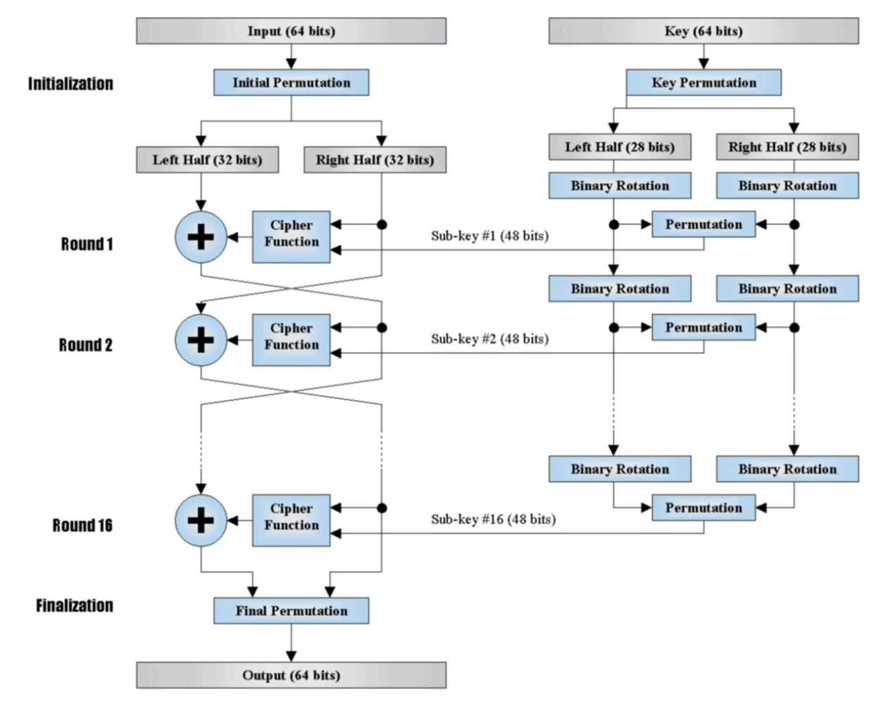
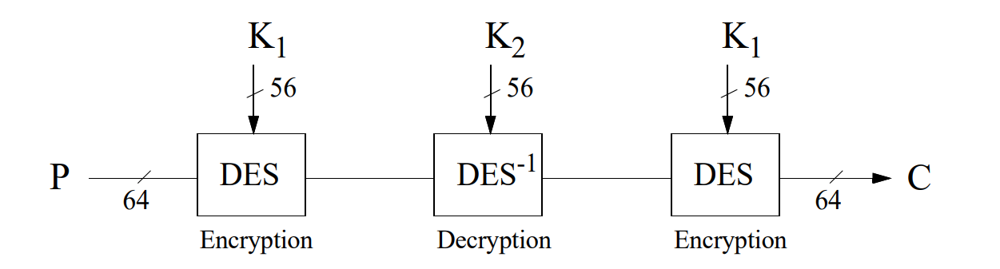

## Vue d'ensemble

**Cryptographie symétrique** = même clé **K** pour chiffrer et déchiffrer.

| | Stream Ciphers | Block Ciphers |
|---|---|---|
| Unité chiffrée | 1 bit | bloc de n bits (≥128) |
| Vitesse | très rapide, "on the fly" | plus lourd, mais très sûr |
| Exemples | RC4, LFSR | DES, 3DES, AES |
| Usage typique | streaming, WiFi | stockage, protocoles réseau |

---

## Cryptage en chaîne (*Stream Ciphers*)

### Principe

**Stream cipher** : famille de cryptosystèmes où le bloc chiffré = **1 bit**.

Deux phases :

1. **Génération** du *keystream* $z_i$ (dépend de la clé **k**).
2. **Substitution** : combinaison du plaintext $m_i$ avec $z_i$ (souvent un **xor** $\oplus$).

::: {.callout-tip title="Intuition"}

Exemple canonique : le **one-time pad**. Génération = aléatoire pur, substitution = xor.

:::

### Caractéristiques

🔴 **Avantages** : rapidité (registres), faible coût CPU, pas de mémoire/buffering, propagation d'erreurs limitée/absente (retransmission suffisante → adapté au WiFi).

🟠 **Inconvénients** : robustesse = qualité du *randomness* du keystream ; la **réutilisation du keystream** casse la sécurité (cf. one-time pad).

### Synchrones vs Asynchrones

| | Synchrone | Asynchrone (self-synchronizing) |
|---|---|---|
| Keystream dépend de | clé **k** seule | clé **k** + **t** ciphertexts précédents |
| Formule | $\sigma_{i+1}=f(\sigma_i,k)$, $z_i=g(\sigma_i,k)$, $c_i=h(z_i,m_i)$ | $\sigma_i=(c_{i-t},\ldots,c_{i-1})$, $z_i=g(\sigma_i,k)$, $c_i=h(z_i,m_i)$ |
| Synchronisation | requise (même état émetteur/récepteur) | auto-synchronisation via buffer |
| Propagation d'erreurs | aucune | limitée à la taille du buffer **t** |
| Attaques actives (insert./suppr.) | non détectées directement | mieux détectées (propagation) |
| Diffusion statistique du plaintext | faible | forte → utile si entropie du plaintext limitée |

::: {.callout-warning title="Piège"}

Synchrone = pas de propagation d'erreur MAIS suppression d'un ciphertext → désynchronisation. Asynchrone = propagation limitée au buffer, mais auto-récupération possible.

:::

**Stream cipher additif** (cas synchrone le plus fréquent) : $c_i = m_i \oplus z_i$, keystream produit par un générateur pseudo-aléatoire piloté par **k**.

### Générateurs de keystream

**LFSR** (*Linear Feedback Shift Register*) : génère un keystream long (**m** bits) à partir d'une clé courte (**l** bits, $l \ll m$).

- adapté au hardware ;
- longues périodes, bonne randomness apparente ;
- basé sur combinaisons linéaires.

🟠 Sécurité insuffisante seule (surtout usage militaire historique) → mesurée par la **complexité linéaire**, calculable via l'algorithme de **Berlekamp-Massey**.

**Solution** : remplacer la combinaison linéaire par une fonction non linéaire **f** → **NLFSR** (Non Linear Feedback Shift Register), plus robuste.

### RC4

- Créé en 1987 (Ron Rivest, RSA Security), **clé variable**, 10× plus rapide que DES.
- Mode **synchrone** : keystream indépendant du plaintext/ciphertext.
- Cœur : **S-box** 8×8 = permutation des valeurs 0–255, fonction de la clé $0 < len(k) \le 255$.
- Chiffrement final : $c_i = m_i \oplus z_i$ (xor avec keystream).
- Deux étapes :

| Étape | Rôle |
|---|---|
| **KSA** (Key Scheduling Algorithm) | remplit la S-box à partir de la clé |
| **PRGA** (Pseudo Random Generator Algorithm) | génère le keystream à partir de la S-box |

::: {.callout-warning title="Piège"}

RC4 est **cassé en pratique** : failles majeures dans le *key scheduling* et le PRGA, exploitées notamment contre le protocole **WiFi WEP**.

:::

---

## Cryptage par blocs (*Block Ciphers*)

### Définition

Un **block cipher** = fonction **bijective** $\{0,1\}^n \to \{0,1\}^n$ paramétrée par une clé de **k** bits (**n** = taille nominale). Chaque clé ↔ une bijection différente.

### Critères de qualité

| Critère | Exigence |
|---|---|
| Entropie de la clé | équiprobable, ≥ 128 bits (résistance brute-force) |
| Performances | vitesse d'exécution |
| Taille du bloc | ≥ 128 bits (évite les attaques par dictionnaire) |
| Résistance cryptanalytique | robuste aux attaques linéaires/différentielles/meet-in-the-middle, effort ≈ brute force |

### Modes d'opération

| Mode | Plaintexts identiques → | Propagation d'erreurs | Parallélisable | Particularité |
|---|---|---|---|---|
| **ECB** | ciphertexts identiques | aucune (blocs indépendants) | oui | faible (patterns visibles) |
| **CBC** | ciphertexts différents (si IV change) | erreur sur $c_j$ affecte $c_j$ et $c_{j+1}$ | non (chaînage) | efface les patterns du plaintext |
| **CFB** | différents (si IV change) | erreur sur $n/r$ ciphertexts suivants | non | fonctionne comme stream cipher **asynchrone** (keystream dépend des ciphertexts précédents) |
| **OFB** | différents (si IV change) | aucune | non (keystream séquentiel) | fonctionne comme stream cipher **synchrone** (keystream = f(clé, IV) seul) |
| **CTR** | différents (compteur change) | aucune | **oui** (accès aléatoire) | keystream = chiffrement d'un compteur incrémenté ; ne jamais réutiliser un compteur |

::: {.callout-warning title="Piège"}

Ne pas confondre CFB (asynchrone, dépend des ciphertexts) et OFB (synchrone, dépend seulement de clé + IV). Pour OFB et CTR : **changer l'IV/compteur** si la clé reste identique, sous peine de réutiliser le keystream.

:::

### Product Ciphers & Feistel Ciphers

**Product cipher** : combinaison successive de transpositions, substitutions, xors, etc.

**Feistel cipher** : product cipher itératif. Plaintext $(L_0,R_0)$ de $2t$ bits → ciphertext $(R_r,L_r)$ après **r** étapes.

$$
L_i = R_{i-1} \qquad R_i = L_{i-1} \oplus f(R_{i-1}, K_i)
$$

- chaque étape est une bijection (inversible) ;
- sous-clés $K_i$ dérivées de **K**, différentes à chaque étape ;
- **r** pair, $\ge 3$ (DES : 16 étapes) ;
- **décryption** = même processus, sous-clés en ordre inverse ($K_r \to K_1$).

### DES (Data Encryption Standard)

| Propriété | Valeur |
|---|---|
| Type | Feistel cipher |
| Taille de bloc | 64 bits |
| Taille de clé effective | 56 bits (64 bits avec parité) |
| Étapes | 16, sous-clés de 48 bits |
| Modes compatibles | ECB, CBC, CFB, OFB |

**Fonction interne (par étape)** : Expansion **E** (32→48 bits) → xor avec sous-clé → **8 S-boxes** (48→32 bits) → permutation **P**. Encadré par les permutations initiale/finale **IP**/**IP⁻¹** sur les 64 bits.

::: {.callout-warning title="Piège"}

**DES n'est pas un groupe** pour la composition : $E_{K_2}(E_{K_1}(x)) \ne E_{K_3}(x)$ en général. C'est ce qui justifie que le **Triple DES** augmente réellement la sécurité (sinon la recherche exhaustive suffirait quel que soit le nombre d'exécutions).

:::

**Clés faibles** : $K$ faible si $E_K(E_K(x))=x$ ; paire **mi-faible** si $E_{K_1}(E_{K_2}(x))=x$. DES : 4 clés faibles, 6 paires mi-faibles (sous-clés répétées par paires → cryptanalyse facilitée).

**Triple DES (3DES)** : Encryption-Decryption-Encryption avec 2 ou 3 clés → espace de clés $\{0,1\}^{112}$. Casse la limite brute-force de DES (24h en 1999 avec 100 000 PC), mais coût = 3× le temps de calcul de DES.

### AES (Advanced Encryption Standard)

| Propriété | Valeur |
|---|---|
| Adopté | 2001 (Daemen & Rijmen, ex-*Rijndael*) |
| Type | block cipher itératif, **pas** un Feistel cipher |
| Taille de bloc | 128 bits |
| Taille de clé | 128 / 192 / 256 bits |
| Étapes | 10 (128 bits) / +1 par +32 bits de clé (14 pour 256 bits) |
| Corps algébrique | $GF(2^8)$ (polynômes degré ≤7 sur $GF(2)$) |

**4 opérations par étape** (sur une matrice 4×4 de bytes) :

| Opération | Rôle |
|---|---|
| **ByteSub** | substitution non linéaire (S-box), résiste cryptanalyse linéaire/différentielle |
| **ShiftRow** | permutation, décalage des lignes |
| **MixColumn** | combinaison linéaire des colonnes (mult. matricielle) |
| **AddRoundKey** | xor avec la sous-clé de l'étape |

**Décryption** : opérations inverses (*InvSubBytes*, *InvShiftRows*, *InvMixColumns*) ; *AddRoundKey* est sa propre inverse (xor).

**Key Schedule** : expansion de la clé principale en matrice $4 \times 4(N_e+1)$, puis découpage en sous-clés (4 colonnes chacune).

::: {.callout-tip title="Intuition"}

AES ≈ 2× plus rapide que DES en software et théoriquement ~$10^{22}$ fois plus sûr.

:::

**Attaques connues (aucune pratique)** :

- **XSL** (Courtois-Pieprzyk) : AES ↔ système de 8000 équations quadratiques, 1600 inconnues, effort estimé $2^{100}$.
- **Related-key attacks** : résultats sur versions réduites d'AES.
- **Meet-in-the-middle bicyclique** (2015) : réduit l'effort AES-128 à $2^{126}$ (facteur 4 vs brute force) — toujours hors de portée.
- **Side-channel attacks** (cache-timing) : extraction de clé via l'implémentation (6-7 couples plaintext/ciphertext suffisent dans certains cas).
- Sécurité toujours conditionnée à une **clé d'entropie maximale** (passwords faibles = vraie faiblesse pratique, ex. WPA2).

### Cryptanalyse des block ciphers

| Technique | Type d'attaque | Principe | Coût (sur DES) |
|---|---|---|---|
| **Différentielle** | chosen plaintext | propagation des différences entre 2 plaintexts à travers les étapes | $2^{47}$ couples chosen plaintext |
| **Linéaire** | known plaintext | approximations linéaires du block cipher, analyse probabiliste | $2^{38}$ (10 % succès) à $2^{43}$ (85 %) known plaintexts |
| **Meet-in-the-middle** | known plaintext | s'applique à $y=E_{K_2}(E_{K_1}(x))$ : construit 2 listes ($2^{56}$ éléments) et cherche les collisions | $2^{57}$ opérations + $2^{56}$ stockage (≪ $2^{112}$ naïf) |

::: {.callout-warning title="Piège"}

L'efficacité des attaques linéaires/différentielles **augmente exponentiellement** quand le nombre d'étapes **diminue** — d'où l'intérêt cryptographique d'un grand nombre de rounds.

:::

---

## À retenir

- **Stream cipher** = 1 bit à la fois, génération de keystream + xor ; **synchrone** (clé seule) vs **asynchrone** (+ ciphertexts précédents, auto-synchronisation, propagation limitée au buffer).
- **LFSR/NLFSR** génèrent le keystream depuis une clé courte ; **RC4** = KSA (init S-box) + PRGA (génération), cassé en pratique (WEP).
- **Block cipher** = fonction bijective par bloc ; qualité = entropie clé + taille bloc + résistance cryptanalytique.
- **Modes** : ECB (aucun chaînage, faible), CBC (chaînage, erreur limitée à 2 blocs), CFB (asynchrone), OFB (synchrone), CTR (parallélisable, pas de propagation d'erreur).
- **Feistel cipher** : $L_i=R_{i-1}$, $R_i=L_{i-1}\oplus f(R_{i-1},K_i)$ — DES en est un exemple (16 étapes, clé 56 bits) ; **DES n'est pas un groupe** → justifie 3DES.
- **AES** : pas un Feistel cipher, 128 bits de bloc, $GF(2^8)$, 4 opérations par étape (ByteSub, ShiftRow, MixColumn, AddRoundKey), 10 à 14 étapes selon la clé.
- **Cryptanalyse** : différentielle (chosen plaintext), linéaire (known plaintext, la plus puissante en pratique), meet-in-the-middle (attaque les compositions $E_{K_2}(E_{K_1}(x))$).
