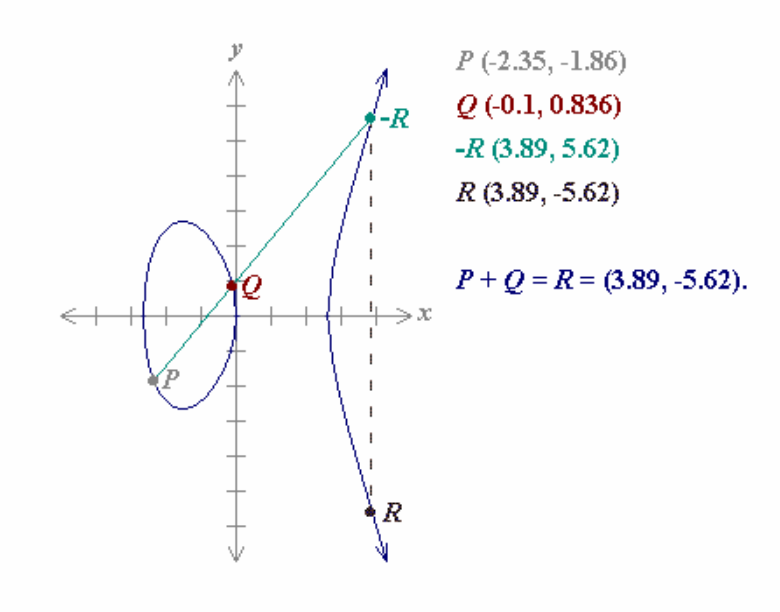
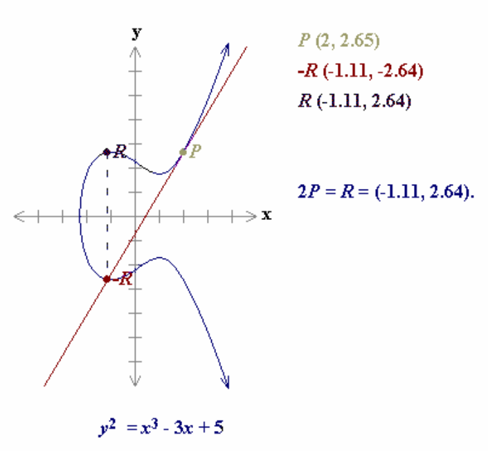

## Aperçu

- Fondements Mathématiques
- Problèmes de Référence
- Factorisation
- Algorithme de Chiffrement RSA
- Algorithme de Chiffrement ElGamal
- Algorithme de Chiffrement Rabin
- Courbes Elliptiques

## Fondements Mathématiques

- **Theorème Fondamental de l'Arithmétique:**

  Tout nombre entier strictement positif n s'écrit de façon unique (à l'ordre près) comme un produit de puissances de nombres premiers $p_i$ distincts, à savoir:

  $$n = p_1^{e1} \cdot p_2^{e2} \cdot p_3^{e3} \cdot \ldots \cdot p_m^{em}$$

- **Fonction Phi d'Euler**:

  Soit $n \in Z^+$, la **fonction phi d'Euler $\Phi(n)$** est égale au nombre de d'entiers positifs plus petits que n qui sont relativement premiers à n.

- Calcul de la **valeur** de la fonction **phi d'Euler $\Phi(n)$:**

  D'après le théorème fondamental de l'arthmétique, tout nombre entier n>1 s'écrit:

  $$n = \prod_{i=1}^{m} p_i^{ei}$$

  alors $\Phi(n)$ se calcule:

  $$\Phi(n) = \prod_{i=1}^{m} (p_i^{ei} - p_i^{(ei-1)})$$

## Fondements Mathématiques (II)

- En particulier, si **n** s'écrit comme **n = p · q** avec **p** et **q** premiers, alors:

  $$\Phi(n) = (p - 1) \cdot (q - 1)$$

- **Théorème d'Euler**:

  Soient $n \in Z^+$ et $a \in Z$ avec pgcd (a, n) = 1, alors on a:

  $$a^{\Phi(n)} \equiv 1 \bmod n$$

- **Petit Théorème de Fermat** (cas particulier du théorème d'Euler si n est premier):

  Soient $a \in Z$ et p un nombre premier tel que p ne divise pas a, alors on a:

  $$a^{p-1} \equiv 1 \bmod p$$

  A noter que puisque p est premier, on a $\Phi(p) = p-1$.

- **Réduction des exposants mod $\Phi(n)$:**

  Si n est le produit de premiers distincts et r, s $\in Z$ t.q. $r \equiv s \bmod \Phi(n)$ alors $\forall a \in Z$:

  $$a^r \equiv a^s \bmod n$$

- **Application du Théorème d'Euler au calcul des inverses**:

  Suite au théorème d'Euler, on a que:

  $$a \, a^{\Phi(n)-1} \equiv 1 \bmod n$$

  ce qui signifie que **$a^{\Phi(n)-1}$ est l'inverse de a mod n.** En particulier, **$a^{p-2}$ est l'inverse de a mod n si p est premier.**

## Fondements Mathématiques (III)

- **Définition:** Le **groupe multiplicatif** de $Z_n$, noté $Z_n^*$ est = { $a \in Z_n$ t.q. **pgcd(a,n) = 1**}.

  En particulier, si **n** est **premier:** $Z_n^* = \{ a \text{ t.q. } 1 \le a \le n-1 \}$

- Le **nombre d'éléments** ou **ordre** du **groupe multiplicatif** $Z_n^*$ est $\Phi(n)$ (par déf. de $\Phi$).

- **Définition**: Soit $a \in Z_n$, l'**ordre** de **a** est le plus petit entier positif **t** pour lequel:

  $$a^t \equiv 1 \bmod n$$

- **Définition**: Soit $\alpha \in Z_n^*$, si l'ordre de $\alpha$ est $\Phi(n)$, alors $\alpha$ est un **générateur** de $Z_n^*$.

  Lorsqu'un groupe $Z_n^*$ a un générateur, on dit qu'il est **cyclique**.

- **Propriétés des générateurs**:
  - $Z_n^*$ a un générateur ssi. **n = 2, 4, $p^k$ ou $2p^k$**, avec **p premier, p ≠ 2 et k ≥ 1**.

    En particulier, si p est premier, $Z_p^*$ a un générateur.
  - Si $\alpha$ est un générateur de $Z_n^*$, alors tous les éléments de $Z_n^*$ s'écrivent:

    $$Z_n^* = \{ \alpha^i \bmod n \text{ t.q } 0 \le i \le \Phi(n) - 1 \}$$
  - Le nombre de générateurs de $Z_n^*$ est $\Phi(\Phi(n))$.
  - $\alpha$ est un générateur de $Z_n^*$ ssi. $\forall$ **premier p** t.q. **p divise $\Phi(n)$**, on a:

    $$\alpha^{\Phi(n)/p} \ne 1 \bmod n .$$

    En particulier si **n** est un **premier** de la forme **2p + 1** avec **p premier** (un tel **n** est appelé un ***safe prime***), $\alpha$ est générateur de $Z_n^*$ ssi. $\alpha^2 \ne 1 \bmod n$ et $\alpha^p \ne 1 \bmod n$.

## Exponentiation Rapide

- ***Fast exponentiation***: En utilisant la représentation binaire d'un nombre, on peut calculer des puissances très efficacement, p.ex calcul de $2^{644} \bmod 645$:

  $$(644)_{10} = (1010000100)_2$$

  Maintenant, on calcule les exposants correspondants aux puissances de 2, soient:

  $$2 \equiv 2 \bmod 645$$
  $$2^2 \equiv 4 \bmod 645$$
  $$2^4 \equiv 16 \bmod 645$$
  $$2^8 \equiv 256 \bmod 645$$
  $$2^{16} \equiv 391 \bmod 645$$
  $$\ldots$$
  $$2^{512} \equiv 256 \bmod 645$$

  D'après la représentation binaire, on calcule:

  $$2^{644} = 2^{512+128+4} = 2^{512} \cdot 2^{128} \cdot 2^4 = 1601536 \equiv 1 \bmod 645$$

  La complexité de cet algorithme ***fast exponentiation*** est $O(\log^3 n)$.

  En s'appuyant sur le théorème d'Euler, le calcul de l'inverse d'un nombre dans un tel groupe est donc effectué en temps polynomial.

- **L'algorithme d'Euclide étendu** peut être également utilisé pour trouver un x t.q:

  $$ax \equiv 1 \bmod n$$

  puisque cette congruence s'écrit: **ax - 1 = kn** et donc:

  $$ax - kn = 1 = \text{pgcd}(a, n).$$

  La complexité de cet algorithme est également $O(\log^3 n)$.

## Théorème des Restes Chinois

- Le **Théorème des Restes Chinois** (III$^\text{e}$ siècle!) permet de résoudre des systèmes linéaires de congruences simultanées. Il résout des problèmes soulevés dans des anciens puzzles chinois. Il s'agissait, par exemple, de trouver un nombre qui produit un reste de 1 lorsqu'il est divisé par 3, de 2 lorsqu'il est divisé par 5 et de 3 lorsqu'il est divisé par 7...Il fut également utilisé pour calculer le moment exact d'alignement de plusieurs astres ayant des orbites (et donc des périodes) différentes.

- **Théorème des Restes Chinois**: Soient $n_1, n_2, \ldots, n_t \in Z^+$ premiers deux à deux (c.à.d. pgcd $(n_i,n_j) = 1$, $i \ne j$) et $a_1, a_2, \ldots, a_t \in Z$. Alors, le système de congruences:

  $$x \equiv a_1 \bmod n_1$$
  $$x \equiv a_2 \bmod n_2$$
  $$\ldots$$
  $$x \equiv a_t \bmod n_t$$

  a une solution unique x mod $N := n_1 n_2 \ldots n_t$

- **Algorithme de Gauss** (1801) pour le calcul de x:

  $$x = \sum_{i=1}^{t} a_i N_i M_i \bmod N$$

  avec $N_i = N/n_i$ et $M_i = N_i^{-1} \bmod n_i$. La complexité de cet algorithme est $O(\log^3 n)$.

- Il est donc possible en temps polynomial de passer des congruences **mod $n_i$** et aux congruences **mod N**!

## Problèmes de Base

- **Problèmes génériques principaux**
  - **Factorisation** (FACTP): Etant donné un entier positif n, trouver sa factorisation en nombre premiers.
  - **Logarithmes discrets** (DLP): Etant donné un nombre premier p, un générateur $\alpha \in Z_p^*$ et un élément $\beta \in Z_p^*$, trouver l'entier x, $0 \le x \le p-2$, tel que: $\alpha^x \equiv \beta \bmod p$.
  - **Racine carrée dans $Z_n$ si n est composite** (SQROOTP): Etant donné un entier composite n et un résidu quadratique a, trouver la racine carrée de `a mod n`.
- **Problèmes spécifiques** (propres à un système de cryptage):
  - **RSA** (RSAP): Etant donné un entier positif n = pq, un entier positif e avec $\gcd(e,(p-1)(q-1)) = 1$ et un entier c, trouver un entier m avec $m^e \equiv c \bmod n$.
  - **Diffie-Hellman** (DHP): Etant donnée un nombre premier p, un générateur $\alpha \in Z_p^*$ et les éléments $\alpha^a \bmod p$ et $\alpha^b \bmod p$, trouver $\alpha^{ab} \bmod p$.
- **Résultats prouvées**:
  - DHP $\le_p$ DLP (Equivalent sous certaines conditions^[*The Relationship Between Breaking the Diffie--Hellman Protocol and Computing Discrete Logarithms*. U. Maurer, S. Wolf. SIAM Journal of Computing, volume 28, no. 5, pages 1689-1721, 1999.])
  - RSAP $\le_p$ FACTP (Prouvé équivalent pour le problème générique, voir page 101)
  - SQROOTP $\cong_p$ FACTP

## Techniques Classiques de Factorisation

### Temps Exponentiel

Ils s'exécutent au mieux en $O(\exp(c * \ln(n)))$

- Division par essais
- Crible d'Ératosthène (IIe siècle av. J.-C.)
- Méthode de différence de carrés de Fermat (~1650)
- Square Form Factorization (1971)
- Méthode p-1 de Pollard (1974)
- Méthode Rho de Pollard (1975)

### Temps Sous-exponentiel

Ils s'exécutent au mieux en $O(\exp(c * (\ln(n))^{1/3}))$

- Fractions continues (1975)
- Crible quadratique (1981)
- Crible du corps de nombres - NFS (1990)
- Crible général du corps de nombres - GNFS (2006)

### Méthodes en Temps Polynomial

- Algorithme de Shor sur un ordinateur quantique (1994) s'exécute en $O(\log^c n)$

## Factorisation : Nouveaux Développements

- L'ordinateur spécifique à but NFS de Bernstein^[Daniel J. Bernstein. *Circuits for Integer Factorization: a Proposal* (October 2001)] qui (selon ses hypothèses) factorise un nombre de 1536 bits dans le même temps qu'un calcul sur 512 bits effectué sur une machine conventionnelle exécutant NFS.

- Lenstra et al.^[Lenstra, Shamir et al. *Analysis of Bernstein's Factorization Circuit*. June 2002] affirment que le « facteur de Bernstein devrait être ramené à 1,17 », mais soutiennent qu'une machine de factorisation d'un jour pour un nombre de 1024 bits peut être construite pour quelques milliers de dollars sous certaines hypothèses optimistes.

- Pour en savoir plus sur la controverse Bernstein - Lenstra, Shamir, voir `http://cr.yp.to/nfscircuit.html`

- La plus grande factorisation de nombre à ce jour (2020) utilisant NFS est RSA-829 (un nombre de 250 chiffres)^[Zimmermann, Paul (February 28, 2020). "*Factorization of RSA-250*". cado-nfs-discuss (Mailing list).]. Un temps de calcul total de *2700 core-years*, en utilisant des *Intel Xeon Gold 6130 CPUs* comme référence (2,1 GHz).

- Factorisation sur un ordinateur quantique
  - Problèmes importants pour construire la machine (erreurs, dispersion, etc.)
  - I. Chuang (IBM, Almaden) construit un ordinateur à 7 *qubits* (décembre 2001)
  - Travaux en cours: faisabilité d'un ordinateur comportant des millions de *qubits*...?

## Procédé d'Encryption/Decryption de RSA^[*A Method for Obtaining Digital Signatures and Public Key Cryptosystems*. R.Rivest, A.Shamir and L.M. Adleman. Communications of tha ACM 21 (1978), 120-126]

### Génération des clés

- Chaque entité (**A**) crée une paire de clés (publique et privée) comme suit:
  - A choisit la taille du **modulus n** (p.ex. taille (n) = 1024 ou taille (n) = 2048).
  - A génère deux nombres premiers **p** et **q** de grande taille (~ n/2).
  - A calcule **n := pq** et $\Phi(n) = (p-1)(q-1)$.
  - A génère l'exposant d'encryption **e**, avec $1 < e < \Phi(n)$ t.q. **pgcd (e, $\Phi(n)$) = 1**.
  - A calcule l'exposant de decryption **d**, t.q.: $ed \equiv 1 \bmod \Phi(n)$ avec l'algorithme d'Euclide étendu ou avec l'algorithme *fast exponentiation* (page 94).
  - Le couple **(n,e)** est la **clé publique** de A; **d** est la **clé privée** de A.

### Encryption

- L'entité **B** obtient **(n,e),** la clé publique authentique de **A**.
- **B** transforme son plaintext en une série d'entiers $m_i$, t.q. $m_i \in [0, n-1] \; \forall i$.
- **B** calcule le ciphertext $c_i := m_i^e \bmod n$, $\forall i$ avec l'algorithme *fast exponentiation*.
- **B** envoie à **A** tous les ciphertext $c_i$.

### Decryption

- **A** utilise sa clé privée pour calculer les plaintexts $m_i = c_i^d \bmod n$.

## Preuve de RSA

- Soit **m** le plaintext et **c** le ciphertext avec $c := m^e \bmod n$, il s'agit de prouver:

  $$m \equiv c^d \bmod n$$

  En substituant c par sa valeur on obtient:

  $$c^d \bmod n = m^{ed} \bmod n \quad (*)$$

  mais, on sait que:

  $$ed \equiv 1 \bmod \Phi(n)$$

  et donc par définition des congruences, il existe un entier k avec:

  $$ed - 1 = k\Phi(n)$$

  en substituant dans (*):

  $$(c^d \equiv m^{k\Phi(n)+1} \equiv m^{k\Phi(n)} m) \bmod n$$

  Si **pgcd (m,n) = 1**, on a par le théorème d'Euler:

  $$1 \equiv m^{\Phi(n)} \bmod n$$

  donc:

  $$(c^d \equiv m^{k\Phi(n)} m \equiv m) \bmod n \qquad \text{c.q.f.d.!}$$

  Si **pgcd (m,n) ≠ 1**, **m** est nécessairement multiple de **p** ou de **q** (cas très peu probable...), on peut montrer en faisant les calculs **mod p** et **mod q** que la congruence reste vraie.

## RSA: Sécurité

- Le problème **RSAP** (page 96) consistant à trouver **m** à partir de **c** n'est pas prouvé comme étant aussi difficile que la factorisation mais...:

- ... on peut prouver que si on trouve **d** on peut facilement calculer **p** et **q**. Ceci équivaut à dire que factoriser **n** et trouver **d** nécessitent un effort de calcul équivalent.

- On sait que les méthodes les plus rapides pour factoriser (page 97) ont une complexité *sub-exponentielle* ($\sim O(\exp(c * (\ln(n))^{1/3}))$). Le problème reste donc calculatoirement impossible pour des modulus ≥ 1048 bits (2048 bits est un choix fréquent pour uns sécurité durable...).

- Afin d'améliorer la vitesse d'encryption, on a tendance à choisir des exposants **e** assez petits (typiquement: **e := 3, e:=17 et e:=19**). On a cependant prouvé que le calcul d'une *i-ème racine* (avec **i** petit) modulo un composite **n** peut être nettement plus facile que la factorisation de **n**^[*Breaking RSA May Not Be Equivalent to Factoring*. D. Boneh et R. Venkatesan. Advances in Cryptology - EUROCRYPT '98.]. Par contre, en 2008 on a prouvé que **la résolution générique du problème RSA est équivalent à la factorisation**.^[*Breaking RSA Generically is Equivalent to Factoring.* D. Aggarwal and U. Maurer. CRYPTO 2008 Rump Session.]

- L'exposant de decryption **d** doit impérativement être de grande taille^[*Cryptanalysis of short RSA secret exponents*. M.J Wiener. IEEE transactions on Information Theory (1990), 553-558.] (au moins la moitié de la taille de n) pour garantir la sécurité du système.

- Par conséquent, **l'encryption est normalement nettement plus rapide que la decryption** puisque les exposants utilisés sont beaucoup plus petits!

## RSA: Attaques

- Lors qu'on souhaite encrypter le même message pour un groupe de correspondants, il convient d'introduire des variations (*randomization*) avant l'encryption pour éviter l'attaque suivant:

  Admettons qu'on calcule des ciphertexts $c_1,c_2,c_3$ à partir du même plaintext m et du même exposant **e:=3** adressés à trois entités avec des modulus: $n_1, n_2, n_3$.

  Le *Théorème des Restes Chinois* nous dit qu'il existe une solution **x mod $n_1n_2n_3$**, t.q.:

  $$x \equiv c_1 \bmod n_1, \qquad x \equiv c_2 \bmod n_2 \qquad x \equiv c_3 \bmod n_3$$

  Mais si **m** ne change pas pour les trois encryptions, on a que $x = m^3 \bmod n_1n_2n_3$ et, de plus: $m^3 < n_1n_2,n_3$. On peut, donc, trouver **m** en calculant la **racine cubique entière** de $m^3$, en sachant que pour ce calcul il existe des algorithmes efficaces!

- Plus généralement, si $m < n^{1/e}$, on peut appliquer des algorithmes rapides (dans **Z**) pour calculer les **racines e-ièmes** de $m^e$. Il convient donc d'effectuer des opérations de "*randomization*" de **m** avant d'encrypter!

- La propriété multiplicative de RSA: $(m_1m_2)^e \equiv m_1^e m_2^e \equiv c_1 c_2 \bmod n$ donne lieu à des failles dangereuses (voir signatures aveugles).

- En admettant que les paramètres sont correctement choisis et que l'implantation n'a pas de failles, la méthode la plus efficace pour "casser" l'algorithme générique RSA reste la factorisation de n.

## Procédé d'Encryption/Decryption d'ElGamal^[*A Public Key Cryptosystem and a Signature Scheme Based on Discrete Logaithms*. T. ElGamal. Advances in Cryptology-Proceedings of CRYPTO 84 (LNCS 196), 10-18, 1985.]

### Génération des clés

- Chaque entité (**A**) crée une paire de clés (publique et privée) comme suit:
  - A génère un nombre premier **p** de grande taille ($\text{len}(p) \ge 1024$ **bits**) et un générateur $\alpha$ du groupe multiplicatif $Z_p^*$.
  - A génère un nombre aléatoire **a**, t.q. $1 \le a \le p-2$ et calcule $\alpha^a \bmod p$.
  - La clé publique de A est **(p, $\alpha$, $\alpha^a \bmod p$)**, la clé privée de A est **a**.

### Encryption

- L'entité **B** obtient **(p, $\alpha$, $\alpha^a \bmod p$),** la clé publique authentique de **A**.
- **B** transforme son plaintext en une série d'entiers $m_i$, t.q. $m_i \in [0, p-1] \; \forall i$.
- Pour chaque message $m_i$:
  - **B** génère un nombre aléatoire unique **k**, t.q. $1 \le k \le p-2$.
  - **B** calcule $\lambda := \alpha^k \bmod p$ et $\delta := m_i (\alpha^a)^k \bmod p$ et envoie le ciphertext $c := (\lambda,\delta)$.

### Decryption

- **A** utilise sa clé privée **a** pour calculer $\lambda^{p-1-a} \bmod p$ (à noter que: $\lambda^{p-1-a} \equiv \lambda^{-a} \equiv \alpha^{-ak} \bmod p$).
- **A** retrouve le plaintext en calculant: $(\alpha^{-ak}) \, \delta \bmod p.$

## Procédé d'ElGamal: Remarques

- La preuve que la decryption fonctionne est évidente en substituant $\delta$ par sa valeur:

  $$(\alpha^{-ak}) \, \delta \bmod p \equiv (\alpha^{-ak}) \, m \, (\alpha^a)^k \bmod p \equiv m \bmod p.$$

- Le procédé d'ElGamal se base sur la difficulté de calculer des logarithmes discrets modulo un nombre premier (voir problème **DLP** en page 96) même s'il n'a pas été prouvé qu'il soit strictement équivalent à ce problème.

- Les algorithmes les plus efficaces connus à cette date ont une complexité *sub-exponentielle* très proche de celle de la factorisation (on utilise souvent les mêmes algorithmes...)

- Les exposants choisis **(k,a)** doivent être de grande taille car il existe des algorithmes efficaces pour calculer des logarithmes discrets modulo un nombre premier lorsque l'exposant est petit (*baby-step giant-step algorithm*^[Algorithm by D.Shanks appearing in: *The Art of Computer Programming-Fundamental Algorithms*. D.E Knuth. Volume 1. Addison Wesley 1973.])

- Un inconvénient d'ElGamal est qu'il multiplie par 2 la longueur du ciphertext.

- Il est essentiel pour la sécurité du procédé que le nombre aléatoire **k ne soit pas répété,** autrement: soient $(\lambda_1,\delta_1)$ et $(\lambda_2,\delta_2)$ les deux ciphertext générés, on a que $\delta_1/\delta_2 = m_1/m_2$ et par conséquent, il est trivial de retrouver un plaintext à partir de l'autre...

- Le procédé d'ElGamal peut se généraliser à d'autres groupes comme **$GF(2^n)$** ou les courbes elliptiques (voir page 111).

## Procédé d'Encryption/Decryption de Rabin^[*Digitalized Signatures and Public Key Functions as Intractable as Factorization.* M.O.Rabin. MIT/LCS/TR 212. MIT Laboratory for Computer Science 1979.]

### Génération des clés

- Chaque entité (**A**) crée une paire de clés (publique et privée) comme suit:
  - A génère deux nombres premiers aléatoires **p** et **q** de grande taille ($\text{len}(pq) \ge 1024$).
  - A calcule **n := pq**.
  - La clé publique de A est **n**, la clé privée de A est **(p,q)**.

### Encryption

- L'entité **B** obtient **n,** la clé publique authentique de **A**.
- **B** transforme son plaintext en une série d'entiers $m_i$, t.q. $m_i \in [0, n-1] \; \forall i$.
- **B** calcule $c_i = m_i^2 \bmod n$ pour chaque message $m_i$.
- **B** envoie tous les ciphertext $c_i$ à **A**.

### Decryption

- **A** utilise sa clé privée **(p,q)** pour retrouver les **4 solutions** de l'équation: $c_i = x^2 \bmod n$ en utilisant des algorithmes efficaces pour calculer des racines carrées **mod p** et **mod q**.
- **A** détermine soit par une indication supplémentaire de **B**, soit par une analyse de redondance lequel des 4 messages $m_1, m_2, m_3, m_4$ est le plaintext original.

## Procédé de Rabin: Remarques

- Le procédé de Rabin est basé sur l'impossibilité de trouver des racines carrées modulo un composite de factorisation inconnue (problème **SQROOTP**, voir page 96).

- L'intérêt principal de cet algorithme réside dans le fait qu'il a été prouvé comme étant équivalent à la factorisation (SQROOTP $\cong$ FACTP). Cet algorithme appartient donc à la catégorie ***provably secure* pour toute attaque passive**.

- Les **attaques actives** peuvent, dans certains cas, compromettre la sécurité de l'algorithme. Plus précisément, si on monte l'attaque *chosen ciphertext* (on demande à A de decrypter un ciphertext choisi) suivant:
  - L'attaquant **M** génère un **m** et envoie à **A** le ciphertext $c = m^2 \bmod n$.
  - **A** répond avec une racine $m_x$ parmi les 4 possibles $m_1, m_2, m_3, m_4$.
  - Si $m \equiv \pm m_x \bmod n$ (probabilité 0.5), **M** recommence avec un nouveau **m**.
  - Sinon, **A** calcule **pgcd $(m - m_x, n)$** et obtient ainsi un des deux facteurs de **n**...

- Cette attaque pourrait être évitée si le procédé exigeait une redondance suffisante dans les plaintexts permettant à A d'identifier sans ambiguïté laquelle des solutions possibles est le plaintext original. Dans ce cas, A répondrait toujours **m** et jetterait les autres solutions n'ayant pas le niveau de redondance préétabli.

## Courbes Elliptiques^[Source de toutes les images sur les courbes elliptiques: `https://www.certicom.com/en/ecc-tutorial`]

- Une **courbe elliptique** est un ensemble de points **E** défini par l'équation:

  $$y^2 = x^3 + ax + b$$

  avec x, y, a et b des nombres **rationnels**, **entiers** ou **entiers modulo m** (m > 1). L'ensemble E contient également un ¨**point à l'infini**¨ noté $\infty$. Le point $\infty$ n'est pas dans la courbe mais il est l'élément identité de E.

- On choisira pour nos calculs les courbes elliptiques n'ayant pas de racines multiples ou, en d'autres termes, des courbes où le discriminant $4a^3 + 27b^2 \ne 0.$

## Courbes Elliptiques: Addition

- Soit $P := (x, y) \in E$, on définit **-P** comme **-P := (x, -y)**. Graphiquement, **-P** est le point symétrique de **P** par rapport à l'axe des **x**. A noter que **P + (-P) = $\infty$**.

- Soient deux points $P, Q \in E$, tels que $Q \ne -P$, on définit l'addition **P + Q := R** où $R \in E$ t.q. **-R** est le 3$^\text{e}$ point d'intersection entre la courbe et la droite qui passe par **P** et **Q**:

- L'ensemble E avec $\infty$ définit un **groupe commutatif** pour l'addition.

## Courbes Elliptiques: Multiplication par un Scalaire

- Soit $P \in E$, le point **2P = R**, t.q. **-R** est le point d'intersection de la courbe avec la droite tangente à la courbe au point P.

- Lorsque la courbe elliptique est définie sur le corps $Z_p$ avec **p** un nombre premier de grande taille ($y^2 \equiv x^3 + ax+ b \bmod p$), le calcul de $k \in Z_p$ t.q. **Q = kP** avec **(P, Q)** connus, est très difficile (nécessite un effort exponentiel...). Ce problème est connu comme: **Elliptic Curve Discrete Logarithm Problem (ECDLP)**

## Courbes Elliptiques: Remarques

- L'avantage principal de la cryptographie publique basée sur des courbes elliptiques est que la taille des nombres utilisés (et donc, des clés) est plus petite.

- Ceci est dû à la complexité accrue des calculs sur $E_p$ (courbe elliptique définie sur le corps $Z_p$) par rapport aux corps habituels tels que $Z_p$ ou $GF(2^m)$.

- Ce tableau montre les rapports des tailles des clés par rapport à celles de RSA:

- La représentation d'un plaintext en points de la courbe reste une opération complexe.

- En Octobre 2003^[`http://www.certicom.com/index.php?action=company,press_archive&view=175`], la *US National Security Agency* (NSA) a acheté un brevet de *Certicom* pour l'utilisation de la cryptographie à courbes elliptiques.

- En Septembre 2013 Claus Diem montré^[`http://www.math.uni-leipzig.de/~diem/preprints/dlp-ell-curves-II.pdf`] que sous certaines condtitions le problème **ECDLP** pouvait être resolu en temps *sub-exponentiel*.

## Procédé d'ElGamal sur des Courbes Elliptiques

### Génération des clés

- Chaque entité (**A**) crée une paire de clés (publique et privée) comme suit:
  - A choisit une courbe elliptique $E_p$ avec **p,** un nombre premier de grande taille ($\text{len}(p) \sim 200$ **bits**) et un point $P_o \in E_p$.
  - A génère un nombre aléatoire **a**, t.q. $1 < a < p$ et calcule $P_a = aP_o$ (multiplication par un scalaire sur $E_p$, pour laquelle, il existe des algorithmes efficaces).
  - La clé publique de A est **($E_p$, $P_o$, $P_a$)**, la clé privée de A est **a**.

### Encryption

- L'entité **B** obtient **($E_p$, $P_o$, $P_a$),** la clé publique authentique de **A**.
- **B** transforme son plaintext en une série d'entiers $m_i$, t.q. $m_i \in E_p \; \forall i$.
- Pour chaque message $m_i$:
  - **B** génère un nombre aléatoire unique **k**, t.q. $1 < k < p$.
  - **B** calcule $\lambda := kP_o$ et $\delta := kP_a + m_i$ et envoie le ciphertext $c := (\lambda,\delta)$.

### Decryption

- **A** utilise sa clé privée **a** pour calculer: $a\lambda = akP_o = kP_a$ .
- **A** retrouve le plaintext en calculant: $\delta - kP_a = kP_a + m_i - kP_a = m_i.$
- La sécurité du schéma s'appuie sur **ECDLP**!

## Tableau Récapitulatif^[*Next Generation Security for Wireless.* S.A Vanstone, 2004. `http://www.compseconline.com/hottopics/hottopic20_8/Next.pdf`]

| Système à clé publique | Problème mathématique | Exemples |
|---|---|---|
| Factorisation d'entiers | Étant donné un nombre n, trouver ses facteurs premiers | RSA, Rabin-Williams |
| Logarithme discret | Étant donné un nombre premier n, et des nombres g et h, trouver x tel que $h = g^x \bmod n$ | ElGamal, Diffie-Hellman, DSA |
| Logarithme discret sur courbe elliptique | Étant donné une courbe elliptique E et des points P et Q sur E, trouver x tel que Q = xP | EC-Diffie-Hellman, ECDSA |

| Système à clé publique | Meilleures méthodes connues pour résoudre le problème mathématique | Temps d'exécution |
|---|---|---|
| Factorisation d'entiers | Number field sieve: $\exp(1.923 (\log n)^{1/3}(\log \log n)^{2/3})$ | Sous-exponentiel |
| Logarithme discret | Number field sieve: $\exp(1.923 (\log n)^{1/3}(\log \log n)^{2/3})$ | Sous-exponentiel |
| Logarithme discret sur courbe elliptique | Pollard-rho algorithm: racine carrée de n | Pleinement exponentiel |
