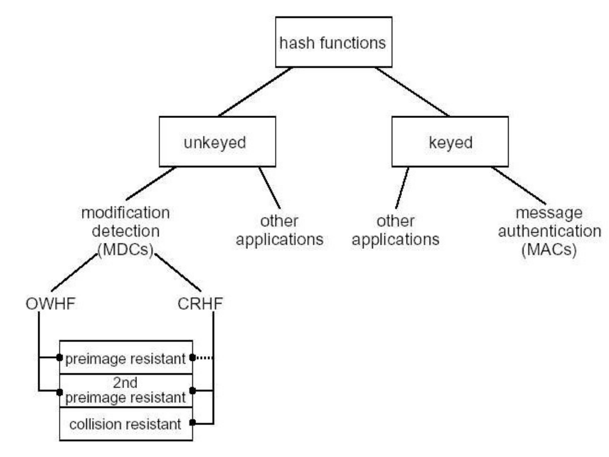
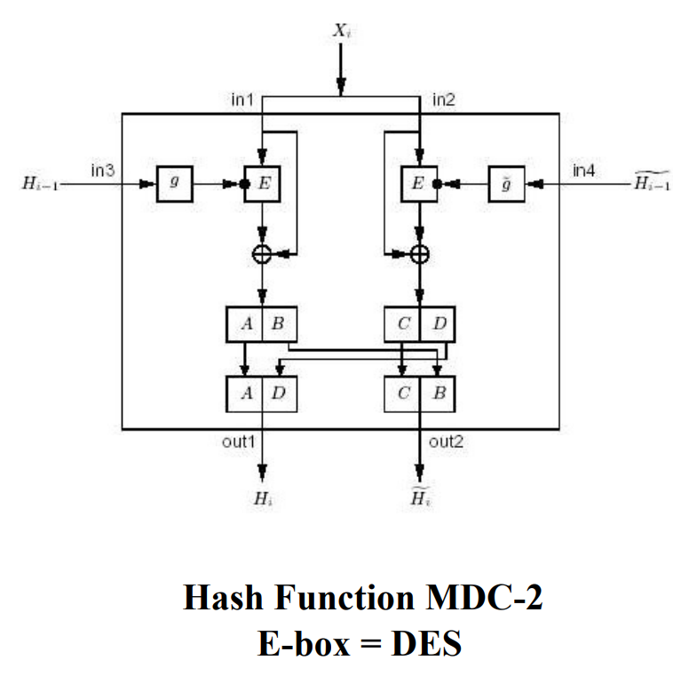
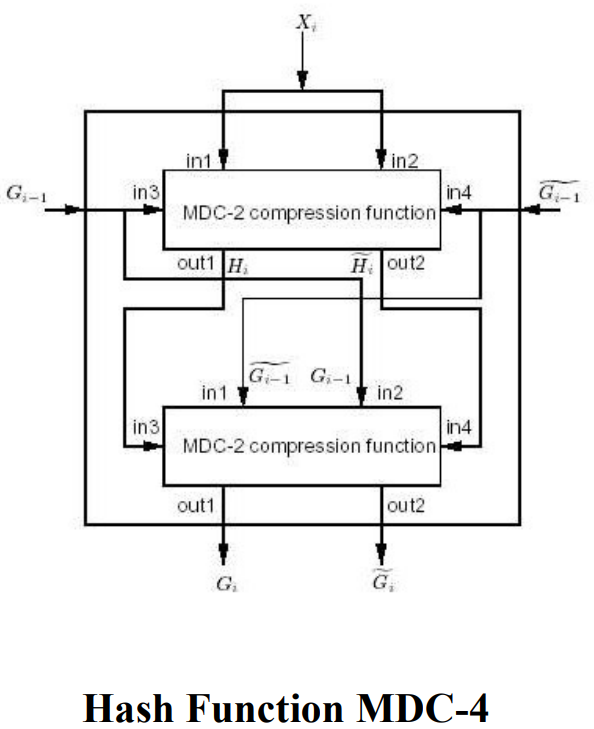
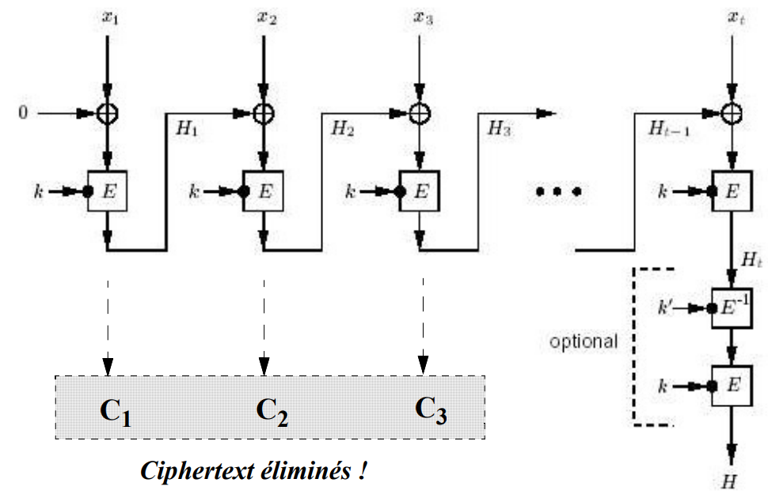
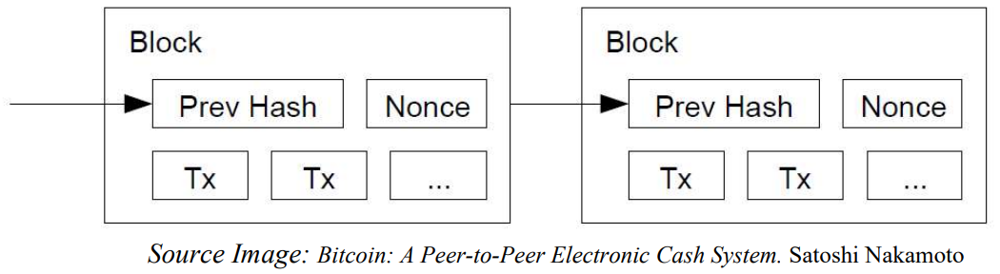
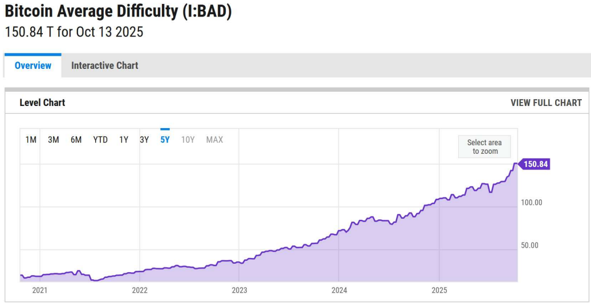
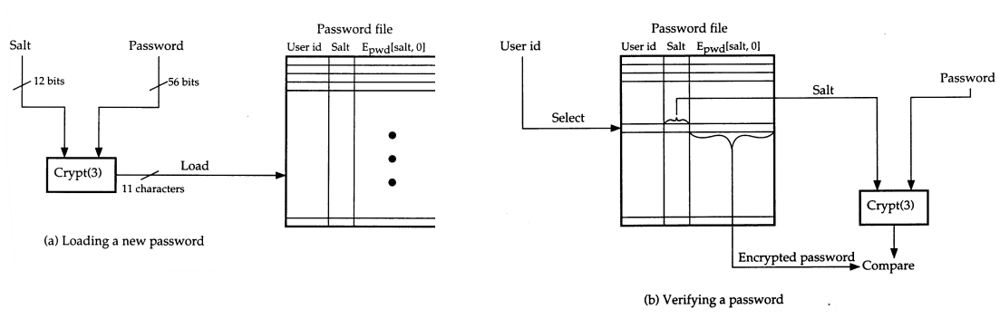
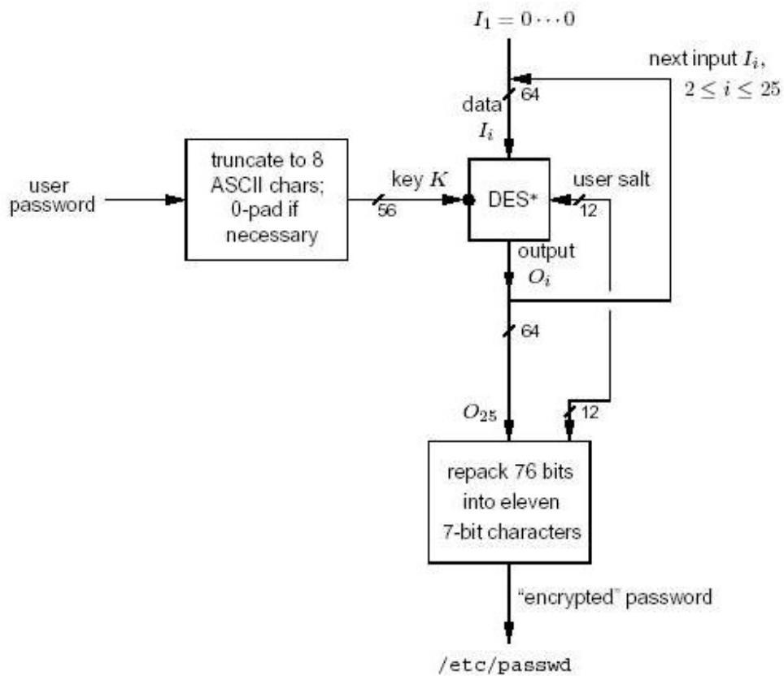

## Hashes and MACs — Plan

- *Fonctions à sens unique* (*one-way functions*)
- Fonction de hachage : définition et classification
- Fonctions de hachage sans clé (MDCs)
    - MDCs basées sur des algorithmes cryptographiques
    - MDCs personnalisées (MD5, SHAx)
- Fonctions de hachage à clé (MACs)
- Applications
- *Fonctions de hachage randomisées* : exemple UNIX

## Fonctions à sens unique

- Une fonction f est dite à sens unique (**one-way function** ou **OWF**) si $\forall x \in X$ on peut facilement calculer $f(x) = y$ mais pour la grande majorité des $y \in Y$ il est calculatoirement impossible de trouver un $x$ tq. $f(x) = y$.
- Exemples :
    - calcul des carrées modulo un composite :

      $$f(x) = x^2 \mod n \text{ avec } n = pq \text{ (p et q inconnus)}$$

      est une one-way function car l'inverse est difficile (voir le problème de base SQROOTP).
    - on peut construire une one-way function sur la base de DES ou de n'importe quel autre système de cryptage à blocs E comme suit :

      $$y = f(x) = E_k(x) \oplus x, \text{ avec } k \text{ une clé fixée et connue}$$

      on peut considérer que $E_k(x) \oplus x$ a un comportement (pseudo) aléatoire par construction de E. Le calcul de l'inverse revient à trouver un $x$ t.q. :

      $$x = E_k^{-1}(x \oplus y)$$

      ce qui est considéré difficile avec les propriétés de E.

      A noter que $f(x) = E_k(x)$ ne suffirait pas pour en faire une OWF car, en connaissant la clé, DES est réversible.

## Fonctions de hachage : définitions

- Une fonction de hachage (**hash function**) est une fonction h ayant les propriétés suivantes :
    - **compression** : la fonction h fait correspondre à un ensemble X composée par des chaînes de bits de longueur finie mais arbitraire, un ensemble Y composé par des chaînes de bits de longueur finie et fixée (et normalement inférieur à la taille de X) avec $h(x) = y$, et $x \in X, y \in Y$.
    - **facile à calculer** : partant de h et $x \in X$, $h(x)$ est facile à calculer.
- Une hash function est dite « à clé » (**keyed hash function**) si une clé intervient dans le calcul de la fct. ($h_k(x) = y$) ; sinon on l'appelle « sans clé » (**unkeyed hash function**).
- Les hash functions ont des nombreuses applications informatiques dont l'archivage structuré facilitant la recherche. Coté sécurité nous allons étudier deux catégories principales :
    - codes détecteurs d'altérations (**manipulation detection codes (MDC)** or *message integrity codes (MIC)*) : ce sont des *unkeyed functions* permettant de fournir un service d'intégrité sous certaines conditions. Le résultat d'une telle fonction est appelée *MDC-value* ou, simplement, *digest*.
    - codes d'authentification de message (**message authentication codes ou MAC**) qui sont des *keyed functions* permettant d'authentifier la source du message et d'assurer son intégrité sans utiliser des mécanismes (cryptage) additionnels.

## Fonctions de hachage : définitions (II)

- Quelques propriétés de base des hash functions :
    - 1) *preimage resistance* : étant donné un $y \in Y$, il est calculatoirement impossible de trouver une pré-image $x \in X$ satisfaisant $h(x) = y$.
    - 2) *2ⁿᵈ-preimage resistance* : étant donné un $x \in X$ et son image $y \in Y$, avec $h(x) = y$, il est calculatoirement impossible de trouver un $x' \neq x$ tel que $h(x) = h(x')$. Aussi appelée *weak collision resistance*.
    - 3) *collision résistance* : il est calculatoirement impossible de trouver deux pré-images $x, x' \in X$ distinctes pour lesquels $h(x) = h(x')$ (pas de restriction sur le choix des valeurs). Aussi appelée *strong collision resistance*.
- Une fonction de hachage à sens unique (**one way hash function ou OWHF**) est un MDC satisfaisant l) et 2). Aussi appelée : *weak one-way hash function*.
- Une fonction de hachage résistante aux collisions (**collision resistant hash function ou CRHF**) est un MDC satisfaisant le propriétés 2) et 3). (A noter que 3) $\Rightarrow$ 2)). Aussi appelée : *strong one-way hash function*.
- OWF $\not\Rightarrow$ OWHF : A noter qu'une OWHF en tant que hash function impose des restrictions supplémentaires sur les domaines sources et image ainsi que sur la 2nd-*preimage resistance* qui ne sont pas forcement respectés par des OWFs.
    - Exemple : $f(x) = x^2 \mod n$ avec $n = pq$ (p et q inconnus) n'est pas une OWHF car étant donné $x$, $-x$ est une collision triviale.

## Message Authentication Codes (MAC)

- Un **Message Authentication Code (MAC)** est une famille de fonctions $h_k$ paramétrisées par une clé secrète k ayant les propriétés suivantes :
    - 1) **compression** : comme pour les fonctions de hash génériques mais appliqué à $h_k$.
    - 2) **facile à calculer** : à partir d'une fonction $h_k$, et d'une clé connue k, on peut facilement calculer $h_k(x)$. Le résultat est appelée un *MAC-value* ou, simplement, un *MAC*.
    - 3) **résistance calculatoire** (*computation-resistance*) : sans connaissance de la clé symétrique k, il est (calculatoirement) impossible de calculer des paires $(x, h_k(x))$ à partir de 0 ou plusieurs paires connus $(x_i, h_k(x_i))$ pour tout $x \neq x_i$.
- La propriété 3) implique que les paires $(x_i, h_k(x_i))$ ne peuvent non plus servir à calculer la clé k (*key non-recovery*). Cependant la propriété *key non-recovery* n'implique pas *computation-resistance* car des attaques *chosen/known-plaintext* pourraient mener à des paires $(x, h_k(x))$ falsifiées.
- L'impossibilité de calculer des paires $(x, h_k(x))$ se traduit également en *preimage* et *collision resistance* (cf. transparent précédent) pour toute entité ne possédant pas la clé k.

## *Hash Functions* : Schéma Récapitulatif



*(Source [Men97])*

## Attaques sur des MDCs : 2ⁿᵈ preimage résistance

- Problème : étant donné $h(x) = y$, trouver $x'$ tq. $h(x') = h(x)$.
- Exemple pratique : on a un texte avec un *digest* associé portant une signature digitale ; on veut créer un faux texte portant la même signature (sans avoir le contrôle sur le texte original). Quelles sont nos chances d'un point de vue probabiliste ?
- Soit une hash function h avec n sorties possibles et une valeur donnée $h(x)$. Si h est appliquée à k valeurs aléatoires, quelle doit être la valeur de k pour que la probabilité d'avoir au moins un $y$ tq. $h(x) = h(y)$ soit 0.5 ?
- Pour la première valeur de y, la probabilité que $h(x) = h(y)$ est $1/n$. Inversement, la probabilité que $h(x) \neq h(y)$ est $1 - 1/n$. Pour k valeurs, la probabilité de n'avoir aucune collision est de : $(1 - 1/n)^k$, soit :

$$\left(1 - \frac{1}{n}\right)^k = 1 - k\frac{1}{n} + \binom{k}{2}\frac{1}{n^2} - \binom{k}{3}\frac{1}{n^3} + \dots$$

  ce qui pour n très grand peut être approché par $1 - k/n$. Par conséquent, la probabilité complémentaire d'avoir au moins une collision est d'environ $k/n$ ; c'est qui nous donne $k = n/2$ pour une probabilité de 0.5.
- Conclusion : pour un digest de m-bits, le nombre d'essais nécessaires à trouver un $y$ tq. $h(x) = h(y)$ avec une probabilité de 0.5 est $2^{m-1}$.

## Attaques sur des MDCs : collision résistance

- Problème : trouver deux valeurs $x, x'$ distincts t.q. $h(x) = h(x')$.
- Exemple pratique : On doit faire signer un texte à quelqu'un et on veut appliquer cette signature à un texte falsifié (on contrôle le texte original). Quelles sont nos chances de trouver deux textes originaux satisfaisant ce critère ?

![*Exemple d'une lettre falsifiée en $2^{37}$ variations (source [Sta95])*](qmd_images/lettre_falsifiee.png)

## *Birthday Paradox* : Fondement Mathématique

- Le *birthday paradox* est un problème probabiliste classique qui montre que dans une réunion de 23 personnes seulement, on a déjà une chance sur deux d'avoir deux personnes ayant leur anniversaire le même jour.
- Soit $y_1, y_2, \dots, y_n$ toutes les sorties possibles d'une hash function. Combien des $h(x_i) : h(x_1), h(x_2), \dots, h(x_k)$ devons nous calculer pour avoir une probabilité de collision égale ou supérieure à 0.5 ?
- Le premier choix pour $h(x_1)$ est arbitraire ($prob = 1$), le deuxième $h(x_2) \neq h(x_1)$ a une probabilité de $1 - 1/n$, le troisième de $1 - 2/n$, etc. Ce qui nous donne une probabilité de ne pas avoir des collisions égale à :

$$P_{no-collision} = \prod_{i=1}^{k-1}\left(1 - \frac{i}{n}\right)$$

  On prouve facilement (développement en série de $e^{-x}$) que pour $0 \le x \le 1 : 1 - x \le e^{-x}$ et donc :

$$P_{no-coll} = \prod_{i=1}^{k-1}\left(1 - \frac{i}{n}\right) \le \prod_{i=1}^{k-1} e^{-\frac{i}{n}} = e^{\frac{-k(k-1)}{2n}}$$

## *Birthday Paradox* : Fondement Mathématique (II)

La probabilité d'avoir au moins une collision est $P_{au-moins1} = 1 - P_{no-coll}$, soit :

$$P_{au-moins1} \ge 1 - e^{\frac{-k(k-1)}{2n}}$$

Pour connaître la valeur de k pour laquelle $P_{au-moins1}$ est plus grand que 0.5, il suffit de calculer :

$$\frac{1}{2} = 1 - e^{\frac{-k(k-1)}{2n}}$$

Si k est grand, on remplace $k(k-1)$ par $k^2$ et on obtient après des calculs simples :

$$k = \sqrt{2(\ln 2)n} \cong 1{,}17\sqrt{n} \approx \sqrt{n}$$

- En prenant n = 365 pour l'anniversaire, on obtient $k = 22.3$, ce qui confirme l'énoncé du problème
- Conséquence pour les hash functions : Soit une hash function avec $2^m$ sorties possibles. Si h est appliqué à $k = 2^{m/2}$ entrées on a une probabilité supérieure à 0.5 d'obtenir $h(x_i) = h(x_j)$

## Résistance Calculatoire Théorique des Hash Functions : Récapitulation

| Type de Hash Fct. | Caractéristique | Difficulté Calculatoire | But de l'attaque | Taille conseillée du digest/clé |
|---|---|---|---|---|
| OWHF | *preimage resistance* | $2^n$ | trouver une pré-image | $n \ge 80$ bits |
| OWHF | *2ⁿᵈ-preimage résistance* | $2^{n-1}$ | trouver $x'$ avec $h(x') = h(x)$ | $n \ge 80$ bits |
| CRHF | *collision resistance* | $2^{n/2}$ | trouver une collision | $n \ge 160$ bits |
| MAC | *key non-recovery* | $2^t$ | trouver la clé | $n \ge 80$ |
| MAC | *computation resistance* | $\min(2^t, 2^n)$ | produire un $(x, h_k(x))$ | $t \ge 80$ |

- n : taille du *MDC-value* ou du *MAC-value* résultant de l'application de la *hash function*
- t : taille de la clé du MAC

## Modèle de fonctionnement générique des MDCs


*(Source [Men97])*

## MDCs Basées sur des Systèmes de Cryptage

- Idée : utiliser un système de cryptage symétrique connu pour construire un MDC.
- Problèmes à résoudre :
    - il faut « casser » la réversibilité des algorithmes symétriques pour en faire des OWHF ou des CRHF.
    - La « largeur nominale » de certains systèmes de cryptage (eg. DES) est de 64 bits, ce qui n'est pas suffisant pour construire des CRHF.
- Principe de fonctionnement :
    - les blocs de texte sont séquentiellement traités par la « boîte » de cryptage.
    - la compression se base sur des opérations de chaînage avec les blocs résultant des itérations précédentes et des fonctions logiques (fondamentalement XOR). Ceci rend également le procédé irréversible.
    - Si nécessaire, n boîtes de cryptage seront combinées pour obtenir des longueurs de *digests* n fois supérieures à la largeur nominale des boîtes utilisées.
- Attention : la sécurité de ces algorithmes est fortement dépendante des propriétés des boîtes de cryptage sous-jacents.
- Exemples :
    - Les modèles de *Matyas-Meyer-Oseas*, *Davies-Meyer* et *Miyaguchi-Preneel*.
    - MDC-2 et MDC-4 utilisant respectivement 2 et 4 boîtes DES. *Digest* = 128 bits.

## MDCs Basées sur des Systèmes de Cryptage : Modèles Génériques


**Matyas-Meyer-Oseas** — **Davies-Meyer** — **Miyaguchi-Preneel**

*(source [Men97])*

## Exemples (II) : MDC-2 et MDC-4

::: {layout-ncol=2}



:::

*(Source [Men97])*

## Customized MDCs

- Il s'agit de fonctions conçues exclusivement pour générer des codes d'intégrité (des *digests*) avec un soucis principal de vitesse et sécurité.
- Leur fonctionnement se base sur les éléments suivants :
    - des opérations d'initialisation (*padding* + rajouter la longueur).
    - un ensemble de constantes prédéfinies choisies spécialement pour augmenter la dispersion.
    - un ensemble « d'étapes » (*rounds*) qui vont séquentiellement s'appliquer a tous les blocs des données originaux. Ces rounds vont effectuer une combinaison d'opérations logiques et des rotations sur les données et les constantes.
    - des opérations de chaînage impliquant les sorties des *rounds* précédents.
- Dans ces fonctions, chaque bit du *digest* est une fonction de chaque bit des entrées.
- Les plus connues sont :
    - MD5 : R. Rivest, 1992 ; RFC 1321. *Digest* = 128 bits. Cassé !
    - SHA-0 : NIST, 1993. *Digest* = 160 bits. Collisions en $2^{39}$ opérations au lieu de $2^{80}$
    - SHA-1 : NIST, 1995. *Digest* = 160 bits. Révision de SHA-0 avec rotation de bits additionnelle. Collisions en $2^{63}$ opérations (au lieu de $2^{80}$).
    - SHA-2 : NIST (FIPS 190-3). Comprend : SHA-224, SHA-256, SHA-384 et SHA-512. Les tailles du digest vont de 224 à 512 bits.
    - SHA-3 : *Keccak* Algorithm (taille du digest variable de 224 à 512 bits)

## *Hash Functions* : Derniers Développements

- X.Wang et al.^1^ culminent en 2004 un long travail visant à trouver des collisions dans l'algorithme MD5. Ils publient deux paires de collisions pour des messages de 1024 bits.
- En 2005, X.Wang et al.^2^ prouvent dans la conférence CRYPTO'05 que le nombre d'opérations nécessaires pour trouver des collisions sur SHA-1 (standard actuel pour les fonctions de hashage sécurisées) est seulement de $2^{63}$.
- Ces attaques ont pour cible la recherche de collisions arbitraires mais lors de CRYPTO'06 des chercheurs de l'Université de Graz en Autriche^3^ proposent une méthode pour contrôler partiellement le contenu des collisions.
- En Décembre 2008^4^ on montre qu'on peut générer des collisions contrôlées sur MD5 et créer ainsi une Certification Authority illicite permettant des forger des certificats acceptés par n'importe quel browser.
- Ces résultats s'appuient sur des approches analytiques (par opposition au *brute force*!)
- Le processus de sélection de successeur de SHA-1 est semblable à celui ayant désigné AES comme standard de cryptage en blocs. Le NIST a décidé (Octobre 2012) que Keccak serait l'algorithme de base pour **SHA-3**.

::: {.callout-note title="Références"}
1. X.Wang et al. *Collisions for Hash Functions MD4, MD5, HAVAL-128 and RIPEMD*. http://eprint.iacr.org/2004/199.pdf.
2. X.Wang et al. *Finding Collisions in the Full SHA-1.* Advances in Cryptology. Crypto'05
3. C. Cannière et al. *SHA-1 collisions : Partial meaningful at no extra cost?* Ramp Sessions CRYPTO'06.
4. M. Stevens et al. *Short Chosen-Prefix Collisions for MD5 and the Creation of Rogue CA Certificate.* CRYPTO'09
:::

## *Secure Hash Algorithm* : Vue d'Ensemble

![*(Source [Sta95])*](qmd_images/sha_vue_ensemble.png)

## SHA-0 : Détails de Fonctionnement

![*(Source [Sta95])*](qmd_images/sha0_details.png)

| $t$ | $K_t$ | $f_t(b,c,d)$ |
|---|---|---|
| $0 \le t \le 19$ | $K_t := \text{5A827999}$ | $f_t(b,c,d) := (b \cdot c)\ U\ (\bar{b} \cdot d)$ |
| $20 \le t \le 39$ | $K_t := \text{6ED9EBA1}$ | $f_t(b,c,d) := b \oplus c \oplus d$ |
| $40 \le t \le 59$ | $K_t := \text{8F1BBCDC}$ | $f_t(b,c,d) := (b \cdot c)\ U\ (b \cdot d)\ U\ (c \cdot d)$ |
| $60 \le t \le 79$ | $K_t := \text{CA62C1D6}$ | $f_t(b,c,d) := b \oplus c \oplus d$ |

Les blocs de text $W_t$ se calculent : $W_t := W_{t-16} \oplus W_{t-14} \oplus W_{t-8} \oplus W_{t-3}$

## MACs basés sur des Systèmes de Cryptage

- Algorithme CBC-MAC basé sur DES-CBC avec $IV = 0$ et élimination des *ciphertext* intermédiaires
- longueur de clé = 56 bits (112 en cas d'utilisation de la partie optionnelle)
- Longueur du *MAC-value* = 64 bits



*(Source [Men97])*

## Nested MACs et HMACs

- Un **Nested MAC** ou **NMAC** est une composition de 2 familles de fonctions MACs G et H paramètrès par les clés k et l tel que :

  $$G \circ H = \{ g \circ h \text{ avec } g \in G \text{ et } h \in H \} \text{ avec } g \circ h_{(k,l)}(x) = g_k(h_l(x))$$

- La sécurité d'un NMAC dépend de deux critères :
    - La famille de fonctions G est résistante aux collisions.
    - La famille de fonctions H est résistante aux attaques spécifiques pour MACs, i.e. :

      Il est impossible de trouver un couple $(x,y)$ et une clé m fixée mais inconnue, telle que : $MAC_m(x) = y$.
- Un **HMAC** (FIPS 198, 2002) est un Nested MAC utilisant à la base des MDCs sans clé dédiées comme SHA-1 ou SHA-256.
- Un HMAC utilise deux constantes de 512 bits dénommés *ipad* et *opad* telles que :

  $$opad := 363636\dots36 \quad \text{et} \quad ipad := 5C5C5C\dots5C$$

  et une clé k de 512 bits.
- Le schéma de fonctionnement de HMAC-256 (sur la base de SHA-256) est le suivant :

  $$HMAC\text{-}256_k(x) := SHA\text{-}256\big((k \oplus opad)\ ||\ SHA\text{-}256((k \oplus ipad)\ ||\ x)\big)$$

- Les HMACs sont les MACs les plus utilisés. Les attaques mentionnées sur les fonctions de la famille SHA sont plus difficiles à réaliser sur un HMAC par cause de la clé k.

## Applications des Hash Functions : Intégrité


**MAC Seul :** — **MDC + Encryption :** — **MDC + canal authentique :**

*(Source [Men97])*

## Application des Hash Functions : Blockchains

- Les transactions bitcoin sont publiées et visibles par tous les intervenants. Elles sont encapsulées dans des **blocs** chaînés à l'aide de fonctions de hachage cryptographiques
- Le **minage** (*mining*) consiste à rajouter itérativement des nouveaux blocs contenant les transactions courantes
- La génération d'un bloc valable nécessite la **résolution d'un *puzzle cryptographique (proof of work)*** très coûteux en temps de calcul (trouver des *pseudo-collisions* dans les fonctions de hachage cryptographiques). La validation reste très efficace
- Le premier mineur capable de générer un bloc valable recevra une récompense monétaire (en bitcoins). Le processus de minage est ouvert à tous les mineurs mais seul le premier est récompensé
- La chaine de blocs résultante (**blockchain**) devient alors un registre publique (*public ledger*), décentralisé et immuable protégeant toutes les transactions passées. La falsification/modification des données protégées par la *blockchain* nécessiterait un effort calculatoire supérieur à celui effectué par tous les mineurs *honnêtes*



## Blockchain : *Proof of Work*

**Statistiques Bitcoin 13/10/2025** *(source http://ycharts.com)* :

- *Difficulty* : **150.84 T**
- *Target* : $2^{224}$ / *Difficulty* = $\sim 2^{177}$. Le digest valable pour générer un bloc doit être **inférieur à $2^{177}$**, ce qui signifie une ***pseudo-collision sur les 79 bits de poids plus fort***. La variation sur les inputs dépend du *nonce*
- *Hashrate* : $\sim$ **1.1 ZH/sec** ($1.1 \times 10^{21}$ hashes/sec)
- Fonctions de hachage exécutées pour obtenir un bloc : $\sim$ **660 $\times$ 10²¹**
- Temps moyen de génération d'un bloc : **10 min**



## Autres Applications de Hash Functions

- Authentification :
    - *data origin authentication* (DOA)
    - *transaction authentication* (= DOA + *time-variant parameters*)
- *Virus checking*
    - Le créateur d'un logiciel crée un digest = $h(x)$ avec x étant l'original et le distribue par un canal sûr (eg. CD-ROM).
- Distribution des clés publiques
    - Permet de contrôler l'authenticité d'une clé publique.
- *Timestamp* sur un document :
    - Le document sur lequel on veut effectuer le timestamp est d'abord soumis à une hash function. Le timestamp (avec la signature de l'entité correspondante) s'applique alors seulement au digest.
- *One-time password (S-Key)* (mécanisme d'identification)
    - A partir d'un *seed* secret $x_0$, on crée une chaîne de hash-values : $x_1 = h(x_0)$, $x_2 = h(x_1)$, ... $x_n = h(x_{n-1})$.
    - Le système mémorise $x_n$ et l'utilsateur rentre $x_{n-1}$. Si $h(x_{n-1}) == x_n$ => OK.
    - Le système mémorise alors $x_{n-1}$ et ainsi de suite.

## *Randomized Hash Functions* (l'exemple UNIX) I

- UNIX garde ses mots de passe dans un fichier globalement accessible (ou éventuellement distribué par NIS)
- L'information stockée correspond au résultat produit par une hash function.
- Exemple (fictif) :

```
root:Jw87u9bebeb9i:0:1:Operator:/:/bin/csh
pp:1Qhw.oihEtHK6:359:355:PP:/net/spp_telecom/pp:/bin/cs
```

- Problèmes :
    - la hash function étant déterministe, elle produit le même résultat pour des mots de passe identiques.
    - on pourrait créer des « cahiers » (*codebooks*) contenant le résultat de l'application de la hash function à des entrées données (p.ex. un dictionnaire) et les comparer facilement (*off-line*) avec les chaînes stockées par UNIX (*brute force dictionnary attack*).
- Solution :
    - Rajouter un élément (pseudo) aléatoire de 12 bits différent pour chaque mot de passe (appelé *salt*) avant de calculer la hash function et lors de la vérification.
    - Cet élément permet de rajouter un facteur aléatoire de 4096 possibilités pour chaque mot de passe et de prévenir la détection des duplications.

## *Randomized Hash Functions* (l'exemple UNIX) II



*(Source [Sta95])*

## *Randomized Hash Functions* (l'exemple UNIX) III



*(Source [Men97])*
