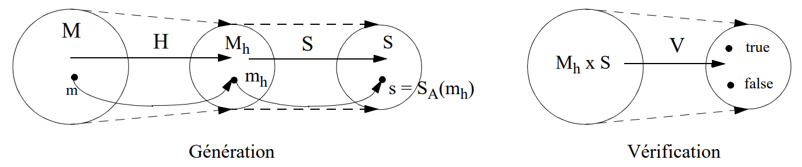
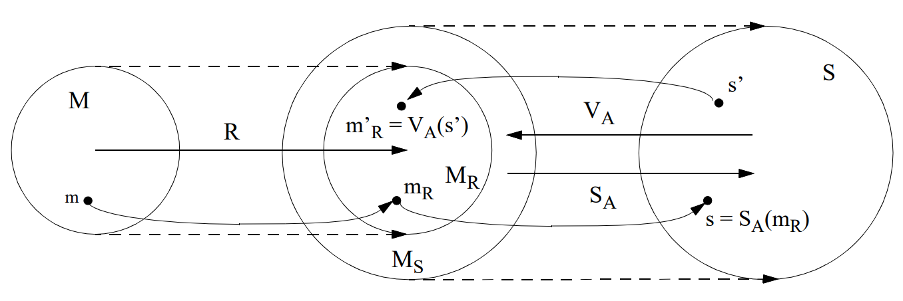
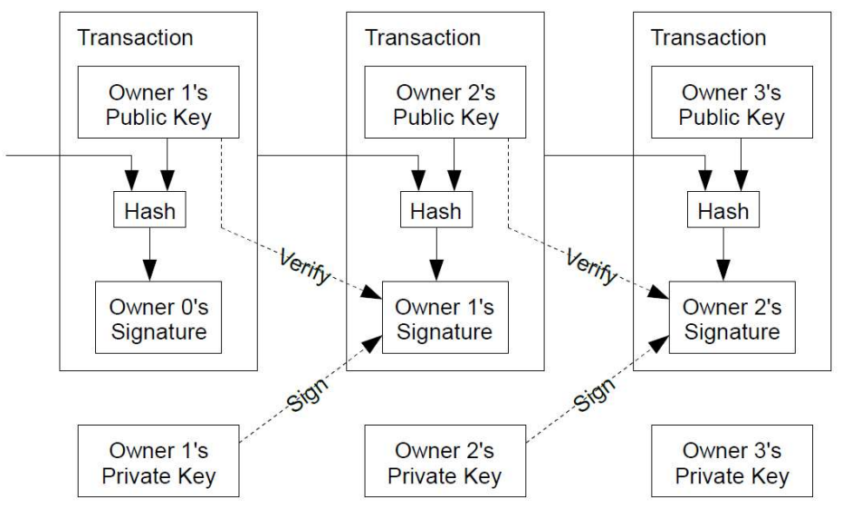

## Signatures Digitales : Plan

* Définitions
* Signatures Digitales avec Appendice
* Signatures Digitales avec Reconstitution du Message
* Procédé de Signature RSA
* Procédé de Signature Rabin
* Procédé de Signature ElGamal
* Signatures Digitales et Crypto-monnaies
* Attaques sur les Signatures Digitales

## Signatures Digitales : Définitions

* *Signature digitale*: chaîne de données permettant d'associer un message (sous forme digitale) à une entité d'origine.
* *Schéma de signature digitale*: algorithme de génération + algorithme de vérification.
* *Procédé de signature*: formatage du message + algorithme de génération de signature
* *Procédé de vérification*: algorithme de vérification + (reconstruction du message).
* Classification des signatures digitales:
    * *Signatures digitales avec appendice* qui nécessitent la présence du message original pour vérifier la validité de la signature. Ce sont les plus couramment utilisées. Exemples: *ElGamal*, *DSS*.
    * *Signatures digitales avec reconstitution du message* qui offrent, en plus, la possibilité de reconstruire le message à partir de la signature. Exemples: *RSA*, *Rabin*.
* Les signatures digitales sont pour la plupart basées sur la crypto asymétrique du fait que la notion clé partagée n'est pas adaptée aux besoins d'identifier une entité de façon explicite.
* Des engagements semblables à ceux obtenus par une signature à clé publique (comme la non-répudiation d'origine) peuvent cependant être obtenus avec la technologie symétrique et des tierces de confiance (*Trusted Third Parties* ou *TTP*). Ces méthodes sont nommées: *arbitrated digital signatures*.

## Signatures Digitales avec Appendice : Cadre Formel

* On admet que chaque entité a une clé privée pour signer des messages et une copie authentique des clés publiques des correspondants.

**Notation:**

* $M$: Espace de messages
* $M_h$: $m_h = H(m)$ avec $m \in M$, $m_h \in M_h$ et $H$ une *hash function*
* $S$: Espace des valeurs pouvant être obtenues par un procédé de signature

**Description:**

Chaque entité définit une appl. injective $S_A : M_h \to S$ ; (ie. la *signature*)

L'application $S_A$ donne lieu à une application $V_A$:

$$V_A: M_h \times S \to \{\text{vrai}, \text{faux}\}$$ ; (ie. la *vérification*)

t.q. $\forall\ m_h \in M_h, s \in S$, on a:

$$V_A(m_h, s) = \text{vrai si } S_A(m_h) = s \text{ et}$$
$$V_A(m_h, s) = \text{faux sinon}$$

Les opérations $S_A$ nécessitent la clé *privée* de A alors que les opérations $V_A$ utilisent la clé *publique* de A.

* Quelques propriétés simples:
    - Les opérations $S_A$ et $V_A$ doivent être faciles à calculer (en ayant les clés corresp.)
    - Il est impossible (calculatoirement) pour une entité n'ayant pas la clé privée de A de trouver un $m'$ et un $s'$ avec $m' \in M$ et $s' \in S$ t.q. $V_A(m'_h, s') = \text{vrai}$ avec $m'_h = H(m')$.

## SD avec reconstitution du message : Cadre Formel

**Notation**: en plus des définitions précédentes, on a:

* $M_s$: L'espace des éléments sur lesquels peut s'appliquer une signature.
* $R$: Une application injective: $M \to M_s$, appelée *fonction de redondance*. Elle doit être *inversible* et *publique*.
* $M_R$: $M_R = \text{Im}(R)$

**Description**:

Chaque entité définit une appl. injective $S_A : M_S \to S$ ; (ie. la *signature*)

L'application $S_A$ donne lieu à une application $V_A$: ; (ie. la *vérification*)

$$V_A : S \to M_s \text{, t.q. } V_A \circ S_A = \text{Identité sur } M_s$$

A noter que la vérification s'effectue sans la clé privée de A

**Génération de signature**:

(1) Calculer $m_R = R(m)$ et $s = S_A(m_R)$

(2) Rendre publique $s$ en tant que signature de A sur $m$. Ceci permet aux autres entités de vérifier la signature et reconstituer $m$.

**Vérification**:

(1) Calculer $m_R = V_A(s)$ (avec la clé publique de A)

(2) Vérifier que $m_R \in M_R$ (sinon rejeter la signature)

(3) Reconstituer $m$ en calculant: $R^{-1}(m_R)$

## Signatures Digitales : Appendice et Reconstitution

## SD avec reconstitution du message : Propriétés

* Propriétés:
    - Les opérations $S_A$ et $V_A$ doivent être faciles à calculer (en ayant les clés corresp.)
    - Il est impossible (calculatoirement) pour une entité n'ayant pas la clé privée de A de trouver un $s' \in S$ t.q. $V_A(s') \notin M_R$
* Remarques sur la fonction de redondance:
    * Le choix d'une fonction de redondance est essentiel pour la sécurité du système.
    * Si $M_R = M_S$ et $R$ et $S_A$ sont des bijections respectivement de $M$ dans $M_R$ et de $M_S$ dans $S$, alors $M$ et $S$ ont une taille identique et, par conséquent, il est trivial de forger des messages portant la signature de A.
* Exemple de fonction de redondance: soit $M = \{m: m \in \{0,1\}^n\}$ (n taille du message) et $M_S = \{t: t \in \{0,1\}^{2n}\}$. Soit $R : M \to M_S$ t.q. $R(m) = m \| m$ ( $\|$ étant la concaténation de 2 messages). La probabilité de tomber sur un tel message en essayant de forger un message à partir d'une signature est de : $|M_R| / |M_S| = (1/2)^n$, ce qui est négligeable pour des grands messages.
* Attention!: Une fonction de redondance adaptée pour un schéma de signature digitale peut provoquer des failles dans un autre différent !

## Procédé de Signature de RSA[^rsa]

[^rsa]: *A Method for Obtaining Digital Signatures and Public Key Cryptosystems*. R.Rivest, A.Shamir and L.M. Adleman. Communications of tha ACM 21 (1978), 120-126

**Génération des clés**

* Chaque entité (**A**) crée une paire de clés (publique et privée) comme suit:
    * **A** choisit la taille du **modulus n** (p.ex. taille (n) = 1024 ou taille (n) = 2048).
    * **A** génère deux nombres premiers **p** et **q** de grande taille ($\sim n/2$).
    * **A** calcule $n := pq$ et $\Phi(n) = (p-1)(q-1)$.
    * **A** génère l'exposant de vérification **e**, avec $1 < e < \Phi(n)$ t.q. $\text{pgcd}(e, \Phi(n)) = 1$.
    * **A** calcule l'exposant de signature **d**, t.q.: $ed \equiv 1 \bmod \Phi(n)$ avec l'algorithme d'Euclide étendu ou avec l'algorithme *fast exponentiation* (page 94).
    * Le couple **(n,e)** est la **clé de publique** de A; **d** est la **clé privée** de A.

**Signature**

* **A** calcule la fonction de redondance du message **m**: $m_R := R(m)$.
* **A** calcule la signature: $s := m_R^{\ d} \bmod n$ et envoie **s** à **B**.

**Vérification**

* L'entité **B** obtient **(n,e),** la clé publique authentique de **A**.
* B calcule $m'_R = s^e \bmod n$, vérifie $m'_R \in M_R$ et rejette la signature si $m'_R \notin M_R$.
* B retrouve le message correctement signé par **A** en calculant: $m = R^{-1}(m'_R)$.

## Signature RSA : Remarques

* La preuve de fonctionnement est identique à celle du procédé d'encryption (page 99). L'ordre d'exponentiation n'a pas d'influence puisque:

$$ed \equiv de \equiv 1 \bmod \Phi(n)$$

* Le procédé peut également être utilisé pour produire des signatures avec appendice avec les modifications suivantes:

**Signature**:

* A utilise une fonction de hachage **H** et calcule $m_h := H(m)$.
* A calcule la signature de $m_h$: $s := m_h^{\ d} \bmod n$ et envoie le couple **(m,s)** à B.

**Vérification**

* B calcule $m'_h = s^e \bmod n$ et $H(m)$ et vérifie l'égalité $m'_h = H(m)$.
* Si l'égalité est vérifiée, **B** accepte la signature **s** de **A** sur le message **M.**

* Le calcul de signature est plus lent que la vérification à cause de différence de taille entre l'exposant **d** ($\text{taille}(d) \approx \text{taille}(\Phi(n))$) et **e**.
* Les risques et attaques mentionnés dans le procédé d'encryption (page 102) s'appliquent également pour la signature.
* Il convient de différencier les paires de clés d'encryption et de signature puisqu'elles nécessitent des politiques de stockage, sauvegarde et mise à jour distinctes.

## Signatures "Aveugles" (*Blind Signatures*)

* Schéma inventé par Chaum ([Chau82][^chau82]).
* Idée: **A** envoie une information à **B** pour signature. **B** retourne à **A** l'information signée. A partir de cette signature, **A** peut calculer la signature de **B** sur un autre message choisi à priori par **A**. Ceci permet à **A** d'avoir une signature de **B** sur un message que **B** n'a jamais vu (d'où le nom de signature aveugle...)
* En fait il s'agit d'une faille basée sur la propriété multiplicative de RSA (page 102) qui a été exploitée pour en faire un nouveau procédé de signature.
* Algorithme: Soit $S_B$ la signature de RSA de **B** avec **(n,e)** et **d**, resp. les clés publiques et privées de **B**. Soit **k** un entier fixé avec $\text{pgcd}(n,k) = 1$:

$$f: \mathbb{Z}_n \to \mathbb{Z}_n \text{ avec } f(m) = m \cdot k^e \bmod n$$ ; *blinding function*

$$g: \mathbb{Z}_n \to \mathbb{Z}_n \text{ avec } g(m) = k^{-1} \cdot m \bmod n$$ ; *unblinding function*

ce qui donne:

$$g(S_B(f(m))) = g(S_B(mk^e \bmod n)) = g(m^d k \bmod n) = m^d \bmod n = S_B(m) \quad (*)$$

* Protocole:

$$A \to B: m' = f(m)$$
$$A \leftarrow B: s' = S_B(m')$$

A calcule $g(s')$ et obtient la signature souhaitée en utilisant **(\*)**.

[^chau82]: [Chau82]: Chaum, D. *Blind Signatures for Untraceable Payments*. Crypto'82

## Procédé de Signature de Rabin[^rabin]

[^rabin]: *Digitalized Signatures and Public Key Functions as Intractable as Factorization.* M.O.Rabin. MIT/LCS/TR 212. MIT Laboratory for Computer Science 1979.

**Génération des clés**

* Chaque entité (**A**) crée une paire de clés (publique et privée) comme suit:
    * **A** génère deux nombres premiers aléatoires **p** et **q** de grande taille ($len(pq) \geq 1024$).
    * **A** calcule $n := pq$.
    * La clé publique de **A** est **n** la clé privée de **A** est **(p,q)**.

**Signature**

* **A** calcule la fonction de redondance du message **m**: $m_R := R(m)$.
* **A** utilise sa clé privée pour calculer la signature: $s := m_R^{1/2} \bmod n$ en utilisant des algorithmes efficaces pour calculer des racines carrées **mod p** et **mod q.**
* **A** envoie **s** à **B** (**s** est **une des 4** racines carrées obtenues).

**Vérification**

* L'entité **B** obtient **n,** la clé publique authentique de **A**.
* B calcule $m'_R = s^2 \bmod n$, vérifie $m'_R \in M_R$ et rejette la signature si $m'_R \notin M_R$.
* B retrouve le message correctement signé par **A** en calculant: $m = R^{-1}(m'_R)$.

## Procédé de Signature d'ElGamal[^elgamal]

[^elgamal]: *A Public Key Cryptosystem and a Signature Scheme Based on Discrete Logaithms*. T. ElGamal. Advances in Cryptology-Proceedings of CRYPTO 84 (LNCS 196), 10-18, 1985.

**Génération des clés**

* Chaque entité (**A**) crée une paire de clés (publique et privée) comme suit:
    * **A** génère un nombre premier **p** ($len(p) \geq 1024$ **bits**) et un générateur $\alpha$ de $\mathbb{Z}_p^{*}$.
    * **A** génère un nombre aléatoire **a**, t.q. $1 \leq a \leq p-2$ et calcule $y := \alpha^a \bmod p$.
    * La clé publique de **A** est $(p, \alpha, y)$, la clé privée de **A** est **a**.

**Signature**

* **A** utilise une fonction de hachage **H** et calcule $m_h := H(m).$
* **A** génère un nombre aléatoire **k** ($1 \leq k \leq p-2$ et $\text{pgcd}(k,p-1) = 1$) et calcule $k^{-1} \bmod (p-1)$
* **A** calcule $r := \alpha^k \bmod p$ et ensuite $s := k^{-1} (m_h - ar) \bmod (p-1)$
* La signature de **A** sur le message **m** est le couple **(r,s)**.

**Vérification**

* L'entité **B** obtient $(p, \alpha, \alpha^a \bmod p)$, la clé publique authentique de **A**.
* **B** vérifie que $1 \leq r \leq p-2$, sinon rejette la signature.
* **B** calcule $v_1 := y^r r^s \bmod p$.
* **B** calcule $H(m)$ et $v_2 := \alpha^{H(m)} \bmod p$
* **B** accepte la signature ssi. $v_1 = v_2$.

## Signature ElGamal : Remarques

* Preuve que le schéma fonctionne: Si $s \equiv k^{-1} (m_h - ar) \bmod (p-1)$, on a que:

$$m_h \equiv (ar + ks) \bmod (p-1) \text{ et}$$
$$v_2 = \alpha^{H(m)} \bmod p$$

si, comme on souhaite montrer $m_h = H(m)$, en réduisant les exposants **mod (p-1)** (page 92), on peut réécrire $v_2$:

$$v_2 \equiv \alpha^{ar+ks} \bmod p$$

D'autre part:

$$v_1 = y^r r^s \equiv \alpha^{ar} \alpha^{ks} \equiv \alpha^{ar+ks} \bmod p \qquad \text{c.q.f.d.}$$

* Par construction, le schéma d'ElGamal fonctionne uniquement avec appendice (résultat de l'application d'une fonction de hachage). Le schéma de Nyberg-Rueppel[^nyberg] introduit une variation permettant la reconstitution du message.
* Le *Digital Signature Algorithm* (*DSA*), approuvé par le *US National Institute of Standards and Technology* est devenu le standard de signature le plus couramment utilisé. Il est construit sur la base d'un dérivé direct du schéma d'ElGamal avec la fonction de hachage *SHA-1* (page 128).

[^nyberg]: *Message Recovery for Signature Schemes Based on the Discrete Logarithm Problem*. K. Nyberg and R.Rueppel. Designs, Codes and Cryptography, 7 1996, 61-81.

## Signatures Digitales : *Crypto-monnaies*

* La plupart des crypto-monnaies se basent sur la cryptographie asymétrique. Le *bitcoin* p.ex. utilise des signatures digitales pour authentifier ses transactions
* La dépense ou la transmission de bitcoins nécessite la signature avec la clé privée du détenteur (qui était à son tour le destinataire de la transaction précédente):

* *Bitcoin* et *Ethereum* utilisent l'algorithme **ECDSA** (*Elliptic Curve Digital Signature Algorithm*) dérivé de algorithme de signature de ElGamal sur les courbes elliptiques dont la sécurité repose sur *ECDLP* (page 109).

## Signatures Digitales : Schéma Récapitulatif[^recap]

[^recap]: Le fonctionnement des procédés de signature *One-time*, *Undeniable* et *Fail-Stop* peut être consulté dans [Men97].

| Classe | Schéma | Message Recovery | Problème de base |
|---|---|---|---|
| *Signatures Classiques* | RSA | oui | RSAP |
| | Rabin | oui | SQROOTP |
| | ElGamal | non | DLP |
| | DSS | non | DLP |
| *One-time Signatures* | Lamport | non | dépend de la OWF |
| | Bos-Chaum | non | dépend de la OWF |
| *Undeniable Signatures* | Chaum-van Antwerpen | non | DLP |
| *Fail-Stop Signatures* | van Heyst-Pedersen | non | DLP |
| *Blind Signatures* | Chaum | oui | RSAP |

## Types d'attaques pour les SD

* Critères pour "casser" un schéma de signature digitale:
    * *Total Break*: Calculer la clé privé du signataire ou un algorithme efficace (polynomial) pour générer des signatures.
    * *Falsification sélective* (*selective forgery*). L'adversaire est capable de générer une signature valide pour un message (ou une classe de messages) fixé.
    * *Falsification existentielle* (*existential forgery*). L'adversaire est capable de forger une signature pour (au moins) un message (dont il n'a pas le contrôle).
* Attaques de base:
    * Attaques *key-only*: L'adversaire a seulement connaissance de la clé publique du signataire.
    * Attaques basées sur les messages: L'adversaire a accès à des signatures correspondantes à des:
        * *known-messages*
        * *chosen-messages*
        * *adaptive chosen-messages*

    Equivalents à des attaques *x-ciphertext* mais avec des messages !
