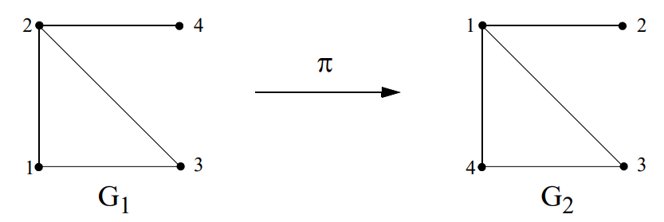

## Authentification

### Aperçu

- Authentification de l'origine des données
- Authentification d'entités
  - Authentification faible
  - Authentification forte
  - Authentification par Zero Knowledge

## Authentification de l'origine des données

- 1) MAC avec une clé symétrique $k$ connue de $A$ et $B$:

  $$A \rightarrow B:\quad X,\ \mathrm{MAC}_k(X)$$

  Si $B$ calcule de son coté $\mathrm{MAC}_k(X)$ et obtient la même valeur => le message provient de $A$.

- 2) MDC + cryptage symétrique (clé $k$ connue de $A$ et $B$)

  $$A \rightarrow B: X,\ E_k(\mathrm{MDC}(X))$$

  $B$ calcule $\mathrm{MDC}(X)$ et puis $E_k(\mathrm{MDC}(X))$. Si égal => message vient de $A$.

- 3) Comme 2) avec confidentialité de $X$ en plus:

  $$A \rightarrow B:\quad E_k(X,\mathrm{MDC}(X))$$

- 4) MDC + signature digitale:

  $$A \rightarrow B:\quad X,\ \mathrm{Sig}_{priv-A}(\mathrm{MDC}(X))$$

  $B$ calcule $\mathrm{MDC}(X)$ et vérifie $\mathrm{Sig}_{priv-A}(\mathrm{MDC}(X))$ avec une copie authentique de `pub-A`. Si égalité => $A$ est à l'origine du message.

  Cette solution offre en plus la non-répudiation d'origine.

- Ces protocoles simples n'offrent aucun support sur l'unicité ni sur l'actualité (*timeliness*) des messages reçus et sont exposés à des *replay attacks* ! Ils nécessitent des mécanismes tenant compte du temps ou du contexte de la transaction (cf. authentification d'entités).

## Authentification d'Entités: Introduction

- authentification d'entités (*entity authentication*), aussi appelé identification
- Objectifs d'un protocole d'identification robuste:
  - 1) Si $A$ et $B$ sont "honnêtes": si $A$ est capable de s'authentifier auprès de $B$, $B$ doit accepter l'identité de $A$.
  - 2) $B$ ne peut pas réutiliser l'information remise par $A$ pour s'identifier en tant que $A$ auprès de $C$.
  - 3) La probabilité qu'une tierce entité $C$ réussisse à se faire passer par $A$ auprès de $B$ est négligeable.
  - 4) Le point 3) reste vrai même si:
    - $C$ a observé un grand nombre (polynomial) d'instances du protocole d'identification entre $A$ et $B$
    - $C$ a participé (ev. en se faisant passer par quelqu'un d'autre) à des exécutions précédentes du protocole d'identification auprès de $A$ ou (non exclusif) $B$.
    - plusieurs instances du protocole (ev. initiées par $C$) peuvent s'exécuter simultanément sans compromettre le processus d'identification.
- Les protocoles d'*authentification faible* satisfont les points 1) et 3). Alors que les protocoles d'*authentification forte* satisfont (au moins partiellement) les points 2) et 4) en plus.

## Authentification d'Entités: Introduction (II)

- Terminologie: pour la suite on appelle l'*utilisateur ($A$)*, l'entité devant prouver son identité (*claimant*) et le *système ($B$)* l'entité chargée de vérifier cette identité (*verifier*)
- Eléments de base pour l'authentification:
  - *something known*: passwords, PINs, clés privées ou secrètes, etc.
  - *something possessed*: passeport, carte à puces, générateurs de passwords, etc.
  - *something inherent to the human individual:* propriétés *biométriques* comme les empreintes digitales, la rétine, le code ADN, etc.
- **Authentification faible** (*weak authentication*): L'utilisateur présente un couple (*userid*, *password*) au système afin de s'identifier. Le *userid* étant l'identité prétendue et le *password* l'évidence corroborant.
- **Authentification forte** (*strong authentication*): Contrairement à l'authentification faible, le secret permettant de corroborer l'identité n'est pas révélé explicitement mais, plutôt, l'utilisateur fournit au système une preuve de possession de ce secret.
- Authentification par *zero knowledge*: Ce sont des protocoles d'authentification forte qui ont en plus la caractéristique de prouver l'identité de l'utilisateur sans dévoiler aucune information (ni même une piste...) sur le secret lui même. En d'autres mots, il s'agit de donner une preuve d'une assertion sans en révéler le moindre détail.

## Attaques Dictionnaire (*Dictionnary Attacks*)

- Une **attaque dictionnaire** consiste à utiliser une base des données contenant des mots de dictionnaire d'une ou plusieurs langues (ainsi que des variantes) comme entrée à un système d'encryption ou de hachage afin d'obtenir des clés secrètes ou des passwords.
- Cette attaque est très efficace pour obtenir des mots de passe de mauvaise qualité même si dès nos jours il existent des bases de données de très grande taille contenant des variations de mots ainsi que de règles mnémotechniques complexes permettant de "casser" des mots de passe de plus forte entropie.
- Une attaque dictionnaire peut être montée:
  - en obtenant la base de données des mots de passe (encryptée ou *hashée*) du système d'authentification (système d'exploitation, réseau, etc.)
  - à partir d'un ou plusieurs échanges d'une instance d'authentification, suite à une attaque passive (observation de paquets réseau) p.ex.:

    :::: {layout-ncol="2"}

    ::: {#first-column}
    $A \rightarrow B:\quad A$

    $A \leftarrow B:\quad R$

    $A \rightarrow B:\quad E_p(R)$
    :::

    ::: {#second-column}
    $A$ envoie son identité

    $R$ = un nombre aléatoire (challenge)

    $A$ encrypte $R$ avec son password
    :::

    ::::

    Le couple $(R, E_p(R))$ permet de monter une attaque dictionnaire *offline*.
- Les attaques dictionnaire sont normalement moins efficaces *online* car les systèmes d'exploitation limitent le nombre d'essais infructueux d'authentification.

## Equivalence Plaintext (*Plaintext-Equivalence*)

- Une chaîne de données est dite *plaintext-equivalent* à un mot de passe si elle peut être utilisée pour obtenir le même niveau d'accès correspondant à l'utilisation du password.
- P.ex.: Si le système $B$ stocke une liste de tous les mots de passe hashés de ses clients dans le procédé d'authentification suivant:

  :::: {layout-ncol="2"}

  ::: {#first-column}

  $A \rightarrow B:\quad H(p)$

  :::

  ::: {#second-column}

  $A$ envoie à $B$ le hash du password au système

  :::

  ::::

  la chaîne d'information $H(p)$ est *plaintext-equivalent* au mot de passe $p$.
  Ceci est équivalent à dire que l'application d'une fonction de hachage pour le stockage des passwords ne constitue pas une sécurité supplémentaire pour le système.
- En particulier, dans le système d'authentification classique d'UNIX (page 138) le hash du password stockée dans le fichier `/etc/passwd` n'est pas *plaintext-equivalent* au mot de passe car c'est $p$ et non pas $H(p)$ qui est échangé entre le client et le serveur.
- Cette propriété est essentielle car les bases de données des mots de passe sont normalement protégées par des mécanismes logiques qui sont souvent mis en évidence par des failles du système d'exploitation du serveur.
- Si ces bases de données centrales contiennent des mots de passe en clair ou des informations *plaintext-equivalent* à ces derniers, les conséquences en cas d'attaque sont dévastatrices.
- Le cas idéal est que les informations stockées par le serveur ne soient ni *plaintext-équivalent* aux passwords ni exposées à des attaques dictionnaire *offline*.

## Authentification Faible

- Les systèmes d'authentification faible sont divisés en deux catégories principales:
  - *Password fixe*: Le password ne dépend pas du temps ni du nombre de fois que le protocole d'identification a été exécuté. Cette catégorie inclue les systèmes où le password est changé par décision de l'utilisateur ou par mesure de sécurité du système.
  - *Password variable*: La modification du password en fonction du temps et/ou du nombre d'exécutions fait partie du protocole d'identification.
- Techniques de stockage propres aux systèmes à password fixe:
  - stockage du password *en clair* dans un fichier protégé par les mécanismes de contrôle d'accès propres au système d'exploitation.
    Problèmes: failles dans le OS, privilèges du "super-user", *backups*, etc.
  - stockage du password encrypté ou après l'application d'une *one-way function* (éventuellement en rendant publique l'accès à ce fichier, cf. exemple UNIX).
    Problèmes: attaques *off-line*, ie. *guessing attacks*, *brute-force dictionary attacks*, identification de collisions, etc.
- Problème le plus grave du *password fixe*: il peut être rejoué après avoir écouté une instance d'identification sur un réseau non protégé !

## Authentification Faible: Password fixe

- Techniques de protection des systèmes de password fixe:
  - Règles strictes de comportement concernant la création, le maintien et la mise à jour des passwords en tenant compte de la faible entropie des passwords choisis habituellement par les utilisateurs (cf. tableau ci-contre)

| $\downarrow n \ \rightarrow c$ | 26 (lowercase) | 36 (lowercase alphanumeric) | 62 (mixed case alphanumeric) | 95 (keyboard characters) |
|---|---|---|---|---|
| 5 | 23.5 | 25.9 | 29.8 | 32.9 |
| 6 | 28.2 | 31.0 | 35.7 | 39.4 |
| 7 | 32.9 | 36.2 | 41.7 | 46.0 |
| 8 | 37.6 | 41.4 | 47.6 | 52.6 |
| 9 | 42.3 | 46.5 | 53.6 | 59.1 |
| 10 | 47.0 | 51.7 | 59.5 | 65.7 |

: Table 10.1 : Taille en bits de l'espace des mots de passe pour diverses combinaisons de caractères. Le nombre de mots de passe à $n$ caractères, avec $c$ choix par caractère, est $c^n$. Le tableau donne le logarithme en base 2 de ce nombre de mots de passe possibles.

| $\downarrow n \ \rightarrow c$ | 26 (lowercase) | 36 (lowercase alphanumeric) | 62 (mixed case alphanumeric) | 95 (keyboard characters) |
|---|---|---|---|---|
| 5 | 0.67 hr | 3.4 hr | 51 hr | 430 hr |
| 6 | 17 hr | 120 hr | 130 dy | 4.7 yr |
| 7 | 19 dy | 180 dy | 22 yr | 440 yr |
| 8 | 1.3 yr | 18 yr | 1400 yr | 42000 yr |
| 9 | 34 yr | 640 yr | 86000 yr | $4.0 \times 10^6$ yr |
| 10 | 890 yr | 23000 yr | $5.3 \times 10^6$ yr | $3.8 \times 10^8$ yr |

: Table 10.2 : Temps nécessaire pour parcourir l'intégralité de l'espace des mots de passe. Le tableau donne le temps $T$ (en heures, jours ou années) nécessaire pour parcourir ou précalculer l'intégralité de l'espace spécifié à l'aide d'un seul processeur (cf. Table 10.1). $T = c^n \cdot t \cdot y$, où $t$ est le nombre de fois que le mapping du mot de passe est itéré, et $y$ le temps par itération, pour $t = 25$, $y = 1/(125\,000)$ sec. (Ceci approxime la commande UNIX crypt sur un PC haut de gamme effectuant DES à 1.0 Mbytes/s – voir §10.2.3.)

*(Source [Men97])*

  - Ralentir le processus d'identification ainsi que limiter le nombre d'essais infructueux afin de contrer les "*on-line brute force attacks*".
  - *salting*: (cf. exemple UNIX)
  - Restreindre ou même éviter la diffusion des fichiers de mots de passe, même encryptés.

## Authentification Faible: Password Variable

- Les deux techniques les plus connues d'identification par password variable sont les *one-time passwords* et les générateurs (*hardware*) de nombres aléatoires
- les *one-time passwords*: comme le schéma de *Lamport* (dont le *S-Key* est l'implantation la plus courante). Il fonctionne de la manière suivante:

**Initialisation**:

$A$ génère un secret $w$

Une constante $t$ (= nb. d'identifications ~1000) et une OWF $H$ sont choisies

:::: {layout-ncol="2"}

::: {#first-column}

$A \rightarrow B:\quad w_t = H_t(w)$

:::

::: {#second-column}

$H$ appliqué $t$ fois à $w$

:::

::::

$B$ stocke: $w_{stored} := w_t,\ n:= t-1$

**Messages correspondants à l'identification $(t-n)^{ème}$:**

:::: {layout-ncol="2"}

::: {#first-column}

$A \rightarrow B:\quad A$

$A \leftarrow B:\quad n$

$A \rightarrow B:\quad w_n = H_n(w)$

:::

::: {#second-column}

identité de $A$

itération courante pour $A$

:::

::::

$B$ teste: $H(w_n) == w_{stored}$. Si OK => $n := n - 1$ et $w_{stored} := w_n$

**Fin**: Quand $n == 0$, $A$ choisit un nouveau $w$ et on recommence...

- **Attaques**: Authentification de $B$ **nécessaire** ! Sinon: $C$ se fait passer par $B$ et:
  - obtient le mot de passe courant $w_n$ et peut le rejouer (*pre-play attack*)
  - fournit un $n < n_{courant}$ et peut ainsi générer tous les $H_{m>n}(w_n)$ (*small n attack*)

## Authentification Faible: Password Variable (II)

- Générateurs (*hardware*) de nombres aléatoires.
  - Il s'agit des cartes à puces qui générent périodiquement (~ tous les 30 ou 60 secs) des nombres différents servant à identifier (avec en plus, un *PIN* et des information sur l'identité de la personne) le détenteur de la carte.
  - La génération se fait à partir d'une clé secrète présente sur la carte et connue du système.
  - Le plus connu est *SecureId* fabriquée par *RSA Security*.
  - Il a été adopté par des nombreuses banques comme support d'authentification du *tele-banking* sur Internet.
  - Il est également exposé au *pre-play attack* mais le délai pour rejouer le password se limite à la fréquence de changement (30 ou 60 secs.).
- Conclusions authentification faible:
  - Les password fixes offrent un niveau de sécurité très réduit.
  - Les password variables constituent un pas important vers l'authentification forte mais nécessitent des précautions supplémentaires.

## Authentification Forte: Solutions Symétriques

- Les protocoles d'authentification forte utilisent des techniques cryptographiques symétriques ou asymétriques. On commence par les symétriques...
- **Authentification unilatérale à clé symétrique partagée**:

  :::: {layout-ncol="2"}

  ::: {#first-column}

  $A \rightarrow B:\quad A$

  $A \leftarrow B:\quad R$

  $A \rightarrow B:\quad E_{k-AB}(R)$

  :::

  ::: {#second-column}

  $A$ envoie son identité

  $R$ = un nombre aléatoire (challenge)

  $A$ encrypte $R$ avec la clé partagée

  :::

  ::::

  $B$ décrypte $E_{k-AB}(R)$ et identifie $A$ s'il trouve $R$

- Remarques:
  - $B$ doit s'assurer que le challenge $R$ est aléatoire et ne doit pas le répéter.
  - Ce protocole constitue une amélioration remarquable par rapport à l'authentification par password car la variation des challenges empêche Eve de rejouer des parties du protocole.
  - *Eve* peut essayer un *off-line known-plaintext attack* à partir d'un nombre (qui reste normalement réduit) de couples $(R, E_{k-AB}(R))$ mais la plupart de systèmes de cryptage sont sûrs à cet égard (DES est vulnérable seulement à partir de $2^{47}$ paires) !
  - $C$ peut se faire passer par $B$ et choisir ses challenges $R$ pour monter un *chosen-plaintext attack* (la vulnérabilité de DES à cet égard est aussi de $2^{47}$ mais d'autres systèmes de cryptage sont plus sensibles à ces attaques).

## Authentification Forte: Solutions Symétriques (II)

- Remarques (suite):
  - $C$ pourrait monter une attaque *Active Man-in-the Middle* en se faisant passer par $B$ puisque $B$ n'est pas authentifié) mais il doit convaincre $A$ pour commencer le proto.
  - Un MDC: $H(k-AB,R)$ ou un MAC: $H_{k-AB}(R)$ peuvent remplacer $E_{k-AB}(R)$ et accélérer l'identification.
  - Après l'identification initiale, un canal sûr (au moins authentifié) doit être établi à l'aide d'une protection cryptographique pour éviter que $C$ puisse injecter des paquets en se faisant passer par $A$.
  - Les protocoles de ce type où une entité doit répondre en tenant compte d'un *challenge* proposé par l'autre s'appellent *challenge and response protocols* et sont la forme la plus répandue d'authentification forte.
- **Authentification unilatérale à clé symétrique partagée, $2^{ème}$ variante**:

  :::: {layout-ncol="2"}

  ::: {#first-column}

  $A \rightarrow B:\quad A,\ E_{k-AB}(\mathrm{timestamp})$

  :::

  ::: {#second-column}

  horloges synchronisées entre $A$ et $B$ !

  :::

  ::::

  - Avantage: un message en moins et protocole *stateless* **mais:**
  - la synchronisation d'horloges est difficile à obtenir dans la réalité et des "flottements" peuvent être exploités par un adversaire.
  - De plus, si on arrive à convaincre $B$ "d'avancer sa montre", certaines instances d'identification passées peuvent redevenir valables.

## Authentification Forte: Solutions Symétriques (III)

- **Authentification bilatérale à clé symétrique partagée (solution intuitive):**

  :::: {layout-ncol="2"}

  ::: {#first-column}

  $A \rightarrow B:\quad A,\ R_2$

  $A \leftarrow B:\quad R_1,\ E_{k-AB}(R_2)$

  $A \rightarrow B:\quad E_{k-AB}(R_1)$

  :::

  ::: {#second-column}

  :::

  ::::

- A première vue le protocole semble robuste **mais** observons ce que un adversaire $C$ peut faire en démarrant deux processus d'identification:

  :::: {layout-ncol="2"}

  ::: {#first-column}

  $C \rightarrow B:\quad A,\ R_2$

  $C \leftarrow B:\quad R_1,\ E_{k-AB}(R_2)$

  :::

  ::: {#second-column}

  $C$ prétend être $A$

  $B$ répond en se faisant passer pour $A$

  :::

  ::::

  à ce moment, $C$ démarre une deuxième instance:

  :::: {layout-ncol="2"}

  ::: {#first-column}

  $C \rightarrow B:\quad A,\ R_1$

  $C \leftarrow B:\quad R_3,\ E_{k-AB}(R_1)$

  :::

  ::: {#second-column}

  $$$$

  $C$ ne peut plus poursuivre mais...

  :::

  ::::

  complète avec succès la première instance d'identification avec:

  :::: {layout-ncol="2"}

  ::: {#first-column}

  $C \rightarrow B:\quad E_{k-AB}(R_1)$

  :::

  ::: {#second-column}

  et c'est fait !

  :::

  ::::

- Du fait que $C$ renvoie à $B$ le même $R$ qu'il a reçu de lui, ce genre d'attaques s'appellent *reflection attacks*.
- Comme la clé est partagée, $C$ aurait pu obtenir le même résultat (même plus discrètement) en exécutant la deuxième instance auprès de $A$ (en prétendant être $B$)

## Authentification Forte: Solutions Symétriques (IV)

- **Authentification bilatérale avec clé symétrique partagée (solution robuste):**

  :::: {layout-ncol="2"}

  ::: {#first-column}

  $(1)\ A \rightarrow B:\quad A,\ R_2$

  $(2)\ A \leftarrow B:\quad E_{k-AB}(R_1,R_2,A)$

  $(3)\ A \rightarrow B:\quad E_{k-AB}(R_2,R_1)$

  :::

  ::: {#second-column}

  :::

  ::::

- La présence de $A$ dans $(2)$ rajoute une sécurité supplémentaire au cas où les *reflection attacks* évidents ne sont pas détectés par le protocole. Autrement, si $A$ lance une authentification avec celui qu'il croit $B$ mais qui est en réalité $C$:

  $A \rightarrow C:\quad A, R_2 \qquad (*)$

  Alors $C$ commence une nouvelle instance d'authentification avec $A$ avec le même $R_2$:

  :::: {layout="[ 30, 70 ]"}

  ::: {#first-column}

  $C \rightarrow A:\quad B,\ R_2$

  $C \leftarrow A:\quad E_{k-AB}(R_1,R_2)$

  :::

  ::: {#second-column}

  Si $A$ ne voit pas $R_2$ comme réflexion évidente, alors il répond :

  Comme dans $(2)$ mais sans le « $A$ »

  :::

  ::::

  ce qui est utilisé par $C$ pour compléter son protocole $(*)$. Cependant, si $A$ répond avec $B$ à l'intérieur du paquet comme recommandé dans le protocole:

  $A \rightarrow C:\quad E_{k-AB}(R_1,R_2,B)$

  ceci ne sera plus utilisable par $C$ pour continuer $(*)$ car il faudrait $A$ à la place de $B$.

- A noter également que le fait d'inclure $R_1$ dans la partie encryptée protège également des dangers de *chosen plaintext attacks* de la solution précédente.

## Solutions Symétriques: Smartcards

![*(Source [Men97])*](qmd_images/smartcards.png)

## Authentification Forte: Solutions Asymétriques

- **Authentification unilatérale à clé asymétrique (solution intuitive...):**

  :::: {layout-ncol="2"}

  ::: {#first-column}

  $A \rightarrow B:\quad A$

  $A \leftarrow B:\quad E_{pub-A}(R)$

  $A \rightarrow B:\quad R$

  :::

  ::: {#second-column}

  $A$ envoie son identité à $B$

  $B$ encrypte avec la clé publique de $A$

  $A$ retourne $R$ après décryptage

  :::

  ::::

- Remarques:
  - $B$ doit connaître la clé authentique de $A$ pour éviter des *man-in-the-middle attacks*.
  - **mais surtout:** $B$ peut monter des *chosen-ciphertext attacks* (ie. $B$ peut faire décrypter n'importe quoi à $A$ !).
- **Authentification unilatérale avec clé asymétrique (solution robuste)**:
  Idée: structurer le texte encrypté avec `pub-A` et montrer que $B$ connaît le *plaintext*:

  :::: {layout-ncol="2"}

  ::: {#first-column}

  $A \rightarrow B:\quad A$

  $A \leftarrow B:\quad H(R),\ B,\ E_{pub-A}(B,R)$

  :::

  ::: {#second-column}

  $A$ envoie son identité à $B$

  $H(R)$ témoigne du fait que $B$ connaît $R$

  :::

  ::::

  $A$ décrypte $E_{pub-A}(B,R)$ et obtient $B'$ et $R'$.

  $A$ suspend le protocole si $h(R') \neq h(R)$ ou $B' \neq B$, sinon:

  $A \rightarrow B: R$

  $B$ identifie $A$ si coincidence avec le $R$ initiale

- Un protocole dual peut être imaginé en utilisant la signature de $A$ avec `priv-A` (au lieu de l'encryption avec `pub-A`), mais les mêmes précautions concernant la structure s'appliquent pour éviter que $A$ signe un message "mal intentionné" généré par $B$.

## Authentification Forte: Solutions Asymétriques (II)

- **Authentification bilatérale à clé asymétrique. Solution robuste due à Needham et Schroeder:**

  $(1)\ A \rightarrow B:\quad E_{pub-B}(r_1,A)$

  $(2)\ A \leftarrow B:\quad E_{pub-A}(r_1,r_2)$

  $(3)\ A \rightarrow B:\quad r_2$

- A noter que la présence de $A$ dans $(1)$ démonte les *chosen ciphertext attacks*.
- Le protocole peut être renforcé en rajoutant un "témoin" $H(r_1)$ dans $(1)$.

### Remarques finales sur authentification classique

- L'authentification d'entités est un processus très complexe rempli de pièges inespérés.
- Certains protocoles comme celui proposé par l'ISO en 1988 pour l'authentification dans les répertoires distribués ont des failles très semblables à celles que nous avons mis en évidence ici.
- Par ailleurs, dans [Kau95], page 233, le protocole 9-9 a une faille non spécifiée et pour laquelle l'auteur ne donne pas de solution. A vous de la découvrir...
- Lorsque l'identification se fait dans le cadre d'une session, il est impératif que *tous les paquets* propres à la session soient authentifiés (p.ex. moyennant l'établissement d'un canal sûr avec l'établissement de clés de session).

## Zero Knowledge Proofs: Définitions

- Problème avec les méthodes d'authentification "classiques": $B$ (ou même un observateur) est en mesure d'obtenir des informations sur le secret détenu par $A$:
  - Dans les méthodes d'authentification faible (par *password*) c'est le secret dans son intégrité qui est dévoilé.
  - Dans les méthodes *challenge and response* classiques, $B$ peut obtenir des couples [*plaintext* / *ciphertext*] pouvant servir à la cryptanalyse.
- *Définition*: Un protocole interactif est une **preuve de connaissance** (*proof of knowledge*) lorsqu'il a les deux caractéristiques suivantes:
  - **consistance** (*completeness*): si $A$ et $B$ sont deux entités "honnêtes", $B$ accepte la preuve fournie par $A$.
  - **significativité** (*soundness*): Si une entité "malhonnête" $C$ est capable de "tromper" $B$ alors $C$ détient le secret de $A$ (ou une information *polynomialement* équivalente au secret). Ceci équivaut à exiger la possession du secret pour la réussite de la preuve.
- Une preuve de connaissance interactive est dite "*sans apport d'information*" (**zero knowledge interactive proof** ou **ZKIP**) si elle a, *en plus*, la propriété que $A$ est capable de convaincre $B$ sur un fait sans ne révéler *aucune information* sur le secret qu'elle possède.

## Zero Knowledge Proofs: Définitions (II)

- Un protocole est une **ZKIP calculatoire** (*computational ZKIP*) si un observateur capable d'effectuer des tests probabilistes en temps polynomial n'est pas capable de distinguer une preuve authentique (ou $A$ répond) d'une preuve simulée (p.ex. par un générateur aléatoire).
- Un protocole est une **ZKIP parfait** (*perfect ZKIP*) s'il n'existe aucune différence (au sens probabiliste) entre la vraie preuve et la preuve simulée. L'absence d'information dans la preuve est garantie par la *théorie de l'information* de Shannon et non pas par des critères calculatoires.
- Structure générique d'une ZKIP:

  :::: {layout-ncol="2"}

  ::: {#first-column}

  $(1)\ A \rightarrow B$

  $(2)\ A \leftarrow B$

  $(3)\ A \rightarrow B$

  :::

  ::: {#second-column}

  témoin (witness)

  défi (challenge)

  réponse (response)

  :::

  ::::

  - $(1)$ $A$ choisit un nombre aléatoire secret et envoie à $B$ une preuve de possession de ce secret. Ceci constitue un engagement de la part de $A$ et définit une classe de questions à laquelle $A$ prétend savoir répondre.
  - $(2)$ Le défi envoyé par $B$ choisit (aléatoirement) une question dans cette classe.
  - $(3)$ $A$ répond (en utilisant son secret).
- Si nécessaire, le protocole est répété afin de réduire au maximum la probabilité qu'un "imposteur" devine "par chance" les réponses correctes.

## ZKIP: Exemple Intuitif

- Cet exemple est décrit dans [Qui89]^[[Qui89]: Quisquater, J-J. et.al. *How to Explain Zero-Knowledge Protocols to Your Children*. Proceedings of Crypto'89 Conference. 1989.]. Admettons que $A$ connaît un passage entre $y$ et $z$ (le secret).

- $(1)$ $B$ se tient à l'entrée de la caverne au point $E$.
- $(2)$ $A$ choisit une direction et se dirige vers les points $y$ ou $z$ (choix de témoin).
- $(3)$ Une fois $A$ à l'intérieur de la caverne, $B$ entre à son tour mais s'arrête au point $x$.
- $(4)$ $B$ demande à $A$ de se rendre au point $x$ par la par la droite ou par la gauche (le défi).
- $(5)$ En utilisant le secret pour passer de $y$ à $z$ (ou réciproquement) si nécessaire, $A$ obéit aux instructions de $B$.

Répéter les points $(1)$ à $(5)$ $n$ fois. Si $A$ ne connaît pas le secret, il a une probabilité de $2^{-n}$ de réussir à tromper $B$ (de deviner "juste").

## ZKIP: Exemple Intuitif (II)

- Dans cet exemple, $B$ constate que $A$ peut traverser à volonté le passage $yz$ mais n'obtient aucune information sur la manière de le faire même si le protocole est exécuté des millions de fois.
- Par ailleurs, $B$ ne peut pas convaincre $B'$ du fait que $A$ connaît le secret (comme il aurait été le cas si $A$ encryptait une information en utilisant une clé privée, p.ex.). $B'$ pourrait suspecter $A$ et $B$ d'avoir convenu les séquences (droite/gauche)
- Ce genre de protocoles sont inspirés de la technique du "*cut and choose*" où $A$ et $B$ partagent équitablement une tarte en suivant les étapes suivantes:
  - $A$ coupe la tarte.
  - $B$ choisit un morceau.
  - $A$ prend le morceau restant.
- Le premier ZKIP a été publié en 1985 par S. Goldwasser [Gol85]^[[Gol85]: Goldwasser, S. et al. *The Knowledge Complexity of Interactive Proof Systems*. Proceedings of the 17th ACM Symposium on Theory of Computing, 1985.]. L'application du paradigme du *cut and choose* aux protocoles cryptographiques est due à Rabin [Rab78]^[[Rab78]: Rabin, M.O. *Digital Signatures*. Foundations of Secure Communications. New York, Academic Press, 1978.].

## ZKIP: Isomorphisme de Graphes

- Deux graphes $G_1 = (V_1,E_1)$ et $G_2=(V_2,E_2)$ sont *isomorphes* s'il existe une permutation $\pi$ t.q. $\{u,v\} \in E_1$ ssi $\{\pi(u), \pi(v)\} \in E_2$.
- Exemple: $G_1 = (V, E_1)$ et $G_2=(V, E_2)$ avec $V = \{1,2,3,4\}$, $E_1= \{12,13,23,24\}$, et $E_2 = \{12,13,14,34\}$ sont isomorphes avec la permutation $\pi: G_1 \rightarrow G_2$, $\pi = \{4,1,3,2\}$:

- A partir d'un graphe $G_1$, on peut facilement (en temps polynomial) trouver une permutation $\pi$ t.q.: $G_2 = \pi(G_1)$.
- Cependant, aucun algorithme polynomial n'est connu pour déterminer si deux graphes suffisamment grands (~1000 sommets) sont isomorphes (c.à.d. trouver la permutation $\pi$ à partir des $G_1$ et $G_2$).

## ZKIP: Isomorphisme de Graphes (II)

- Sur la base de l'isomorphisme des graphes, on peut construire une ZKIP comme suit:

**(Initialisation)** $A$ choisit un graphe $G_1$ suffisamment grand et invente une permutation $\pi$ (le secret) lui permettant de calculer un deuxième graphe $G_2$ ($G_1$ et $G_2$ sont rendus publiques)

:::: {layout="[ 40, 60 ]"}

::: {#first-column}

$(1)\ A \rightarrow B:\quad H$

:::

::: {#second-column}

$A$ choisit une permutation aléatoire $\delta$ telle que $\delta: G_2 \rightarrow H$ et envoie $H$ à $B$ (le témoin)

:::

::::
:::: {layout="[ 40, 60 ]"}

::: {#first-column}

$(2)\ A \leftarrow B:\quad i$

$(3)\ A \rightarrow B:\quad \lambda$

:::

::: {#second-column}

$B$ choisit un entier $i \in \{1,2\}$ et l'envoie à $A$ (le défi)

$A$ calcule $\lambda$ telle que $H = \lambda(G_i)$ :

&nbsp;&nbsp;&nbsp;&nbsp;Si $i = 2$ : $\lambda := \delta$

&nbsp;&nbsp;&nbsp;&nbsp;Si $i = 1$ : $\lambda := \delta \circ \pi$

:::

::::

$(4)$ $B$ contrôle si $H = \lambda(G_i)$ et accepte l'étape comme juste.

$(5)$ Répéter $(1)$ à $(4)$ un nombre de fois assez grand pour minimiser les risques de "deviner juste".

## ZKIP: Isomorphisme de Graphes (III)

- Vérification des propriétés:
  - *Consistance*: Le protocole est accepté si $A$ connaît le secret (ie. la permutation entre les deux graphes).
  - *Significativité*: Si $C$ essaye de se faire passer par $A$ sans connaître $\pi$, il pourra fixer un $j$ et fournir une permutation correcte $\lambda(G_j)$ mais ne pourra pas trouver une permutation correcte pour les deux graphes. Il devra se contenter de deviner le *défi* fourni par $B$.
  - *Zero-Knowledge*: $A$ réussit à convaincre $B$ du fait que les deux graphes sont isomorphes mais n'apprend rien sur $\pi$; $B$ ne voit qu'un graphe aléatoire $H$ isomorphe à $G_1$ et $G_2$ ainsi qu'une permutation entre $H$ et $G_1$ ou entre $H$ et $G_2$.
  - *Zéro-Knowledge parfait:* ceci équivaut à dire que $B$ pourrait générer des telles informations tout seul (à l'aide d'un générateur aléatoire et des calculs polynomiaux). On peut prouver (cf. [Sti95]) que les transcriptions fournies par le protocole ne peuvent se distinguer (d'un point de vue de distribution probabiliste) de celles produites par un simulateur (même en admettant que $B$ "triche").
- L'utilisation du paradigme de l'isomorphisme de graphes dans les protocoles d'authentification reste relativement marginale dû à des problèmes d'efficacité d'implantation.

## ZKIP: Algorithme de Fiat-Shamir

- But: Permettre à $A$ de s'identifier en prouvant la connaissance d'un secret $s$ (associé à $A$ au moyen d'informations publiques authentiques) auprès de $B$ sans lui révéler des informations sur $s$.
- Il s'agit d'un protocole qui sert comme base à des implantations réelles et efficaces.
- Algorithme:

**(Initialisation)**:

(a) Un tierce de confiance, $T$ choisit et publie un $n$ t.q. $n = pq$ et garde $p$ et $q$ secrets.

(b) $A$ choisit un secret $s$ avec $1 \leq s \leq n -1$ et $(s,n) = 1$, calcule $v = s^2 \bmod n$ et distribue $v$ comme clé publique certifiée par $T$.

:::: {layout-ncol="2"}

::: {#first-column}

$(1)\ A \rightarrow B:\quad x = r^2 \bmod n$

$(2)\ A \leftarrow B:\quad e \in \{0,1\}$

$(3)\ A \rightarrow B:\quad y = r \cdot s^e \bmod n$

:::

::: {#second-column}

$A$ choisit un $r$ aléatoire et envoie un témoin $r^2$

$B$ envoie son défi

$A$ calcule la réponse en utilisant le secret $s$.

:::

::::

$B$ rejette la preuve si $y = 0$ (un imposteur pourrait fausser la preuve avec $r = 0$) et accepte la preuve si $y^2 \equiv x \cdot v^e \bmod n$.

Les étapes $(1)$ à $(3)$ sont répétées jusqu'à atteindre une marge de confiance suffisante.

## ZKIP: Algorithme de Fiat-Shamir (II)

- Vérification des propriétés:
  - *Consistance*: Si $A$ connaît $s$, le protocole accepte la preuve d'identification.
  - *Significativité*: Dans le cas simple, un imposteur pourrait seulement répondre à $e = 0$. Sinon, il pourrait choisir un $r$ aléatoire et envoyer $x = r^2/v$ dans $(1)$ et répondre au défi $e = 1$ avec une réponse correcte $y = r$. Dans le cas où $e = 0$, il devrait calculer la racine carré de $x$ mod $n$ ($n$ composite de factorisation inconnue) ce qui est difficile par SQROOTP. La réussite de la preuve nécessite, donc, la possession du secret.
  - *Zéro Knowledge*: $B$ ne peut obtenir aucune information sur $s$ car lorsque $e = 1$, il est caché par un nombre aléatoire (*blinding factor*).
  - *Zéro-Knowledge parfait*: Les paires $(x,y)$ obtenues de $A$ peuvent également être simulées par $B$ en choisissant un $y$ aléatoire et un $x = y^2$ ou $y^2/v \bmod n$. On peut prouver que ces paires ont une distribution probabiliste identique à celles fournies par $A$ (qui les calcule différemment !).
- A noter que, malgré cette dernière propriété, $B$ est incapable de se faire passer par $A$ auprès de $B'$ car il ne peut pas prédire la valeurs des défis $e$.

## ZKIP: Implantations Courantes

- **Feige-Fiat-Shamir (FSS)**:
  - Basé sur le protocole de Fiat-Shamir mais en utilisant des témoins et des défis multiples (des ensembles de $k$ valeurs) à chaque itération; ce qui pour $n$ itérations nous donne une probabilité de $2^{-nk}$ de deviner toutes les réponses.
- **Guillou-Quisquater (GQ)**:
  - Egalement basé sur Fiat-Shamir mais en augmentant le choix des défis ce qui diminue la probabilité de deviner sans augmenter le nombre d'instances transférées et d'étapes du protocole.
- **Schnorr**
  - Basé sur la difficulté de calculer des logarithmes discrets (DLP)
  - Il utilise également un domaine très grand de défis possibles ce qui lui permet de réaliser une identification en 3 échanges de messages seulement.
- Ces protocoles sont nettement plus efficaces que RSA et peuvent être implantés sur des supports à capacité de calcul réduite (*smart cards*).
- Il satisfont les propriétés de *consistance*, *significativité* mais la propriété *zero-knowledge* est parfois sacrifiée (comme dans le cas de *Schnorr*) pour augmenter l'efficacité.
- Pour une description détaillée de ces protocoles se référer à [Men97] ou à [Sti95].

## ZKIP: Remarques Finales

- Les ZKIP offrent un très bon niveau de sécurité cryptographique. Ils permettent de procéder à des identification en minimisant les chances d'un imposteur hypothétique et, **surtout**, en protégeant les informations sécrètes des utilisateurs "honnêtes".
- En 1989 (SECURICOM'89) *Adi Shamir* disait à propos des ZKIP : "*I could go to a Mafia owned store a million successive times and they will still not be able to misrepresent themselves as me*"...
- Et pourtant ([Sch96]): $A$ participe à une ZKIP avec $C \in$ Mafia; en même temps, $D$ (complice de $C$) participe à une autre ZKIP où il prétend se faire passer par $A$ auprès de $B$ (un vérificateur "honnête").

  :::: {layout-ncol="2"}

  ::: {#first-column}

  $(1)\quad A \rightarrow C:\quad t_1$

  $(1')\quad D \rightarrow B:\quad t_1$

  $(2')\quad D \leftarrow B:\quad d_1$

  $(2)\quad A \leftarrow C:\quad d_1$

  $(3)\quad A \rightarrow C:\quad r_1$

  $(3')\quad D \rightarrow B:\quad r_1$

  :::

  ::: {#second-column}

  témoin que $C$ fait suivre par liaison radio à $D$

  $D$ fait suivre $t_1$ à $B$

  $B$ envoie le défi à $D$ ; $D$ le fait suivre à $C$

  $C$ reprend le défi dans son dialogue avec $A$

  $A$ calcule la réponse en utilisant son secret, que $C$ envoie à $D$

  $B$ accepte $r_1$ et ainsi de suite !

  :::

  ::::

- Solutions:
  - Procéder à des identifications dans des chambres blindées (cage de *Faraday*)...
  - Utiliser des algorithmes de synchronisation forte pour éviter des échanges annexes.

## Authentification: Récapitulation

### Attaques et Protections

| Attaque | Description | Protection |
|---|---|---|
| *replay* | rejouer une instance d'identification précédente | *zero-knowledge* ; *challenge and response* ; *one-time password* (att. aux *pre-play* !) |
| *known/chosen-plaintext* | obtenir des couples plaintext / ciphertext | *zero-knowledge* |
| *chosen-ciphertext* | faire décrypter (ou signer) à A des informations soigneusement choisies | *zero-knowledge* ; *ch. & resp.* + témoin de connaissance + structure (redondance !) |
| *reflection* | répondre le même nombre qui a été reçu | inclure l'entité cible dans les messages ; asymétrie dans les messages |
| *interleaving* | utiliser des messages appartenant à plusieurs instances de protocoles simultanées | inclure l'entité cible dans les messages ; introduire un chaînage cryptographique entre les messages d'une même instance d'identification |
| *collusion* | connivence entre les intervenants | cage de *Faraday* ; synchronisation forte |
