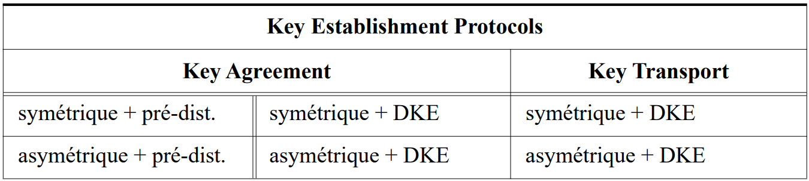
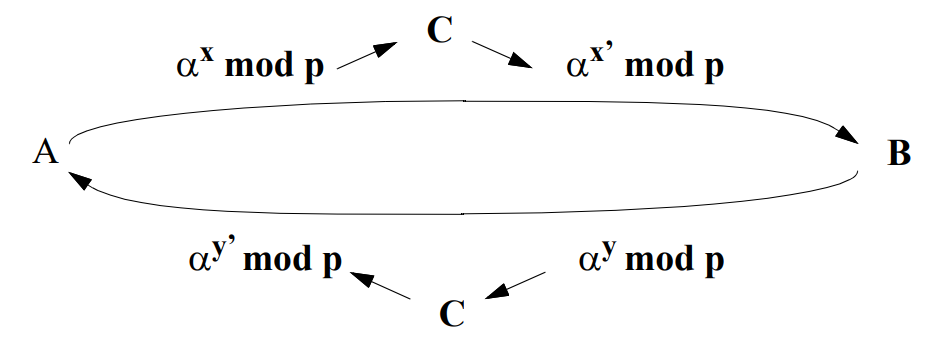
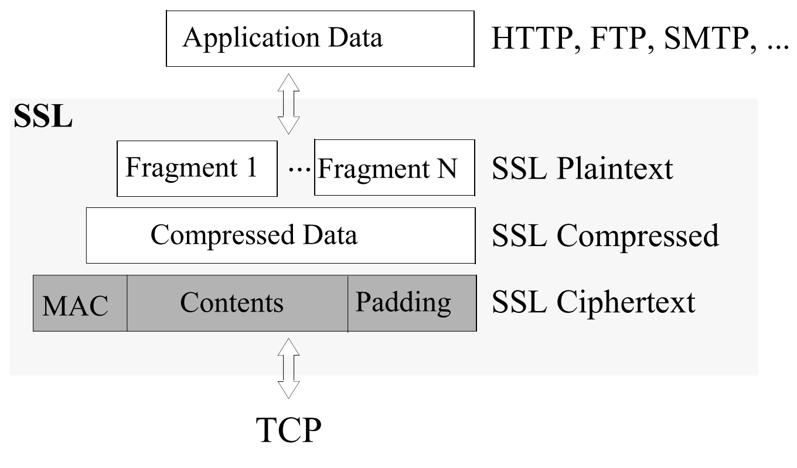
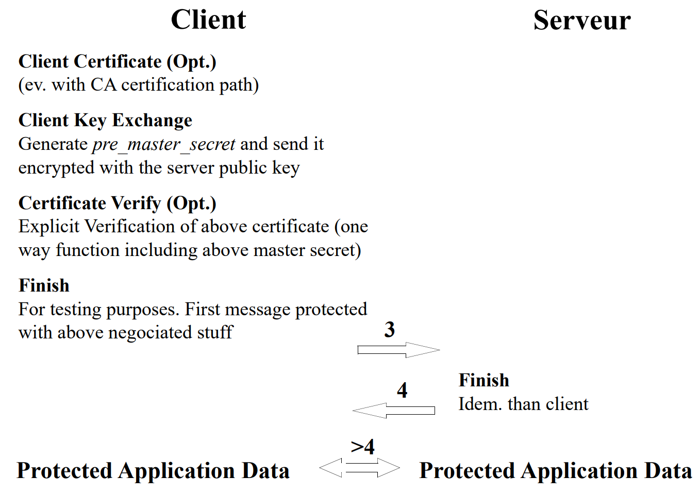

## Key Establishment Protocols (KEPs) — Aperçu

* Définitions
* Classification
* Propriétés
* *Key Agreement Protocols* (KAP) :
    * Symétrique : *Authenticated Key Exchange* 2
    * Asymétrique : *Diffie-Hellman*, *Station to Station*, *Secure Remote Password*, *Off-The Record Protocol* (OTR) et *Signal Protocol*
* *Key Transport Protocols* (KTP) :
    * Symétrique : *Shamir's No-key Protocol*, *Kerberos*
    * Mixte : *Encrypted Key Exchange*
    * Asymétrique : *Needham-Schroeder Protocol*
* SSL/TLS

## Key Establishment protocols. Définitions

* Un protocole d'établissement de clés (*key establishment protocol* ou *KEP*) est celui qui met à disposition des entités impliquées un secret partagé (une clé) qui servira comme base pour des échanges cryptographiques ultérieurs.
* Les deux variantes des KEP sont les protocoles de transport de clé (*key transport protocol* ou *KTP*) et les protocoles de mise en accord (*key agreement protocol* ou *KAP*).
    * Un *key transport protocol* (KTP) est un mécanisme permettant à une entité de créer une clé secrète et de la transférer à son (ses) correspondant(s).
    * Un *key agreement protocol* (KAP) est un mécanisme permettant à deux (ou plusieurs) entités de dériver une clé à partir d'informations *propres à chaque entité*.
* *Key pré-distribution schemes* sont ceux où les clés utilisées sont entièrement déterminées à priori (p.ex. à partir des calculs initiaux).
* *Dynamic key establishment schemes* (DKE) sont ceux où les clés changent pour chaque exécution du protocole.



## Key Establishment Protocols: Propriétés

* ***Implicit key authentication* (ou *key authentication*)** : propriété par laquelle une entité est assurée que seul(s) son (ses) correspondant(s) peut (peuvent) accéder à une clé secrète. Cependant, ceci ne spécifie rien sur le fait de posséder effectivement la clé.
* ***Key confirmation*** : propriété permettant à une entité d'être sûre que ses correspondants sont en possession des clés de session générées
* ***Explicit key authentication*** : = *implicit key authentication* + *key confirmation*.
* Un ***authenticated KEP*** est un KEP capable de fournir *key authentication*.
* Attaques :
    * Une ***attaque passive*** est celle qui essaye de démonter un système cryptographique en se limitant à l'enregistrement et à l'analyse des échanges.
    * Une ***attaque active*** fait intervenir un adversaire qui modifie ou injecte des messages.
    * Un protocole est dit vulnérable à un ***known-key attack*** si lorsqu'une clé de session antérieure est compromise, il devient possible : (a) de compromettre par une attaque passive des clés futures et/ou (b) de monter des attaques actives visant l'usurpation d'identité.

## Key Establishment Protocols: Propriétés (II)

La plupart des protocoles modernes garantissent les propriétés suivantes :

* ***Perfect Forward Secrecy*** (PFS) est une caractéristique qui garantit la confidentialité des clés de sessions utilisées par le passé même si les clés long terme (par exemple la clé privé du destinataire) est compromise :


* ***Future Secrecy*** : Le protocole garantit la sécurité des échanges ultérieurs (les clés des sessions futures sont protégées) même si les clés long terme sont compromises **par un attaquant passif** :


* ***Deniability / Repudiability*** (*répudiabilité*) : A l'image des protocoles d'authentification *Zéro-Knowledge*, permet aux entités de garantir l'authentification des échanges sans apporter des informations qui permettraient de prouver à un tiers leur participation dans l'échange cryptographique.

## KAP Symétrique avec Pré-distribution — Cas Trivial

* Soit un nombre n d'utilisateurs avec un centre de distribution de clés (*key distribution center* ou *KDC*)
* On peut construire un KAP symétrique avec pré-distribution trivial de la façon suivante :

    (1) KDC génère $n(n-1)/2$ clés différentes (une clé différente pour chaque couple d'utilisateurs).

    (2) KDC distribue en suite par un canal confidentiel et authentique les clés en donnant $n-1$ clés à chaque utilisateur.

* Si KDC génère les clés de façon vraiment aléatoire, ce système est inconditionnellement sûr contre des complots d'utilisateurs (même en admettant que $n-2$ utilisateurs complotent, ils ne pourraient pas trouver la clé des deux autres) par construction du protocole.
* Problème de ce protocole :
    * $O(n^2)$ en stockage de clés par le KDC.
    * $O(n)$ en clés secrètes échangées pour chaque entité.

## KAP Symétriques avec *Dynamic Key Establishment*

* Ces méthodes permettent aux entités impliqués de dériver des clés de courte durée (typiquement, des clés de session) à partir de secrets de longue durée qui, pour ces protocoles, sont des clés symétriques.
* Exemple intuitif :

    (Initialisation) : $A$ et $B$ partagent une clé symétrique long terme $S$

:::: {layout-ncol="2"}

::: {#first-column}

$(1)\quad A \rightarrow B:\quad r_a$

$(2)\quad A \leftarrow B:\quad r_b$

:::

::: {#second-column}

$A$ génère un nombre aléatoire et l'envoie à $B$

$B$ fait de même

:::

::::

$A$ et $B$ calculent la clé de session : $K := E_S(r_a \oplus r_b)$

Propriétés :

* *Entity authentication* : NON : par construction du protocole, les $r_i$ peuvent être envoyés par une entité quelconque.
* *Implicit key authentication* : OUI : seules les entités partageant la clé symétrique long terme $S$ peuvent accéder à la clé de session $K$.
* *Key confirmation* : NON : les $r_i$ étant aléatoires, ils peuvent être modifiés par un adversaire et empêcher $A$ et $B$ de se mettre d'accord sur la clé de session $K$. Ceci ne serait pas détecté par le protocole.
* *Perfect Forward Secrecy* : NON : si la clé long terme $S$ est compromise, toutes les clés de session précédentes peuvent être facilement calculées par un adversaire qui aurait enregistré tous les échanges.

## KAP Symétriques avec DKE — *Authenticated Key Exchange Protocol* 2 (AKEP2)^[Bellare, M. et Rogaway, P. *Entity Authentication and Key Distribution*. Advances in Cryptography. CRYPTO'93.]

(Init.) : $A$ et $B$ partagent deux clés symétriques long terme $S$ et $S'$. $S$ est utilisé pour générer des MACs $h_S()$ (afin de garantir l'intégrité et l'authentification d'entités) et $S'$ pour la génération de la clé de session $K$.

:::: {layout-ncol="2"}

::: {#first-column}

$(1)\quad A \rightarrow B:\quad r_a$

$(2)\quad A \leftarrow B:\quad T = (B,A,r_a,r_b), h_S(T)$

$(3)\quad A \rightarrow B:\quad (A, r_b), h_S(A,r_b)$

:::

::: {#second-column}

$A$ génère un nombre aléatoire et l'envoie à $B$

$B$ fait de même, plus les identités, plus le MAC de tout

$A$ vérifie les identités et le $r_a$ fournis par $B$ ; ensuite, il envoie identité + $r_b$ + MAC du tout

:::

::::

La clé est calculée bilatéralement avec un MAC dédié $h'_{S'}()$ : $K := h'_{S'}(r_b)$.

* *Entity authentication* : OUI mutuelle (fournie par les MACs).
* *Implicit key authentication* : OUI.
* *Key confirmation* : NON (pas d'évidence que la clé $S'$ est connue du correspondant).
* *Perfect forward secrecy* : NON (si la clé $S'$ est compromise, les clés de session $K$ précédentes aussi).
* La clé dépend seulement de $B$ (et de la clé long terme $S'$) mais le protocole peut être facilement modifié pour que la clé dépende aussi de $A$ et en faire un "vrai" KAP.

## KAP Asymétrique avec Pré-Distribution — Diffie-Hellman

* Publié en 1976^[Diffie, W. and Hellman, M. *New Directions in Cryptography*. IEEE Transactions on Information Theory, 22 (1976), 644-654.], il s'agit du précurseur des protocoles asymétriques.
* Il permet à deux entités qui ne se sont jamais rencontrées de construire une clé partagée en échangeant des messages sur un canal non confidentiel.
* Protocole :

    Initialisation : Un nb. premier p est généré et un générateur $\alpha$ de $Z_p^*$, t.q. $\alpha \in Z_{p-1}$. Les deux nombres sont rendus publiques.

:::: {layout-ncol="2"}

::: {#first-column}

$(1)\quad A \rightarrow B:\quad \alpha^x \bmod p$

$(2)\quad A \leftarrow B:\quad \alpha^y \bmod p$

:::

::: {#second-column}

$A$ choisit un secret $x \in Z_{p-1}$ et envoie la partie publique

$B$ choisit un secret $y \in Z_{p-1}$ et envoie la partie publique

:::

::::

    $A$ calcule la clé secrète : $K := (\alpha^y)^x \bmod p$ et $B$ à son tour : $K := (\alpha^x)^y \bmod p$

* La sécurité de ce schéma réside dans l'impossibilité de trouver $\alpha^{xy} \bmod p$ à partir de $\alpha^x \bmod p$ et $\alpha^y \bmod p$. (*Diffie-Hellman Problem* : DHP).
* **Résultat prouvé** : $DHP \leq_p DLP$.

## Diffie-Hellman (II)

* Diffie-Hellman est sûr (autant que DHP) contre des attaques passives. En d'autres mots, un adversaire qui se limite à voir passer des messages ne peut pas trouver la clé $K$.
* Ceci n'est cependant plus vrai pour des attaques actives ; voyons ce que $C$ peut faire en modifiant les messages :



* $C$ échange des clés secrètes avec $A$ et $B$, respectivement : $\alpha^{xy'} \bmod p$ et $\alpha^{x'y} \bmod p$ ($C$ contrôle $x'$ et $y'$). Si $C$ ré-encrypte chaque paquet qu'il reçoit avec la clé publique correspondante, l'attaque se fera de manière transparente pour $A$ et $B$.
* Cette attaque est appelée *Man in the Middle* (MIM) et s'applique à tous les protocoles asymétriques.
* Elle est due au manque d'authentification des clés publiques, ie. lorsque $A$ "parle" à $B$, il doit utiliser la clé publique authentique de $B$.

## Diffie-Hellman (III)

* Caractéristiques de Diffie-Hellman (non authentifié) :
    * *Entity Authentication* : NON.
    * *Implicit key authentication* : NON (par l'attaque *MIM*).
    * *Key confirmation* : NON (dû au risque de *MIM*, $A$ ne peut pas être sûr que $B$ possède la clé secrète partagée).
* Génération de clés symétriques à partir d'une clé partagée Diffie-Hellman :
    * Les quantités manipulés dans DH (notamment $K$) sont de taille 512 - 1024 bits (suivant le nb. premier p utilisé).
    * Une approche intuitive pour générer des clés symétriques de petite taille (64 - 128 bits) serait de prendre un sous-ensemble de bits de la clé K.
    * Malheureusement, on peut prouver que les clés DH ne sont pas *bit secure* ce qui signifie que des sous ensembles de bits (notamment les *Least Significant Bits*) peuvent être calculés avec un effort non proportionnel à l'effort nécessaire à calculer la clé $K$ entière.
    * Pour générer des clés de manière sûre il est conseillé d'appliquer un MDC (comme SHA ou MD5) à *toute* la clé (ev. enchaîner l'application des MDCs pour obtenir des clés symétriques successives).
    * Cette méthode permet d'obtenir un KAP avec *Dynamic Key Establishment*.

## Diffie-Hellman sur des Courbes Elliptiques

**Génération des clés**

* $A$ et $B$ choisissent une courbe elliptique $E_p$ avec $p$, un nombre premier de grande taille ($len(p) \sim 200$ **bits**) et un point $P_0 \in E_p$ de grand ordre (ev. un générateur de $E_p$).
* $A$ génère un nombre aléatoire $x$, t.q. $1 < x < p$ et calcule la partie publique $xP_0$ (multiplication par un scalaire sur $E_p$, pour laquelle, il existe des algorithmes efficaces). $B$ génère un nombre aléatoire $y$ t.q. $1 < y < p$ et calcule la partie publique $yP_0$.
* Protocole d'échange de clés :

:::: {layout-ncol="2"}

::: {#first-column}

$(1)\quad A \rightarrow B:\quad xP_0$

$(2)\quad A \leftarrow B:\quad yP_0$

:::

::: {#second-column}


:::

::::

* Après l'échange $A$ calcule $K_a := x (yP_0)$ et $B$ calcule à son tour : $K_b := y (xP_0)$.
* La propriété commutative des opérations sur $E_p$ garantit l'égalité : $K_a = K_b$.
* La clé secrète partagée résulte d'un processus de sélection de bits de la clé $K_a$ ou du résultat d'un MDC (fonction de hachage) appliqué à la clé $K_a$.
* Il est également nécessaire d'authentifier les parties publiques échangées afin d'éviter les attaques *man-in-the middle* précédemment décrites.
* Les propriétés du protocole sont identiques au cas $Z_p^*$ (page 192).

## KAP Asymétrique avec DKE — *Station to Station Protocol*^[Diffie, W. et al. *Authentication and Authenticated Key Exchanges*. Designs, Codes and Cryptography, 2 (1992).]

(Notation) $S_A$ : Signature avec la clé privé de $A$.

(Initialisation) :

(a) On choisit un nb. premier p et un générateur $\alpha$ de $Z_p^*$, t.q. $\alpha \in Z_{p-1}$. Les deux nombres sont rendus publiques (et éventuellement associés aux clés publiques des intervenants).

(b) Les intervenants ont accès aux copies authentiques des clés publiques des correspondants. Des certificats peuvent être échangés si besoin dans (2) et (3).

:::: {layout-ncol="2"}

::: {#first-column}

$(1)\quad A \rightarrow B:\quad \alpha^x \bmod p$

$(2)\quad A \leftarrow B:\quad \alpha^y \bmod p, E_k(S_B(\alpha^x, \alpha^y))$

$(3)\quad A \rightarrow B:\quad E_k(S_A(\alpha^y, \alpha^x))$

:::

::: {#second-column}

$A$ génère un secret $x$ et envoie la partie publique

$B$ génère un secret $y$ et calcule la clé : $k := (\alpha^x)^y \bmod p$, signe et encrypte les parties publiques

$A$ décrypte en calculant $k := (\alpha^y)^x \bmod p$, teste la signature de $B$ et les parties publiques ; si OK, $A$ signe et encrypte en inversant les parties publiques

:::

::::

$B$ décrypte et teste la signature de $A$ sur les parties publiques. Si OK => FIN.

## Station to Station Protocol (II)

Caractéristiques :

* *Entity Authentication* : OUI mutuelle (fournie par les signatures).
* *Implicit key authentication* : OUI, les clés sont protégées par DHP. L'attaque MIM est rendue impossible par les signatures.
* *Key confirmation* : OUI, les deux entités prouvent la possession de la clé en encryptant des quantités avec.
* *Explicit key authentication* : OUI : *implicit key authentication* + *key confirmation*.
* *Perfect Forward Secrecy* : OUI. La seule clé à long terme est celle utilisée pour signature/vérification. Si cette clé est compromise, les clés de session antérieures sont protégées par le fait qu'elles ne sont pas explicitement échangées mais plutôt calculées par DH.
* Evidemment, dès que la clé de signature est compromise (vol de clé privée), les propriétés énoncées ne sont plus vérifiées pour les échanges ultérieurs.
* Le protocole fournit en plus l'*anonymat* car l'identité des parties est protégée par k.
* Variante : Dans (2), calculer $sig := S_B(\alpha^x, \alpha^y)$, et envoyer : $(sig, h_k(sig))$ plutôt que $E_k(S_B(\alpha^x, \alpha^y))$. Pareil pour (3) en observant les asymétries du protocole. Solution plus efficace car elle fait intervenir un MAC plutôt qu'un cryptage symétrique.
* Algorithme robuste et efficace choisi comme support de base pour la génération de clés dans *IPv6*.

## Protocole *Off-The-Record* (OTR)

* Protocole conçu en 2004^[N. Borisov, I. Goldberg, E. Brewer. *Off-the-Record Communication, or, Why Not To Use PGP*. Workshop on Privacy in the Electronic Society 2004.] dans le but d'offrir des services d'authentification et de confidentialité dans les échanges des messages (*instant messaging*) en préservant le caractère "répudiable" d'une conversation "*off the record*"
* Le protocole satisfait également les propriétés de **PFS** et **Future Secrecy** en cas de compromis des clés long terme.
* Il reprend les mêmes principes que le protocole *Station-to-Station* (page 196) en rajoutant aux signatures des paramètres DH une **authentification éphémère** via un MAC. Cette technique double est appelée **SIGMA**^[H. Krawczyk. *SIGMA: The 'SIGn-and-MAc' Approach to Authenticated Diffie-Hellman and Its Use in the IKE Protocols.* CRYPTO 2003: Advances in Cryptology - CRYPTO 2003] (*SIGn-and-MAC*) :
* Il utilise une fonction de dérivation de clés (*Key Derivation Function* ou *KDF*) pour générer une clé d'encryption ($K_e$) préservant la confidentialité des messages avec *AES CTR-mode* et une clé MAC ($K_m$) garantissant l'authenticité d'origine de ceux-ci.
* Chaque conversation implique un changement de clés (nouvel échange de paramètres DH) avec en plus un échange en clair des clés MAC ($K_m$) utilisées dans l'échange précédent pour garantir la **répudiabilité** !

## Protocoles *OTR* et *Signal*

* Échanges schématiques du protocole OTR :

:::: {layout-ncol="2"}

::: {#first-column}

$(1)\quad A \rightarrow B:\quad \alpha^x \bmod p$

$(2)\quad A \leftarrow B:\quad \alpha^y \bmod p, S_B(\alpha^x, \alpha^y)), MAC_{Km}(B)$

$(3)\quad A \rightarrow B:\quad S_A(\alpha^y, \alpha^x), MAC_{Km}(A)$

:::

::: {#second-column}

$A$ génère un secret $x$ et envoie la partie publique

$B$ génère un secret $y$, calcule la clé de session $k := (\alpha^x)^y \bmod p$ et signe les parties publiques DH. Il génère ensuite les clés $K_e$ et $K_m$ via la KDF : $(K_m, K_e) := KDF(k)$

$A$ fait de même

:::

::::

Les messages sont ensuite chiffrés avec la clé $K_e$

* Il existe de nombreuses évolutions du protocole original OTR^[https://otr.cypherpunks.ca] ayant permis d'adresser des vulnérabilités et de rendre le protocole plus efficace.
* Le protocole **Signal**^[https://signal.org (Open Whisper Systems)] est une évolution du protocole OTR qui cible la protection des échanges des messages dans les réseaux sociaux. Il utilise également des clés asymétriques et symétriques éphémères pour assurer la *PFS*, la *Future Secrecy* et la *repudiability* avec des calculs DH sur des courbes elliptiques.
* **Signal** est utilisé pour protéger les plateformes de messagerie telles que *Whatsapp* et *Facebook Messenger* entre autres.

## Attaques Récentes sur Diffie-Hellman et la PFS

* En 2015 un groupe de chercheurs a publié^[Adrian, A. et al. *Imperfect Forward Secrecy: How Diffie-Hellman Fails in Practice*. 22nd ACM Conference on Computer and Communications Security, CSS 2015.] une série d'attaques sur le protocole TLS/SSL permettant de :
    * Effectuer un *downgrade* via une attaque active appelée *Logjam* moyennant laquelle un *man-in-the-middle* réussit à diminuer à 512 bits la taille du groupe Diffie-Hellman sur lequel s'effectue l'établissement de la clé secrète partagée.
    * Calculer ensuite les logarithmes discrets de $\alpha^x \bmod p$ et de $\alpha^y \bmod p$ avec la technique *Number Field Sieve*.
* A partir d'un groupe basé sur un nombre premier $p$ fixé, ils effectuent une phase de pré-calcul d'une durée approximative d'**une semaine**.
* Une fois cette phase initiale terminée, les calculs des logarithmes individuels ne prennent qu'**une minute** !
* Une constatation statistique montre qu'un pourcentage significatif des serveurs se basent sur le même groupe (même premier p) ce qui permet d'utiliser la même phase de pré-calcul pour compromettre plusieurs serveurs.
* Une des conclusions de cette recherche est que des acteurs majeurs avec des ressources étatiques seraient capable à ce jour de démonter la PFS lorsque celle-ci est basé sur des groupes (très répandus à ce jour...) de 1024 bits.

## KAP Asymétrique avec DKE — *Secure Remote Password protocol*^[Thomas Wu. *The SRP Authentication and Key Exchange System*. Request for Comments: 2945. Septembre 2000.]

(a) Soit m un *safe prime* avec $m := 2p+1$ et p premier

(b) Soit $\alpha$ un générateur de $Z_p^*$, t.q. $\alpha \in Z_{p-1}$

(c) Soit $P$ le password de $A$ et $x := H(P)$ avec $H$ une CRHF.

(d) $B$ garde dans sa base des mots de passe le *vérificateur* $v := \alpha^x \bmod m$.

:::: {layout-ncol="2"}

::: {#first-column}

$(1)\quad A \rightarrow B:\quad \delta := \alpha^r \bmod m$

$(2)\quad A \leftarrow B:\quad \lambda := (v + \alpha^t) \bmod m, u$

:::

::: {#second-column}

$A$ génère un nombre aléatoire secret $r$

$B$ génère un nombre aléatoire secret $t$ et un deuxième nombre aléatoire $u$

:::

::::

$A$ calcule la clé symétrique : $k := (\lambda - v)^{r+ux} \bmod m$

$B$ calcule la clé symétrique : $k := (\delta v^u)^t \bmod m$

$A$ et $B$ prouvent la connaissance de $k$ (*key confirmation*) lors d'un échange ultérieur.

* **SRP** protège les mots de passe des attaques dictionnaire.
* $B$ ne stocke pas les passwords mais des valeurs de vérification (*verifier-based*).
* **SRP** satisfait également toutes les propriétés propres aux KEP et est inclus dans des nombreux standards (SSL/TLS, EAP, etc.).

## Key Transport Protocol Symétrique — Cas trivial

(Init.) $A$ et $B$ partagent une clé symétrique long terme $S$

:::: {layout-ncol="2"}

::: {#first-column}

$(1)\quad A \rightarrow B:\quad E_S(r_a)$

:::

::: {#second-column}

$A$ génère un nombre aléatoire et l'encrypte avec $k$

:::

::::

La clé de session utilisée par les deux entités est $K := r_a$.

Propriétés :

* *Entity Authentication* : NON.
* *Implicit Key Authentication* : OUI (seul $A$ et $B$ ont accès à la clé).
* *Key Confirmation* : NON. $B$ ne peut pas être sûr que $A$ possède la clé car $r_a$ est un nombre aléatoire. En rajoutant de la redondance (p.ex. l'identité de $B$), $B$ peut obtenir *key confirmation* unilatérale (et donc, *explicit key authentication*) :

:::: {layout-ncol="2"}

::: {#first-column}

$(1')\quad A \rightarrow B:\quad E_s(B, r_a)$

:::

::: {#second-column}


:::

::::

* *Perfect Forward Secrecy* : NON.
* Si, de plus, $B$ ne peut pas juger l'actualité (*freshness*) de (1) à partir du seul $r_a$, il peut demander à $A$ d'inclure un *timestamp* à condition d'avoir des horloges synchronisés :

:::: {layout-ncol="2"}

::: {#first-column}

$(1'')\quad A \rightarrow B:\quad E_s(B, t_a, r_a)$

:::

::: {#second-column}


:::

::::

## KTP Symétrique: *Shamir's No-key Protocol*^[Massey, J.L. *Contemporary Cryptology: An Introduction in Contemporary Cryptology: The Science of Information Integrity*. G.J Simmons, ed., IEEE Press, 1992.pp 1-39.]

Rappel Théorie des nombres : Si p premier et $r \equiv t \bmod p-1$ alors $a^r \equiv a^t \bmod p \; \forall a \in Z$ et donc : $r.r^{-1} \equiv 1 \bmod p-1$ implique $a^{rr^{-1}} \equiv a \bmod p$.

(Init.) (a) Choisir et publier un nb. premier p pour lequel il est difficile (par DLP) de calculer les logarithmes discrets dans $Z_p$.

(b) $A$ (resp. $B$) génère un nombre secret a (resp. b), t.q $\{a,b\} \in Z_{p-1}$ et $(a,p-1) = 1$ et $(b,p-1) = 1$ (pour que les inverses existent).

(c) Pour la suite, $A$ pré-calcule $a^{-1} \bmod p-1$ et $B$ pré-calcule $b^{-1} \bmod p-1$

:::: {layout-ncol="2"}

::: {#first-column}

$(1)\quad A \rightarrow B:\quad K^a \bmod p$

$(2)\quad A \leftarrow B:\quad (K^a)^b \bmod p$

$(3)\quad A \rightarrow B:\quad (K^{ab})^{a^{-1}} \bmod p$

:::

::: {#second-column}

$A$ choisit une clé $K \in Z_p$ et la cache avec l'exposant $a$

$B$ exponentie à son tour avec l'exposant $b$

$A$ défait l'exponentiation avec $a^{-1} \bmod (p-1)$ mais la clé reste protégée par l'exposant $b$

:::

::::

$B$ n'a plus qu'à calculer $K$ en exponentiant avec $b^{-1} \bmod p-1$.

* Ce protocole est l'équivalent de Diffie-Hellman en *Key Transport* (dans DH la clé n'est pas transportée mais calculée bilatéralement). Il souffre donc des mêmes problèmes (notamment *Man in the Middle*) que ce dernier.


## Key Transport Protocol Asymétrique — *Needham-Schroeder Public Key Protocol*^[Needham, R.M. et Schroeder, M.D. *Using Encryption for Authentication in a Large Network of Computers*. Communications of the ACM, 21, 1978.]

(Notation) : $E_{pubE}(X)$ signifie *encrypter avec la clé publique de l'entité E*.

(Init) : $A$ et $B$ possèdent une copie authentique (ev. un certificat) de la clé publique de l'autre.

:::: {layout-ncol="2"}

::: {#first-column}

$(1)\quad A \rightarrow B:\quad E_{pubB}(k_1,A)$

$(2)\quad A \leftarrow B:\quad E_{pubA}(k_1,k_2)$

$(3)\quad A \rightarrow B:\quad E_{pubB}(k_2)$

:::

::: {#second-column}

$A$ génère un nombre aléatoire $k_1$, l'associe à $A$, puis encrypte

$B$ fait de même pour $k_2$, concatène avec $k_1$, puis encrypte

$A$ vérifie si $k_1$ coïncide, si oui, encrypte $k_2$ ; $B$ vérifie si $k_2$ coïncide avec $(2)$

:::

::::

La clés est générée à l'aide d'une fonction de hachage cryptographique : $K := H(k_1,k_2)$

Caractéristiques :

* *Entity Authentication* + *implicit key authentication* + *key confirmation* : OUI.
* *Perfect forward secrecy* : NON : Les clés sont entièrement déterminées par les quantités échangées.
* Un protocole semblable (seul (3) change) peut être utilisé pour l'authentification d'entités (cf. chapitre authentification).

## KTP mixte: *Encrypted Key Exchange* (EKE)^[Bellovin, S.M. and Meritt, M. *Encrypted Key Exchange: Password-Based Protocols Secure Against Dictionary Attacks*. 1992 IEEE CS Conf. on Research in Security and Privacy 1992.]

* Ce protocole fait intervenir des schémas symétriques et asymétriques afin de minimiser le risque de cryptanalyse par *attaque dictionnaire* inhérents aux systèmes symétriques.

(Init.) : $A$ et $B$ partagent un secret symétrique $p$ (*password*).

:::: {layout-ncol="2"}

::: {#first-column}

$(1)\quad A \rightarrow B:\quad A, E_p(pub_A)$

$(2)\quad A \leftarrow B:\quad E_p(E_{pubA}(k))$

$(3)\quad A \rightarrow B:\quad E_k(r_a)$

$(4)\quad A \leftarrow B:\quad E_k(r_a,r_b)$

$(5)\quad A \rightarrow B:\quad E_k(r_b)$

:::

::: {#second-column}

$A$ génère une paire de clés publique/privée et envoie la partie publique à $B$ encryptée avec $p$

$B$ génère une clé de session $k$ et l'envoie encryptée

$A$ génère un nombre aléatoire et l'envoie encrypté avec $k$

$B$ génère $r_b$ et l'envoie avec $r_a$ crypté avec $k$

Confirmation de la part de $A$. Si $r_b$ = OK => FIN

:::

::::

* (1) et (2) sont responsables du *key transport* ; (3) à (5) du *key confirmation*.
* Ce protocole est robuste même si le *password* $p$ partagé entre $A$ et $B$ est de mauvaise qualité. En effet, *Eve* ne peut pas essayer de deviner sans "casser" aussi l'algorithme asymétrique.
* *Entity Authentication* + *implicit key authentication* + *key confirmation* : OUI.
* *Perfect forward secrecy* : OUI si la paire $pub_A/priv_A$ est régénérée à chaque instance du protocole. NON si $pub_A/priv_A$ est une clé de longue durée.

## KTP symétrique avec *Key Distribution Center* — *Needham-Schroeder Symétrique*^[Needham, R.M. et Schroeder, M.D. *Using Encryption for Authentication in a Large Network of Computers*. Communications of the ACM, 21, 1978.]

(Notation) : On appelle $T$, le *Key Distribution Center*.

(Init.) : $A$ et $T$ partagent la clé symétrique $K_{AT}$. $B$ et $T$ partagent $K_{BT}$.

:::: {layout-ncol="2"}

::: {#first-column}

$(1)\quad A \rightarrow T:\quad A, B, r_a$

$(2)\quad A \leftarrow T:\quad E_{KAT}(r_a, B, k_{AB}, E_{KBT}(k_{AB},A))$

$(3)\quad A \rightarrow B:\quad E_{KBT}(k_{AB}, A)$

$(4)\quad A \leftarrow B:\quad E_{kAB}(r_b)$

$(5)\quad A \rightarrow B:\quad E_{kAB}(r_b - 1)$

:::

::: {#second-column}

$A$ génère un nombre aléatoire $r_a$ et l'envoie à $T$ avec les identités

$T$ génère $k_{AB}$ et l'envoie encryptée

$A$ transmet le paquet à $B$

Confirmation de $B$ en utilisant $k_{AB}$ et un nombre aléatoire $r_b$

Confirmation de $A$

:::

::::

* *Entity Authentication* :
    * $A$ auprès de $B$ : OUI.
    * $B$ auprès de $A$ : NON : $A$ n'a jamais vu $r_b$ (il pourrait s'agir de $E_{k'}(r_b')$).
* *Implicit Key Authentication* : OUI (les clés sont toujours protégées par $K_{AT}$ et $K_{BT}$). Cependant, en cas de *known-key attack* (cf. page suivante), ceci n'est plus vérifié pour $B$.
* *Key Confirmation* : Seul $B$ obtient l'assurance que $A$ possède la clé à cause de la faille décrite dans *entity authentication*.


## KTP symétrique avec *Key Distribution Center* — *Needham-Schroeder Symétrique* (II)

* *Perfect Forward Secrecy* : NON. Si une des deux clés $K_{AT}$ ou $K_{BT}$ est compromise, les clés de session k deviennent immédiatement visibles.
* Solution pour obtenir *key confirmation* et *entity authentication* mutuelles :

    Remplacer : (3) et (4) par :

:::: {layout-ncol="2"}

::: {#first-column}

$(3')\quad A \rightarrow B:\quad E_{kAB}(r_a'), E_{KBT}(k_{AB}, A)$

$(4')\quad A \leftarrow B:\quad E_{kAB}(r_a'-1,r_b)$

:::

::: {#second-column}


:::

::::

    Pour autant que les $r_i$ soient soigneusement contrôlés par les intervenants.

    Cependant : attention aux *reflection attacks* (cf. authentification d'entités) !

* **Problème** : $A$ peut rejouer (3) autant des fois qu'il le souhaite, sans aucun contrôle de la part de $B$. Ce problème s'aggrave si une vielle clé k est compromise :
* *Vulnérable au known-key attack* : Si une clé de session k déjà utilisée est obtenue par un adversaire $C$, il peut sans difficulté la faire accepter par $B$ en rejouant (3) et en calculant le *challenge* envoyé par $B$ dans (5). Dans ce cas, les propriétés *entity authentication*, *implicit key authentication* et *key confirmation* de $A$ auprès de $B$ sont aussi compromises.
* Solution : Rajouter un *timestamp* dans (3) témoignant de l'actualité des échanges :

:::: {layout-ncol="2"}

::: {#first-column}

$(3'')\quad A \rightarrow B:\quad E_{KBT}(k_{AB}, A,t)$

:::

::: {#second-column}

C'est la solution adoptée par Kerberos

:::

::::

## KTP symétrique avec *Key Distribution Center* — Kerberos

* Kerberos est un protocole permettant l'authentification d'entités et la distribution de clés à l'intérieur dans un réseau d'utilisateurs.
* A l'origine, Kerberos était conçu comme solution de remplacement pour remédier aux problèmes d'insécurité (authentification faible, transactions en clair, etc.) propres aux environnements UNIX.
* Kerberos fut crée à MIT comme partie intégrante du projet ATHENA.
* Il est basé sur le protocole de *Needham-Schroeder* symétrique avec notamment la correction de quelques failles du protocole et l'inclusion de *timestamps*.
* Les trois premières versions étaient instables. La version 4 a eu un succès considérable aussi bien dans les environnements industriel qu'académique et reste prédominante. La version 5, bien qu'étant plus sûre et mieux structurée, est plus complexe et moins performante, ce qui a ralenti son déploiement.
* Kerberos définit également un mode de collaboration entre domaines appartenant à des autorités administratives distinctes (les *realms*). Ceci permet à des utilisateurs d'un domaine d'utiliser des ressources d'un autre domaine "sans sortir" de l'environnement sécurisé de Kerberos.
* Pour des transactions *inter-realm*, la cryptographie symétrique constitue un obstacle significatif car nécessite des canaux confidentiels pour la pré-distribution des clés.

## Kerberos: Schéma Simplifié


![**[Kau95] contient une description complète de Kerberos**](qmd_images/kerberos.png)

## Kerberos Version 5

(Notation) : - $A$ et $B$ veulent établir une transaction sécurisée ; dans l'environnement Kerberos, il s'agit normalement d'un client et d'un serveur fournissant des services. - Le *KDC* de Kerberos est subdivisé en deux entités fonctionnelles : l'*Authentication Server* ($AS$) et le *Ticket Granting Server* ($TGS$). Les deux accèdent à la *BdD passwords*. - Les $r_a^{(n)}$ sont des nbs. aléatoires, t est un *timestamp*, $t_1$ et $t_2$ indiquent une fenêtre de validité de temps.

(Initialisation) : $A$ et $B$ partagent une clé secrète avec $AS$, soient : $K_A$ et $K_B$ (pour les clients, il s'agit d'une OWF du *password*). $TGS$ a également une clé secrète $K_T$.

:::: {layout-ncol="2"}

::: {#first-column}

$(1)\quad A \rightarrow AS:\quad A, TGS, r_a$

$(2)\quad A \leftarrow AS:\quad E_{KA}(k_{AT},r_a), Ticket_{AT} := E_{KT}(A,TGS,t_1,t_2,k_{AT})$

$(3)\quad A \rightarrow TGS:\quad Authenticator_{AT} := E_{kAT}(A,t), Ticket_{AT}, B, r_a'$

$(4)\quad A \leftarrow TGS:\quad E_{kAT}(k_{AB},r_a'), Ticket_{AB} := E_{KB}(A,B,t_1,t_2,k_{AB})$

$(5)\quad A \rightarrow B:\quad Authenticator_{AB} := E_{kAB}(A,t), Ticket_{AB}, r_a'', [request]$

$(6)\quad A \leftarrow B:\quad E_{KAB}(r_a''), [response]$

:::

::: {#second-column}


$AS$ génère $k_{AT}$


$TGS$ génère $k_{AB}$


$[request]$ et $[response]$ éventuellement cryptés avec $k_{AB}$

:::

::::

**(1) + (2)** : Demande de ticket pour $TGS$

**(3) + (4)** : Demande de ticket pour $B$

**(5) + (6)** : Authentification et établissement de clé entre $A$ et $B$.

## Caractéristiques de Kerberos

* *Entity Authentication* : OUI, de toutes les entités impliquées.
* *Implicit key authentication* : OUI : toutes les clés générées sont protégées par des clés partagées entre le $AS$ et tous les participants.
* *Key confirmation* :
    * Entre $A$ et $AS$ : NON : $AS$ n'a pas de preuve que $A$ possède la clé $K_A$.
    * Entre $A$ et $TGS$ : OUI pour $k_{AT}$ (des quantités redondantes encryptées avec $k_{AT}$ sont échangées entre $A$ et $TGS$) ; NON pour $k_{AB}$ ($TGS$ n'a pas de preuve de la part de $A$)
    * Entre $A$ et $B$ : OUI : échange des quantités redondantes encryptées avec $k_{AB}$.
* *Perfect forward secrecy* : NON : Toutes les clés sont explicitement transférées.

**Problèmes** :

* Les clés initiales (comme $K_A$) dépendent (directement) des *passwords* choisis par les utilisateurs. Ceci rend le protocole vulnérable à des *vols de password* ou à des :
* *Password guessing attacks* : $E_{KA}(k_{AT},r_a)$ dans (2) aide à casser le password de $A$. Solution : Pré-authentification dans (1) : $E_{KA}(t)$ avec t = *timestamp* (optionnelle dans v5).
* La fenêtre de validité d'un *ticket* peut conduire à des *replay attacks* si les $r_a^{(n)}$ ne sont pas correctement contrôlés par les intervenants.
* La synchronisation d'horloges est *nécessaire* ! Ceci n'est pas toujours facile dans des environnements hétérogènes.

## *Secure Socket Layer* (SSL) / *Transport Level Security* (TLS)

* Se situe entre la couche transport (TCP) et les protocoles de la couche application (non seulement HTTP mais également SMTP, FTP, etc. !)
* Il s'agit d'un *Meta Protocole d'établissement de clés* hautement paramétrable permettant des nombreux modes de fonctionnement et des options de négociation.
* Offre des services de confidentialité, intégrité, authentification du flot de données, et identification du serveur (et accessoirement du client)
* Utilise les familles d'algorithmes suivants :
    * Cryptographie publique (RSA, *Diffie-Hellmann*, DSA, etc.) pour l'échange de clés symétriques
    * MACs pour l'authentification du flot de données
    * Cryptographie symétrique (DES, IDEA, AES, etc.) pour l'encryption du flot de données
* L'intervention des *CAs* pour *certifier* l'association entre entités et clés publiques est vivement recommandée... mais pas indispensable !
* *Entity authentication* par certificats (serveur et client optionnelle), *Implicit Key Authentication* et *Key Confirmation* sont garanties. La *Perfect Forward Secrecy* depend du protocole choisi pour l'échange de clés.

## SSL/TLS Aperçu

* SSL est une "mini-pile" de protocoles avec des fonctionnalités des couches session, présentation et application.
* SSL est constitué de trois blocs fondamentaux :
    * *SSL record protocol* permettant l'encapsulation des protocoles de plus haut niveau au dessus de TCP (fragmentation + compression + encryption)
    * *SSL handshake protocol* chargé de l'authentification des intervenants et de la négociation des paramètres d'encryption
    * *SSL state machine*. Contrairement à HTTP, SSL est un protocole à états (*stateful*), il nécessite, donc, un ensemble de variables qui déterminent l'état d'une session et d'une connexion

## SSL/TLS *Record Protocol*



**MAC** = *Message Authentication Code* : Permet d'assurer l'intégrité et l'authenticité du paquet

## SSL/TLS *State Variables*

Une session peut contenir plusieurs connexions !

**Par session**

* **session identifier**
* **peer certificate**
* **compression method**
* **cipher specification**
    encryption algo. + authentication algo. + crypto attributes
* **master secret**
    secret shared between client and server
* **is resumable**
    indicates if new connections may be initiated under this session

**Par connexion**

* **client/server random**
    byte sequences for key gen.
* **c/s write MAC secret**
    secret key used to generate MACs by the client (resp. the server)
* **c/s write key secret**
    secret key used by the client (resp. the server) to encrypt application data
* **sequence numbers**
    keep track of received/sent messages
* **initialization vectors**
    for crypto algorithms

## SSL/TLS *Handshake Protocol* Simplifié


## SSL/TLS *Handshake Protocol* Simplifié (II)



## SSL/TLS: Generation de clés

```
master_secret = 
    MD5(pre_master_secret + SHA('A' + pre_master_secret +
      ClientHello.random + ServerHello.random)) +
    MD5(pre_master_secret + SHA('BB' + pre_master_secret +
      ClientHello.random + ServerHello.random)) +
    MD5(pre_master_secret + SHA('CCC' + pre_master_secret +
      ClientHello.random + ServerHello.random));
key_block =
    MD5(master_secret + SHA('A' + master_secret +
                ServerHello.random +
                ClientHello.random)) +
    MD5(master_secret + SHA('BB' + master_secret +
                ServerHello.random +
                ClientHello.random)) +
    MD5(master_secret + SHA('CCC' + master_secret +
                ServerHello.random +
                ClientHello.random)) + [...];

until enough output has been generated.  Then the key_block is
partitioned as follows:

client_write_MAC_secret[CipherSpec.hash_size]
server_write_MAC_secret[CipherSpec.hash_size]
client_write_key[CipherSpec.key_material]
server_write_key[CipherSpec.key_material]
client_write_IV[CipherSpec.IV_size] /* non-export ciphers */
server_write_IV[CipherSpec.IV_size] /* non-export ciphers */
```

## SSL/TLS: Remarques Finales

* Les clés secrètes sont le résultat de l'application de fonctions de hachage (MD5,SHA) sur les *random numbers* des enregistrement *Hello* et le *pre_master_secret*
* TLS/SSL est devenu le standard *de facto* pour la sécurité sur le web (à la base de *https*)
* Les clients SSL (*Explorer, Firefox, Opera, Chrome*, etc.) contiennent "hard-coded" des certificats correspondant à quelques entités de certification racine (*Verisign*, *Thawte*, *Microsoft*, *RSA*, etc.) permettant de vérifier les certificats présentés par certains serveurs mais SSL est conçu pour s'appuyer sur un réseau global de certification pour le moment inexistant.
* Les failles de sécurité les plus courantes de SSL concernent la génération aléatoire des clés ainsi que les défauts d'implantation les plus courants : *buffer overflows*, *sql injection*, etc. La faiblesse des fonctions de hachage (MD5, SHA) est aussi un facteur à risque.
* En Novembre 2009^[Marsh Ray, Steve Dispensa. *Renegotiating TLS*. http://extendedsubset.com/Renegotiating_TLS.pdf. Novembre 2009.], on a découvert une attaque permettant à un *Man in The Middle* d'injecter du contenu (*chosen plaintext*) dans un flot authentique suite à une re-négociation des paramètres prévue dans le protocole. Il s'agit d'une **faille dans le protocole** qui a nécessité un patch dans toutes les implantation.
* La faille *heartbleed* basée sur un buffer overflow a serieusement troublé la communauté Internet lors de sa découverte en Avril 2014.

## *Key Establishment Protocols*: Remarques Finales

* Les protocoles d'établissement de clés constituent une pierre angulaire de toute solution de sécurité. Avant de choisir (concevoir) un KEP, il est, donc, indispensable de :
    * Définir les objectifs (confidentialité, authentification d'entités/données, non-répudiation, etc.)
    * Définir le niveau de sécurité souhaité en fonction des propriétés étudiées (*key confirmation*, *perfect forward secrecy*, etc.)
    * Etablir une liste des contraintes liées à l'environnement (utilisateurs, machines, réseau, attaquants potentiels, etc.)
* En fonction de ces critères nous pouvons :
    * Choisir une solution prouvée et robuste (mieux qu'en inventer une *from scratch* !).
    * Vérifier que les objectifs sont atteints et les propriétés satisfaites.
* La vérification des protocoles est un processus complexe et délicat, de plus, les solutions publiées ne sont pas toujours correctes. Deux approches sont possibles (et nécessaires) :
    * L'analyse pratique. Analyser les failles du protocole "sur papier" et "sur machine" en tenant compte des pièges classiques : contrôle des nbs. aléatoires pour éviter des *reflection attacks*, redondance des quantités encryptées/signées, etc.
    * L'analyse formelle avec des *logiques* spécialement conçues à cet effet (comme la logique BAN^[Burrows, Abadi, Needham. *A Logic of Authentication.* Proceedings of the Royal Society, Series A, 426, 1871 (December 1989), 233-271. http://www.research.digital.com/SRC/personal/Martin_Abadi.])
