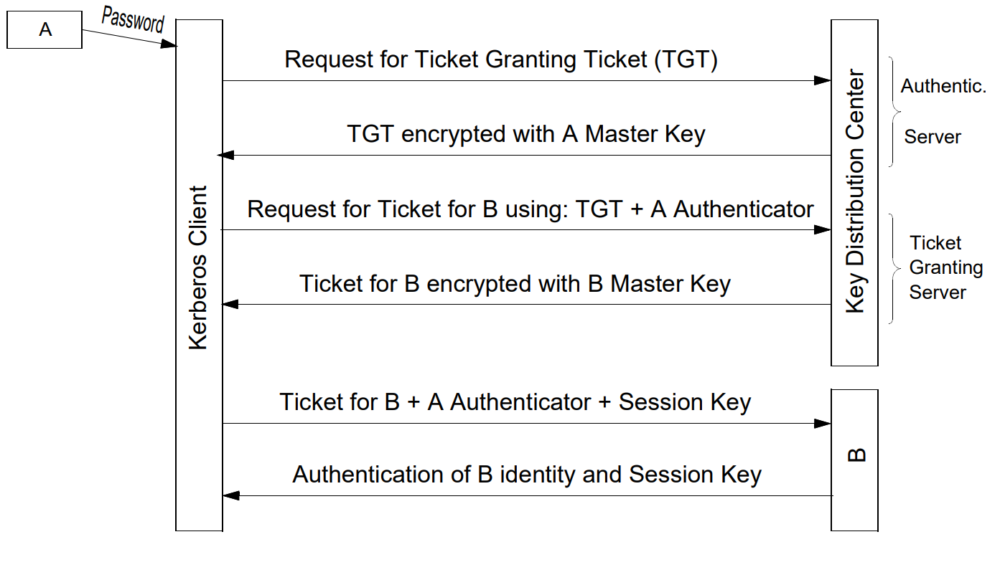

## Vue d'ensemble

Un **KEP** met à disposition un secret partagé (clé) pour de futurs échanges cryptographiques. Deux variantes :

* **KTP** (*Key Transport*) : une entité **crée** la clé et la **transfère**.
* **KAP** (*Key Agreement*) : les entités **dérivent** la clé à partir d'infos propres à chacune.

Autre axe de classification :

* **Pré-distribution** : clés fixées à l'avance.
* **DKE** (*Dynamic Key Establishment*) : clé nouvelle à chaque exécution (session).

| Type | Symétrique | Mixte | Asymétrique |
|---|---|---|---|
| **KAP** | AKEP2 | — | Diffie-Hellman, DH-EC, STS, SRP, OTR, Signal |
| **KTP** | Cas trivial, Shamir No-key, NS symétrique, Kerberos | EKE | Needham-Schroeder Public Key |

**SSL/TLS** : méta-protocole paramétrable au-dessus de TCP, combine plusieurs KEP.

## Concepts fondamentaux

### Définitions

* **Attaque passive** : observation/analyse des échanges uniquement.
* **Attaque active** : modification/injection de messages.
* ***Known-key attack*** : une clé de session passée compromise permet (a) de casser passivement des clés futures et/ou (b) de monter des usurpations actives.

### Propriétés essentielles

::: {.callout-important title="🔴 Hiérarchie des propriétés d'authentification"}

* **Implicit key authentication** : seul(s) le(s) correspondant(s) peut/peuvent accéder à la clé (ne prouve pas qu'il la possède déjà).
* **Key confirmation** : preuve que le(s) correspondant(s) possède(nt) effectivement la clé.
* **Explicit key authentication** = *implicit key authentication* + *key confirmation*.
* **Authenticated KEP** : KEP garantissant *key authentication*.

:::

| Propriété | Question à laquelle elle répond | Attaquant visé |
|---|---|---|
| **PFS** (*Perfect Forward Secrecy*) | Les clés de session *passées* restent-elles sûres si la clé long terme est compromise ? | actif ou passif |
| **Future Secrecy** | Les clés de session *futures* restent-elles sûres si la clé long terme est compromise ? | **passif uniquement** |
| **Deniability / Repudiability** | Peut-on s'authentifier sans laisser de preuve exploitable par un tiers ? | — |

::: {layout-ncol="2"}

:::

::: {.callout-warning title="Piège"}

**PFS ≠ Future Secrecy** : PFS protège le **passé** (vert avant compromission), Future Secrecy protège le **futur** (vert après compromission), et seulement contre un attaquant **passif** — un attaquant actif peut toujours usurper l'identité une fois la clé long terme volée.

:::

## KAP Symétriques

### Pré-distribution triviale (KDC)

1. KDC génère $n(n-1)/2$ clés (une par paire d'utilisateurs).
2. KDC distribue $n-1$ clés à chaque utilisateur (canal confidentiel + authentique).

* **Sécurité** : inconditionnelle contre les complots (même $n-2$ complices ne trouvent pas la clé des 2 autres).
* **Limites** : $O(n^2)$ stockage au KDC, $O(n)$ clés par utilisateur.

### DKE — échange intuitif (challenge-réponse)

Init : $A,B$ partagent $S$ (long terme).

$(1)\ A\to B: r_a \qquad (2)\ A\leftarrow B: r_b \qquad K := E_S(r_a \oplus r_b)$

| Propriété | Statut | Raison |
|---|---|---|
| Entity authentication | NON | $r_i$ envoyable par n'importe qui |
| Implicit key auth | OUI | seuls détenteurs de $S$ calculent $K$ |
| Key confirmation | NON | $r_i$ modifiables sans détection |
| PFS | NON | $S$ compromis ⇒ tout $K$ passé recalculable |

### AKEP2 (*Authenticated Key Exchange Protocol 2*)

Init : $A,B$ partagent $S$ (MAC $h_S$, authentification) et $S'$ (génération de $K$).

$(1)\ A\to B: r_a$
$(2)\ A\leftarrow B: (B,A,r_a,r_b), h_S(T)$
$(3)\ A\to B: (A,r_b), h_S(A,r_b)$

$K := h'_{S'}(r_b)$

| EA | IKA | KC | PFS |
|---|---|---|---|
| OUI (mutuelle, via MACs) | OUI | NON ($S'$ non prouvée connue) | NON |

## KAP Asymétriques

### Diffie-Hellman (1976)

Init publique : $p$ premier, $\alpha$ générateur de $Z_p^*$.

$(1)\ A\to B:\ \alpha^x \bmod p \qquad (2)\ A\leftarrow B:\ \alpha^y \bmod p$

$$K := \alpha^{xy} \bmod p$$

* Sécurité passive = difficulté du **DHP** (*Diffie-Hellman Problem*), avec $DHP \le_p DLP$.
* **Vulnérable au Man-in-the-Middle (MIM)** en actif : $C$ négocie séparément avec $A$ (clé $\alpha^{xy'}$) et $B$ (clé $\alpha^{x'y}$), invisible si $C$ relaie/déchiffre-rechiffre. Cause : **absence d'authentification des clés publiques**.

| EA | IKA | KC | PFS |
|---|---|---|---|
| NON | NON (à cause du MIM) | NON | — |

::: {.callout-warning title="Piège"}

Les clés DH ($K$, 512-1024 bits) **ne sont pas *bit secure*** : un sous-ensemble de bits (LSB) se calcule plus facilement que $K$ entière. **Solution** : appliquer un MDC (SHA/MD5) sur *toute* la clé pour dériver des clés symétriques (⇒ obtient un DKE).

:::

**DH sur courbes elliptiques** : même principe avec $E_p$, point $P_0$, secrets $x,y$ ; $K_a := x(yP_0) = y(xP_0) =: K_b$ (commutativité). Mêmes propriétés que le cas $Z_p^*$ ; nécessite aussi authentification des parties publiques.

### Station-to-Station (STS)

Ajoute des **signatures** aux échanges DH pour contrer MIM.

$(1)\ A\to B:\ \alpha^x$
$(2)\ A\leftarrow B:\ \alpha^y,\ E_k(S_B(\alpha^x,\alpha^y))$
$(3)\ A\to B:\ E_k(S_A(\alpha^y,\alpha^x))$, avec $k := \alpha^{xy} \bmod p$

| EA | IKA | KC | PFS |
|---|---|---|---|
| OUI mutuelle | OUI (MIM bloqué par signature) | OUI | **OUI** |

* Seule clé long terme = clé de signature ⇒ compromission ne casse pas les $K$ de session passées.
* Fournit aussi l'**anonymat** (identités protégées par $k$).
* Variante efficace : remplacer $E_k(S_B(...))$ par $(sig, h_k(sig))$ (MAC au lieu de chiffrement symétrique).
* Base de la génération de clés en **IPv6**.

### OTR (*Off-The-Record*, 2004) et Signal

* Reprend STS + **authentification éphémère par MAC** = approche **SIGMA** (*SIGn-and-MAc*).
* KDF génère $K_e$ (chiffrement, AES CTR) et $K_m$ (MAC).
* Révèle en clair l'ancien $K_m$ après usage ⇒ **répudiabilité**.
* Garantit **PFS + Future Secrecy + Deniability**.
* **Signal** = évolution d'OTR sur courbes elliptiques, pour messagerie (WhatsApp, Messenger).

### Attaques récentes sur DH — *Logjam* (2015)

1. **Downgrade actif** : force le groupe DH à 512 bits.
2. Calcul des logarithmes discrets par **Number Field Sieve** : pré-calcul ≈ **1 semaine** (fixé pour un $p$), puis chaque log individuel ≈ **1 minute**.
3. Beaucoup de serveurs partagent le même $p$ ⇒ un seul pré-calcul compromet plusieurs serveurs.

::: {.callout-warning title="Piège"}

Des acteurs étatiques seraient capables de casser la PFS pour des groupes **1024 bits**, très répandus à l'époque — ce n'est pas seulement un problème théorique.

:::

### Secure Remote Password (SRP)

* $x := H(P)$ (password), $B$ stocke le **vérificateur** $v := \alpha^x \bmod m$ (pas le password).
* Protège contre les **attaques dictionnaire**.
* Propriétés KEP complètes ; utilisé dans SSL/TLS, EAP, etc.

## Tableau récapitulatif KAP/KTP

| Protocole | EA | IKA | KC | PFS |
|---|---|---|---|---|
| DKE intuitif (symétrique) | NON | OUI | NON | NON |
| AKEP2 | OUI | OUI | NON | NON |
| Diffie-Hellman (non authentifié) | NON | NON | NON | — |
| Station-to-Station | OUI | OUI | OUI | **OUI** |
| SRP | OUI | OUI | OUI | oui |
| KTP trivial symétrique | NON | OUI | NON* | NON |
| Shamir No-key | — | — | — | vulnérable MIM |
| Needham-Schroeder Public Key | OUI | OUI | OUI | NON |
| EKE | OUI | OUI | OUI | OUI si clés éphémères |
| Needham-Schroeder symétrique | partielle | OUI | partielle | NON |
| Kerberos | OUI | OUI | partielle | NON |

*avec redondance (identité de $B$), *key confirmation* unilatérale possible.

## Key Transport Protocols (KTP)

### Cas trivial symétrique

$(1)\ A\to B:\ E_S(r_a)$, $K := r_a$.

* Ajout d'identité $E_S(B,r_a)$ ⇒ *key confirmation* unilatérale.
* Ajout d'un *timestamp* $E_S(B,t_a,r_a)$ ⇒ garantit la *freshness* (horloges synchronisées requises).

### Shamir's No-key Protocol

$(1)\ A\to B:\ K^a \bmod p$
$(2)\ A\leftarrow B:\ K^{ab} \bmod p$
$(3)\ A\to B:\ K^{b} \bmod p$ (via $a^{-1}$)

* Équivalent de DH en mode **transport** (clé choisie par $A$, pas calculée bilatéralement).
* Mêmes failles que DH : **vulnérable au MIM**.

### Needham-Schroeder Public Key

$(1)\ A\to B:\ E_{pubB}(k_1,A)$
$(2)\ A\leftarrow B:\ E_{pubA}(k_1,k_2)$
$(3)\ A\to B:\ E_{pubB}(k_2)$, $K := H(k_1,k_2)$

* EA + IKA + KC : **OUI**. PFS : **NON** (clés entièrement déterminées par les échanges).

### Encrypted Key Exchange (EKE) — mixte

* $A,B$ partagent un mot de passe $p$ (souvent faible).
* (1)-(2) : transport de clé (paire pub/priv de $A$ chiffrée avec $p$, session key $k$ retournée chiffrée).
* (3)-(5) : confirmation via challenge-réponse chiffrés avec $k$.
* **Robuste même avec mot de passe faible** : casser $p$ nécessiterait aussi de casser l'algorithme asymétrique.
* PFS : OUI si paire pub/priv régénérée à chaque session, sinon NON.

### Needham-Schroeder Symétrique (avec KDC $T$)

$(1)\ A\to T:\ A,B,r_a$
$(2)\ A\leftarrow T:\ E_{K_{AT}}(r_a,B,k_{AB}, E_{K_{BT}}(k_{AB},A))$
$(3)\ A\to B:\ E_{K_{BT}}(k_{AB},A)$
$(4)\ A\leftarrow B:\ E_{k_{AB}}(r_b)$
$(5)\ A\to B:\ E_{k_{AB}}(r_b-1)$

::: {.callout-warning title="Piège — faille du protocole"}

* **$B$ n'est jamais authentifié auprès de $A$** ($A$ ne voit jamais $r_b$ en clair pour vérifier).
* **Vulnérable au *known-key attack*** : une clé de session $k$ passée compromise permet à un attaquant de rejouer (3) et de répondre au challenge (5) ⇒ usurpe $A$ auprès de $B$.
* **Solution** : ajouter un *timestamp* dans (3) : $E_{K_{BT}}(k_{AB},A,t)$ → **adoptée par Kerberos**.

:::

### Kerberos

* Basé sur NS symétrique + correctifs (timestamps).
* Architecture : **KDC = Authentication Server (AS) + Ticket Granting Server (TGS)**.
* v4 : succès industriel/académique. v5 : plus sûre mais plus complexe (déploiement plus lent). Gère les domaines (*realms*).

**Flux simplifié (v5)** :

1. **(1)+(2)** : $A \leftrightarrow AS$ → obtention du *ticket* pour $TGS$ (clé $k_{AT}$).
2. **(3)+(4)** : $A \leftrightarrow TGS$ → obtention du *ticket* pour $B$ (clé $k_{AB}$).
3. **(5)+(6)** : $A \leftrightarrow B$ → authentification mutuelle + établissement de $k_{AB}$.

| Propriété | Statut |
|---|---|
| Entity authentication | OUI (toutes entités) |
| Implicit key auth | OUI |
| Key confirmation | partielle (NON entre $A$-$AS$ ; OUI $A$-$TGS$ pour $k_{AT}$ seulement ; OUI $A$-$B$) |
| PFS | NON (clés transférées explicitement) |

**Problèmes connus** :

* Clés initiales dérivées des *passwords* ⇒ **password guessing attacks** (mitigé par pré-authentification optionnelle avec timestamp).
* Fenêtre de validité des tickets ⇒ risque de **replay attacks** si $r_a^{(n)}$ mal contrôlés.
* **Synchronisation d'horloges obligatoire**.

## SSL / TLS

Méta-protocole d'établissement de clés, entre TCP et couche application (HTTP, SMTP, FTP…).

* **Algorithmes combinés** : crypto publique (RSA, DH, DSA) pour l'échange de clés, MAC pour l'intégrité, crypto symétrique (AES, etc.) pour les données.
* **CA** recommandées mais pas indispensables.
* EA (certificats, client optionnel), IKA, KC : garanties. **PFS dépend du mode d'échange de clés choisi**.

### Trois blocs

1. **Record protocol** : fragmentation + compression + encryption.
2. **Handshake protocol** : authentification + négociation des paramètres.
3. **State machine** : protocole *stateful* (contrairement à HTTP).

### Variables d'état

| Par **session** | Par **connexion** |
|---|---|
| session identifier, peer certificate, compression method, cipher spec, **master secret**, is resumable | client/server random, write MAC secret, write key secret, sequence numbers, IV |

### Génération des clés (schéma)

$$\text{master\_secret} = f(\text{pre\_master\_secret}, \text{ClientHello.random}, \text{ServerHello.random})$$

puis un `key_block` (dérivé du *master_secret* via MD5/SHA) est partitionné en clés MAC + clés de chiffrement + IV pour client et serveur.

### Incidents historiques

* **Logjam** (2015) : cf. attaques DH ci-dessus.
* **Renegotiation attack** (nov. 2009) : injection de contenu (*chosen plaintext*) via re-négociation — faille de **protocole**, patch nécessaire partout.
* **Heartbleed** (avril 2014) : buffer overflow, faille d'**implémentation** (OpenSSL).

## Pièges — Ne pas confondre

| Concepts | Différence clé |
|---|---|
| KAP vs KTP | KAP = clé **dérivée** bilatéralement ; KTP = clé **créée** par une entité puis transférée |
| Pré-distribution vs DKE | clés fixes à priori vs clés renouvelées à chaque session |
| Implicit key auth vs Key confirmation | *implicit* = seul le bon correspondant *peut* obtenir la clé ; *confirmation* = preuve qu'il la *possède déjà* |
| PFS vs Future Secrecy | protège respectivement le **passé** et le **futur** ; Future Secrecy seulement contre attaquant **passif** |
| DH vs Shamir No-key | DH = KAP (clé calculée par les deux) ; Shamir = KTP (clé choisie par $A$) — même vulnérabilité MIM |
| STS vs DH simple | STS ajoute les **signatures** ⇒ contre MIM, obtient PFS et key confirmation |
| known-key attack | exploite une clé de **session passée** compromise, pas la clé long terme |

## À retenir

* Un **KEP** = KTP (transport) ou KAP (accord) ; clés en **pré-distribution** ou **DKE**.
* Hiérarchie : **Explicit key auth = Implicit key auth + Key confirmation**.
* **PFS** protège le passé, **Future Secrecy** protège le futur (attaquant passif seulement).
* **DH non authentifié** est cassable par **MIM** — toute variante sûre (STS, OTR, Signal) ajoute une **authentification** des parties publiques (signatures ou MAC).
* **STS** est la référence pour EA + IKA + KC + PFS complets ; **OTR/Signal** y ajoutent la **répudiabilité** via **SIGMA**.
* **Needham-Schroeder** (public ou symétrique) manque de PFS ; la version symétrique souffre d'un **known-key attack** corrigé par des **timestamps** → base de **Kerberos**.
* **Kerberos** = AS + TGS, authentification mutuelle forte, mais PFS absente et dépendance aux mots de passe.
* **SSL/TLS** est un méta-protocole combinant tous ces blocs ; sa sécurité dépend fortement du choix du mode d'échange de clés et de l'implémentation (Heartbleed, renegotiation).
* Avant de choisir/concevoir un KEP : définir objectifs, niveau de sécurité, contraintes ; préférer une **solution prouvée** ; vérifier par **analyse pratique + formelle** (ex. logique BAN).
