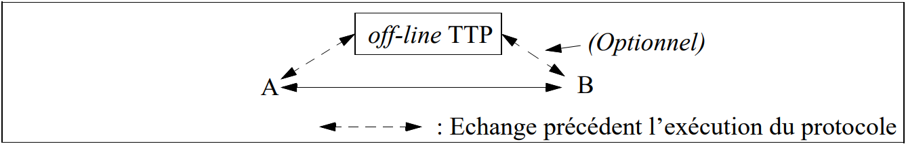

# *Trusted Third Parties* et *Certification*

* *Tiers de confiance (TTP)*
  * Modes de fonctionnement des TTP
  * KDCs et CAs
  * Autres TTPs
* Authentification à clé publique
  * Certificats
  * *Listes de révocation de certificats*
  * Arbres d'authentification
  * Topologies de certification
* *Infrastructures à clé publique (PKIs)*

## TTP: Modes de Fonctionnement

* *In-line*: Le TTP agit comme intermédiaire pour relayer en temps réel les échanges entre A et B. Exemples: *Proxies*, *Secure Gateways*.

* *On-line*: Le TTP participe en temps réel aux échanges entre A et B mais A et B communiquent directement (sans passer par le TTP). Exemple: *Key Distribution Center*.

* *Off-line*: Le TTP ne participe pas à l'échange en temps réel mais rend l'information disponible *à priori*. Exemple: *Certification Authorities*.

* Comparaison *In-line/On-Line/Off-line*: Echanges facilités et pas besoin de disponibilité permanente des TTP dans le *off-line* (contrairement aux deux autres) mais révocation des privilèges (p.ex.: lorsqu'une clé secrète est compromise) plus complexe.

## TTP: *Key Distribution Centers* (KDCs)

* *Key Distribution Centers*: But: Résoudre le *n2 key distribution problem*:
  * Dans un environnement symétrique de n entités sans intermédiaire: $n(n-1)/2 \sim n^2$ clés différentes sont nécessaires pour toutes les paires d'entités partagent une clé différente.
  * De plus, un tel système n'est pas évolutif (*scalable*) car l'adjonction d'une entité se traduit par la génération de n nouvelles clés.

Si chaque entité partage une clé avec un KDC, seules n clés sont nécessaires pour le fonctionnement du système et une clé suffit pour chaque nouvelle entité. L'établissement de canaux sûrs étant assuré par la génération de clés de session et la présence des *tickets à la Kerberos*.

* Problèmes:
  * *Single point of security failure*: par construction le KDC peut usurper l'identité de tous les noeuds du réseau. S'il est compromis tout le système devient vulnérable.
  * *Single point of operational failure*: le mode de fonctionnement habituel d'un KDC est *on-line* (ev. *in-line*). S'il devient indisponible (p.ex. suite à un *denial of service attack*), tout le système est paralysé.
  * *Performance bottleneck*: les opérations des KDC sont souvent coûteuses en temps de calcul (cryptage/décryptage, *random generation*, etc.). Des solutions classiques (ie. le *mirroring*) doivent être envisagées pour répartir la charge des KDCs.

## TTP: *Certification Authorities* (CAs)

* Le rôle premier d'une Entité de Certification (*Certification Authority* ou *CA*) est d'authentifier l'association entre une entité et sa clé publique (pensez aux attaques *Man-In-the-Middle* !).
* La CA va créer et signer des *certificats* contenant cette association (moyennant une preuve d'identité comme un passeport) et les rendre accessibles aux entités concernées.
* Une fois signées, des copies des certificats (*cached certificates*) peuvent être gardées dans des endroits non protégés (p.ex. dans l'espace disque de l'utilisateur). Cependant, afin de vérifier la signature des certificats, les entités concernées nécessitent une copie *authentique* de la clé publique de la CA.
* *Simpler then safer*: pas besoin d'implanter des protocoles complexes dans une CA.
* Le mode de fonctionnement habituel d'une CA est *off-line*, ce qui diminue les conséquences des périodes (courtes...) d'indisponibilité.
* Problème associé au mode *off-line*: la validité des *cached certificates* peut être remise en question de manière « asynchrone » par un vol de clé privé. Remède: les CAs publient également des listes signées des certificats non valides (*Certificate Revocation Lists* ou CRLs).
* Le compromis d'une CAs a des conséquences *moins évidentes* mais *presque aussi néfastes* que celui d'un KDC surtout si la clé privée servant à signer des certificats est aussi compromise.

## CA: *Proof of Possesion* (PoP)

* La vérification de l'identité de A pour créer (ev. modifier) un certificat associant A à sa clé publique n'est pas un critère suffisant. Il faut également vérifier que A possède vraiment la clé privée correspondante.
* Soient A et sa CA: CAA. Voyons ce qu'un attaquant actif C peut faire en « collaboration » avec une CAC qui ne vérifierait pas la PoP:

A signe un document contenant la description d'une invention révolutionnaire et l'envoie à B (le notaire) avec son certificat signé par CAA:

$$A \rightarrow B: S_{privA}(Invention), S_{privCA_A}(CertA)$$

C intercepte ce paquet, s'adresse à CAC et lui demande de créer un certificat associant son identité C à la clé publique de A et envoie à B:

$$C \rightarrow B: S_{privA}(Invention), S_{privCA_C}(CertC)$$

C dévient ainsi l'inventeur révolutionnaire...

* Protocole simple de vérification de PoP:

  $$CA \rightarrow A: A, r$$

  r: nb. aléatoire, A pour protéger A des *chosen message attacks*.

  $$CA \leftarrow A: S_{privA}(A,r)$$

  CA n'a plus qu'à vérifier la signature avec pubA.

* Ce critère et d'autres critères de comportement comme la mise à jour des CRLs ou la sécurité de la clé de signature introduisent des *niveaux des confiance* pour les CAs et pour les certificats qu'elles signent.
* Ce phénomène s'aggrave avec la prolifération non contrôlée des CAs !

## CA: Certification et Révocation

* Problème: Si la même clé sert à signer les certificats et les CRLs, un adversaire possédant la clé privée de signature d'une CA peut attaquer une « victime » A sous l'autorité de cette CA comme suit:
  * Publier une CRL contenant le certificat révoqué de A.
  * Créer un certificat associant A à une clé publique dont il contrôle la clé privée pour ensuite:
  * jouer le *Man-In-the-Middle* pour décrypter les transactions confidentielles pour A;
  * se faire passer par A pour des transactions authentifiées ou des documents signés.
* Solution: *Separation of duties*^[Crispo, B. et Lomas, M. *A Certification Scheme for Electronic Commerce*. International Workshop on Security Protocols. Cambridge, UK. April, 1996.]: La certification et la révocation deviennent des tâches clairement différenciées:
  * Certificats et CRLs sont signés avec des clés différentes,
  * par des entités fonctionnelles différentes (*Certification Authority* et *Revocation Authority*);
  * si possible, résidant dans des machines différentes soumises à des critères de sécurité (*security policies*) indépendants.

## Entités Fonctionnelles Liées à la Certification

* *Name Server*: responsable de la gestion d'un espace de noms unique et cohérent. Lorsque l'authentification est nécessaire, la gestion des noms doit être complétée par la certification des clés publiques associées à ces noms.

Exemple d'une solution pilote combinant les deux concepts: `DNSsec`: environnement de gestion de noms authentifiés pour Internet.

* *Registration Authority*: Entité chargée d'accomplir les tâches relatives à la gestion des certificats nécessitant un contact direct avec les entités concernées. Ces tâches comprennent la vérification des paramètres nécessaires à la demande initiale ou à la modification des certificats (vérification d'identité, PoP, etc.). Le fait de détacher cette fonctionnalité de la CA est normalement dû à des considérations géographiques.
* *Key Generator*: Permet de déléguer le processus de création de paires de clés publique/privée à une entité dédiée:
  * Avantages: simplicité pour les utilisateurs; possibilité de renforcer la sécurité des paires choisies.
  * Désavantage: Clé privée connue d'une autre entité! Perte de la non-répudiation.
* *Certificate Directory*: Le répertoire permettant aux utilisateurs d'accéder (en lecture seulement) aux certificats des correspondants.

## Autres TTPs

* *Timestamp agent* (TA): Certifie l'existence d'un document ou le déroulement d'une transaction à un moment bien spécifié dans le temps. Pour ce faire le TA peut:
  * associer un *timestamp* au document (ou à `h(doc)` avec h une *Collision Resistant Hash Fonction*) et signer le tout avec sa clé privée et
  * utiliser un *authentication tree* (arbre d'authentification, cf. page 231).
* *Notary agent*: Certifie non seulement l'existence d'un document à un temps donné (comme le TA) mais également sa validité, origine ou appartenance à une entité donnée. Ce service constitue un support (légalement nécessaire ?) pour la non-répudiation.
* *Key escrow agent* (KEA): Entité autorisée à accéder aux clés secrètes de session pourvu que certaines conditions (p.ex. un mandat judiciaire) soient remplies. Ceci nécessite un système de cryptage dédié. Exemple, le *Clipper key escrow system*:
  * Annoncé en Avril 1993 par l'administration USA, au milieu d'une grande polémique, comme *la* solution de cryptage de communications à grande échelle.
  * Le *Clipper chip* est un dispositif de cryptage/décryptage symétrique donnant accès aux clés des session lorsque les clés secrètes de deux KEAs (normalement des agences fédérales) lui sont fournies en entrée.
  * La présence de quelques failles ainsi que le besoin de crypto asymétrique ont donné lieu à son successeur: le *Capstone chip* pouvant être intégré dans une carte PCMCIA (appelée *Fortezza* et utilisée pour *military level security*).

## Authenticité des clés publiques: Certificats

* Un certificat est une pièce d'information associant une entité à sa clé publique. De manière générique, il est constitué des élément suivants:
  * *Serial Number*, *Version*.
  * *Issuer*: l'identité (global et unique) de la CA signataire.
  * *Signature Algorithm*: l'algorithme permettant de calculer la signature sur le certificat. P.ex.: `MD5 + ElGamal` ou `SHA + RSA`.
  * *Subject*: Le nom (global et unique) de l'entité dont la clé publique est certifiée.
  * *Subject Public Key*: La clé publique de l'entité. Par exemple:
    * **(n,e)**: modulus et exposant publique pour RSA.
    * **(p, $\alpha$, $\alpha^x \bmod p$)**: modulus, générateur et partie publique pour Diffie-Hellman.
  * *Subject Public Key Algorithm*: L'algorithme associé à la clé publique. P.ex: RSA ou Diffie-Hellman.
  * *Validity*: La période de validité du certificat, normalement exprimée en UTC.
  * *Signature*: Contient la signature effectuée au moyen du *Signature Algorithm* et de la clé privée de la CA. Elle porte sur l'ensemble des enregistrements précédents et garantit ainsi l'authenticité des informations qu'ils contiennent.

## *Certificate Revocation Lists* (CRLs)

* Il s'agit de listes contenant des certificats devenus non valables suite à une clé privée compromise ou à tout autre facteur mettant en évidence la validité des informations contenues dans un certificat (changement de l'algorithme utilisé, changement de fonction pour un *role-based certificate*, etc.).
* Une CRL générique a les éléments suivants:
  * *Issuer*, *Signature Algorithm*: comme pour les certificats.
  * *Date of Issue*, *Date of Next Issue*: date d'émission et date de la prochaine émission.
  * Pour chaque certificat révoqué, les enregistrements suivants:
    * *Serial Number* du certificat révoqué.
    * *Revocation Date*.
  * *Signature*: signature portant sur toute la liste.
* Une CA se doit de publier des CRLs avec une fréquence très élevée et en utilisant des canaux de distribution de large audience, afin de diminuer le risque de fraudes.
* La révocation est le *talon d'Achilles* de tout système à clés publiques...
* Une solution: certificats avec des lapses de validité très courts (quelques minutes) exigeant une re-confirmation périodique de la part des CAs...
* ...mais ceci nous fait revenir au mode *on-line* et à imposer, donc, une grande disponibilité de la part des CAs.

## Arbres d'Authentification

* Les arbres d'authentification sont une alternative à la certification pour authentifier des information publiques.
* Il s'agit d'exploiter les avantages d'une structure d'arbre (normalement binaire) avec l'utilisation de *hash fonctions* et l'authentification du noeud *racine*.

Soit un arbre A avec n feuilles. Soit h une *collision resistant hash function* (CRHF). L'arbre A peut être utilisé pour l'authentification de n valeurs publiques $Y_1, Y_2, ..., Y_n$ en construisant un arbre d'authentification comme suit:

1. Les valeurs $Y_1, Y_2, ..., Y_n$ sont placées dans les feuilles de l'arbre.
2. Chaque arc partant d'une feuille $Y_i$ est étiqueté $h(Y_i)$ (h étant une CRHF).
3. Chaque noeud non-terminal ayant des arcs sousjacents étiquetés $h_1$ et $h_2$ est étiqueté $h(h_1 \| h_2)$ ($\|$ dénote concaténation).

## Arbres d'Authentification (II)

* Pour vérifier l'authenticité de $Y_1$, il est nécessaire de fournir les valeurs $h(Y_2)$, $h(Y_3)$, $h(Y_4)$. Après, il suffit de calculer $h(Y_1)$, $h_1$ et $h_2$ (selon la figure) et accepter l'authenticité de $Y_1$ si $h(h_2 \| h(Y_4)) = \mathbf{R}$. Une modification illicite dans $Y_1$ se traduirait (par les caractéristiques de la CRHF) en une valeur différente pour $h(h_2 \| h(Y_4)) \Leftrightarrow R$.
* A noter que seule la valeur **R** doit être authentifiée (p.ex. à l'aide d'une signature digitale). Les autres valeurs sont protégées par la *non-réversibilité* de la CRHF.
* Avantage: Seul R nécessite une protection cryptographique pour l'authentification!
* Inconvénients:
  * Pour vérifier la valeur $Y_1$, les valeurs $h(Y_{2,3,4})$ et la valeur R sont nécessaires. Pour minimiser cet effet, on peut d'utiliser des arbres *équilibrés* (des arbres dont les chemins différent d'*au plus* un arc) afin de réduire le nombre de données intermédiaires à $\sim \log_2 n$.
  * Lorsqu'un noeud est modifié, tout le chemin jusqu'à la racine doit être re-calculé.
  * Lorsque des nouveaux noeuds sont rajoutés, il convient de construire des arbres non-équilibrés (comme celui de la figure) et de rajouter les noeuds par la racine.
* Application principale: *timestamping*: le *timestamping agent* (TA) construit un tel arbre et fournit au requérant le *timestamp* signé avec sa clé privée ainsi que le chemin de vérification. TA publie **R** quotidiennement dans un journal ce qui lui empêche de tricher!

## Topologies de Certification

* Lorsque deux utilisateurs appartenant à des CAs différentes souhaitent communiquer, il apparaît un problème de confiance: doit-on faire confiance à un certificat émis par une autre CA?.
* Le processus de *certification croisée* (*cross-certification*) permet à CAA de certifier la clé publique pubCAB de CAB. Le certificat résultant s'appelle certificat croisé (*cross-certificate*), on le note: CAA{CAB}.
* Si A désire vérifier l'authenticité de la clé publique de B et il existe un certificat croisé CAA{CAB}, A va demander à B de lui fournir son certificat signé par CAB, soit CAB{B}. La chaîne de certification résultante: CAA{CAB}CAB{B} permet à A de vérifier la clé publique de B en utilisant une copie authentique de pubCAA.
* La relation de confiance nécessaire à la certification croisée n'est pas toujours facile à établir dans des environnements concurrents, c'est pourquoi des modèles hiérarchiques entre les CAs ont été proposés. Exemple le modèle hiérarchique strict de PEM/X.509:

## Topologies de Certification (II)

* Dans l'environnement PEM , toute chaîne de certification non-locale commence au noeud racine, dont la clé publique est supposée connue du monde entier...
* D'autres modèles comme celui proposé par PGP se basent sur une structure de graphe où les noeuds sont les utilisateurs qui agissent comme CAs pour certifier les clés publiques des correspondants. Même si bien adapté pour des groupes fermés d'utilisateurs, ce modèle a ses limites lorsqu'il est appliqué à des populations non connectées.

* D'autres schémas proposés combinent la structure hiérarchique avec la certification croisée bidirectionnelle.
* Il faut garder les chaînes de certification aussi courtes que possible (une chaîne est toujours aussi vulnérable que son maillon le plus faible!).

## *Public Key Infrastructure* (PKI): Définitions

::: {.callout-note}
**Définition:** *Une PKI est une infrastructure intégrée permettant de fournir un ensemble de services de sécurité sur la base de la cryptographie à clés publiques.*
:::

**Entités Fonctionnelles:**

* **Entité de certification** (*Certification Authority* ou CA): Entité responsable de la création et maintenance des certificats.
* **Répertoire des certificats** (*Certificate Repository*) mettant les certificats à disposition des utilisateurs et des applications. Technologies utilisées: X.500, LDAP, Serveurs WWW, DNS, etc.
* **Révocation des certificats** (*Certificate Revocation*) compromis ou devenus obsolètes (notamment gestion des CRLs)
* **Sauvegarde et rétablissement centralisés des clés** (*Key Backup and Recovery*): Entité permettant de gérer la perte de clés suite à des événements divers: destruction du support matériel , oubli du mot de passe de déblocage, départ de l'employé, etc. A noter que cette procédure s'applique principalement à la *clé privée de décryption* (par opposition à la *clé privée de signature*).
* **Mise à jour automatique des clés** (*Automatic Key Update*) après la fin de leur validité.

## *Public Key Infrastructure* (PKI): Entités Fonctionnelles (II)

* **Historique des clés et des certificats** (*Key and Certificate History*). Cette entité permet de récupérer des clés devenues obsolètes, ayant servi à encrypter un document dans le passé.
* **Certification croisée** (*Cross-Certification*) avec d'autres PKI (clients, fournisseurs, partenaires, etc.). Cette fonctionnalité permet (sous certaines contraintes) de valider les certificats émis par d'autres PKIs
* **Support pour la *non-répudiation***: Service à valeur ajouté permettant de fournir l'évidence nécessaire à démontrer le déroulement d'une transaction authentifiée (*data origin authentication*, *time-stamped data signature*, *signed receipt of delivery*, etc.)
* ***Secure Time Stamping***: Entité capable de fournir un temps de référence accepté par tous les intervenants d'une PKI. Applications principales: *non-répudiation*, arbitrage en cas de conflits, etc.
* **Logiciel Client**: Cette entité fonctionnelle permet de réaliser toutes les opérations propres à la PKI côté client. Exemples: gestion des certificats utilisateurs, signature de documents, décryption d'information, gestion de périphériques spécifiques (lecteurs de cartes à puces, dispositifs biométriques, etc.)

## PKI: Principaux Avantages et Inconvénients

**Avantages**

* **Sécurité**: La nature intégrée d'une PKI permet de créer un environnement de sécurité sans maillons faibles.
* **Tout en un**: Une PKI permet l'intégration et la gestion de tous les paramètres de sécurité propres à un grand nombre de services: authentification forte d'entités, signature des documents permettant la non-répudiation, *single sign-on*, réseaux privés virtuels (VPNs), communications sécurisées avec des clients/partenaires/fournisseurs (B2C,B2B), etc. La PKI constitue une économie notable par rapport aux solutions « au cas par cas ».
* **Inter-opérabilité *intra* et *inter* entreprise**: Les principaux produits PKI répondent à des normes de standardisation très répandues (X.509,PKCS,OCSP,etc.). Un grand nombre d'applications et dispositifs matériels sont désormais conformes à ces standards. La compatibilité possible entre différents fournisseurs de PKIs permet également (sous quelques réserves) l'inter-opérabilité inter-entreprise.

**Inconvénients**

* **Coût de mise en place:** produits chers, compétences rares
* **Complexité**...mais:
* la **sous-traitance** du « service » PKI est une alternative.
